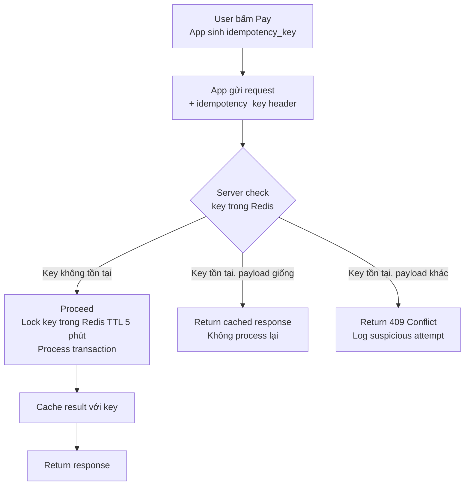
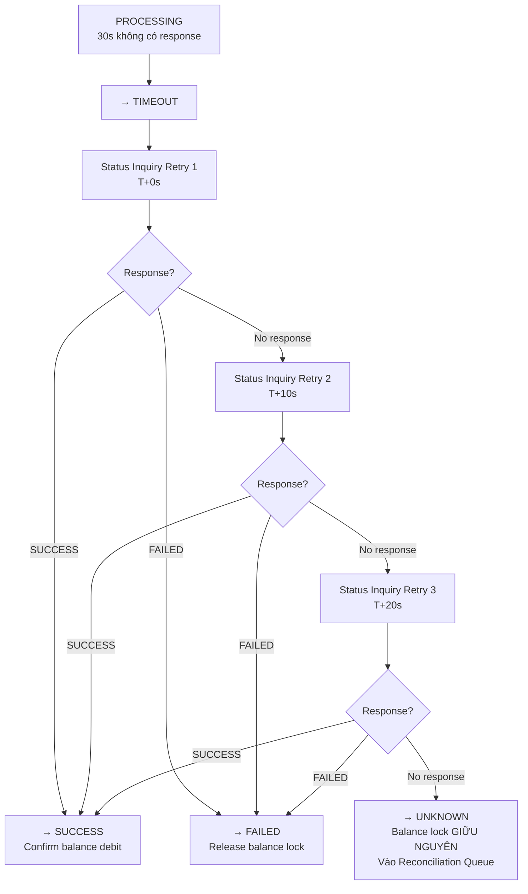

<Warning>
  **Practice Case Study** — FinPay là công ty fictional. Tài liệu này được tạo cho mục đích portfolio BA. Các SLA, timeout values và business rules là fictional assumptions — cần calibrate theo thực tế dự án.
</Warning>

---

## Phần 1: Exception Queue

### Tổng quan

Trong hệ thống payment, exception không phải là edge case — với volume lớn, ngay cả tỷ lệ lỗi 0.5% cũng tạo ra hàng chục exception mỗi ngày cần xử lý. Không có exception queue tập trung, mỗi team sẽ xử lý theo cách riêng, không có audit trail, và SLA resolution bị bỏ qua.

Exception queue giải quyết ba vấn đề: *phát hiện* (auto-detect, không chờ user báo), *phân loại* (severity tag để ưu tiên đúng), và *theo dõi* (audit trail mọi action cho compliance).

---

### Exception Types — 13 loại

#### EXC-PAY-01: INVALID_QR

| | |
|---|---|
| **Exception ID** | EXC-PAY-01 |
| **Tên** | Invalid QR Code |
| **Trigger** | QR không pass CRC-16 checksum, QR đã hết hạn (dynamic QR sau 10 phút), hoặc QR dynamic đã được sử dụng 1 lần |
| **Severity** | Low |
| **Owner** | System (auto-reject, không vào queue) → CS nếu user khiếu nại |
| **Suggested Action** | Hiển thị lỗi rõ ràng cho user; CS hướng dẫn user quét lại hoặc nhờ merchant tạo QR mới |
| **SLA** | N/A — auto-handled; nếu user khiếu nại: 4 giờ |
| **Audit Log Required** | Yes — log `qr_id`, `error_reason`, `user_id`, `timestamp` |

---

#### EXC-PAY-02: MERCHANT_NOT_FOUND

| | |
|---|---|
| **Exception ID** | EXC-PAY-02 |
| **Tên** | Merchant Not Found |
| **Trigger** | BIN hoặc merchant ID trong QR payload không tồn tại hoặc không active trong Bank Registry |
| **Severity** | Medium |
| **Owner** | CS Agent |
| **Suggested Action** | Kiểm tra merchant registry; nếu merchant tồn tại nhưng BIN chưa được sync → trigger registry update; nếu merchant không hợp lệ → reject transaction và notify user |
| **SLA** | 4 giờ |
| **Audit Log Required** | Yes — log `merchant_id`, `bin_code`, `qr_payload_hash` |

---

#### EXC-PAY-03: INSUFFICIENT_BALANCE

| | |
|---|---|
| **Exception ID** | EXC-PAY-03 |
| **Tên** | Insufficient Balance |
| **Trigger** | `wallet_balance_available < amount + fee` tại thời điểm pre-check |
| **Severity** | Low |
| **Owner** | System (auto-reject, không vào exception queue) |
| **Suggested Action** | Hiển thị số dư hiện tại và số tiền thiếu; suggest user nạp tiền; không vào exception queue — này là validation error thông thường |
| **SLA** | N/A — auto-handled |
| **Audit Log Required** | Yes — log `user_id`, `amount`, `available_balance`, `timestamp` |

---

#### EXC-PAY-04: LIMIT_EXCEEDED

| | |
|---|---|
| **Exception ID** | EXC-PAY-04 |
| **Tên** | Transaction Limit Exceeded |
| **Trigger** | Amount vượt per-transaction limit, daily limit, hoặc monthly limit theo KYC tier |
| **Severity** | Low |
| **Owner** | System (auto-reject) |
| **Suggested Action** | Hiển thị loại limit bị vượt và remaining amount; suggest user nâng KYC tier nếu muốn giao dịch lớn hơn |
| **SLA** | N/A — auto-handled |
| **Audit Log Required** | Yes — log `limit_type`, `limit_value`, `attempted_amount`, `kyc_tier` |

---

#### EXC-PAY-05: DUPLICATE_PAYMENT

| | |
|---|---|
| **Exception ID** | EXC-PAY-05 |
| **Tên** | Duplicate Payment Request |
| **Trigger** | Idempotency key trùng nhưng request payload khác (amount khác, merchant khác) — không phải retry hợp lệ mà là attempt để tạo GD mới với key cũ |
| **Severity** | High |
| **Owner** | Risk / Operation Officer |
| **Suggested Action** | Log ngay; kiểm tra pattern (nếu cùng user có nhiều duplicate attempts → flag account); trả về 409 Conflict cho client |
| **SLA** | 2 giờ |
| **Audit Log Required** | Yes — log `idempotency_key`, `original_request_hash`, `new_request_hash`, `user_id`, `ip_address` |

---

#### EXC-PAY-06: PAYMENT_TIMEOUT

| | |
|---|---|
| **Exception ID** | EXC-PAY-06 |
| **Tên** | Payment Gateway Timeout |
| **Trigger** | NAPAS/Gateway không trả về kết quả trong 30 giây sau khi GD vào PROCESSING |
| **Severity** | High |
| **Owner** | System (auto-move to UNKNOWN) → Reconciliation Staff |
| **Suggested Action** | System tự động trigger Status Inquiry; nếu Status Inquiry không resolve → đưa vào reconciliation batch; notify user rằng kết quả sẽ cập nhật trong 24h |
| **SLA** | 24 giờ (từ khi vào UNKNOWN) |
| **Audit Log Required** | Yes — log `gateway_endpoint`, `request_timestamp`, `timeout_at`, `status_inquiry_attempts`, `status_inquiry_results` |

---

#### EXC-PAY-07: MISSING_CALLBACK

| | |
|---|---|
| **Exception ID** | EXC-PAY-07 |
| **Tên** | Missing Gateway Callback |
| **Trigger** | Gateway đã xử lý thành công (confirmed qua Status Inquiry hoặc settlement report) nhưng callback webhook về OMS không đến trong 5 phút sau khi transaction PROCESSING |
| **Severity** | High |
| **Owner** | System (auto-detect) → Reconciliation Staff |
| **Suggested Action** | System trigger Status Inquiry chủ động; cập nhật internal status dựa trên kết quả; check webhook endpoint health; review webhook retry logs |
| **SLA** | 2 giờ |
| **Audit Log Required** | Yes — log `expected_callback_at`, `actual_callback_at` (null), `status_inquiry_result` |

---

#### EXC-PAY-08: STATUS_MISMATCH

| | |
|---|---|
| **Exception ID** | EXC-PAY-08 |
| **Tên** | Status Mismatch — Internal vs External |
| **Trigger** | Reconciliation batch phát hiện: internal `wallet_status = SUCCESS` nhưng external gateway report ghi `FAILED`, hoặc ngược lại |
| **Severity** | Critical |
| **Owner** | Risk / Operation Officer |
| **Suggested Action** | Freeze settlement cho GD này; Operation verify với gateway về kết quả thật; nếu user đã bị trừ tiền nhưng GD thực ra failed → tạo REFUND ngay; nếu GD thật ra success nhưng ví ghi failed → update status và notify user |
| **SLA** | 2 giờ |
| **Audit Log Required** | Yes — log đầy đủ cả internal và external status, timestamp, resolution action |

---

#### EXC-PAY-09: AMOUNT_MISMATCH

| | |
|---|---|
| **Exception ID** | EXC-PAY-09 |
| **Tên** | Amount Mismatch — Internal vs External |
| **Trigger** | Reconciliation batch phát hiện số tiền trong internal record khác với số tiền trong external gateway report |
| **Severity** | Critical |
| **Owner** | Risk / Operation Officer + Finance Admin |
| **Suggested Action** | Dừng settlement; Finance audit fee calculation và currency formatting; nếu user bị trừ nhiều hơn → refund phần chênh; nếu ít hơn → điều tra trước khi charge thêm |
| **SLA** | 2 giờ |
| **Audit Log Required** | Yes — log `internal_amount`, `external_amount`, `difference`, `currency` |

---

#### EXC-PAY-10: WALLET_DEBITED_GATEWAY_FAILED

| | |
|---|---|
| **Exception ID** | EXC-PAY-10 |
| **Tên** | Wallet Debited but Gateway Failed |
| **Trigger** | Wallet Core đã debit thành công (balance trừ, lock confirmed) nhưng Gateway trả về NACK hoặc timeout dẫn đến UNKNOWN và reconciliation xác nhận Gateway failed |
| **Severity** | Critical |
| **Owner** | Risk / Operation Officer |
| **Suggested Action** | Tạo REFUND request ngay lập tức; notify user rằng tiền sẽ được hoàn trong 3-5 ngày làm việc; ghi nhận root cause để fix rollback logic |
| **SLA** | 1 giờ |
| **Audit Log Required** | Yes — mandatory; log wallet debit timestamp, gateway failure timestamp, refund initiation timestamp |

---

#### EXC-PAY-11: GATEWAY_SUCCESS_WALLET_NOT_UPDATED

| | |
|---|---|
| **Exception ID** | EXC-PAY-11 |
| **Tên** | Gateway Success but Wallet Not Updated |
| **Trigger** | Gateway xác nhận thành công (qua callback hoặc Status Inquiry) nhưng internal transaction vẫn ở PROCESSING hoặc UNKNOWN — wallet balance không phản ánh debit |
| **Severity** | Critical |
| **Owner** | System (auto-detect) → Risk / Operation Officer |
| **Suggested Action** | System thực hiện compensating transaction để sync wallet state; Operation verify trước khi apply; audit callback handler để tìm bug; trong lúc chờ — merchant đã nhận tiền nên không được để user retry (sẽ double-charge merchant) |
| **SLA** | 1 giờ |
| **Audit Log Required** | Yes — log gateway confirmation evidence, wallet state before/after fix |

---

#### EXC-PAY-12: USER_DISPUTE

| | |
|---|---|
| **Exception ID** | EXC-PAY-12 |
| **Tên** | User Disputes Transaction |
| **Trigger** | User liên hệ CS khiếu nại rằng GD không phải do họ thực hiện, hoặc số tiền sai, hoặc merchant sai |
| **Severity** | High |
| **Owner** | CS Agent → Risk / Operation Officer (nếu cần escalate) |
| **Suggested Action** | CS thu thập evidence (screenshot, thời gian GD, device info); kiểm tra audit log (device ID, IP, auth method); nếu có dấu hiệu unauthorized access → block account ngay, gửi alert Risk team; nếu là user nhầm → explain; nếu là lỗi hệ thống → tạo refund |
| **SLA** | 4 giờ (initial response); 48 giờ (resolution) |
| **Audit Log Required** | Yes — log complaint_details, evidence_collected, investigation_steps, resolution |

---

#### EXC-PAY-13: REFUND_REQUIRED

| | |
|---|---|
| **Exception ID** | EXC-PAY-13 |
| **Tên** | Refund Required — Post Reconciliation |
| **Trigger** | Reconciliation xác nhận cần hoàn tiền: từ STATUS_MISMATCH, WALLET_DEBITED_GATEWAY_FAILED, hoặc AMOUNT_MISMATCH |
| **Severity** | High |
| **Owner** | Reconciliation Staff → Finance Admin (approve) |
| **Suggested Action** | Tạo refund request với amount và reason; Finance Admin approve; Refund Service execute; notify user khi complete |
| **SLA** | 4 giờ (from detection to approval); 3-5 ngày làm việc (execution với bank) |
| **Audit Log Required** | Yes — log refund_reason, amount, approver, execution_timestamp, gateway_refund_reference |

---

## Phần 2: Idempotency, Timeout, Retry, Duplicate Prevention

### 2.1 Tại sao Payment cần Idempotency

Trong payment, duplicate request không phải lỗi kỹ thuật hiếm gặp — chúng xảy ra thường xuyên và có thể dẫn đến tổn thất tài chính thực sự:

- **Double tap**: User bấm Pay 2 lần vì lag → 2 requests cùng lúc
- **App retry**: App tự retry khi mất kết nối mạng sau khi đã gửi request đầu tiên
- **User retry thủ công**: Thấy màn hình timeout → bấm lại
- **Browser back**: Nhấn Back rồi Submit lại

Idempotency đảm bảo rằng dù backend nhận 1 hay 10 requests cho cùng 1 ý định thanh toán, chỉ có duy nhất 1 transaction được tạo và 1 lần debit xảy ra.

---

### 2.2 Idempotency Key Design

| Thuộc tính | Giá trị | Lý do |
|---|---|---|
| **Được tạo khi nào** | Client-side, ngay trước khi gửi payment request | Phải sinh trước khi submit — không sinh sau khi server nhận |
| **Format** | UUID v4 | Unique, không predictable, không encode business data |
| **Scope** | Per payment session — mỗi lần user bắt đầu payment flow mới | Không reuse giữa các GD khác nhau |
| **Cache TTL** | 5 phút server-side (Redis) | Đủ để cover all retry scenarios; sau 5 phút user scan QR khác → key mới |
| **Collision handling** | Request có cùng key + cùng payload → return cached response; cùng key + payload khác → 409 Conflict | Phân biệt retry hợp lệ với abuse |



**Thứ tự operations quan trọng:**
```
1. Check key trong Redis (có không?)
2. Nếu không có: Set key với "processing" placeholder (atomic)
3. Begin wallet debit (DB transaction)
4. Gửi request sang Gateway
5. Commit/Rollback wallet debit
6. Update key trong Redis với final result
```

Bước 2 phải là atomic operation — nếu 2 requests đến đồng thời với cùng key, chỉ 1 request "win" và set key, request kia thấy key đã tồn tại và return cached.

---

### 2.3 Timeout Handling

| Scenario | Hành vi | Lý do |
|---|---|---|
| App timeout, gateway đã xử lý SUCCESS | Giữ balance lock; Status Inquiry; update về SUCCESS khi confirm | Tránh release balance trong khi GD thật ra thành công |
| App timeout, gateway đã xử lý FAILED | Giữ balance lock; Status Inquiry; update về FAILED, release balance | Confirm failure trước khi release |
| App timeout, gateway chưa xử lý | Background retry 1 lần sau 5s; nếu vẫn timeout → UNKNOWN | Không retry nhiều lần — tránh double-charge |
| Timeout kéo dài > 24h không resolve | Escalate lên Operation; notify user | Không được để user bị hold tiền vô thời hạn |
| Gateway trả SUCCESS sau timeout | Cập nhật về SUCCESS; không rollback balance | Late response là kết quả thật |



---

### 2.4 Retry Policy

| Scenario | Retry? | Số lần max | Backoff | Ghi chú |
|---|---|---|---|---|
| Network error (connection refused, DNS fail) | Yes | 3 lần | Exponential: 1s, 2s, 4s | Chỉ retry nếu GD **chưa** được tạo (trước bước 3) |
| TIMEOUT | **Không retry payment** | N/A | N/A | Thay vào đó: Status Inquiry. Tuyệt đối không retry payment sau timeout |
| Gateway NACK (explicit rejection) | **Không** | N/A | N/A | NACK = business refusal. Retry sẽ nhận NACK lần nữa |
| Missing callback | System retry Status Inquiry | 3 lần | 5 min interval | Retry để biết kết quả, không phải retry để execute lại |
| Internal service error (Wallet Core timeout) | Yes (internal) | 2 lần | 500ms, 1s | Chỉ retry wallet operations trước khi gửi sang Gateway |

**Nguyên tắc tuyệt đối:** Không bao giờ retry payment request sau khi GD đã vào `PROCESSING`. Lúc đó balance đã locked và Gateway có thể đã xử lý — retry là double-charge.

---

### 2.5 Status Inquiry vs Retry

Hai khái niệm này hay bị nhầm lẫn:

| Điểm khác nhau | Status Inquiry | Retry Payment |
|---|---|---|
| **Mục đích** | Hỏi Gateway "GD này kết quả là gì?" | Thực hiện lại GD từ đầu |
| **Khi nào dùng** | Sau timeout, sau missing callback | Trước PROCESSING nếu network error |
| **Có tạo GD mới không** | Không | Có (nếu idempotency không block) |
| **Có debit balance lần nữa không** | Không | Có thể có (nguy hiểm nếu không có idempotency) |
| **API call** | `GET /payment/{gateway_tx_id}/status` | `POST /payment` với body mới |
| **Idempotency key** | Không cần (read-only) | Bắt buộc (phải dùng key cũ nếu retry hợp lệ) |

---

### 2.6 Duplicate Prevention Rules

| Detection Method | Fields | Time Window | Action |
|---|---|---|---|
| **Idempotency key** | `idempotency_key` | 5 phút | Return cached result; không tạo GD mới |
| **QR one-time use** | `qr_id` (dynamic QR) | Forever | Reject với `QR_014 — QR already used` |
| **Rate limiting** | `user_id` + transaction count | Per minute (5/min) | Block với `QR_009 — Too many requests` |
| **Same transaction pattern** | `user_id` + `merchant_id` + `amount` + timestamp | 60 giây | Warning modal: "Bạn vừa thực hiện GD tương tự. Xác nhận tiếp tục?" |

---

## Phần 3: Business Rules

| Rule ID | Tên | Trigger | Điều kiện | Expected Behavior | Exception | Owner |
|---|---|---|---|---|---|---|
| **BR-QR-VAL-01** | QR CRC Validation | QR raw string được submit | CRC-16 checksum không khớp | Reject với error `QR_002`; không hiển thị bank info | Nếu checksum lỗi nhỏ có thể do encoding — log và alert | System |
| **BR-QR-VAL-02** | QR Expiry Check | Dynamic QR được scan | `expires_at` < `now()` | Reject với error `QR_013` (QR expired); suggest merchant tạo QR mới | Cho phép grace period 30s để xử lý clock drift | System |
| **BR-QR-VAL-03** | QR One-time Use | Dynamic QR được scan | `used = true` trong DB | Reject với error `QR_014` (QR already used) | Race condition xử lý bằng DB lock với SELECT FOR UPDATE | System |
| **BR-QR-VAL-04** | Merchant Active | Merchant ID từ QR lookup | `merchant.status != ACTIVE` | Reject với error `QR_015` (Merchant not available); CS được alert | Nếu merchant bị suspend tạm thời — có thể retry sau | System |
| **BR-QR-VAL-05** | QR Internal Redirect | QR parse ra internal scheme | `ewallet://transfer?user_id=...` | Redirect sang Transfer P2P module; không xử lý tại QR Payment | Nếu user_id không tồn tại → Transfer module handle | System |
| **BR-QR-LIM-01** | KYC Tier Check | Pre-check trước authentication | `user.kyc_tier < 2` | Block với error `QR_003` (KYC required); redirect sang KYC onboarding | Tier 2 là minimum — cần xác nhận với Legal nếu có exception | System |
| **BR-QR-LIM-02** | Balance Check | Pre-check | `available_balance < amount + fee` | Block với `QR_007`; hiển thị `balance_available` và số tiền thiếu | Không lock balance tại bước này — chỉ display | Wallet Core |
| **BR-QR-LIM-03** | Per-Transaction Limit | Pre-check | `amount > per_tx_limit[kyc_tier]` | Block với `QR_004`; hiển thị limit và suggest KYC upgrade | | Limit Engine |
| **BR-QR-LIM-04** | Daily Limit | Pre-check | `daily_spent + amount > daily_limit[kyc_tier]` | Block với `QR_005`; hiển thị remaining | Limit dùng chung với Transfer P2P — row-level lock khi update | Limit Engine |
| **BR-QR-LIM-05** | Monthly Limit | Pre-check | `monthly_spent + amount > monthly_limit[kyc_tier]` | Block với `QR_006` | Tương tự daily limit | Limit Engine |
| **BR-QR-AUTH-01** | PIN Max Retry | Authentication | Sai PIN ≥ 3 lần liên tiếp | Block account tạm thời 30 phút; transaction → FAILED | Biometric fail không count vào PIN retry counter | Auth Service |
| **BR-QR-AUTH-02** | Auth Timeout | Authentication | Không có input sau 60s | Transaction → CANCELLED; không debit; session cleared | | System |
| **BR-QR-AUTH-03** | Biometric Fallback | Authentication | Biometric fail 3 lần | Bắt buộc fallback về PIN; không cho phép skip | Biometric failure không phải auth failure → không block account | Auth Service |
| **BR-QR-TX-01** | Idempotency Mandatory | Payment request | Request thiếu `idempotency_key` header | Reject với `400 Bad Request`; không process | | System |
| **BR-QR-TX-02** | Atomic Balance Lock | PROCESSING | Gateway call initiation | Lock amount từ `balance_available` → `balance_locked` trong cùng DB transaction trước khi gọi Gateway | Nếu lock fail → transaction FAILED trước khi gateway call | Wallet Core |
| **BR-QR-TX-03** | Amount Immutable for Dynamic QR | Confirmation screen | User cố thay đổi amount trong dynamic QR | Server reject; ignore client-sent amount; dùng QR embed amount | Client-side validation + server-side enforce | System |
| **BR-QR-TX-04** | Rate Limiting | Payment request | > 5 GD/phút/user | Block với `QR_009` (rate limit exceeded); wait 1 phút | Sliding window tại API Gateway | API Gateway |
| **BR-QR-TX-05** | Balance Release on Failure | FAILED / CANCELLED | Transaction terminal với FAILED or CANCELLED | Release `balance_locked` → `balance_available` ngay lập tức trong cùng DB transaction | Không release khi TIMEOUT hoặc UNKNOWN | Wallet Core |
| **BR-QR-TIMEOUT-01** | Timeout = 30s | PROCESSING | 30s sau khi gateway call khởi tạo | → TIMEOUT; giữ balance lock; trigger Status Inquiry | | System |
| **BR-QR-TIMEOUT-02** | No Auto-FAILED on Timeout | TIMEOUT | Timeout detected | KHÔNG được set FAILED; phải vào TIMEOUT → UNKNOWN nếu Status Inquiry không resolve | | System |
| **BR-QR-TIMEOUT-03** | Status Inquiry Retry | TIMEOUT | Sau timeout | Retry 3 lần với interval 10s; nếu vẫn không có kết quả → UNKNOWN | | System |
| **BR-QR-TIMEOUT-04** | UNKNOWN SLA | UNKNOWN | Transaction ở UNKNOWN > 24h | Escalate tự động lên Operation Manager; notify user | | Reconciliation Service |
| **BR-QR-CB-01** | Callback Verification | Gateway callback nhận | Callback không có HMAC signature hợp lệ | Reject; không update transaction; log suspicious webhook | | System |
| **BR-QR-CB-02** | Late Callback | UNKNOWN / TIMEOUT | Gateway callback đến sau timeout | Accept và update transaction nếu kết quả xác định (SUCCESS/FAILED); không reject vì "quá muộn" | | System |
| **BR-QR-CB-03** | Callback Idempotency | Gateway callback nhận | Callback trùng (same event, same result) | Process first occurrence; subsequent duplicates → 200 OK, no re-processing | Carrier hay retry — phải handle gracefully | System |
| **BR-QR-REC-01** | Reconciliation Frequency | Scheduled job | 14:00 và 23:59 hàng ngày | Run reconciliation batch, match internal vs external | Manual trigger available cho Operation Manager | Reconciliation Service |
| **BR-QR-REC-02** | MISMATCHED SLA | MISMATCHED state | GD vào MISMATCHED > 48h không resolve | Escalate tự động lên Risk team; flag cho compliance | | Reconciliation Service |
| **BR-QR-REC-03** | Refund eligibility | Refund request | Refund được request từ GD chưa MATCHED | Reject; yêu cầu MATCHED trước khi tạo REFUND | Exception: Operation có thể override với evidence | Refund Service |
| **BR-QR-REC-04** | Settlement Hold | MISMATCHED | GD ở MISMATCHED | Dừng merchant settlement cho GD này cho đến khi resolved | | Reconciliation Service |
| **BR-QR-REFUND-01** | Refund Approval Required | Refund request created | Request amount > threshold (ví dụ 500,000 VND) | Cần Finance Admin approve trước khi execute | Threshold cần xác nhận với Finance team | Refund Service |
| **BR-QR-REFUND-02** | Refund Timeline | Refund approved | Finance Admin approve | Execute refund với Gateway; ghi nhận timeline cho compliance (fictional assumption: 3-5 ngày làm việc) | Actual timeline phụ thuộc bank/gateway contract thực tế | Refund Service |
| **BR-QR-REFUND-03** | Partial Refund | Refund request | AMOUNT_MISMATCH với chênh lệch nhỏ | Cho phép partial refund chỉ cho phần chênh lệch; ghi nhận original amount và refund amount riêng | | Refund Service |

---

## Phần 4: UAT Scenarios

### Group 1: Happy Path QR Payment

**[UAT-HAPPY-01] QR tĩnh — giao dịch thành công**

| | |
|---|---|
| **Preconditions** | User có balance ≥ 150,000 VND; KYC Tier 2; merchant active |
| **Steps** | 1. User scan QR tĩnh (không có amount). / 2. App hiển thị merchant info, user nhập 150,000 VND. / 3. Pre-check pass (balance đủ, limit chưa vượt). / 4. User xác thực bằng PIN đúng. / 5. App gửi payment request với idempotency_key. / 6. Gateway trả ACK trong 30s. / 7. Verify: wallet_status = SUCCESS, balance giảm 150,000 VND, push notification gửi. |
| **Expected Result** | Transaction SUCCESS. Balance đúng. Push notification nhận được trong vòng 5s. Transaction xuất hiện trong History với status "Thành công". idempotency_key được cache 5 phút. |
| **Priority** | High |

---

**[UAT-HAPPY-02] QR động — số tiền prefilled, không cho chỉnh sửa**

| | |
|---|---|
| **Preconditions** | Merchant tạo dynamic QR với amount = 85,000 VND, expires 10 phút |
| **Steps** | 1. User scan QR động. / 2. App hiển thị amount 85,000 VND với field locked (không tương tác được). / 3. User thử chỉnh amount (test kiểm tra lock). / 4. Verify: app không cho chỉnh. / 5. User confirm và xác thực biometric. / 6. Transaction SUCCESS. |
| **Expected Result** | Amount field locked ở UI. Server cũng verify: nếu client gửi amount khác → reject. Dynamic QR được đánh dấu `used = true` sau payment. |
| **Priority** | High |

---

**[UAT-HAPPY-03] Scan lại QR đã dùng — bị từ chối**

| | |
|---|---|
| **Preconditions** | Dynamic QR từ `UAT-HAPPY-02` đã được thanh toán |
| **Steps** | 1. User (hoặc user khác) scan lại cùng QR. / 2. Verify: hệ thống trả lỗi QR_014 "Mã QR này đã được thanh toán". |
| **Expected Result** | Error `QR_014` hiển thị ngay khi parse. Không tạo transaction mới. |
| **Priority** | High |

---

### Group 2: Invalid QR

**[UAT-QR-01] QR hỏng — CRC fail**

| | |
|---|---|
| **Preconditions** | QR string với CRC checksum sai |
| **Steps** | 1. User scan QR bị hỏng. / 2. Verify error `QR_002` "Mã QR bị hỏng". |
| **Expected Result** | Error hiển thị ngay. Không call tới server. |
| **Priority** | Medium |

---

**[UAT-QR-02] Dynamic QR hết hạn**

| | |
|---|---|
| **Preconditions** | Dynamic QR created với expires_at = now - 1 phút (đã hết hạn) |
| **Steps** | 1. User scan QR hết hạn. / 2. Verify error `QR_013` "Mã QR đã hết hạn". |
| **Expected Result** | Error `QR_013`. Suggest merchant tạo QR mới. |
| **Priority** | Medium |

---

### Group 3: Balance & Limit

**[UAT-BAL-01] Số dư không đủ**

| | |
|---|---|
| **Preconditions** | User balance = 50,000 VND; scan QR amount 100,000 VND |
| **Steps** | 1. User scan QR, nhập amount 100,000 VND. / 2. Pre-check: balance < amount. / 3. Verify error `QR_007` với balance_available hiển thị. |
| **Expected Result** | Error hiển thị số dư hiện tại (50,000) và số tiền cần nạp thêm (50,000). Không tạo transaction. |
| **Priority** | High |

---

**[UAT-BAL-02] Vượt daily limit**

| | |
|---|---|
| **Preconditions** | User Tier 2, daily limit 100,000,000 VND, đã spent 99,500,000 VND hôm nay |
| **Steps** | 1. User scan QR với amount 600,000 VND. / 2. Pre-check: daily_spent + 600,000 > daily_limit. / 3. Verify error `QR_005` với remaining daily limit. |
| **Expected Result** | Error `QR_005` với "Còn được chi 500,000 VND trong ngày hôm nay". |
| **Priority** | High |

---

### Group 4: Idempotency & Duplicate

**[UAT-IDEM-01] Double tap — user bấm Pay 2 lần**

| | |
|---|---|
| **Preconditions** | User ở màn hình xác thực PIN, đã submit 1 request |
| **Steps** | 1. App gửi request lần 1 với idempotency_key = "KEY_001". / 2. App gửi request lần 2 (do double tap) với cùng idempotency_key = "KEY_001". / 3. Verify: server xử lý lần 1; lần 2 nhận cached response. / 4. Verify: chỉ 1 transaction được tạo; balance chỉ bị trừ 1 lần. |
| **Expected Result** | 1 transaction trong DB. 1 lần debit. Response lần 2 = response lần 1 (từ cache). |
| **Priority** | High |

---

**[UAT-IDEM-02] App crash sau khi submit, user mở lại và thử lại**

| | |
|---|---|
| **Preconditions** | User submit payment; app crash trước khi nhận response |
| **Steps** | 1. App gửi request với KEY_002, crash trước khi nhận response. / 2. User mở lại app; thấy GD không rõ trạng thái. / 3. App retry với cùng KEY_002. / 4. Verify: server nhận KEY_002 đã tồn tại trong Redis → return cached result (SUCCESS hoặc FAILED). / 5. Verify: 1 transaction trong DB; balance thay đổi đúng 1 lần. |
| **Expected Result** | Retry với cùng key nhận cached result. Không tạo duplicate. |
| **Priority** | High |

---

**[UAT-IDEM-03] Idempotency key trùng nhưng amount khác (abuse attempt)**

| | |
|---|---|
| **Preconditions** | Request 1 với KEY_003, amount 100,000. Sau đó Request 2 với KEY_003, amount 200,000. |
| **Steps** | 1. Submit request 1 → thành công. / 2. Submit request 2 với cùng key nhưng amount khác. / 3. Verify: server trả 409 Conflict. / 4. Verify: attempt được log là suspicious. |
| **Expected Result** | 409 Conflict cho request 2. Log entry với `suspicious_attempt = true`. Không tạo transaction mới. |
| **Priority** | High |

---

### Group 5: Timeout Handling

**[UAT-TIMEOUT-01] Gateway timeout → Status Inquiry thành công → SUCCESS**

| | |
|---|---|
| **Preconditions** | Mock gateway: delay response 35 giây (> timeout 30s), sau đó trả SUCCESS khi query |
| **Steps** | 1. User submit payment. / 2. 30s sau — timeout triggered. / 3. System auto-trigger Status Inquiry. / 4. Gateway trả SUCCESS cho Status Inquiry. / 5. Verify: transaction update về SUCCESS; balance debit confirmed; user nhận notification. |
| **Expected Result** | Transaction SUCCESS sau Status Inquiry. User được notify. Balance đúng. |
| **Priority** | High |

---

**[UAT-TIMEOUT-02] Gateway timeout → Status Inquiry fail → UNKNOWN → Operation escalate sau 24h**

| | |
|---|---|
| **Preconditions** | Mock gateway: không trả response cho cả payment và Status Inquiry |
| **Steps** | 1. User submit payment. / 2. 30s sau — timeout → TIMEOUT. / 3. Status Inquiry 3 lần → no response → UNKNOWN. / 4. Verify user message: "đang xác nhận, kết quả cập nhật trong 24h". / 5. Advance mock clock 24h. / 6. Verify: auto-escalation trigger; Operation Manager nhận alert. |
| **Expected Result** | UNKNOWN state sau timeout. User notified. Auto-escalation sau 24h. Balance lock giữ nguyên suốt. |
| **Priority** | High |

---

### Group 6: Callback Issues

**[UAT-CB-01] Callback đến muộn sau 45s (sau timeout)**

| | |
|---|---|
| **Preconditions** | Mock gateway: delay callback 45s; Status Inquiry không có kết quả; callback SUCCESS đến lúc T+45s |
| **Steps** | 1. Payment submit. / 2. T+30: timeout → TIMEOUT → Status Inquiry fail → UNKNOWN. / 3. T+45: callback SUCCESS từ gateway. / 4. Verify: system accept late callback; transaction update về SUCCESS; user notified; balance debit confirmed. |
| **Expected Result** | Late callback được accept và processed. Transaction SUCCESS. |
| **Priority** | High |

---

**[UAT-CB-02] Gateway SUCCESS nhưng wallet không cập nhật (callback handler bug)**

| | |
|---|---|
| **Preconditions** | Mock scenario: callback nhận thành công nhưng wallet state machine có bug không process; GD stuck ở PROCESSING |
| **Steps** | 1. Payment submit. / 2. Gateway ACK nhận. / 3. Bug: wallet state không update. / 4. Reconciliation batch chạy. / 5. Verify: mismatch phát hiện (GATEWAY_SUCCESS_WALLET_NOT_UPDATED). / 6. Exception EXC-PAY-11 tạo. / 7. Operation review và apply compensating transaction. |
| **Expected Result** | Mismatch detected. EXC-PAY-11 tạo. Compensating transaction applied. Audit log đầy đủ. |
| **Priority** | High |

---

### Group 7: Reconciliation

**[UAT-REC-01] GD matched sau reconciliation**

| | |
|---|---|
| **Preconditions** | Transaction SUCCESS; reconciliation batch chưa chạy |
| **Steps** | 1. Run reconciliation batch với bank statement matching GD này. / 2. Verify: reconciliation_status = MATCHED. / 3. Verify: merchant settlement eligible. / 4. Verify: refund now possible (MATCHED = settled). |
| **Expected Result** | reconciliation_status MATCHED. Merchant settlement unblocked. |
| **Priority** | High |

---

**[UAT-REC-02] GD mismatched — status mismatch → Operation review**

| | |
|---|---|
| **Preconditions** | Internal: wallet_status = SUCCESS; External bank report: gateway_status = FAILED |
| **Steps** | 1. Run reconciliation batch. / 2. Verify: STATUS_MISMATCH detected; EXC-PAY-08 tạo trong exception queue. / 3. Operation Officer review; confirm cần refund. / 4. Verify: REFUND_REQUIRED state. |
| **Expected Result** | Mismatch phát hiện. Exception queue entry với severity Critical. Operation có thể action. |
| **Priority** | High |

---

**[UAT-REC-03] Refund required → approve → refunded**

| | |
|---|---|
| **Preconditions** | Transaction ở REFUND_REQUIRED (từ UAT-REC-02) |
| **Steps** | 1. Reconciliation Staff tạo refund request. / 2. Finance Admin approve. / 3. Refund Service execute (mock). / 4. Verify: wallet_status = REFUNDED; balance credited; user notified. |
| **Expected Result** | Refund APPROVED → REFUNDED. Balance +credit. User notified. Audit trail complete. |
| **Priority** | High |

---

### Group 8: Permission

**[UAT-PERM-01] CS Agent không thể approve refund**

| | |
|---|---|
| **Preconditions** | Refund request pending; user là CS Agent |
| **Steps** | 1. CS Agent login và navigate đến refund request. / 2. CS Agent thử approve (call API `POST /refunds/{id}/approve`). / 3. Verify: API trả 403 Forbidden. / 4. Verify: "Approve Refund" button không hiển thị trong CS Agent UI. |
| **Expected Result** | 403 Forbidden tại API. Button ẩn tại UI. Action logged as unauthorized attempt. |
| **Priority** | High |

---

**[UAT-PERM-02] Customer không thể access reconciliation dashboard**

| | |
|---|---|
| **Preconditions** | Customer user login |
| **Steps** | 1. Customer navigate trực tiếp đến `/reconciliation/dashboard`. / 2. Verify: redirect về login hoặc 403 Forbidden. / 3. Customer call API `GET /reconciliation/summary`. / 4. Verify: 403 Forbidden. |
| **Expected Result** | Dashboard không accessible với customer token. 403 tại cả UI và API. |
| **Priority** | High |
