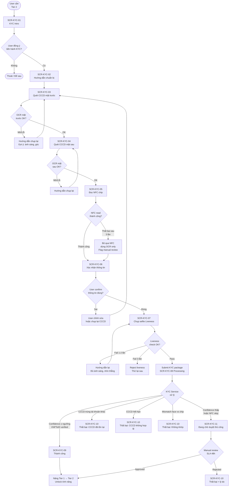
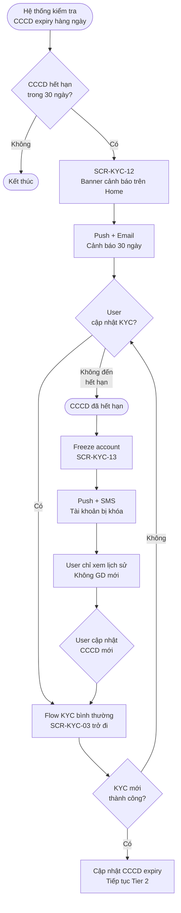
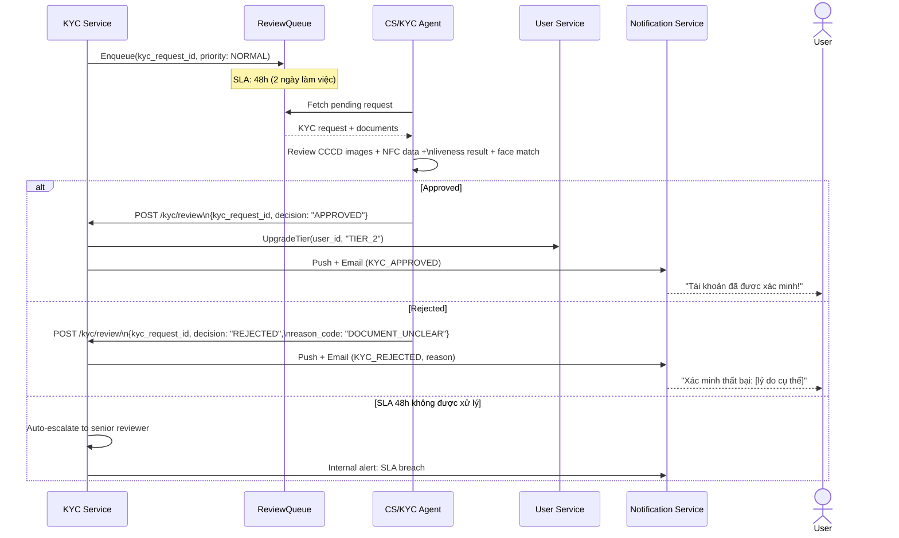

# PRD: KYC Module

<Info>
  **Document ID:** PRD-EW-KYC-001 · **Version:** 1.0 · **Status:** Draft  
  **Ngày tạo:** 2026-05-25 · **Tác giả:** BA Team  
  **Reviewer:** Tech Lead, Compliance, Security Team · **Approver:** Head of Product  
  **Tài liệu liên quan:** PRD-EW-AUTH-001, PRD-EW-WALLET-001
</Info>

| Vai trò | Mục đích đọc |
|---|---|
| Tech Lead / Developer | Tích hợp VNPTeID SDK + iProov SDK; thiết kế KYC Service |
| Compliance / Legal | Đảm bảo đúng Nghị định 52/2024 về xác minh danh tính |
| Security Team | Review NFC data handling, liveness check, duplicate detection |
| QA Lead | Test cases: scan thành công, OCR mờ, liveness fail, CCCD trùng, pending → kết quả |
| UX Designer | Hiểu từng bước scan, trạng thái chờ, thông báo kết quả |

---

## 1. Tổng quan module & eKYC Architecture

### 1.1 Mục tiêu

Module KYC xác minh danh tính người dùng để:
- Nâng cấp tài khoản từ **Tier 1 → Tier 2** (mở toàn bộ tính năng giao dịch)
- Tuân thủ Nghị định 52/2024/NĐ-CP về định danh tài khoản ví điện tử
- Phòng chống gian lận: 1 CCCD = 1 tài khoản ví

### 1.2 KYC Tier System

| Tier | Đạt được khi | Hạn mức GD/lần | Hạn mức tháng | Tính năng |
|---|---|---|---|---|
| **Tier 1** | Đăng ký xong (SĐT verified) | 1M VND | 10M VND | Nhận tiền; nạp; không rút |
| **Tier 2** | eKYC thành công (CCCD + Face) | 20M VND | 100M VND | Đầy đủ: rút, chuyển, QR |
| **Tier 3** | Full KYC (manual, dành cho Business/VIP) | 100M VND | 500M VND | Business disbursement |

### 1.3 eKYC Architecture

<Info>
  **Provider được chọn:** **VNPTeID** (xác thực chip CCCD với CSDL Cục Cư dân) + **iProov** (face liveness). Đây là kiến trúc mà các ví điện tử lớn tại Việt Nam (gồm MoMo) đang áp dụng — kết hợp dữ liệu chip chính phủ với liveness detection cấp ngân hàng.
</Info>

```mermaid
flowchart LR
    subgraph App['Mobile App']
        NFC['NFC Reader\n(CCCD Chip)']
        CAM['Camera\n(CCCD + Selfie)']
    end

    subgraph KYCSvc['KYC Service (Internal)']
        OCR['OCR Engine']
        ORCH['KYC Orchestrator']
        REVIEW['Manual Review\nQueue']
    end

    subgraph Providers['External Providers']
        VNP['VNPTeID\n(Cục Cư dân)\nChip Verification']
        iPROOV['iProov\nFace Liveness\n(Genuine Presence)']
    end

    subgraph Internal['Internal Systems']
        USER['User Service\n(Tier upgrade)']
        NOTIF['Notification Service']
        AUDIT['Audit Logger']
    end

    NFC -->|NFC Data| ORCH
    CAM -->|CCCD images| OCR
    CAM -->|Face frames| iPROOV
    OCR -->|Extracted data| ORCH
    iPROOV -->|Liveness score| ORCH
    ORCH -->|Chip + data| VNP
    VNP -->|Verified identity| ORCH
    ORCH -->|Auto approve| USER
    ORCH -->|Low confidence| REVIEW
    REVIEW -->|Manual decision| USER
    USER -->|Tier upgraded| NOTIF
    ORCH --> AUDIT
```

**Luồng xử lý:**
1. **NFC Layer**: App đọc dữ liệu chip CCCD (MRZ, ảnh chân dung, thông tin cá nhân được mã hóa)
2. **OCR Layer**: Nhận diện số CCCD, họ tên, ngày sinh từ ảnh chụp mặt trước làm cross-check
3. **Face Liveness (iProov)**: Phân tích frames selfie → xác nhận người thật, không phải ảnh tĩnh hay video replay
4. **VNPTeID Verification**: Gửi dữ liệu chip lên VNPTeID để xác thực với CSDL Cục Cư dân → xác nhận CCCD thật, chưa bị thu hồi
5. **Auto-approve** nếu tất cả confidence score ≥ ngưỡng → nâng tier ngay
6. **Manual fallback** nếu bất kỳ score nào thấp → queue cho KYC reviewer (SLA 48h)

---

## 2. Danh sách màn hình

| Screen ID | Tên màn hình | Điều kiện hiển thị |
|---|---|---|
| SCR-KYC-01 | KYC Intro — Tại sao cần xác minh? | User Tier 1; chưa KYC; vào tính năng cần Tier 2 hoặc vào Settings > Xác minh |
| SCR-KYC-02 | Hướng dẫn chuẩn bị | Sau khi user bắt đầu KYC |
| SCR-KYC-03 | Quét CCCD mặt trước | Bắt đầu scan flow |
| SCR-KYC-04 | Quét CCCD mặt sau | Sau khi mặt trước OK |
| SCR-KYC-05 | Đọc chip NFC | Sau khi cả 2 mặt OK |
| SCR-KYC-06 | Xác nhận thông tin OCR | Sau khi OCR + NFC read OK |
| SCR-KYC-07 | Chụp ảnh selfie — Liveness | Sau khi user confirm thông tin |
| SCR-KYC-08 | Đang xử lý (Processing) | Sau khi submit; chờ auto-approve |
| SCR-KYC-09 | Kết quả — Thành công | Auto-approve hoặc manual approved |
| SCR-KYC-10 | Kết quả — Thất bại | Auto-reject hoặc manual rejected |
| SCR-KYC-11 | Đang chờ duyệt thủ công | Confidence thấp → manual queue |
| SCR-KYC-12 | Cảnh báo CCCD sắp hết hạn | 30 ngày trước ngày hết hạn CCCD |
| SCR-KYC-13 | Tài khoản bị khóa — CCCD hết hạn | Sau ngày hết hạn mà chưa re-KYC |

---

## 3. User Flow — KYC Lần Đầu (Tier 1 → Tier 2)



---

## 4. User Flow — Re-KYC (CCCD sắp hết hạn)



---

## 5. Sequence Diagram — KYC Auto-Approve

```mermaid
sequenceDiagram
    actor User
    participant App
    participant KYCSvc as KYC Service
    participant VNPTeID
    participant iProov
    participant UserSvc as User Service
    participant NotifSvc as Notification Service

    User->>App: Submit KYC (NFC data + CCCD images + selfie frames)
    App->>KYCSvc: POST /kyc/submit\n{user_id, nfc_data, cccd_front_img,\ncccd_back_img, selfie_frames}

    Note over KYCSvc: Tạo kyc_request_id; status = PROCESSING

    par Parallel verification
        KYCSvc->>VNPTeID: VerifyChip(nfc_data)
        VNPTeID-->>KYCSvc: {verified: true, id_number, full_name,\ndob, expiry_date, confidence: 0.98}
    and
        KYCSvc->>iProov: VerifyLiveness(selfie_frames, reference_face)
        Note over iProov: So sánh selfie với ảnh trên chip\nKiểm tra Genuine Presence
        iProov-->>KYCSvc: {liveness_passed: true,\nface_match_score: 0.94, confidence: 0.96}
    end

    KYCSvc->>KYCSvc: Check duplicate CCCD in DB
    KYCSvc->>KYCSvc: Calculate overall_score = min(chip_conf, liveness_conf)

    alt overall_score ≥ 0.85 (Auto-approve threshold)
        KYCSvc->>UserSvc: UpgradeTier(user_id, tier: "TIER_2",\nkyc_data: {id_number, name, dob, expiry})
        UserSvc-->>KYCSvc: {success: true}
        KYCSvc->>NotifSvc: Push(user_id, "KYC_APPROVED")
        KYCSvc-->>App: 200 {status: "APPROVED", tier: "TIER_2"}
        App->>User: SCR-KYC-09: Thành công!

    else 0.70 ≤ overall_score < 0.85 (Manual review)
        KYCSvc->>KYCSvc: Enqueue to manual_review_queue
        KYCSvc-->>App: 200 {status: "PENDING_REVIEW",\nestimated_sla: "48h"}
        App->>User: SCR-KYC-11: Đang chờ duyệt

    else overall_score < 0.70 OR duplicate OR invalid
        KYCSvc->>KYCSvc: Log rejection reason
        KYCSvc-->>App: 200 {status: "REJECTED",\nreason_code: "FACE_MISMATCH"}
        App->>User: SCR-KYC-10: Thất bại + lý do
    end
```

---

## 6. Sequence Diagram — Manual Review Flow



---

## 7. Screen Specifications

### SCR-KYC-01 — KYC Intro

```
┌─────────────────────────────────┐
│                                 │
│      [Illustration: CCCD+phone] │
│                                 │
│       Xác minh danh tính        │
│  Mở khóa đầy đủ tính năng      │
│  chuyển tiền và rút tiền        │
│                                 │
│  ✅ Chuyển tiền đến 20M/lần     │
│  ✅ Rút tiền về ngân hàng       │
│  ✅ Bảo vệ tài khoản cao hơn    │
│                                 │
│  ┌───────────────────────────┐  │
│  │ 📋 CCCD gắn chip còn hạn  │  │
│  │ 📱 Camera và NFC          │  │
│  └───────────────────────────┘  │
│                                 │
│  [ Bắt đầu xác minh ]          │
│        Để sau                   │
└─────────────────────────────────┘
```

| Component | Loại | Nội dung | Điều kiện | Action |
|---|---|---|---|---|
| Illustration | Image | Hình minh họa CCCD + phone | Always | — |
| Title | Text H1 | "Xác minh danh tính" | Always | — |
| Subtitle | Text | "Mở khóa đầy đủ tính năng chuyển tiền và rút tiền" | Always | — |
| Benefit list | List | ✅ Chuyển tiền đến 20 triệu/lần · ✅ Rút tiền về ngân hàng · ✅ Bảo vệ tài khoản | Always | — |
| What you need | Info box | "📋 CCCD gắn chip còn hạn · 📱 Camera và NFC" | Always | — |
| Legal note | Text (small) | "Theo Nghị định 52/2024/NĐ-CP, ví điện tử yêu cầu xác minh danh tính." | Always | — |
| "Bắt đầu xác minh" | Primary button | "Bắt đầu xác minh" | Always | Sang SCR-KYC-02 |
| "Để sau" | Text link | "Để sau" | Always | Đóng flow; về trang trước |

---

### SCR-KYC-03 — Quét CCCD Mặt Trước

```
┌─────────────────────────────────┐
│  ① Mặt trước ② Mặt sau ③ NFC ④ Selfie│
│                                 │
│  ┌─────────────────────────┐   │
│  │                         │   │
│  │  ┌───────────────────┐  │   │
│  │  │                   │  │   │
│  │  │  [ CCCD FRAME ]   │  │   │  ← khung tỷ lệ CCCD
│  │  │                   │  │   │
│  │  └───────────────────┘  │   │
│  │                         │   │
│  └─────────────────────────┘   │
│                                 │
│  Đặt CCCD vào trong khung      │
│  Giữ cách 20–30cm              │
│                                 │
│  ⚡ [flash]   [Chụp ngay]       │  ← "Chụp ngay" sau 10s
└─────────────────────────────────┘
```

| Component | Loại | Nội dung | Điều kiện | Action |
|---|---|---|---|---|
| Camera viewfinder | Camera | Live camera feed | Always | — |
| CCCD overlay | Overlay | Khung hình chữ nhật tỷ lệ CCCD | Always | Guide position |
| Instruction text | Text | "Đặt CCCD vào trong khung · Giữ điện thoại cách CCCD 20–30cm" | Always | — |
| Progress indicator | Step dots | ① Mặt trước ② Mặt sau ③ NFC ④ Selfie | Always | — |
| Auto-capture indicator | Animation | Vòng xanh khi ảnh đạt chất lượng | Khi chất lượng đủ | Auto-capture sau 1s |
| Flash toggle | Icon button | ⚡ Bật/tắt flash | Always | Toggle flash |
| "Chụp thủ công" | Secondary button | "Chụp ngay" | Nếu auto không trigger sau 10s | Manual capture |
| Rejection feedback | Banner (red) | "Ảnh quá mờ · Ánh sáng không đủ · Bị nghiêng" | Khi quality fail | — |

**Auto-capture logic:**
- Hệ thống liên tục phân tích frame realtime
- Khi: blur score < ngưỡng AND card detected AND 4 góc visible AND không bị che → auto-capture sau 1 giây đếm ngược
- Nếu sau 10 giây không auto-capture → hiện nút "Chụp ngay"

---

### SCR-KYC-05 — Đọc Chip NFC

```
┌─────────────────────────────────┐
│  ① ② ③ NFC ④                  │
│                                 │
│    [Illustration: phone + CCCD  │
│     mặt sau chạm nhau]          │
│                                 │
│  Đặt CCCD tiếp xúc             │
│  mặt sau điện thoại             │
│  Giữ yên trong 5 giây          │
│                                 │
│         ◌◌◌●●● (progress)       │  ← vòng tròn tiến độ
│                                 │
│  ✅ Đọc chip thành công!        │  ← khi thành công
│  ─── hoặc ───                   │
│  ❌ Không đọc được (lần 2/3)    │  ← khi fail
│                                 │
│       [ Bỏ qua bước này ]       │  ← sau 3 lần fail
└─────────────────────────────────┘
```

| Component | Loại | Nội dung | Điều kiện | Action |
|---|---|---|---|---|
| NFC instruction | Illustration | Hình điện thoại đặt sau lưng CCCD | Always | — |
| Instruction | Text | "Đặt CCCD tiếp xúc mặt sau điện thoại · Giữ yên trong 5 giây" | Always | — |
| Progress ring | Animation | Vòng tròn tiến độ đọc NFC | Đang đọc | — |
| Success state | Icon + Text | ✅ "Đọc chip thành công" | NFC OK | Auto-advance sau 1.5s |
| Error state | Icon + Text | ❌ "Không đọc được chip. Thử lại hoặc bỏ qua." | NFC fail | — |
| Retry count | Text | "Lần thử {N}/3" | Khi fail | — |
| "Bỏ qua NFC" | Secondary button | "Bỏ qua bước này" | Sau 3 lần fail | Tiếp tục không có NFC; flag manual review |

**NFC fail fallback:** Nếu skip NFC → KYC package chỉ có OCR data → confidence thường thấp hơn → khả năng cao vào manual review queue.

---

### SCR-KYC-06 — Xác Nhận Thông Tin OCR/NFC

```
┌─────────────────────────────────┐
│  ←     Kiểm tra thông tin CCCD  │
│                                 │
│  Họ và tên                      │
│  NGUYEN DUC CHINH               │  ← read-only
│                                 │
│  Số CCCD                        │
│  079 **** **** 36               │  ← che 4 số giữa
│                                 │
│  Ngày sinh        01/01/1999    │
│  Ngày hết hạn     15/08/2030    │
│                                 │
│  ╔══════════════════════════╗   │
│  ║ ⚠ CCCD còn hạn đến      ║   │  ← nếu < 90 ngày
│  ║   15/08/2026. Cần gia hạn║   │
│  ╚══════════════════════════╝   │
│                                 │
│  [ Thông tin chính xác, tiếp ] │
│  [ Thông tin sai, chụp lại   ] │
└─────────────────────────────────┘
```

| Component | Loại | Nội dung | Điều kiện | Action |
|---|---|---|---|---|
| Title | Text | "Kiểm tra thông tin CCCD" | Always | — |
| Họ và tên | Display field | Tên từ NFC/OCR (đọc-only) | Always | Không chỉnh sửa được |
| Số CCCD | Display field | 12 số (che 4 số giữa) | Always | — |
| Ngày sinh | Display field | DD/MM/YYYY | Always | — |
| Ngày hết hạn CCCD | Display field | DD/MM/YYYY | Always | Cảnh báo màu đỏ nếu < 90 ngày |
| Expiry warning | Banner (orange) | "CCCD còn hạn đến {date}. Hãy chuẩn bị gia hạn sớm." | Khi còn < 90 ngày | — |
| "Thông tin đúng rồi" | Primary button | "Thông tin chính xác, tiếp tục" | Always | Sang SCR-KYC-07 |
| "Chụp lại CCCD" | Secondary button | "Thông tin sai, chụp lại" | Always | Về SCR-KYC-03 |

---

### SCR-KYC-07 — Chụp Selfie Liveness

```
┌─────────────────────────────────┐
│  ① ② ③ ④ Selfie               │
│                                 │
│  ┌─────────────────────────┐   │
│  │    ~~~~~~~~~~~~~~~~~~~~  │   │
│  │   /    ╭─────────╮    \ │   │
│  │   |    │  FACE   │    | │   │  ← oval overlay
│  │   |    │  OVAL   │    | │   │
│  │   \    ╰─────────╯    / │   │
│  │    ~~~~~~~~~~~~~~~~~~~~  │   │
│  └─────────────────────────┘   │
│                                 │
│  ↑ Gần hơn / ↓ Xa hơn          │  ← hướng dẫn realtime
│  Nhìn thẳng · Đủ ánh sáng      │
│                                 │
│  ✨ [iProov flash sequence]     │  ← nhấp nháy màu
│                                 │
│  ❌ Chưa nhận diện (lần 1/3)   │  ← khi fail
└─────────────────────────────────┘
```

| Component | Loại | Nội dung | Điều kiện | Action |
|---|---|---|---|---|
| Camera (front) | Camera | Live front camera | Always | — |
| Face oval overlay | Overlay | Hình oval hướng dẫn vị trí khuôn mặt | Always | — |
| Distance indicator | Text + icon | "Gần hơn ↑" / "Xa hơn ↓" / "✅ Khoảng cách tốt" | Realtime | Hướng dẫn động |
| Instruction | Text | "Nhìn thẳng vào camera · Không đeo kính mát · Đủ ánh sáng" | Always | — |
| iProov prompt | Màn hình nhấp nháy | Flash màu chiếu lên mặt (Genuine Presence check) | Khi face detected + distance OK | Auto-capture |
| Retry instruction | Text (red) | "Chưa nhận diện được. Đảm bảo đủ sáng và nhìn thẳng." | Khi fail | — |
| Attempt counter | Text | "Lần thử {N}/3" | Từ lần 2 | — |

**iProov Genuine Presence Assurance™:**
Màn hình điện thoại chiếu một chuỗi ánh sáng màu ngẫu nhiên lên mặt người dùng trong ~2 giây. iProov phân tích phản chiếu ánh sáng để xác nhận đây là người thật đang có mặt, không phải ảnh in hay video phát lại. Cơ chế này là server-side (không xử lý trên thiết bị), không thể bị spoof bằng ảnh tĩnh.

---

### SCR-KYC-11 — Đang Chờ Duyệt Thủ Công

```
┌─────────────────────────────────┐
│                                 │
│       [🕐 Illustration]         │
│                                 │
│       Đang xem xét hồ sơ       │
│                                 │
│  Chúng tôi sẽ thông báo kết    │
│  quả trong vòng 48 giờ làm     │
│  việc qua Push notification     │
│                                 │
│  Mã yêu cầu: KYC-2026-001234   │
│                                 │
│  ┌───────────────────────────┐  │
│  │ ℹ️ Tài khoản vẫn ở Tier 1 │  │
│  │   trong thời gian chờ     │  │
│  └───────────────────────────┘  │
│                                 │
│     [      Về trang chủ     ]   │
│      Cần hỗ trợ? Liên hệ CS    │
└─────────────────────────────────┘
```

| Component | Loại | Nội dung | Điều kiện | Action |
|---|---|---|---|---|
| Illustration | Image | Đồng hồ / giấy tờ | Always | — |
| Title | Text | "Đang xem xét hồ sơ" | Always | — |
| SLA info | Text | "Chúng tôi sẽ thông báo kết quả trong vòng 48 giờ làm việc." | Always | — |
| Request ID | Text (small) | "Mã yêu cầu: {kyc_request_id}" | Always | — |
| Current access | Info box | "Trong thời gian chờ, tài khoản của bạn vẫn ở Tier 1." | Always | — |
| "Về trang chủ" | Button | "Về trang chủ" | Always | Về Home; notification khi có kết quả |
| Contact CS | Text link | "Cần hỗ trợ? Liên hệ CSKH" | Always | Mở chat CS |

---

## 8. Validation Rules

| Field / Bước | Rule | Thông báo | Trigger |
|---|---|---|---|
| **CCCD scan — chất lượng ảnh** | Không mờ (blur score ≥ ngưỡng) | "Ảnh bị mờ. Giữ điện thoại cố định." | Real-time frame analysis |
| | 4 góc CCCD phải hiện | "Đặt toàn bộ CCCD vào trong khung." | Real-time |
| | Không bị che (che < 5% diện tích) | "Không che thẻ khi chụp." | Real-time |
| | Ánh sáng đủ (brightness ≥ ngưỡng) | "Thiếu sáng. Bật flash hoặc ra chỗ sáng hơn." | Real-time |
| **CCCD — thông tin** | Số CCCD: đúng 12 chữ số | "Không nhận dạng được số CCCD." | After OCR |
| | CCCD chưa hết hạn | "CCCD đã hết hạn. Vui lòng dùng CCCD còn hiệu lực." | After OCR/NFC |
| | Tên khớp với tài khoản (nếu user đã nhập tên khi đăng ký) | "Tên trên CCCD không khớp với thông tin đăng ký." | Server-side |
| | Tuổi ≥ 15 (từ ngày sinh trên CCCD) | "Bạn phải đủ 15 tuổi để sử dụng ví điện tử." | Server-side |
| **CCCD — duplicate** | Số CCCD chưa được KYC bởi tài khoản khác | "CCCD này đã được xác minh bởi tài khoản khác. Liên hệ CSKH nếu đây là nhầm lẫn." | Server-side |
| **NFC** | NFC read thành công (không bắt buộc) | Nếu fail 3 lần: "Không đọc được chip. Bạn có thể bỏ qua bước này." | After 3 fails |
| | Chữ ký số chip hợp lệ (VNPTeID verify) | "Dữ liệu chip không hợp lệ. Dùng CCCD khác hoặc liên hệ CSKH." | Server-side via VNPTeID |
| **Face liveness** | Đủ sáng (ambient light ≥ ngưỡng) | "Vui lòng ra chỗ sáng hơn hoặc bật đèn." | Pre-capture |
| | Không đeo kính mát / khẩu trang che mặt | "Vui lòng bỏ kính mát và đảm bảo thấy rõ khuôn mặt." | Frame analysis |
| | iProov liveness score ≥ 0.80 | "Không xác nhận được khuôn mặt. Thử lại lần {N}/3." | Server iProov |
| | Face match score (selfie vs. chip photo) ≥ 0.75 | "Khuôn mặt không khớp với ảnh CCCD." | Server iProov |
| | Sau 3 lần fail liveness | "Xác minh thất bại. Vui lòng thử lại sau hoặc liên hệ CSKH." | After 3 fails |

---

## 9. Business Rules

| ID | Rule | Áp dụng tại |
|---|---|---|
| BR-KYC-01 | Chỉ chấp nhận CCCD gắn chip 12 số (không nhận CCND 9 số, passport) | SCR-KYC-03 |
| BR-KYC-02 | CCCD phải còn hạn tại thời điểm submit | SCR-KYC-06, server-side |
| BR-KYC-03 | 1 số CCCD = 1 tài khoản ví; phát hiện trùng → block tài khoản mới | Server-side duplicate check |
| BR-KYC-04 | Retry không giới hạn; không có cooling period giữa các lần thử | Flow |
| BR-KYC-05 | Auto-approve khi confidence ≥ 0.85; manual review khi 0.70–0.84; reject khi < 0.70 | KYC Service |
| BR-KYC-06 | NFC read thất bại 3 lần → cho phép bỏ qua; KYC package bị flag → ưu tiên manual | SCR-KYC-05 |
| BR-KYC-07 | Manual review SLA: 48 giờ làm việc (không tính cuối tuần) | Review Queue |
| BR-KYC-08 | Sau manual review SLA 48h: tự động escalate; không auto-approve | Review Queue |
| BR-KYC-09 | Cảnh báo CCCD hết hạn: gửi push + email 30 ngày trước; 14 ngày; 7 ngày; 1 ngày | Scheduler |
| BR-KYC-10 | Sau ngày CCCD hết hạn mà chưa re-KYC: freeze account (chỉ xem lịch sử) | Scheduler |
| BR-KYC-11 | KYC data lưu trữ tối thiểu 5 năm theo Nghị định 52/2024 | Audit/Storage |
| BR-KYC-12 | Reviewer không được tự duyệt hồ sơ của mình (nếu CS cũng là user) | Review system |
| BR-KYC-13 | Tier chỉ tăng, không giảm tự động (chỉ giảm khi tài khoản bị suspend bởi Compliance) | User Service |

---

## 10. Notification Specifications

| Event | Channel | Nội dung | Thời điểm |
|---|---|---|---|
| KYC approved (auto) | Push + In-app | "🎉 Xác minh danh tính thành công! Bạn có thể chuyển tiền và rút tiền ngay." | Ngay khi auto-approve |
| KYC approved (manual) | Push + In-app + Email | Push: "Hồ sơ xác minh đã được duyệt!" Email: Chi tiết tier mới, hạn mức | Ngay khi reviewer approve |
| KYC rejected | Push + In-app | "Xác minh chưa thành công: {reason}. Vui lòng thử lại." | Ngay khi reject |
| KYC pending (manual) | Push + In-app | "Hồ sơ của bạn đang được xem xét. Chúng tôi sẽ thông báo trong 48h." | Khi vào manual queue |
| SLA 48h sắp hết | Internal alert | (Gửi cho CS team) "Hồ sơ {kyc_request_id} còn 4h đến deadline." | Khi còn 4h |
| CCCD sắp hết hạn (30 ngày) | Push + Email | "CCCD của bạn sẽ hết hạn vào {date}. Vui lòng cập nhật để tránh gián đoạn dịch vụ." | 30/14/7/1 ngày trước |
| Tài khoản bị freeze (CCCD hết hạn) | Push + SMS + Email | "Tài khoản tạm thời bị hạn chế do CCCD hết hạn. Cập nhật CCCD để khôi phục đầy đủ tính năng." | Ngay khi freeze |
| Tài khoản được mở khóa sau re-KYC | Push + Email | "Tài khoản đã được khôi phục đầy đủ tính năng sau khi cập nhật CCCD." | Khi re-KYC approved |
| CCCD trùng phát hiện | In-app | "Chúng tôi cần xác minh thêm. Vui lòng liên hệ CSKH." (Không tiết lộ lý do cụ thể) | Khi duplicate detected |

---

## 11. API Summary

| Method | Endpoint | Request | Response | Mô tả |
|---|---|---|---|---|
| POST | `/kyc/submit` | `{user_id, nfc_data?, cccd_front_b64, cccd_back_b64, selfie_frames_b64[]}` | `{kyc_request_id, status, estimated_sla?}` | Submit toàn bộ KYC package |
| GET | `/kyc/status` | Header: access_token | `{status, tier, reason_code?, submitted_at}` | Kiểm tra trạng thái KYC hiện tại |
| GET | `/kyc/requests/{id}` | — | `{kyc_request_id, status, documents, scores, reviewer?}` | Chi tiết một request KYC |
| POST | `/kyc/review` | `{kyc_request_id, decision, reason_code?}` *(internal — CS agent only)* | `{success: true}` | CS agent duyệt / từ chối |
| POST | `/kyc/nfc/verify` | `{nfc_raw_data}` | `{valid: bool, data: {...}}` | Verify NFC data (internal, call VNPTeID) |
| POST | `/kyc/liveness/check` | `{user_id, frames_b64[]}` | `{liveness_passed, face_match_score, confidence}` | iProov liveness check |

---

## 12. Error Codes

| Code | HTTP | Hiển thị user | Ghi chú dev |
|---|---|---|---|
| `KYC_001` | 400 | "Ảnh CCCD không đủ chất lượng. Vui lòng chụp lại." | OCR quality score < threshold |
| `KYC_002` | 400 | "CCCD đã hết hạn. Dùng CCCD còn hiệu lực." | expiry_date < today |
| `KYC_003` | 409 | "CCCD này đã được xác minh bởi tài khoản khác. Liên hệ CSKH." | Duplicate CCCD in DB |
| `KYC_004` | 400 | "Khuôn mặt không khớp với ảnh CCCD. Thử lại." | face_match_score < 0.75 |
| `KYC_005` | 400 | "Không xác nhận được người thật. Đảm bảo đủ sáng và thử lại." | liveness_score < 0.80 |
| `KYC_006` | 400 | "Dữ liệu chip CCCD không hợp lệ. Liên hệ CSKH nếu tiếp tục." | VNPTeID chip invalid |
| `KYC_007` | 400 | "Bạn phải đủ 15 tuổi để sử dụng dịch vụ." | age < 15 from dob |
| `KYC_008` | 400 | "Tên trên CCCD không khớp thông tin đã đăng ký." | name mismatch (nếu áp dụng) |
| `KYC_009` | 503 | "Hệ thống xác minh đang bảo trì. Thử lại sau vài phút." | VNPTeID / iProov timeout |
| `KYC_010` | 400 | "Loại giấy tờ không được hỗ trợ. Dùng CCCD gắn chip 12 số." | Wrong document type detected |

---

## 13. Edge Cases

| Trường hợp | Xử lý |
|---|---|
| User submit KYC rồi đóng app trước khi có kết quả | `kyc_request_id` vẫn xử lý; khi user mở app lại → check `/kyc/status`; hiển thị đúng trạng thái |
| iProov service timeout (> 30s) | Retry 1 lần tự động; nếu vẫn fail → flag manual review; không reject user |
| VNPTeID service down | Queue request; retry sau 15 phút (tối đa 3 lần); nếu vẫn fail → manual review |
| User có 2 CCCD (chip cũ và chip mới cùng số) | NFC đọc cả 2 đều hợp lệ; chấp nhận; lấy expiry xa nhất |
| User thay CCCD (số mới sau khi đổi họ) | Cho phép submit lại; nếu số CCCD mới chưa có trong DB → KYC bình thường; số CCCD cũ bị unlink |
| Camera không có quyền truy cập | Hiển thị hướng dẫn cấp quyền; không tiếp tục được nếu không có camera |
| NFC bị vô hiệu hoá trên thiết bị (iOS) | Phát hiện và bỏ qua bước NFC tự động; OCR only + manual review flag |
| User đang KYC Tier 2, nộp KYC lần 2 (re-KYC expiry) | Chỉ cập nhật expiry date; không reset tier; không cần manual review nếu auto-approve |
| CS agent reject nhầm | CS lead có thể override quyết định trong 24h; trigger re-process |
| User dưới 18 tuổi nộp CCCD của bố/mẹ (bypass tuổi) | Face liveness phát hiện khuôn mặt không khớp với ảnh trên CCCD (face match score < 0.75) → KYC_004; flag tài khoản cho Security review nếu 2 lần fail face match với CCCD của người khác |
| CCCD có MRZ đọc được nhưng chip NFC bị lỗi cứng (physical damage) | OCR đủ để tiếp tục nhưng NFC fail → được phép skip NFC (BR-KYC-06); package bị flag manual; reviewer check MRZ + face match thủ công |
| Tài khoản đang ở manual review queue, user submit KYC lần 2 | Block lần submit thứ 2 khi đang có request PENDING; hiển thị "Hồ sơ đang được xem xét. Vui lòng chờ kết quả." |

---

## 14. Roadmap — Tính năng phát triển

<Info>
  Các mục dưới đây yêu cầu làm rõ với Compliance, Risk và CS Ops trước Sprint tương ứng. BA chịu trách nhiệm điều phối để nhận quyết định chính thức và cập nhật vào Business Rules.
</Info>

### [Sprint 1] Xác nhận ngưỡng Confidence Score với Compliance & Risk

**Team:** Compliance + Risk · **Ưu tiên:** Critical

Làm rõ và nhận sign-off chính thức từ Compliance và Risk Team cho ngưỡng phân loại KYC hiện tại: **≥ 0.85 auto-approve**, **0.70–0.84 manual review**, **< 0.70 auto-reject**. Ngưỡng này ảnh hưởng trực tiếp đến tỷ lệ thông qua KYC và rủi ro pháp lý.

**Yêu cầu chính:** Họp review threshold với Compliance và Risk; document quyết định vào BR-KYC-04; điều chỉnh AutoDecisionEngine nếu có thay đổi ngưỡng.  
**Phụ thuộc:** Dữ liệu backtest từ tập mẫu CCCD thực (VNPTeID cung cấp sandbox test data).

### [Sprint 1] Policy rút tiền trong Grace Period — CCCD hết hạn & Freeze

**Team:** Compliance + Product · **Ưu tiên:** High

Xác định rõ rule: khi CCCD hết hạn và tài khoản bị đưa vào diện freeze, user có được **rút toàn bộ số dư về ngân hàng đã liên kết** trong thời gian grace period không? Ảnh hưởng đến quyền lợi người dùng và nghĩa vụ pháp lý.

**Yêu cầu chính:** Document policy vào BR-KYC; cập nhật Wallet Core module nếu cần giới hạn GD trong freeze period; thông báo rõ cho user qua notification trước khi freeze.  
**Phụ thuộc:** Tham chiếu Nghị định 52/2024 và hướng dẫn của NHNN về ví điện tử.

### [Sprint 1] Thông báo User cũ khi phát hiện CCCD trùng

**Team:** Security + Legal · **Ưu tiên:** High

Khi hệ thống phát hiện CCCD đã được đăng ký ở tài khoản khác, ngoài việc CS được alert, cần quyết định: có **thông báo cho chủ tài khoản cũ** không, hay chỉ xử lý nội bộ? Cân nhắc giữa transparency và rủi ro lộ thông tin.

**Yêu cầu chính:** Document policy vào BR-KYC-10; implement notification (push + email) nếu được chọn; ghi audit trail đầy đủ.  
**Phụ thuộc:** Legal Team xác nhận góc độ pháp lý; Security Team đánh giá risk information disclosure.

### [Sprint 1] Quyết định iProov SDK — Native vs Web

**Team:** Tech Lead · **Ưu tiên:** Critical

Lựa chọn giữa **iProov Native SDK** (tích hợp sâu vào iOS/Android, hiệu năng cao) và **iProov Web SDK** (Webview, triển khai nhanh hơn nhưng giới hạn UX). Quyết định ảnh hưởng đến iOS/Android build pipeline và thời gian tích hợp.

**Yêu cầu chính:** Tech Lead ra quyết định và document vào Architecture Decision Record (ADR); cập nhật scope KYC module nếu có thay đổi phương án.  
**Phụ thuộc:** iProov cung cấp demo cả hai SDK; Tech Lead test trên thiết bị mid-range mục tiêu.

### [Sprint 2] Quy trình KYC Tier 3 — Full KYC / Business Account

**Team:** Compliance · **Ưu tiên:** Medium

Thiết kế luồng KYC nâng cao cho **Tier 3**: tài khoản doanh nghiệp hoặc cá nhân có hạn mức cao. Xác định: có thể tự thực hiện online (upload giấy phép kinh doanh, CCCD người đại diện) hay phải **gặp trực tiếp tại điểm giao dịch**?

**Yêu cầu chính:** BA viết PRD Tier 3 KYC module riêng; xác định danh sách giấy tờ, quy trình review, SLA duyệt; tích hợp với hạn mức Tier 3 ở Wallet Core.  
**Phụ thuộc:** Compliance xác nhận yêu cầu pháp lý cho tài khoản business; Product xác nhận roadmap Tier 3 vào Sprint nào.

### [Sprint 2] Quy trình Manual Review khi NFC Chip hỏng

**Team:** Product + CS Ops · **Ưu tiên:** Medium

Xác định SOP và checklist cho **manual reviewer** khi NFC fail và hồ sơ vào hàng đợi review: dữ liệu OCR có đủ để duyệt không? Trường hợp nào cần yêu cầu user nộp thêm giấy tờ bổ sung?

**Yêu cầu chính:** Document checklist reviewer; cập nhật rejection flow để request additional documents; thêm trạng thái `DOCS_REQUIRED` vào KYC state machine; cập nhật SCR-KYC-08.  
**Phụ thuộc:** CS Ops xây dựng training material cho reviewer; Product định nghĩa SLA cho trạng thái DOCS_REQUIRED (đề xuất 48h).

---

## 15. Non-Functional Requirements (NFR)

### Performance

| Chỉ số | Target | Ghi chú |
|---|---|---|
| Upload ảnh CCCD (2 mặt) | P95 < 5s | Phụ thuộc mạng; cần compress trước upload |
| OCR processing (server-side) | P95 < 8s | Tổng thời gian từ upload đến có kết quả OCR |
| NFC read thành công | P95 < 5s | Phụ thuộc hardware; timeout sau 30s auto-skip |
| iProov liveness check (flash sequence + analysis) | P95 < 15s | Gồm thời gian flash sequence (~2s) + server analysis |
| KYC auto-decision (tổng end-to-end) | P95 < 30s | Từ lúc user bấm submit đến khi nhận kết quả |
| Manual review SLA | ≤ 48 giờ làm việc | Không tính thứ Bảy, Chủ Nhật, ngày lễ |

### Bảo mật (Security)

| Yêu cầu | Mô tả |
|---|---|
| Mã hóa dữ liệu KYC at rest | Ảnh CCCD, selfie frames: AES-256; không lưu raw file trên CDN công khai |
| Transport | TLS 1.3 bắt buộc cho mọi upload KYC; reject request dùng TLS < 1.2 |
| Biometric data — không cache | Không lưu frame selfie trên device sau khi upload; xóa khỏi memory ngay sau khi gửi |
| Access control cho KYC data | Chỉ KYC Service và CS reviewer được xem ảnh CCCD; mọi access đều được log |
| NFC raw data | Không lưu sau khi VNPTeID verify; chỉ lưu extracted fields (tên, ngày sinh, số CCCD) |
| Duplicate check race condition | Chạy CCCD duplicate check trong DB transaction với row-level lock; không parallel insert |

### Tính sẵn sàng & Độ tin cậy

| Chỉ số | Target | Ghi chú |
|---|---|---|
| KYC Service uptime | ≥ 99.5% | Có fallback: auto-fail-to-manual nếu auto decision path down |
| VNPTeID provider SLA | ≥ 99.5% | Fallback: queue request, retry sau 15 phút (tối đa 3 lần) |
| iProov provider SLA | ≥ 99.5% | Fallback: route vào manual review queue; không reject user |
| Graceful degradation | Auto-approve path down → 100% vào manual queue | Không được reject user khi provider down |
| Manual review throughput | ≥ 200 hồ sơ/ngày/reviewer | Tính toán capacity khi launch |

### Lưu trữ & Compliance (Nghị định 52/2024)

| Loại dữ liệu | Thời gian lưu | Cơ sở pháp lý |
|---|---|---|
| Ảnh CCCD (mặt trước + sau) | Tối thiểu 5 năm | Nghị định 52/2024, Điều về lưu trữ thông tin KYC |
| Selfie frames / liveness data | Tối thiểu 5 năm | Như trên |
| KYC decision audit log | Tối thiểu 5 năm | Bao gồm: confidence score, provider response, reviewer action, timestamp |
| NFC extracted fields (tên, ngày sinh, số CCCD) | Vĩnh viễn (gắn với profile user) | Cập nhật khi re-KYC; không xóa khi user deactivate |
| Manual review actions (ai duyệt, khi nào, lý do) | Tối thiểu 5 năm | Audit & compliance investigation |
