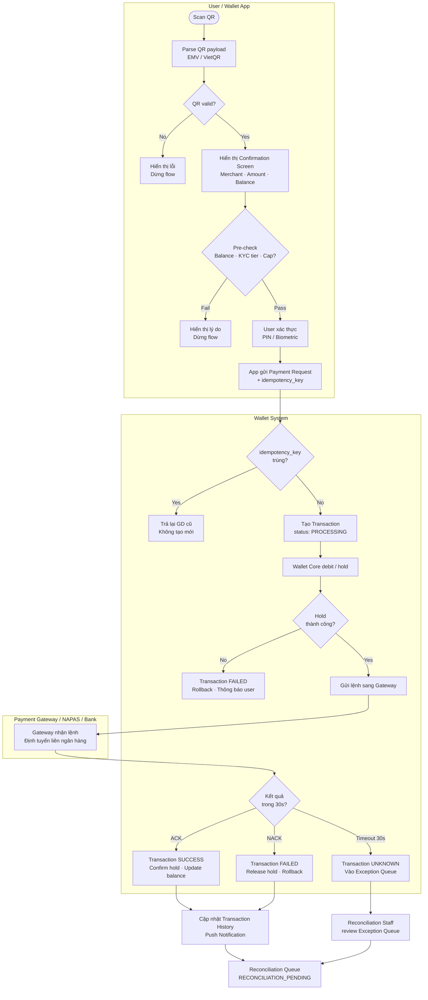
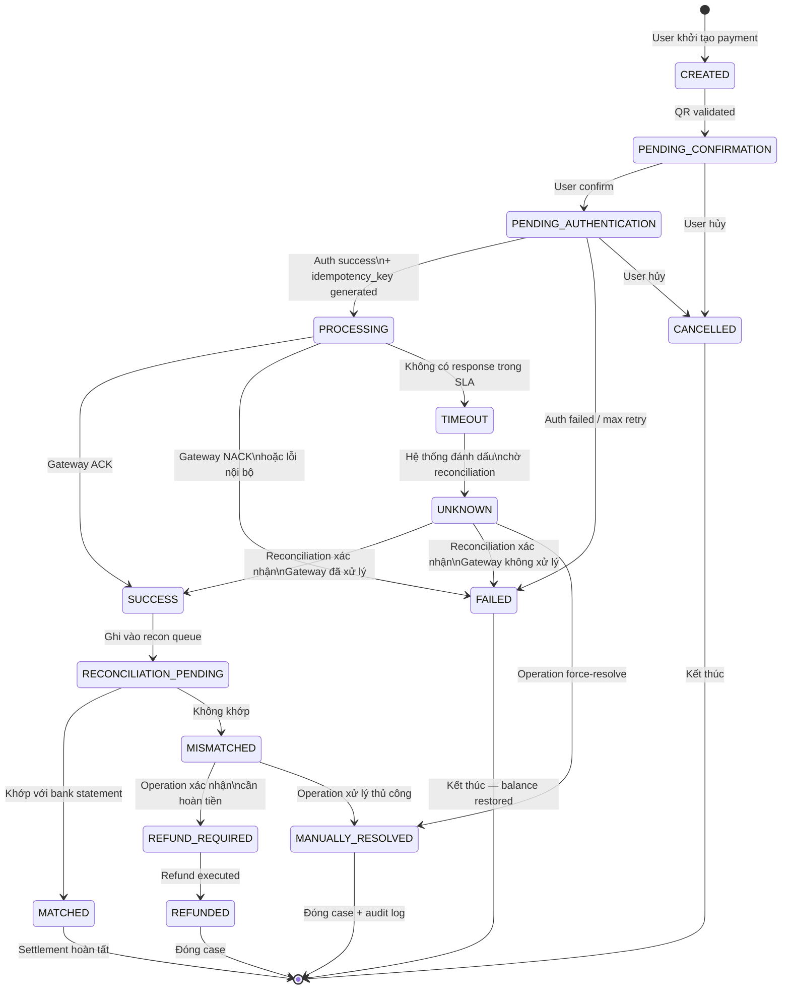
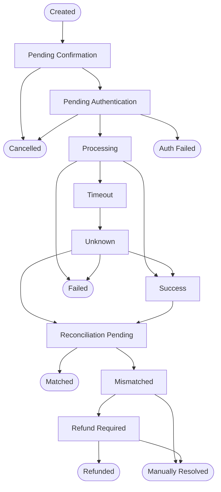

<Warning>
**Practice Case Study — Fictional Project**

FinPay là dự án giả định được tạo ra cho mục đích portfolio. Mọi tên công ty, số liệu, và tình huống nghiệp vụ trong tài liệu này đều là fictional và không đại diện cho bất kỳ tổ chức hoặc sản phẩm thương mại nào. Các giới hạn giao dịch và quy định tham chiếu là fictional assumptions — cần xác nhận với Legal/Compliance trong dự án thực tế.
</Warning>

<Info>
**4 supporting documents:**
- [`qr-payment.mdx`](/projects/ewallet/qr-payment) — QR Payment flow chi tiết: EMV/VietQR parsing, validation rules, confirmation UX
- [`transaction-state-machine.mdx`](/projects/ewallet/transaction-state-machine) — 15 states, tất cả transitions, exception paths
- [`reconciliation-dashboard.mdx`](/projects/ewallet/reconciliation-dashboard) — Dashboard wireframe, mismatch queue, manual resolve workflow
- [`exception-handling.mdx`](/projects/ewallet/exception-handling) — Timeout, retry, idempotency, callback failure decision trees
</Info>

---

## Bài toán thật

Phần lớn tài liệu về QR Payment mô tả happy path — user scan, xác nhận, tiền chuyển đi, xong. Nhưng bài toán BA thực sự nằm ở những gì xảy ra khi happy path **không xảy ra** — và trong hệ thống payment, điều đó không phải ngoại lệ mà là tình huống thường xuyên cần được thiết kế trước.

**Trạng thái không nhất quán giữa các hệ thống.** Khi user bấm "Xác nhận thanh toán", ứng dụng phải giao tiếp đồng thời với ít nhất hai hệ thống độc lập: Wallet Core (trừ số dư nội bộ) và Payment Gateway/NAPAS (chuyển tiền sang ngân hàng thụ hưởng). Hai hệ thống này không chia sẻ transaction state — chúng có thể ra kết quả khác nhau. Nếu Gateway báo SUCCESS nhưng Wallet chưa cập nhật do timeout nội bộ, hoặc Wallet đã debit nhưng Gateway trả NACK, hệ thống rơi vào trạng thái mâu thuẫn. Ai là source of truth? User thấy gì trên màn hình? Tiền đã trừ hay chưa? Đây là câu hỏi nghiệp vụ phải được trả lời trước khi viết một dòng API spec.

**Timeout và bài toán "không biết kết quả".** NAPAS không phải lúc nào cũng trả kết quả trong thời gian chờ hợp lý. Sau 30 giây, giao dịch ở trạng thái nào? Nếu hệ thống tự động đánh Failed để "an toàn cho user" nhưng NAPAS thực ra đã xử lý thành công — merchant nhận tiền, user bị trừ tiền, app hiển thị thất bại. Double charge nếu user thử lại. Ngược lại, nếu để trạng thái treo không xử lý — user bị hold tiền không rõ lý do, merchant không nhận được gì, Customer Support không có data để giải thích. Đây là trade-off mà BA phải quyết định và ghi thành rule, không phải để Dev tự chọn.

**Duplicate payment do double tap.** App lag 2 giây. User bấm "Thanh toán", không có phản hồi tức thì, bấm lại. Rồi bấm lần nữa. Backend nhận 3 request cho cùng một ý định thanh toán. Nếu không có cơ chế idempotency ở tầng nghiệp vụ — không chỉ ở tầng API — ba request này có thể tạo ra ba giao dịch riêng biệt, trừ tiền ba lần, ghi ba bản ghi transaction. User khiếu nại, CS mất thời gian xử lý hoàn tiền, merchant nhầm lẫn về số tiền nhận được.

**Reconciliation — chênh lệch cuối ngày cần công cụ, không chỉ quy trình.** Cuối ngày, Finance đối chiếu: hệ thống ví ghi nhận 1,247 giao dịch thành công. NAPAS/Bank báo cáo 1,239. Chênh lệch 8 giao dịch. Câu hỏi không phải "có bao nhiêu giao dịch chênh" mà là: giao dịch nào cụ thể? Chênh theo hướng nào? Lý do gì? Cần action gì — hoàn tiền, ghi nhận bù, hay liên hệ NAPAS? Nếu không có reconciliation dashboard với mismatch queue và audit trail, Finance phải export CSV, VLOOKUP thủ công, và email qua lại với Operation — mỗi ngày.

---

## Scope

| In Scope | Out of Scope |
|---|---|
| QR code scan và parsing (EMV/VietQR) | KYC onboarding flow |
| QR validation (format, expiry, merchant status) | Bank account linking |
| Payment confirmation screen và UX flow | Loyalty points / cashback |
| Wallet balance debit và hold logic | Merchant onboarding và QR generation |
| Payment Gateway / NAPAS integration spec | Accounting ledger chi tiết (sổ cái) |
| Transaction state machine (15 states) | Advanced fraud scoring model |
| Exception queue: timeout, duplicate, callback failure | Cross-border payment |
| Reconciliation dashboard và mismatch resolution | |

---

## Actors

| Actor | Mục tiêu | Hành động chính | Dữ liệu cần | Quyền hạn |
|---|---|---|---|---|
| **Customer** | Thanh toán nhanh, an toàn, có bằng chứng | Scan QR → xác nhận → xem kết quả | Số dư ví, thông tin merchant, lịch sử GD | Khởi tạo GD, yêu cầu hoàn tiền |
| **Merchant** | Nhận tiền đúng, đủ, có thể đối chiếu | Hiển thị QR, xem notification nhận tiền | Trạng thái GD, số tiền, thời gian | Read-only với GD liên quan đến mình |
| **Wallet App** | Phản hồi tức thì, UX không bị treo | Render QR data, gửi payment request, hiển thị trạng thái | QR payload, transaction status updates | Gửi request, nhận callback |
| **Wallet Core** | Duy trì số dư chính xác, không double debit | Validate balance, debit/hold, rollback nếu cần | Account balance, transaction lock | Write vào wallet account, rollback |
| **Payment Gateway / NAPAS** | Chuyển lệnh thanh toán liên ngân hàng | Nhận lệnh, định tuyến, trả kết quả ACK/NACK | Transaction amount, beneficiary account | Xử lý và trả kết quả — không modify ví nội bộ |
| **Reconciliation Staff** | Đảm bảo dữ liệu ví khớp với bank statement | Review mismatch queue, resolve exceptions | Report NAPAS, transaction log, audit trail | Read all + manual resolve action |
| **Customer Support** | Giải quyết khiếu nại người dùng | Tra cứu GD, xem lịch sử trạng thái, escalate | Full transaction timeline kể cả exception log | Read all, escalate to Operation |
| **Risk / Operation Officer** | Phát hiện bất thường, phê duyệt xử lý ngoại lệ | Review mismatch severity, approve refund hoặc write-off | Mismatch pattern, risk flag, audit log | Approve refund, close exception manually |

---

## Core QR Payment Flow

### Happy Path — 12 bước

1. **User scan QR code** — camera app hoặc in-app scanner đọc QR từ màn hình merchant hoặc QR in.
2. **App parse QR payload** — decode theo chuẩn EMV QR Code / VietQR: extract merchant ID, amount (nếu có), currency, reference ID, expiry.
3. **System validate QR** — kiểm tra: QR format hợp lệ, merchant tồn tại và đang active, QR chưa được sử dụng, QR chưa hết hạn.
4. **App hiển thị confirmation screen** — merchant name, logo, số tiền, nội dung thanh toán, số dư ví hiện tại. User chưa bị trừ tiền ở bước này.
5. **System pre-check trước khi cho phép xác thực** — balance đủ, KYC tier đủ hạn mức giao dịch, giao dịch không vượt daily/monthly cap.
6. **User xác thực danh tính** — PIN (primary, bắt buộc) hoặc Biometric (Face ID / fingerprint — convenience shortcut nếu user đã enable). Xem Decision 5.
7. **Transaction record được tạo với `idempotency_key` duy nhất** — status: `PROCESSING`. Key được sinh từ: user ID + QR reference ID + timestamp rounded. Bất kỳ request trùng key nào trong window 5 phút → trả về transaction cũ, không tạo mới.
8. **Wallet Core hold / debit số tiền** — trừ balance, tạo hold record. Nếu fail ở bước này → transaction → `FAILED`, không gửi sang Gateway.
9. **Payment Gateway / NAPAS nhận lệnh thanh toán** — Wallet gửi request kèm transaction ID, amount, beneficiary. Bắt đầu đếm timeout 30 giây.
10. **Gateway trả kết quả** — `ACK`: transaction → `SUCCESS`. `NACK`: transaction → `FAILED`, hold released, balance rollback. Timeout: transaction → `UNKNOWN` (không phải FAILED — xem Decision 2).
11. **App hiển thị kết quả và cập nhật Transaction History** — màn hình success/failed/pending. Push notification gửi đồng thời.
12. **Reconciliation system nhận transaction record** — ghi vào reconciliation queue với status `RECONCILIATION_PENDING` để xử lý trong batch cuối ngày.

---

### QR Payment Flow — Swimlane

---

## Transaction State Machine

<Note>
Đây là phần trung tâm của toàn bộ payment design. State machine định nghĩa chính xác: giao dịch ở đâu, có thể chuyển sang đâu, ai có quyền trigger transition, và điều gì xảy ra với tiền ở mỗi state. Thiếu state machine rõ ràng → mỗi team (Dev, CS, Finance, Operation) sẽ hiểu khác nhau và xử lý khác nhau.
</Note>

### Nhóm States

**Operational States (6)** — vòng đời bình thường:

| State | Ý nghĩa | Tiền ở đâu |
|---|---|---|
| `CREATED` | Request được tạo, chưa xử lý | Chưa động đến balance |
| `PENDING_CONFIRMATION` | Chờ user xem và xác nhận thông tin | Chưa động đến balance |
| `PENDING_AUTHENTICATION` | Chờ user nhập PIN / Biometric | Chưa động đến balance |
| `PROCESSING` | Đã xác thực, đang gửi sang Gateway | Hold đang được thực hiện |
| `SUCCESS` | Gateway xác nhận thành công | Đã debit, hold confirmed |
| `FAILED` | Gateway từ chối hoặc lỗi hệ thống nội bộ | Hold released, balance restored |

**Exception States (3)** — trạng thái ngoại lệ cần xử lý:

| State | Ý nghĩa | Tiền ở đâu |
|---|---|---|
| `TIMEOUT` | Không nhận được kết quả từ Gateway trong SLA | Hold đang giữ (chưa release) |
| `UNKNOWN` | Sau timeout, chưa xác định được kết quả thật | Hold đang giữ — chờ reconciliation |
| `CANCELLED` | User hủy hoặc hệ thống hủy trước khi gửi Gateway | Hold released nếu đã hold |

**Settlement States (6)** — sau khi giao dịch kết thúc, chờ đối soát:

| State | Ý nghĩa | Action cần thiết |
|---|---|---|
| `RECONCILIATION_PENDING` | Chờ đối soát với NAPAS/Bank | Tự động — chờ batch |
| `MATCHED` | Khớp giữa ví và bank — đã settlement | Không cần action |
| `MISMATCHED` | Không khớp — cần review | Operation review bắt buộc |
| `REFUND_REQUIRED` | Đã xác định cần hoàn tiền | Operation approve refund |
| `REFUNDED` | Hoàn tiền đã được thực hiện | Đóng case |
| `MANUALLY_RESOLVED` | Operation đã xử lý thủ công | Đóng case, ghi audit |

---

### State Diagram

**Ba nguyên tắc thiết kế quan trọng nhất:**

- **Timeout ≠ Failed.** Đưa giao dịch vào `FAILED` ngay khi timeout là sai — nếu NAPAS đã xử lý thành công, user sẽ bị double charge khi thử lại. `TIMEOUT` → `UNKNOWN` là design có chủ đích.
- **SUCCESS trên app ≠ Settled.** Giao dịch `SUCCESS` chỉ có nghĩa là Gateway xác nhận đã nhận lệnh — cần đi qua `RECONCILIATION_PENDING` → `MATCHED` mới là settlement thật sự.
- **Mismatched không tự động resolve.** Hệ thống không được tự động quyết định giao dịch `MISMATCHED` — Operation phải review và approve.

→ [Xem chi tiết 15 states tại transaction-state-machine.mdx](/projects/ewallet/transaction-state-machine)

---

## Source of Truth

| Data Object | Source of Truth | Lý do | Sync Target | Risk / Notes |
|---|---|---|---|---|
| **Wallet balance** | Wallet Core | Single write point — tránh race condition | App display, Transaction Service | Cần distributed lock khi debit |
| **Transaction status** | Transaction Service | Aggregates events từ nhiều source | App, CS tool, Reconciliation | Phải sync với Gateway result và Recon updates |
| **Payment Gateway result** | Payment Gateway / NAPAS | External authoritative — kết quả thật của lệnh chuyển tiền | Transaction Service, Recon | Callback có thể đến muộn sau timeout |
| **Settlement status** | Reconciliation Service | Service duy nhất có đủ data từ cả ví lẫn bank statement | Transaction Service, Finance | Chỉ chạy sau khi có bank file |
| **User-facing TX display** | Transaction Service | Reflects cả payment_status lẫn reconciliation_status | App Transaction History | Phải update khi recon thay đổi status |
| **KYC tier & limits** | KYC Service | Được quản lý riêng theo regulatory requirement | Transaction Service (pre-check) | Tier thay đổi → cap thay đổi ngay |
| **Audit log** | Audit Service | Immutable — ghi nhận mọi state change với actor, timestamp | CS tool, Risk, Compliance | Không được phép edit hoặc delete |
| **Refund status** | Refund Service | Tách biệt khỏi transaction status — refund có lifecycle riêng | Transaction Service, CS tool | Refund có thể partial — cần track riêng |

---

## Key BA Decisions

<AccordionGroup>

<Accordion title="Decision 1 — Tách payment_status và reconciliation_status thành 2 fields riêng biệt">

| | |
|---|---|
| **Context** | Ban đầu đề xuất dùng một field `status` duy nhất cho toàn bộ vòng đời giao dịch. Đơn giản hơn cho Dev implement, ít field hơn trong DB schema. |
| **Problem / Risk** | Một field không đủ để biểu diễn đồng thời hai chiều thông tin độc lập: (1) giao dịch thành công chưa? và (2) đã đối soát với bank chưa? Giao dịch có thể là `SUCCESS` về payment nhưng vẫn đang `RECONCILIATION_PENDING`. CS không biết giao dịch đang ở giai đoạn nào, Finance không biết cái nào cần đối soát. |
| **BA Recommendation** | Tách thành `payment_status` (operational: CREATED → SUCCESS/FAILED) và `reconciliation_status` (settlement: PENDING → MATCHED/MISMATCHED). Hai fields có lifecycle khác nhau, được cập nhật bởi hai service khác nhau. |
| **Trade-off** | Schema phức tạp hơn. Query cần filter theo cả hai fields. CS tool cần hiển thị rõ ràng để tránh nhầm lẫn. |
| **Expected Impact** | CS có thể giải thích chính xác tình trạng giao dịch. Finance có filter chính xác cho reconciliation. Operation không nhầm `SUCCESS` với "đã settlement". |

</Accordion>

<Accordion title="Decision 2 — Timeout → UNKNOWN (không phải FAILED)">

| | |
|---|---|
| **Context** | NAPAS không trả kết quả trong 30 giây. Hai lựa chọn ban đầu: tự động đánh `FAILED` (safe cho user, đơn giản cho Dev) hoặc giữ nguyên `PROCESSING` và chờ vô thời hạn. |
| **Problem / Risk** | Đánh `FAILED` ngay khi timeout có thể gây double charge: nếu NAPAS thực ra đã xử lý thành công (kết quả đến muộn), user nhìn thấy Failed → thử lại → bị trừ tiền lần hai. Đây là lỗi nghiêm trọng hơn so với giao dịch bị treo tạm thời. |
| **BA Recommendation** | `TIMEOUT` → `UNKNOWN` — state có chủ đích nói rằng "kết quả chưa xác định, không được kết luận". Hold amount được giữ nguyên. Exception queue tự động nhận record này. Reconciliation xác định kết quả thật sau khi có bank statement hoặc callback muộn. |
| **Trade-off** | Operation phải xử lý exception queue hàng ngày. User bị hold tiền tạm thời, cần được notify rõ ràng. CS cần script xử lý câu hỏi "tại sao giao dịch tôi không thấy kết quả". |
| **Expected Impact** | Loại bỏ nguy cơ double charge do timeout. Tạo operation overhead có thể quản lý được với SLA 24 giờ cho UNKNOWN resolution. |

</Accordion>

<Accordion title="Decision 3 — Bắt buộc idempotency_key cho mọi payment request">

| | |
|---|---|
| **Context** | Duplicate request là tình huống thực tế: double tap, app retry khi mất mạng, user nhấn Back và nhấn lại. Không có cơ chế idempotency → mỗi request tạo một transaction mới → double charge. |
| **Problem / Risk** | Idempotency thuần túy ở tầng API (HTTP 4xx nếu duplicate header) không đủ — backend vẫn có thể xử lý request song song trước khi record đầu tiên được write vào DB. Cần idempotency ở tầng nghiệp vụ với distributed lock. |
| **BA Recommendation** | `idempotency_key` = hash(user_id + qr_reference_id + amount + timestamp_bucket_5min). Key được lưu với TTL 5 phút. Bất kỳ request nào có cùng key trong window → trả về transaction hiện có, không tạo mới, không debit lần hai. |
| **Trade-off** | Cần Redis/distributed cache để lưu key nhanh. 5 phút window cần calibrate. User scan lại cùng QR sau window → tạo transaction mới bình thường. |
| **Expected Impact** | Loại bỏ duplicate charges do double tap và app retry. Giảm CS ticket liên quan đến "bị trừ tiền hai lần". |

</Accordion>

<Accordion title="Decision 4 — Reconciliation mismatch queue real-time thay vì chỉ batch export cuối ngày">

| | |
|---|---|
| **Context** | Đề xuất ban đầu: cuối ngày export CSV từ cả hai phía, Finance tự VLOOKUP để tìm chênh lệch. Đơn giản, không cần build tool. |
| **Problem / Risk** | Manual VLOOKUP không scale khi volume tăng. Finance mất 2-3 giờ mỗi ngày. Mismatch được phát hiện sau 24 giờ — user đã complain, CS đã tốn thời gian giải thích, merchant đã gọi điện hỏi. |
| **BA Recommendation** | Xây dựng reconciliation pipeline: khi bank statement file về, hệ thống tự động match theo transaction ID và amount. Mismatch → vào queue ngay lập tức với severity tag. Dashboard hiển thị real-time queue với filter, search, và manual resolve actions kèm audit trail. |
| **Trade-off** | Cần build internal tool — không phải zero effort. Cần define matching logic rõ ràng. Intraday settlement phụ thuộc vào NAPAS có cung cấp intraday file hay không. |
| **Expected Impact** | Giảm thời gian Finance từ 2-3 giờ/ngày xuống còn review + approve. Mismatch được phát hiện và assigned trong vòng 1-2 giờ thay vì 24 giờ. |

</Accordion>

<Accordion title="Decision 5 — Biometric = convenience shortcut, PIN = primary auth layer">

| | |
|---|---|
| **Context** | Nhiều ứng dụng ví điện tử cho phép dùng Biometric thay thế hoàn toàn cho PIN. Một số đề xuất bỏ PIN để UX đơn giản hơn. |
| **Problem / Risk** | Biometric trên nhiều thiết bị có thể bị bypass. Nếu thiết bị bị mất, người lấy được điện thoại có thể dùng biometric fake để thanh toán. PIN là layer thứ hai mà kẻ tấn công không có ngay cả khi có điện thoại. Ngoài ra, quy định thanh toán điện tử thường yêu cầu xác thực "something you know" để đảm bảo trách nhiệm pháp lý — cần xác nhận với Legal trong dự án thực tế. |
| **BA Recommendation** | PIN là primary authentication — bắt buộc khi lần đầu kích hoạt payment session hoặc sau khi app restart. Biometric là convenience shortcut — dùng thay PIN trong session đang active, nhưng nếu biometric fail 3 lần → fallback về PIN. |
| **Trade-off** | UX kém hơn so với full biometric — user phải nhớ PIN. Cần onboarding rõ ràng về lý do. |
| **Expected Impact** | Giảm rủi ro unauthorized payment khi mất thiết bị. Biometric vẫn được giữ cho phần lớn giao dịch thông thường → UX không ảnh hưởng đáng kể trong practice. |

</Accordion>

</AccordionGroup>

---

## Visual Artifacts

### Artifact 1 — QR Payment Confirmation Screen

*Annotated UI showing validation, authentication and duplicate-prevention rules.*

<iframe
  src="/artifacts/digital-payment/qr-payment-confirmation.html"
  width="100%"
  height="720"
  style="border:1px solid #e5e7eb;border-radius:12px;"
></iframe>

---

### Artifact 2 — Transaction State Machine

*Highlights why timeout must move to Unknown — not directly to Failed — in payment systems.*

<Note>
**Critical design rule:** `Timeout` must NOT transition directly to `Failed`. If NAPAS already processed the payment but the response was lost, marking as Failed releases the balance — leading to double charge when the user retries. `Timeout → Unknown → Reconciliation` is the safe path.
</Note>

---

### Artifact 3 — Reconciliation Dashboard

*Operation view for detecting mismatched transaction states between wallet and payment gateway.*

<iframe
  src="/artifacts/digital-payment/reconciliation-dashboard.html"
  width="100%"
  height="760"
  style="border:1px solid #e5e7eb;border-radius:12px;"
></iframe>

---

## What This Case Demonstrates

- **Transaction lifecycle design end-to-end** — từ user scan QR đến settlement, bao gồm cả vòng đời trên app và vòng đời với external systems
- **Exception handling có hệ thống** — timeout, duplicate request, callback failure, mismatch — mỗi loại có state riêng, xử lý riêng
- **Separation of concerns rõ ràng** — payment_status và reconciliation_status tách biệt vì hai chiều thông tin phục vụ hai audience khác nhau với SLA khác nhau
- **Idempotency design ở tầng nghiệp vụ** — không phải chỉ API convention mà là business logic: key generation, window, lock order
- **Operation tool design** — reconciliation dashboard và exception queue là yêu cầu nghiệp vụ, không phải nice-to-have
- **Trade-off thinking có lập luận** — mỗi decision đi kèm context, risk, và downside được acknowledge

---

## Supporting Documents

<CardGroup cols={2}>

<Card title="QR Payment Flow" icon="qrcode" href="/projects/ewallet/qr-payment">
  EMV/VietQR parsing, validation rules chi tiết, confirmation UX, và edge cases: expired QR, merchant inactive, amount mismatch.
</Card>

<Card title="Transaction State Machine" icon="diagram-project" href="/projects/ewallet/transaction-state-machine">
  15 states đầy đủ, tất cả transitions với business rules, actor permissions trên từng transition, và money state tại mỗi bước.
</Card>

<Card title="Reconciliation Dashboard" icon="chart-bar" href="/projects/ewallet/reconciliation-dashboard">
  Dashboard wireframe chi tiết, mismatch queue design, manual resolve workflow, audit trail spec, và reporting requirements cho Finance.
</Card>

<Card title="Exception Handling" icon="triangle-exclamation" href="/projects/ewallet/exception-handling">
  Decision trees cho timeout/retry/idempotency, late callback handling, escalation paths, SLA definitions và UAT scenarios.
</Card>

</CardGroup>

---

<Note>
Tài liệu này là case study tập trung vào QR Payment & Reconciliation trong bối cảnh ví điện tử FinPay (fictional). Để xem toàn bộ 8 modules (Auth, KYC, Wallet Core, Bank Linking, Transfer, QR Payment, Transaction History, Notifications), xem [Product Overview](/projects/ewallet/overview).
</Note>
