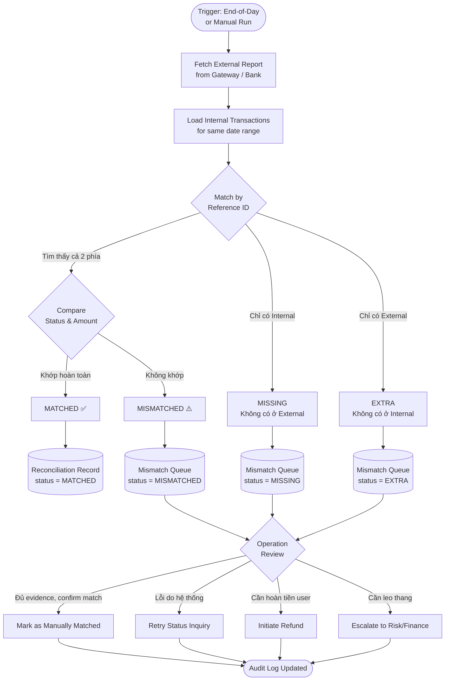

<Note>
  **Practice Case Study** — Tài liệu này là bài tập thực hành BA, không phải dự án thực tế. FinPay là công ty fictional. Các quy định và SLA tham chiếu cần xác nhận với Legal/Compliance trong dự án thực tế.
</Note>

## Tổng Quan & Mục Tiêu

### Tại sao cần Reconciliation Dashboard?

Quy trình đối soát truyền thống dựa trên xuất/nhập CSV cuối ngày tiềm ẩn nhiều rủi ro vận hành: mismatch chỉ được phát hiện sau nhiều giờ, không có audit trail đầy đủ, và đội Operation mất nhiều thời gian tra cứu thủ công từ nhiều hệ thống khác nhau.

<CardGroup cols={2}>
  <Card title="Realtime Mismatch Detection" icon="bell">
    Phát hiện mismatch ngay khi batch reconciliation chạy, thay vì chờ báo cáo cuối ngày. Cho phép đội Operation can thiệp trong vòng 30 phút thay vì nhiều giờ.
  </Card>
  <Card title="Giảm MTTR xuống dưới 30 phút" icon="clock">
    Tập trung toàn bộ context (internal event, external event, callback log) trên một màn hình — loại bỏ việc tra cứu thủ công trên nhiều hệ thống.
  </Card>
  <Card title="Audit Trail Bắt buộc" icon="shield-check">
    Mọi hành động manual resolve đều được ghi log với timestamp, user, lý do và trạng thái trước/sau.
  </Card>
  <Card title="Phân loại theo Severity" icon="triangle-exclamation">
    Exception được phân loại theo severity (Critical / High / Medium / Low) để đội Operation ưu tiên xử lý những case có rủi ro tài chính cao nhất trước.
  </Card>
</CardGroup>

---

## Reconciliation Flow



### Matching Logic

| Bước | Mô tả | Key Field |
|---|---|---|
| 1 | Fetch external report (CSV/API từ gateway) | `gateway_transaction_id` |
| 2 | Load internal records trong cùng date window | `wallet_transaction_id` |
| 3 | Primary match: exact match trên reference ID | `gateway_transaction_id` = `gateway_ref` |
| 4 | Secondary match (fallback): `amount` + `merchant_id` + `created_at` ± 60s | Multiple fields |
| 5 | Flag unmatched records theo hướng thiếu | Internal-only vs External-only |
| 6 | So sánh `status` và `amount` cho matched pairs | `wallet_status` vs `gateway_status` |
| 7 | Ghi kết quả vào `reconciliation_records` table | `reconciliation_status` |

---

## Mismatch Types

<Warning>
  Mọi mismatch có severity **Critical** hoặc **High** phải được assign và bắt đầu xử lý trong vòng **2 giờ** kể từ khi phát hiện. Breach SLA sẽ trigger cảnh báo tự động cho Operation Manager.
</Warning>

| # | Loại Mismatch | Mô tả | Ví dụ Cụ thể | Severity | Hành động Mặc định |
|---|---|---|---|---|---|
| 1 | **STATUS_MISMATCH** | Internal ghi nhận SUCCESS nhưng gateway trả về FAILED (hoặc ngược lại). Rủi ro cao: user có thể bị trừ tiền nhưng giao dịch thực tế thất bại. | Internal: `wallet_status = SUCCESS`. External (VietQR): `gateway_status = FAILED`. User báo bị trừ tiền nhưng merchant không nhận được. | **Critical** | Freeze transaction → Kiểm tra settlement → Refund nếu confirmed failed |
| 2 | **AMOUNT_MISMATCH** | Số tiền ghi nhận ở hai phía không khớp. Thường do lỗi currency formatting, decimal point, hoặc fee calculation khác nhau. | Internal: `amount = 100,000 VND`. External: `amount = 100` (đơn vị USD do gateway config sai locale). | **Critical** | Dừng settlement → Audit fee calculation → Điều chỉnh manual |
| 3 | **MISSING_CALLBACK** | Internal ở trạng thái UNKNOWN/PENDING do callback từ gateway không về, trong khi external đã ghi nhận SUCCESS. | Lúc 14:32: User quét QR 50,000 VND. Internal `wallet_status = UNKNOWN` (callback timeout sau 30s). External: `gateway_status = SUCCESS`. Merchant đã nhận tiền. | **High** | Retry callback fetch → Cập nhật internal status → Notify user |
| 4 | **DUPLICATE_TRANSACTION** | Xuất hiện 2+ records internal cùng `gateway_transaction_id`. Thường do retry logic không idempotent. | `gateway_transaction_id = GW_789` tìm thấy 2 records: `WT_001` và `WT_002`, cả hai SUCCESS, cùng amount. User bị trừ tiền 2 lần. | **Critical** | Xác định record gốc → Void record trùng → Refund amount bị deduct 2 lần |
| 5 | **GHOST_TRANSACTION** | External ghi nhận SUCCESS nhưng internal không tìm thấy bất kỳ record nào. | Bank settlement ghi 1 GD SUCCESS nhưng FinPay DB không có record tương ứng. | **Critical** | Kiểm tra transaction log → DB audit → Điều tra message queue |
| 6 | **SETTLEMENT_DELAY** | GD SUCCESS nhưng settlement xảy ra sau 24 giờ so với `transaction_date`. | GD SUCCESS lúc 23:55 ngày 14/01. Settlement fund xuất hiện ngày 16/01 — delay 33 giờ, vượt SLA. | **Medium** | Kiểm tra settlement batch → Liên hệ gateway → Cập nhật `settlement_date` |

---

## Dashboard Components — 3 Màn hình Chính

### Screen 1: Reconciliation Overview Dashboard

**Mục tiêu:** Operation Manager và Finance xem KPI đối soát theo ngày, phát hiện bất thường match rate.

**Người dùng chính:** Operation Manager, Finance Admin

<iframe src="/artifacts/digital-payment/reconciliation-dashboard.html" width="100%" height="780" style="border:1px solid #e5e7eb;border-radius:12px;"></iframe>

#### 5 KPI Metric Cards

| Card | Metric | Màu cảnh báo |
|---|---|---|
| Total Transactions | Tổng GD trong date range | — |
| Matched | GD khớp hoàn toàn | Xanh nếu ≥ 98% |
| Mismatched | GD không khớp | Đỏ nếu > 2% |
| Pending Review | Trong mismatch queue, chưa resolve | Cam nếu > 0 |
| Unresolved (> SLA) | Pending quá 24h | Đỏ nếu > 0 |

#### Charts

**Match Rate Chart (trái):** Line chart 30 ngày gần nhất, Y-axis: match rate (%), reference line 98% target.

**Mismatch Breakdown (phải):** Stacked bar chart theo ngày, màu theo mismatch type. Click segment → filter mismatch queue theo type đó.

#### Filters

| Filter | Type | Options |
|---|---|---|
| Date Range | Date picker | Today / Yesterday / Last 7d / Last 30d / Custom |
| Gateway | Multi-select | NAPAS, VietQR, VCB, Techcombank, ... |
| Merchant | Search + select | Free-text search |
| Reconciliation Status | Checkbox | MATCHED / MISMATCHED / MISSING / EXTRA / PENDING |

---

### Screen 2: Mismatch Queue

**Mục tiêu:** Reconciliation Staff xử lý từng exception theo thứ tự ưu tiên.

**Người dùng chính:** Reconciliation Staff, CS Agent

`[Insert: Mismatch queue wireframe — sortable table with SLA countdown, filter panel, bulk action bar top, side panel slides in from right for resolution form]`

#### Table Columns

| Cột | Mô tả | Sortable |
|---|---|---|
| **TX ID** | `wallet_transaction_id` — clickable link → Screen 3 | Không |
| **Mismatch Type** | Badge màu theo type | Có |
| **Internal Status** | `wallet_status` | Không |
| **External Status** | `gateway_status` từ external report | Không |
| **Amount** | Số tiền internal (VND) | Có |
| **Created** | `created_at` của mismatch record | Có |
| **SLA Remaining** | Countdown đến deadline 24h — traffic light | Có |
| **Assignee** | Avatar + tên staff; "Unassigned" màu đỏ | Không |
| **Actions** | Quick action buttons | Không |

**SLA Traffic Light:**

| Màu | Điều kiện | Ý nghĩa |
|---|---|---|
| 🟢 Xanh | > 8 giờ còn lại | On track |
| 🟡 Vàng | 2–8 giờ còn lại | Cần chú ý |
| 🔴 Đỏ | < 2 giờ hoặc đã breach | Urgent / Breach |

#### Actions Per Row

| Action | Điều kiện hiện | Kết quả |
|---|---|---|
| **View Detail** | Luôn hiện | Mở Screen 3 |
| **Retry Status Inquiry** | `mismatch_type = MISSING_CALLBACK` | Gọi lại API status inquiry |
| **Mark Matched** | Đã có evidence đủ | Form xác nhận + ghi lý do |
| **Request Refund** | Confirmed overpayment | Tạo refund ticket |
| **Add Note** | Luôn hiện | Thêm note vào audit trail |
| **Escalate** | Luôn hiện | Chuyển cho Risk/Operation Officer |

---

### Screen 3: Transaction Detail (Operation View)

**Mục tiêu:** Full timeline của 1 giao dịch để debug nguyên nhân mismatch.

**Người dùng chính:** CS Agent, Reconciliation Staff, Operation Officer

`[Insert: Transaction detail (operation view) — dual timeline showing internal vs external events synchronized by timestamp, reconciliation history section, role-based action panel fixed right]`

#### Dual Status Timeline

Hiển thị hai cột song song, đồng bộ theo timestamp:

```
INTERNAL EVENTS (FinPay)              EXTERNAL EVENTS (Gateway/Bank)
─────────────────────────────         ──────────────────────────────
14:32:18  Payment Request received    14:32:18  QR scanned at merchant POS
14:32:19  Wallet debit initiated      14:32:19  Payment instruction sent to NAPAS
14:32:19  Balance: 590,000→490,000    14:32:20  NAPAS processing...
14:32:20  Callback timeout (30s)      14:32:20  Gateway: FAILED (currency error)
14:32:50  Status → UNKNOWN            —
—                                     14:33:05  Reversal attempted (auto)
14:35:00  Reconciliation batch run    —
14:35:01  Mismatch detected           —
```

#### Action Panel (role-based, fixed right)

| Action Button | Hiện với Role | State |
|---|---|---|
| Retry Status Inquiry | CS Agent, Recon Staff | Active nếu status UNKNOWN/PENDING |
| Mark as Manually Resolved | Recon Staff, Operation Officer | Active nếu evidence đủ |
| Request Refund | Recon Staff | Active nếu confirmed overcharge |
| Approve Refund | Finance Admin, Operation Officer | Active nếu có refund request pending |
| Escalate | CS Agent, Recon Staff | Luôn active |
| Add Note | Tất cả (trừ Customer) | Luôn active |

---

## Source of Truth

| Data Object | Source of Truth | Lý do | Sync Target | Risk nếu Sai |
|---|---|---|---|---|
| **Wallet Balance** | Wallet Core DB (ledger) | Single write point — tránh race condition khi nhiều GD đồng thời | App display, Transaction Service | Hiển thị số dư sai → User khiếu nại; balance âm → Rủi ro gian lận |
| **Transaction Status (Internal)** | Wallet Transaction DB | Phản ánh trạng thái thực tế của fund movement trong hệ thống | App notification, Support tool | User thấy GD thành công nhưng thực tế chưa settle → Merchant dispute |
| **Payment Gateway Result** | Gateway API / Settlement Report | Gateway là căn cứ pháp lý cho settlement và refund | Reconciliation DB, wallet_status update | Bỏ qua gateway failure → Loss fund |
| **Settlement Status** | Bank Settlement Report (T+1) | Ngân hàng là bên cuối cùng thực hiện fund transfer | Finance ledger, merchant payout | Ghi nhận settled sớm → Sai báo cáo tài chính |
| **User-facing TX Display** | Wallet Transaction DB + Notification Service | User thấy những gì Wallet DB ghi nhận | App transaction history | Hiển thị sai status → Mất niềm tin |
| **KYC Tier / Transaction Limits** | Identity & Compliance DB | KYC là domain riêng, độc lập với payment flow | Payment gateway limit check | Cache KYC cũ → Cho phép GD vượt limit |
| **Audit Log** | Centralized Audit Log Service (append-only) | Audit log phải độc lập, append-only đảm bảo immutability | SIEM, Compliance reporting | Audit log thiếu → Không điều tra được incident |
| **Refund Status** | Refund Management Service | Refund có workflow riêng (request → approve → execute) | Wallet credit, Gateway refund API | Double refund; refund không thực hiện → User khiếu nại |

---

## Data Mapping — 4 Systems

```
[App Payment Request] → [Wallet Transaction] → [Gateway Transaction] → [Reconciliation Record]
```

| Field | Source | Target | Required | Transformation Rule | Validation | Note |
|---|---|---|---|---|---|---|
| `request_id` | App | Wallet Transaction | Required | Copy as-is | UUID v4; unique | Trace origin |
| `idempotency_key` | App | Wallet TX, Gateway TX | Required | Copy to both systems | Unique; 128 chars max | Prevent duplicate payment on retry |
| `wallet_transaction_id` | Wallet (generated) | Reconciliation Record | Required | Generate UUID | UUID v4; unique globally | PK của wallet system |
| `gateway_transaction_id` | Gateway (returned) | Wallet TX, Recon Record | Required (after gateway) | Store in wallet as `gateway_ref` | Not null after callback | Null nếu gateway call chưa xảy ra |
| `merchant_id` | App | Wallet TX, Gateway TX, Recon | Required | Copy as-is | Exists in merchant master | Validate trước khi tạo GD |
| `user_id` | App (auth token) | Wallet TX, Recon | Required | Extract từ JWT token | Must match auth context | Không tin client-provided user_id |
| `amount` | App | Wallet TX, Gateway TX, Recon | Required | Integer VND, không decimal | > 0; ≤ daily limit; ≤ balance | Một số gateway nhận đơn vị khác — cần transform rõ ràng |
| `currency` | App | Wallet TX, Gateway TX | Required | ISO 4217 (VND) | Enum whitelist: [VND] | Hard-code cho thị trường VN |
| `fee` | Fee Service | Wallet TX, Recon | Required | Tính bởi Fee Service; không do client gửi | ≥ 0; theo fee schedule | Separate field để audit |
| `qr_type` | App | Wallet TX, Gateway TX | Required | Enum: STATIC / DYNAMIC | Enum validation | Ảnh hưởng routing logic |
| `payment_method` | App | Wallet TX, Recon | Required | Enum: QR_PAYMENT / BANK_TRANSFER / CARD | Enum validation | Dùng để filter dashboard |
| `wallet_balance_before` | Wallet Core (snapshot) | Wallet TX | Required | Snapshot trong cùng DB transaction | ≥ 0; ≥ amount + fee | Dùng để audit balance movement |
| `wallet_balance_after` | Wallet Core (computed) | Wallet TX | Required | `balance_before` - `amount` - `fee` | Consistent với ledger | |
| `wallet_status` | Wallet TX (state machine) | Recon Record | Required | Managed by state machine | Enum: CREATED → MATCHED | Source of truth cho internal status |
| `gateway_status` | Gateway callback | Wallet TX, Recon | Required (after callback) | Normalize sang FinPay enum | Enum per gateway mapping | Raw gateway code lưu thêm ở `gateway_raw_status` |
| `reconciliation_status` | Reconciliation Service | Recon Record | Required | Generated sau matching | Enum: MATCHED/MISMATCHED/MISSING/EXTRA/PENDING | Null cho GD chưa qua reconciliation |
| `created_at` | Server-side | Wallet TX, Gateway TX, Recon | Required | Server timestamp (UTC) | ISO 8601; not null | UTC throughout; convert sang ICT chỉ ở display layer |
| `updated_at` | System (auto) | Wallet TX, Recon | Required | Auto-update on field change | ISO 8601; ≥ `created_at` | Trigger-managed tại DB level |
| `callback_received_at` | Gateway Callback Handler | Wallet TX | Optional | Timestamp khi callback được nhận | ISO 8601; null nếu chưa nhận | Null = chưa nhận callback; detect MISSING_CALLBACK |
| `settlement_date` | Bank Settlement Report | Recon Record | Optional | Parse từ bank report T+1 | Date YYYY-MM-DD; ≥ DATE(created_at) | Null = chưa settled; detect SETTLEMENT_DELAY |

---

## RBAC Matrix

<Info>
  **Ký hiệu:** ✅ Có quyền | ❌ Không có quyền | 🔒 Có điều kiện
</Info>

| Permission | Customer | Merchant | CS Agent | Reconciliation Staff | Risk / Operation Officer | Finance Admin | System Admin |
|---|:---:|:---:|:---:|:---:|:---:|:---:|:---:|
| View own transaction | ✅ | ✅ | ✅ | ✅ | ✅ | ✅ | ✅ |
| View merchant transactions | ❌ | 🔒¹ | ✅ | ✅ | ✅ | ✅ | ✅ |
| View all transactions | ❌ | ❌ | 🔒² | ✅ | ✅ | ✅ | ✅ |
| View reconciliation dashboard | ❌ | ❌ | 🔒³ | ✅ | ✅ | ✅ | ✅ |
| Retry status inquiry | ❌ | ❌ | ✅ | ✅ | ✅ | ❌ | ✅ |
| Request refund | ❌ | ❌ | 🔒⁴ | ✅ | ✅ | ❌ | ✅ |
| Approve refund | ❌ | ❌ | ❌ | ❌ | ✅ | ✅ | ✅ |
| Mark transaction as manually resolved | ❌ | ❌ | ❌ | ✅ | ✅ | ❌ | ✅ |
| Export reconciliation report | ❌ | 🔒⁵ | ❌ | ✅ | ✅ | ✅ | ✅ |
| View audit log | ❌ | ❌ | 🔒⁶ | ✅ | ✅ | ✅ | ✅ |
| Manage user roles | ❌ | ❌ | ❌ | ❌ | ❌ | ❌ | ✅ |
| Configure reconciliation rules | ❌ | ❌ | ❌ | ❌ | 🔒⁷ | ❌ | ✅ |

**Ghi chú điều kiện:**
¹ Merchant chỉ xem được transactions thuộc merchant_id của mình
² CS Agent access logged; cần reason code khi truy cập
³ CS Agent xem read-only mode; không thực hiện action
⁴ CS Agent chỉ request refund cho cases đã có approval từ Operation Officer
⁵ Merchant chỉ export report của merchant_id mình; format giới hạn
⁶ CS Agent xem audit log của 1 GD cụ thể khi đang hỗ trợ user
⁷ Operation Officer thay đổi threshold rules nhưng cần 4-eyes approval từ System Admin

---

## Audit Trail Requirements

<Warning>
  Audit log phải được lưu trên **hệ thống append-only độc lập** với business DB. Không được phép UPDATE hoặc DELETE audit records. Retention tối thiểu: **5 năm** (cần xác nhận với Legal/Compliance theo quy định thực tế áp dụng).
</Warning>

### Audit Requirements per Action

| Action | Fields Cần Log (ngoài standard fields) | Lý do |
|---|---|---|
| View transaction (first time) | `wallet_transaction_id`, `viewer_role`, `access_reason` | Privacy compliance — log lần đầu tiên actor xem 1 GD |
| Retry status inquiry | `gateway_endpoint_called`, `request_payload`, `response_code` | Trace kết quả gateway call |
| Mark as matched | `previous_recon_status`, `evidence_reference`, `justification_text` | 4-eyes: log cả người request và người confirm |
| Request refund | `refund_amount`, `refund_reason_code`, `refund_reason_text` | Tách biệt request và approve để enforce separation of duties |
| Approve refund | `refund_request_id`, `approved_amount`, `approver_note` | Log approved_amount riêng — có thể khác requested_amount |
| Manual resolve | `previous_status`, `new_status`, `resolution_type`, `resolution_note` | Bắt buộc `resolution_note` không được rỗng; min 20 ký tự |
| Export report | `export_format`, `date_range`, `filters_applied`, `row_count` | Track dữ liệu nào được export ra ngoài |
| Role assignment | `target_user_id`, `previous_role`, `new_role`, `assigner_justification` | Chỉ System Admin thực hiện |
