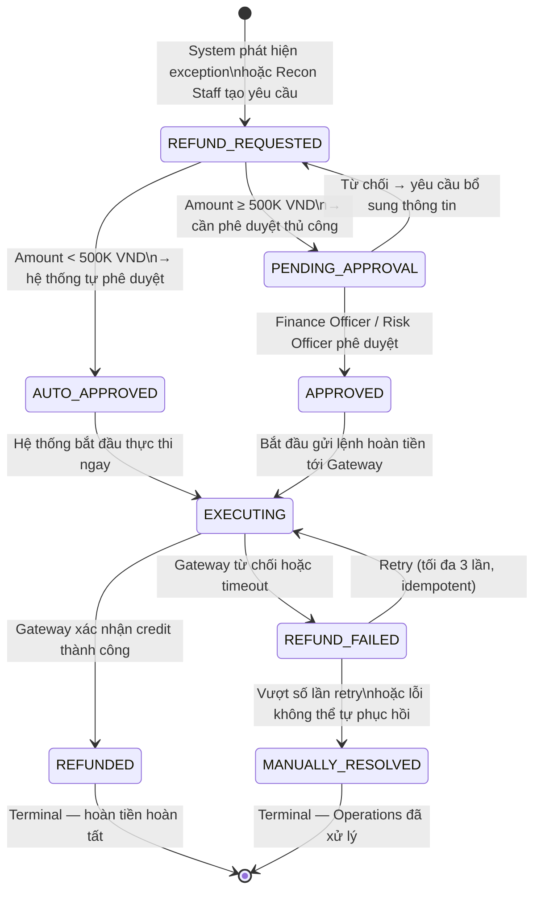

<Note>
  **Practice Case Study** — FinPay là công ty fictional. Tài liệu này được tạo cho mục đích portfolio BA. Các SLA, ngưỡng phê duyệt và business rules là fictional assumptions — cần calibrate theo thực tế dự án và xác nhận với Legal/Compliance.
</Note>

---

## 1. Bối cảnh & Bài toán

Trong hệ thống thanh toán, refund không phải là luồng ngoại lệ hiếm gặp — đây là nghiệp vụ bắt buộc phải được thiết kế đầy đủ từ ngày đầu. Refund được kích hoạt khi có **bất đồng giữa trạng thái giao dịch thực tế và số dư ví**: ví đã bị trừ tiền nhưng giao dịch không hoàn tất thành công ở phía đối tác thanh toán.

### Ba tình huống phổ biến dẫn đến Refund

| Tình huống | Nguyên nhân | Nguồn phát hiện |
|---|---|---|
| **Ví trừ tiền, thanh toán thất bại tại NAPAS** | Wallet Core debit thành công nhưng Gateway trả NACK hoặc thất bại sau xác nhận | Exception EXC-PAY-10 |
| **Giao dịch TIMEOUT không xác nhận được** | 30 giây không có response, Status Inquiry thất bại → UNKNOWN → Reconciliation xác nhận FAILED | Exception EXC-PAY-06 → Reconciliation |
| **AMOUNT_MISMATCH sau đối soát** | Số tiền nội bộ và bên ngoài lệch nhau, user bị trừ nhiều hơn thực tế | Exception EXC-PAY-09 |

Tài liệu này định nghĩa toàn bộ quy trình xử lý Refund — từ khi yêu cầu được tạo đến khi tiền về lại ví của người dùng — bao gồm State Machine, RBAC, Business Rules, SLA và UAT Scenarios.

<Info>
  **Mối liên hệ với các tài liệu khác trong cùng domain:**
  - **Transaction State Machine** — định nghĩa trạng thái `REFUND_REQUIRED` và `REFUNDED` trong vòng đời giao dịch gốc
  - **Exception Handling** — EXC-PAY-10, EXC-PAY-08, EXC-PAY-09 và EXC-PAY-13 là các trigger chính dẫn đến Refund
  - **Reconciliation Dashboard** — nơi Reconciliation Staff phát hiện mismatch và khởi tạo yêu cầu Refund
</Info>

---

## 2. Phạm vi

### IN SCOPE

- Refund do lỗi hệ thống: giao dịch thất bại nhưng ví đã bị trừ tiền
- Refund sau đối soát phát hiện mismatch (STATUS_MISMATCH, AMOUNT_MISMATCH)
- Refund cho giao dịch UNKNOWN được xác nhận thất bại qua Reconciliation

### OUT OF SCOPE

- Refund do người dùng đổi ý sau khi giao dịch thành công
- Tranh chấp với merchant (merchant dispute)
- Chargeback — dự kiến Phase 2

---

## 3. Các loại Refund

| Loại Refund | Trigger | Ví dụ | Người phê duyệt | SLA hoàn thành |
|---|---|---|---|---|
| **Tự động (System-initiated)** | Exception được phát hiện tự động; amount dưới ngưỡng auto-approve (< 500K VND) | EXC-PAY-10: ví trừ tiền, NAPAS trả FAILED | Hệ thống (không cần phê duyệt thủ công) | 24 giờ |
| **Thủ công (Manual)** | Reconciliation Staff review mismatch và tạo yêu cầu; amount ≥ 500K VND | AMOUNT_MISMATCH sau đối soát, chênh lệch lớn | Finance Officer (500K–5M VND) hoặc dual approval (> 5M VND) | 3–5 ngày làm việc |
| **Một phần (Partial)** | AMOUNT_MISMATCH với chênh lệch nhỏ; chỉ hoàn phần bị thu sai | Phí tính sai 5,000 VND trên giao dịch 200,000 VND | Finance Officer nếu > 500K VND; auto nếu dưới ngưỡng | Theo loại (tự động/thủ công) |
| **Khẩn cấp (Emergency)** | Ví trừ tiền nhưng giao dịch thất bại với amount > 500K VND; được ưu tiên xử lý | User thanh toán 2,000,000 VND bị trừ nhưng GD FAILED | Finance Officer; escalate ngay nếu không xử lý trong 30 phút | 4 giờ |

---

## 4. State Machine — Refund

### Bảy trạng thái Refund

| Trạng thái | Ý nghĩa | Owner |
|---|---|---|
| `REFUND_REQUESTED` | Yêu cầu hoàn tiền vừa được tạo — bởi hệ thống (tự động) hoặc Reconciliation Staff (thủ công) | Refund Service |
| `PENDING_APPROVAL` | Yêu cầu chờ phê duyệt từ Finance Officer hoặc Risk Officer (amount ≥ 500K VND) | Finance Officer / Risk Officer |
| `AUTO_APPROVED` | Yêu cầu được hệ thống tự động phê duyệt vì amount < ngưỡng (< 500K VND) | System |
| `APPROVED` | Yêu cầu đã được phê duyệt thủ công — sẵn sàng thực thi | Finance Officer |
| `EXECUTING` | Lệnh hoàn tiền đang được gửi tới Gateway/NAPAS; ví chờ nhận credit | Refund Service |
| `REFUNDED` | Hoàn tiền thành công — số tiền đã về ví người dùng; trạng thái cuối | Refund Service |
| `REFUND_FAILED` | Lệnh hoàn tiền thất bại — có thể retry hoặc chuyển sang xử lý thủ công | Refund Service / Operations |
| `MANUALLY_RESOLVED` | Operations team đã xử lý thủ công sau nhiều lần thất bại — trạng thái cuối | Operations Team |

### Sơ đồ chuyển trạng thái

<Warning>
  **Idempotency bắt buộc tại bước EXECUTING.** Mỗi lần retry phải dùng cùng `refund_idempotency_key` để đảm bảo Gateway không thực hiện hai lần credit cho cùng một yêu cầu. Không bao giờ tạo refund request mới khi một request đang ở EXECUTING hoặc REFUND_FAILED.
</Warning>

---

## 5. RBAC — Ai làm gì

| Hành động | Vai trò được phép | Điều kiện |
|---|---|---|
| Tạo yêu cầu Refund | Reconciliation Staff, System (tự động) | System tạo khi phát hiện exception; Staff tạo sau khi review mismatch trên dashboard |
| Xem yêu cầu Refund đang chờ | CS Agent, Reconciliation Staff, Finance Officer, Risk Officer | CS xem read-only; Staff và Officer có thể action |
| Phê duyệt Refund < 500K VND | System (auto-approve) | Amount dưới ngưỡng → không cần phê duyệt thủ công |
| Phê duyệt Refund 500K VND – 5M VND | Finance Officer | Finance Officer phê duyệt đơn lẻ |
| Phê duyệt Refund > 5M VND | Finance Officer **và** Risk Officer (dual approval) | Cả hai phải phê duyệt; thiếu một bên → không thực thi |
| Từ chối yêu cầu Refund | Finance Officer, Risk Officer | Phải ghi rõ lý do từ chối; yêu cầu trả về Reconciliation Staff để bổ sung evidence |
| Thực thi Refund | Refund Service (tự động sau khi được approve) | Chỉ thực thi khi ở trạng thái `APPROVED` hoặc `AUTO_APPROVED` |
| Retry thực thi | Refund Service (tự động), Operations Team (thủ công) | Tối đa 3 lần retry; vượt ngưỡng → Operations xử lý thủ công |
| Đánh dấu Manually Resolved | Operations Team | Bắt buộc ghi reason code và reviewer ID; không được để trống |
| Xem lịch sử Refund | CS Agent, Reconciliation Staff, Finance Officer, Risk Officer, Operations | Mọi hành động đều để lại audit trail |

---

## 6. Business Rules

| Rule ID | Trigger | Điều kiện | Hành vi | Owner |
|---|---|---|---|---|
| **BR-REFUND-01** | Refund request được tạo | Amount < 500,000 VND | Hệ thống tự động chuyển sang `AUTO_APPROVED` → `EXECUTING` mà không cần phê duyệt thủ công | Refund Service |
| **BR-REFUND-02** | Refund request được tạo | Amount ≥ 500,000 VND | Bắt buộc đi qua `PENDING_APPROVAL`; Finance Officer phê duyệt (500K–5M VND); dual approval cho > 5M VND | Finance Officer / Risk Officer |
| **BR-REFUND-03** | Refund request được khởi tạo | Có refund request nào đang tồn tại cho cùng `original_transaction_id` | Từ chối tạo mới; trả về `409 Conflict`; ghi log. **Idempotency**: một giao dịch gốc chỉ được phép có một refund request active tại một thời điểm | Refund Service |
| **BR-REFUND-04** | Bước EXECUTING hoàn thành | Gateway xác nhận credit thành công | Cập nhật trạng thái về `REFUNDED`; ghi nhận `refunded_at`; gửi thông báo cho user trong vòng 60 giây | Refund Service |
| **BR-REFUND-05** | Bước EXECUTING thất bại | Lần thất bại ≤ 3 | Tự động retry với cùng `refund_idempotency_key`; backoff: 5 phút, 15 phút, 30 phút | Refund Service |
| **BR-REFUND-06** | Bước EXECUTING thất bại | Lần thất bại > 3 | Chuyển sang `REFUND_FAILED` và cảnh báo Operations Team; không tiếp tục retry tự động | Operations Team |
| **BR-REFUND-07** | Refund thuộc loại Emergency (> 500K VND, lỗi hệ thống xác nhận) | SLA 4 giờ bị vi phạm | Tự động escalate lên Finance Officer và Risk Officer; gửi alert qua kênh nội bộ ưu tiên | Refund Service / Operations |

---

## 7. SLA

| Loại Refund | SLA bắt đầu xử lý | SLA hoàn thành | Escalation khi vi phạm |
|---|---|---|---|
| **Tự động (System-initiated)** | Trong vòng 1 giờ kể từ khi exception được phát hiện | Hoàn thành trong 24 giờ | Cảnh báo tự động tới Operations Team sau 24 giờ không resolve |
| **Thủ công (Manual)** | Reconciliation Staff bắt đầu xử lý trong 4 giờ làm việc | Hoàn thành trong 3–5 ngày làm việc (bao gồm thời gian xử lý từ phía ngân hàng/gateway) | Escalate lên Finance Manager nếu quá 5 ngày |
| **Khẩn cấp (Emergency)** | Trong vòng 30 phút kể từ khi phát hiện | Hoàn thành trong 4 giờ | Ngay lập tức escalate Finance Officer và Risk Officer; alert qua kênh ưu tiên |
| **Partial Refund** | Theo loại (tự động hoặc thủ công) | Theo loại tương ứng | Theo loại tương ứng |

<Info>
  SLA tính theo giờ làm việc đối với Refund thủ công. Các trường hợp Emergency và tự động tính theo giờ thực (24/7).
</Info>

---

## 8. Thông báo khi Refund

### Các sự kiện kích hoạt thông báo

| Sự kiện | Nội dung thông báo | Kênh |
|---|---|---|
| Refund request được tạo | "Chúng tôi đã nhận yêu cầu hoàn tiền [X VND] cho giao dịch [mã GD]. Thời gian xử lý: [X ngày làm việc]." | Push notification + In-app |
| Refund hoàn thành thành công | "[X VND] đã được hoàn về ví của bạn. Mã giao dịch hoàn tiền: [refund_id]." | Push notification + In-app |
| Refund thất bại sau các lần retry | "Chúng tôi gặp sự cố khi xử lý hoàn tiền cho giao dịch [mã GD]. Đội ngũ hỗ trợ sẽ liên hệ với bạn trong vòng 24 giờ. Lý do: [mô tả ngắn gọn]." | Push notification + In-app |
| Refund đang chờ xử lý quá SLA | "Yêu cầu hoàn tiền của bạn đang được ưu tiên xử lý. Chúng tôi xin lỗi vì sự chậm trễ." | Push notification + In-app |

### Nguyên tắc thông báo

- Không gửi thông báo trùng lặp: mỗi sự kiện chỉ gửi một lần
- Thông báo thất bại phải bao gồm mô tả nguyên nhân ở mức người dùng hiểu được (không dùng error code kỹ thuật)
- In-app hiển thị trạng thái chi tiết hơn push notification

---

## 9. UAT Scenarios

### [UAT-REFUND-01] Happy Path — Refund tự động dưới ngưỡng

| | |
|---|---|
| **Mô tả** | Ví bị trừ tiền nhưng giao dịch thất bại ở NAPAS, amount < 500K VND → hệ thống tự động tạo và thực thi refund |
| **Preconditions** | Giao dịch ở trạng thái `REFUND_REQUIRED`; amount = 150,000 VND; cấu hình auto-approve threshold = 500,000 VND |
| **Steps** | 1. Exception EXC-PAY-10 được phát hiện. / 2. Hệ thống tự động tạo refund request. / 3. Verify: trạng thái → `AUTO_APPROVED` ngay lập tức (không qua `PENDING_APPROVAL`). / 4. Refund Service thực thi. / 5. Verify: trạng thái → `REFUNDED`; ví người dùng tăng 150,000 VND. / 6. Verify: user nhận push notification trong vòng 60 giây. |
| **Expected Result** | Refund hoàn tất tự động. Không cần phê duyệt thủ công. Audit trail ghi đầy đủ. |
| **Priority** | High |

---

### [UAT-REFUND-02] Happy Path — Refund thủ công cần phê duyệt

| | |
|---|---|
| **Mô tả** | Reconciliation Staff tạo refund sau khi review mismatch; amount 1,200,000 VND → cần Finance Officer phê duyệt |
| **Preconditions** | Giao dịch ở `MISMATCHED` với STATUS_MISMATCH; amount = 1,200,000 VND; Finance Officer user sẵn sàng |
| **Steps** | 1. Reconciliation Staff mở transaction detail, xác nhận cần refund, tạo yêu cầu. / 2. Verify: trạng thái → `PENDING_APPROVAL`. / 3. Finance Officer nhận thông báo nội bộ, review và phê duyệt. / 4. Verify: trạng thái → `APPROVED` → `EXECUTING`. / 5. Gateway xác nhận credit. / 6. Verify: trạng thái → `REFUNDED`; user nhận thông báo. |
| **Expected Result** | Refund hoàn tất sau khi được phê duyệt. Finance Officer audit log ghi đầy đủ approver ID và timestamp. |
| **Priority** | High |

---

### [UAT-REFUND-03] Partial Refund — hoàn một phần do AMOUNT_MISMATCH

| | |
|---|---|
| **Mô tả** | Đối soát phát hiện user bị tính phí sai 8,000 VND trên giao dịch 200,000 VND → chỉ hoàn phần chênh lệch |
| **Preconditions** | Giao dịch `MATCHED`; internal amount = 208,000 VND; gateway amount = 200,000 VND; chênh lệch = 8,000 VND |
| **Steps** | 1. Reconciliation Staff tạo partial refund request với amount = 8,000 VND và ghi rõ lý do AMOUNT_MISMATCH. / 2. Verify: trạng thái → `AUTO_APPROVED` (< 500K VND). / 3. Refund Service thực thi partial refund. / 4. Verify: ví tăng 8,000 VND (không phải 208,000 VND). / 5. Verify: audit log ghi `original_amount = 208,000`, `refund_amount = 8,000`. |
| **Expected Result** | Chỉ hoàn đúng phần chênh lệch. Giao dịch gốc không bị ảnh hưởng. |
| **Priority** | High |

---

### [UAT-REFUND-04] Refund thất bại và tự động retry

| | |
|---|---|
| **Mô tả** | Gateway từ chối lần đầu, Refund Service tự động retry và thành công ở lần thứ hai |
| **Preconditions** | Refund request `APPROVED`; mock gateway cấu hình: lần 1 trả timeout, lần 2 trả SUCCESS |
| **Steps** | 1. Refund Service thực thi lần 1 → Gateway timeout. / 2. Verify: trạng thái → `REFUND_FAILED`. / 3. Sau 5 phút, hệ thống tự động retry với cùng `refund_idempotency_key`. / 4. Gateway trả SUCCESS ở lần retry 2. / 5. Verify: trạng thái → `REFUNDED`; chỉ một lần credit xảy ra trên ví. |
| **Expected Result** | Retry thành công. Idempotency đảm bảo không có double credit. |
| **Priority** | High |

---

### [UAT-REFUND-05] Dual Approval — Refund > 5M VND

| | |
|---|---|
| **Mô tả** | Refund amount 8,000,000 VND cần cả Finance Officer và Risk Officer phê duyệt mới được thực thi |
| **Preconditions** | Refund request được tạo với amount = 8,000,000 VND; dual approval threshold = 5,000,000 VND |
| **Steps** | 1. Reconciliation Staff tạo refund request. / 2. Verify: trạng thái → `PENDING_APPROVAL`. / 3. Finance Officer phê duyệt đơn lẻ. / 4. Verify: trạng thái KHÔNG chuyển sang `APPROVED` — vẫn ở `PENDING_APPROVAL`, chờ Risk Officer. / 5. Risk Officer phê duyệt. / 6. Verify: trạng thái → `APPROVED` → `EXECUTING`. / 7. Refund thành công. |
| **Expected Result** | Refund không thực thi khi chỉ có một bên phê duyệt. Dual approval được enforce đúng. |
| **Priority** | High |

---

### [UAT-REFUND-06] Idempotency — Ngăn refund 2 lần cùng một giao dịch

| | |
|---|---|
| **Mô tả** | Reconciliation Staff vô tình tạo yêu cầu refund lần thứ hai cho cùng một giao dịch đã có refund đang xử lý |
| **Preconditions** | Đã có refund request ở trạng thái `EXECUTING` cho `original_transaction_id = TXN_001` |
| **Steps** | 1. Reconciliation Staff tạo refund request mới cho cùng `TXN_001`. / 2. Verify: API trả `409 Conflict` với message "Refund request đang tồn tại cho giao dịch này". / 3. Verify: không có refund request mới được tạo trong DB. / 4. Verify: attempt được ghi vào audit log. |
| **Expected Result** | 409 Conflict. Không tạo duplicate refund. Idempotency được đảm bảo. |
| **Priority** | High |

---

### [UAT-REFUND-07] Thông báo đúng kênh theo từng trạng thái

| | |
|---|---|
| **Mô tả** | Kiểm tra user nhận đúng thông báo tại mỗi bước quan trọng của vòng đời refund |
| **Preconditions** | User có thiết bị với push notification bật; refund amount = 300,000 VND |
| **Steps** | 1. Refund request được tạo → verify user nhận push: "Đã nhận yêu cầu hoàn tiền 300,000 VND". / 2. Refund thực thi thất bại lần 1 → verify KHÔNG có push notification gửi đến user (chỉ retry nội bộ). / 3. Refund hoàn thành → verify user nhận push "300,000 VND đã về ví" trong 60 giây. / 4. Verify: in-app transaction history hiển thị trạng thái REFUNDED. |
| **Expected Result** | User nhận đúng 2 push notifications (tạo + hoàn thành). Không bị spam notification cho mỗi lần retry. |
| **Priority** | High |

---

### [UAT-REFUND-08] Refund quá SLA → Tự động escalate

| | |
|---|---|
| **Mô tả** | Refund Emergency không được xử lý trong 4 giờ → hệ thống tự động escalate |
| **Preconditions** | Refund Emergency request ở `PENDING_APPROVAL` (amount = 700,000 VND, loại Emergency); mock clock sẵn sàng advance |
| **Steps** | 1. Refund Emergency request tạo lúc T+0. / 2. Advance clock tới T+4h mà không có Finance Officer nào phê duyệt. / 3. Verify: hệ thống tự động trigger escalation alert tới Finance Manager và Risk Officer. / 4. Verify: alert ghi rõ `refund_id`, `original_transaction_id`, `amount`, `elapsed_time`. / 5. Verify: user nhận in-app message xin lỗi vì chậm trễ. |
| **Expected Result** | Escalation xảy ra đúng lúc T+4h. Alert đầy đủ thông tin. User được thông báo. |
| **Priority** | High |

---

## 10. Edge Cases

### Edge Case 1: Gateway xác nhận refund nhưng ví chưa nhận credit

**Mô tả:** Refund Service nhận response SUCCESS từ Gateway, nhưng Wallet Core không cập nhật balance do lỗi nội bộ (network timeout giữa các service).

**Xử lý:**
- Refund Service ghi nhận `gateway_refund_confirmed = true` và `wallet_credit_applied = false`
- Trigger retry cập nhật ví với cùng `refund_idempotency_key` — idempotent, không gọi lại Gateway
- Nếu retry ví thất bại > 3 lần: cảnh báo Operations Team để apply thủ công
- Audit log bắt buộc: `gateway_confirmation_timestamp`, `wallet_credit_attempt_count`, `final_wallet_status`

<Warning>
  Không được gọi lại Gateway để thực thi refund lần thứ hai trong trường hợp này. Gateway đã xác nhận thành công — chỉ cần đồng bộ lại trạng thái ví nội bộ.
</Warning>

---

### Edge Case 2: User đóng tài khoản trước khi Refund hoàn thành

**Mô tả:** Refund đang ở `PENDING_APPROVAL` hoặc `EXECUTING`, nhưng tài khoản ví của user đã bị đóng (do user yêu cầu hoặc bị khóa bởi Risk team).

**Xử lý:**
- Refund Service phát hiện tài khoản không active khi cố gắng credit
- Giữ nguyên refund request ở `REFUND_FAILED` với reason code `ACCOUNT_INACTIVE`
- Operations Team phải xử lý thủ công: liên hệ user qua email để xác định phương thức hoàn tiền thay thế (chuyển khoản ngân hàng, thẻ ghi nợ đã đăng ký)
- SLA tính từ thời điểm Operations Team xác nhận được phương thức thay thế

---

### Edge Case 3: Refund về tài khoản ngân hàng liên kết đã bị hủy liên kết

**Mô tả:** Giao dịch gốc được thực hiện qua ví liên kết với ngân hàng X. Sau đó user hủy liên kết tài khoản ngân hàng X trước khi refund hoàn thành.

**Xử lý:**
- Hệ thống ưu tiên hoàn tiền vào **ví FinPay** thay vì tài khoản ngân hàng gốc
- Nếu ví FinPay vẫn active → credit vào ví, thông báo user rõ nguồn nhận tiền
- Nếu cả ví lẫn tài khoản ngân hàng đều không khả dụng → chuyển sang Edge Case 2
- Business Rule: luồng refund phải kiểm tra tình trạng tài khoản nhận **ngay trước bước EXECUTING**, không tại thời điểm tạo request
