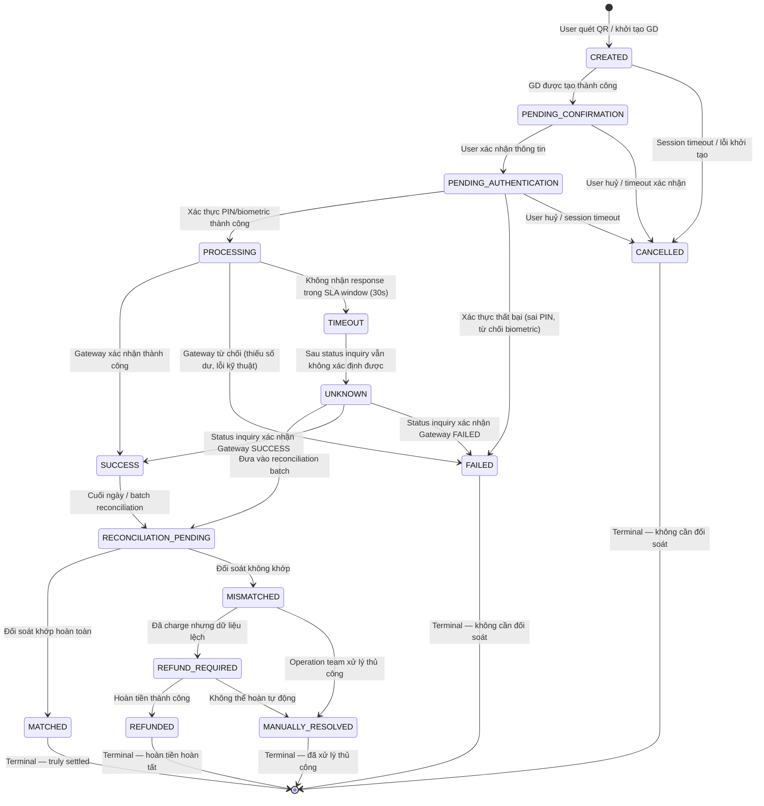
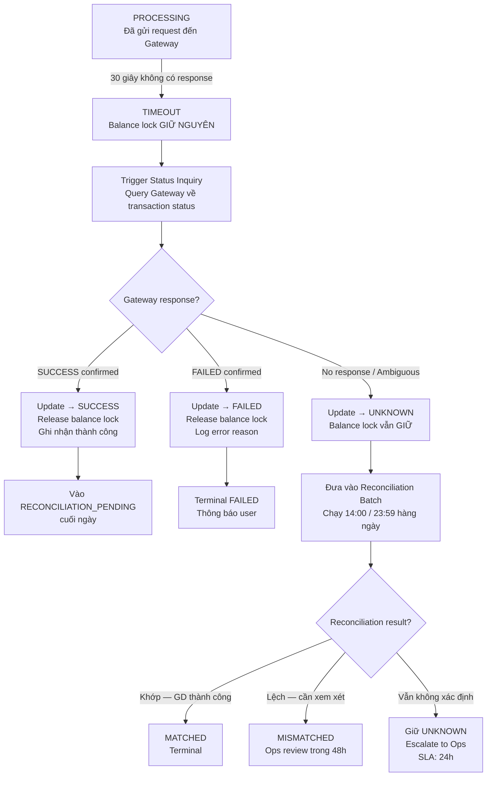

<Warning>
  **Practice Case Study — Fictional Scenario.** Tài liệu này được viết cho portfolio BA cá nhân. FinPay là công ty hư cấu. Mọi số liệu (timeout 30s, SLA 24h/48h) chỉ mang tính minh họa nghiệp vụ. Cần xác nhận với Legal/Compliance trong dự án thực tế.
</Warning>

## Overview

State machine này mô tả toàn bộ vòng đời của một giao dịch QR Payment trong hệ thống FinPay — từ thời điểm người dùng quét mã QR cho đến khi giao dịch được đối soát và quyết toán cuối cùng.

### Ba nhóm trạng thái

| Nhóm | States | Mô tả |
|---|---|---|
| **Operational States** | CREATED, PENDING_CONFIRMATION, PENDING_AUTHENTICATION, PROCESSING, SUCCESS, FAILED | Luồng xử lý chính trong thời gian thực |
| **Exception States** | TIMEOUT, UNKNOWN, CANCELLED | Các tình huống ngoại lệ cần xử lý đặc biệt |
| **Settlement States** | RECONCILIATION_PENDING, MATCHED, MISMATCHED, REFUND_REQUIRED, REFUNDED, MANUALLY_RESOLVED | Luồng đối soát và quyết toán |

### Nguyên tắc thiết kế cốt lõi

<Info>
  **Ba nguyên tắc BA phải nắm vững trước khi đọc tiếp:**

  1. **Timeout ≠ Failed** — Khi hệ thống không nhận được phản hồi từ Gateway, chúng ta KHÔNG biết giao dịch thành công hay thất bại. Đặt thẳng thành FAILED là sai nghiệp vụ và có thể gây double-charge hoặc mất tiền người dùng.

  2. **Unknown → Reconciliation** — Mọi giao dịch rơi vào trạng thái không xác định đều phải đi qua reconciliation trước khi có thể kết luận kết quả cuối cùng.

  3. **Success ≠ Settled** — Gateway xác nhận thành công chỉ là tín hiệu tức thời. "Truly settled" chỉ xảy ra sau khi đối soát khớp (MATCHED). REFUND chỉ được phép thực hiện sau khi giao dịch đã MATCHED.
</Info>

---

## Sơ đồ trạng thái

---

## Chi tiết từng trạng thái

### 1. CREATED

| | |
|---|---|
| **Status** | `CREATED` |
| **Meaning** | Giao dịch đã được khởi tạo trong hệ thống sau khi người dùng quét mã QR. Hệ thống đã sinh Transaction ID và idempotency key, chưa thực hiện bất kỳ thao tác tài chính nào. |
| **Trigger vào trạng thái** | User quét mã QR hợp lệ và hệ thống xác thực mã thành công |
| **Owner system** | Transaction Service |
| **Ai/Hệ thống được phép chuyển** | System (automatic) — ngay sau khi QR được parse và validated |
| **Next possible statuses** | `PENDING_CONFIRMATION`, `CANCELLED` |
| **User-facing message** | "Đang tải thông tin thanh toán..." |
| **Business rules** | BR-TX-01 — idempotency key được sinh và gắn với GD ngay tại bước này |

---

### 2. PENDING_CONFIRMATION

| | |
|---|---|
| **Status** | `PENDING_CONFIRMATION` |
| **Meaning** | Giao dịch đang chờ người dùng xem lại và xác nhận thông tin thanh toán: tên người nhận, số tiền, ngân hàng đích. Chưa có thao tác tài chính nào xảy ra. |
| **Trigger vào trạng thái** | Hệ thống đã load thành công thông tin merchant/payee từ QR data và hiển thị lên màn hình xác nhận |
| **Owner system** | Transaction Service + UI Layer |
| **Ai/Hệ thống được phép chuyển** | User (action) hoặc System (timeout 120s) |
| **Next possible statuses** | `PENDING_AUTHENTICATION`, `CANCELLED` |
| **User-facing message** | "Vui lòng kiểm tra thông tin và xác nhận thanh toán" |
| **Business rules** | Timeout màn hình xác nhận: 120 giây → auto CANCELLED |

---

### 3. PENDING_AUTHENTICATION

| | |
|---|---|
| **Status** | `PENDING_AUTHENTICATION` |
| **Meaning** | Người dùng đã xác nhận thông tin, hệ thống đang chờ xác thực danh tính qua PIN hoặc biometric. Đây là bước bảo mật bắt buộc trước khi gửi lệnh đến Gateway. |
| **Trigger vào trạng thái** | User bấm "Xác nhận thanh toán" tại màn hình PENDING_CONFIRMATION |
| **Owner system** | Auth Service + Transaction Service |
| **Ai/Hệ thống được phép chuyển** | User (action) hoặc System (timeout 60s) |
| **Next possible statuses** | `PROCESSING`, `FAILED`, `CANCELLED` |
| **User-facing message** | "Nhập mã PIN để xác nhận thanh toán" |
| **Business rules** | Tối đa 3 lần thử sai PIN → FAILED. Timeout xác thực: 60 giây → CANCELLED |

---

### 4. PROCESSING

| | |
|---|---|
| **Status** | `PROCESSING` |
| **Meaning** | Hệ thống đã gửi lệnh thanh toán đến Payment Gateway. Số tiền đã bị lock tạm thời trong ví. Đây là trạng thái ngắn nhất — tối đa 30 giây. |
| **Trigger vào trạng thái** | User xác thực thành công; Transaction Service tạo payment request và gửi đến Gateway |
| **Owner system** | Transaction Service + Wallet Core + Payment Gateway Adapter |
| **Ai/Hệ thống được phép chuyển** | System (automatic) — dựa vào Gateway response hoặc timeout |
| **Next possible statuses** | `SUCCESS`, `FAILED`, `TIMEOUT` |
| **User-facing message** | "Đang xử lý thanh toán..." (loading indicator) |
| **Business rules** | BR-TX-01 (idempotency key gửi kèm request); BR-TX-02 (timeout 30s → TIMEOUT, không phải FAILED); BR-TX-03 (balance lock phải được duy trì cho đến khi có kết quả rõ ràng) |

---

### 5. SUCCESS

| | |
|---|---|
| **Status** | `SUCCESS` |
| **Meaning** | Payment Gateway đã xác nhận giao dịch thành công. **Lưu ý quan trọng:** đây là SUCCESS theo thời gian thực, chưa phải "settled" — giao dịch vẫn cần qua reconciliation. |
| **Trigger vào trạng thái** | Gateway trả về response code thành công; hoặc Status Inquiry xác nhận SUCCESS sau TIMEOUT |
| **Owner system** | Payment Gateway Adapter → Transaction Service |
| **Ai/Hệ thống được phép chuyển** | System (automatic) |
| **Next possible statuses** | `RECONCILIATION_PENDING` |
| **User-facing message** | "Thanh toán thành công! ✓" — hiển thị số tiền, mã GD, thời gian |
| **Business rules** | Balance lock được giải phóng; transaction record được ghi nhận; push notification gửi đến user và merchant |

---

### 6. FAILED

| | |
|---|---|
| **Status** | `FAILED` |
| **Meaning** | Giao dịch thất bại với nguyên nhân đã được xác định rõ ràng: Gateway từ chối, hoặc xác thực thất bại. |
| **Trigger vào trạng thái** | Gateway trả về error response code; Auth Service xác nhận sai PIN lần thứ 3; hoặc Status Inquiry sau TIMEOUT xác nhận Gateway FAILED |
| **Owner system** | Payment Gateway Adapter / Auth Service → Transaction Service |
| **Ai/Hệ thống được phép chuyển** | System (automatic) |
| **Next possible statuses** | `[*]` (terminal) |
| **User-facing message** | "Thanh toán thất bại. [Lý do cụ thể]" |
| **Business rules** | BR-TX-03 — balance lock phải được release ngay lập tức khi chuyển sang FAILED |

---

### 7. TIMEOUT

| | |
|---|---|
| **Status** | `TIMEOUT` |
| **Meaning** | Hệ thống đã gửi request đến Gateway nhưng không nhận được response trong vòng 30 giây. **Đây không phải FAILED** — chúng ta chưa biết kết quả. Gateway có thể đã xử lý thành công nhưng response bị mất trên đường về. |
| **Trigger vào trạng thái** | Timer 30 giây kể từ khi gửi request đến Gateway hết hạn mà không nhận được response |
| **Owner system** | Transaction Service (timeout scheduler) |
| **Ai/Hệ thống được phép chuyển** | System (automatic) |
| **Next possible statuses** | `UNKNOWN` (sau status inquiry không xác định được); `SUCCESS`; `FAILED` |
| **User-facing message** | "Giao dịch đang được xử lý. Vui lòng không thực hiện lại. Chúng tôi sẽ thông báo kết quả trong vài phút." |
| **Business rules** | BR-TX-02 — TIMEOUT không được map thành FAILED. Balance lock phải được GIỮ NGUYÊN. Hệ thống phải trigger Status Inquiry ngay sau khi vào TIMEOUT |

<Warning>
  **Điểm BA quan trọng nhất trong toàn bộ state machine này.**

  Nếu map TIMEOUT → FAILED và release balance lock, nhưng thực tế Gateway đã debit tài khoản người dùng thành công, chúng ta sẽ:
  - Trả tiền cho user (unlock balance) trong khi tiền đã ra khỏi tài khoản
  - Merchant đã nhận tiền nhưng hệ thống ghi nhận FAILED
  - Không có reconciliation record → mismatch không thể phát hiện tự động

  Hậu quả: Tổn thất tài chính trực tiếp và mất lòng tin của merchant.
</Warning>

---

### 8. UNKNOWN

| | |
|---|---|
| **Status** | `UNKNOWN` |
| **Meaning** | Sau khi TIMEOUT xảy ra và hệ thống đã thực hiện Status Inquiry nhưng vẫn không xác định được kết quả. Giao dịch cần được xử lý qua reconciliation batch. |
| **Trigger vào trạng thái** | Status Inquiry sau TIMEOUT trả về kết quả không xác định hoặc không nhận được response |
| **Owner system** | Transaction Service + Reconciliation Service |
| **Ai/Hệ thống được phép chuyển** | System (automatic) |
| **Next possible statuses** | `RECONCILIATION_PENDING`, `SUCCESS`, `FAILED` |
| **User-facing message** | "Giao dịch đang được xác nhận. Kết quả sẽ được cập nhật trong vòng 24 giờ. Vui lòng không thực hiện lại giao dịch." |
| **Business rules** | BR-TX-04 — mọi GD ở UNKNOWN phải được reconcile trong vòng 24h. Balance lock vẫn giữ nguyên |

---

### 9. CANCELLED

| | |
|---|---|
| **Status** | `CANCELLED` |
| **Meaning** | Giao dịch bị huỷ trước khi lệnh được gửi đến Gateway. Không có thao tác tài chính nào đã thực sự xảy ra. |
| **Trigger vào trạng thái** | User bấm "Huỷ" tại bất kỳ bước PENDING nào; Session timeout |
| **Owner system** | Transaction Service |
| **Ai/Hệ thống được phép chuyển** | User (action) hoặc System (timeout) |
| **Next possible statuses** | `[*]` (terminal) |
| **User-facing message** | "Giao dịch đã bị huỷ" |
| **Business rules** | CANCELLED chỉ có thể xảy ra trước PROCESSING. Nếu GD đã vào PROCESSING, không thể CANCEL — phải chờ kết quả hoặc đi qua REFUND |

---

### 10. RECONCILIATION_PENDING

| | |
|---|---|
| **Status** | `RECONCILIATION_PENDING` |
| **Meaning** | Giao dịch đang chờ đối soát với dữ liệu từ Payment Gateway / NAPAS. Trạng thái này tồn tại trong khoảng thời gian từ khi GD kết thúc đến khi reconciliation batch chạy. |
| **Trigger vào trạng thái** | Cuối ngày batch job đưa tất cả GD SUCCESS vào reconciliation queue; hoặc GD từ UNKNOWN được xác nhận |
| **Owner system** | Reconciliation Service |
| **Ai/Hệ thống được phép chuyển** | System (automatic) — Reconciliation batch job |
| **Next possible statuses** | `MATCHED`, `MISMATCHED` |
| **User-facing message** | Không hiển thị trực tiếp với user — internal state. Trên màn hình lịch sử GD vẫn hiện "Thành công" |
| **Business rules** | GD ở trạng thái này không được phép REFUND. Reconciliation batch chạy 2 lần/ngày: 14:00 và 23:59 |

---

### 11. MATCHED

| | |
|---|---|
| **Status** | `MATCHED` |
| **Meaning** | Đối soát hoàn toàn khớp: số tiền, trạng thái, và thông tin giao dịch trong hệ thống FinPay khớp chính xác với dữ liệu từ Gateway/NAPAS. **Đây là "truly settled"** — giao dịch hoàn toàn kết thúc về mặt tài chính. |
| **Trigger vào trạng thái** | Reconciliation batch so khớp và xác nhận tất cả fields đều match |
| **Owner system** | Reconciliation Service |
| **Ai/Hệ thống được phép chuyển** | System (automatic) — chỉ Reconciliation Service |
| **Next possible statuses** | `[*]` (terminal) |
| **User-facing message** | Không thay đổi UI — vẫn hiện "Thành công". MATCHED là internal settled state |
| **Business rules** | BR-TX-06 — chỉ từ MATCHED mới có thể tạo REFUND request. MATCHED là điều kiện tiên quyết để merchant settlement |

---

### 12. MISMATCHED

| | |
|---|---|
| **Status** | `MISMATCHED` |
| **Meaning** | Đối soát phát hiện sự không khớp giữa dữ liệu hệ thống và dữ liệu Gateway. Có thể là lệch số tiền, lệch trạng thái, hoặc GD có trong một bên nhưng không có trong bên kia. |
| **Trigger vào trạng thái** | Reconciliation batch phát hiện ít nhất một điều kiện mismatch |
| **Owner system** | Reconciliation Service → Operations Team |
| **Ai/Hệ thống được phép chuyển** | Operations Team (manual review) |
| **Next possible statuses** | `REFUND_REQUIRED`, `MANUALLY_RESOLVED` |
| **User-facing message** | Không thay đổi UI. Trên màn hình lịch sử vẫn hiện "Thành công" trong khi team Ops xử lý nội bộ |
| **Business rules** | BR-TX-05 — MISMATCHED phải được Operations team review trong vòng 48h |

---

### 13. REFUND_REQUIRED

| | |
|---|---|
| **Status** | `REFUND_REQUIRED` |
| **Meaning** | Xác định rằng người dùng đã bị charge tiền nhưng dịch vụ không được cung cấp hoặc có sự cố cần hoàn tiền. |
| **Trigger vào trạng thái** | Từ MISMATCHED sau khi Ops xác định user đã bị charge nhưng cần hoàn; hoặc request hoàn tiền hợp lệ từ MATCHED |
| **Owner system** | Operations Team + Refund Service |
| **Ai/Hệ thống được phép chuyển** | Operations Team (manual) hoặc System (rule-based) |
| **Next possible statuses** | `REFUNDED`, `MANUALLY_RESOLVED` |
| **User-facing message** | "Yêu cầu hoàn tiền của bạn đang được xử lý. Thời gian hoàn tiền: 3-5 ngày làm việc." |
| **Business rules** | BR-TX-06 — REFUND chỉ được tạo khi GD đã đi qua MATCHED hoặc được Ops xác nhận đã charge |

---

### 14. REFUNDED

| | |
|---|---|
| **Status** | `REFUNDED` |
| **Meaning** | Giao dịch hoàn tiền đã được xử lý thành công. Số tiền đã được trả về tài khoản/ví của người dùng. |
| **Trigger vào trạng thái** | Refund Service xác nhận hoàn tiền thành công; Gateway xác nhận credit về tài khoản người dùng |
| **Owner system** | Refund Service → Transaction Service |
| **Ai/Hệ thống được phép chuyển** | System (automatic) — Refund Service |
| **Next possible statuses** | `[*]` (terminal) |
| **User-facing message** | "Hoàn tiền thành công. [Số tiền] đã được hoàn về tài khoản của bạn." — kèm push notification |
| **Business rules** | Refund transaction được tạo như một GD riêng biệt, linked với original transaction ID |

---

### 15. MANUALLY_RESOLVED

| | |
|---|---|
| **Status** | `MANUALLY_RESOLVED` |
| **Meaning** | Operations team đã xem xét và xử lý thủ công giao dịch này — có thể là điều chỉnh sổ sách, xác nhận không cần hoàn tiền, hoặc xử lý đặc biệt không theo luồng tự động. |
| **Trigger vào trạng thái** | Ops team hoàn tất manual review và đánh dấu resolved |
| **Owner system** | Operations Tool → Transaction Service |
| **Ai/Hệ thống được phép chuyển** | Operations Team (manual only) — bắt buộc ghi nhận reason code và reviewer ID |
| **Next possible statuses** | `[*]` (terminal) |
| **User-facing message** | Tùy vào quyết định của Ops |
| **Business rules** | Bắt buộc audit trail: reviewer ID, timestamp, reason code, action taken |

---

## Terminal States

| Terminal State | Ý nghĩa tài chính | Điều kiện đạt được | Cần đối soát? |
|---|---|---|---|
| **FAILED** | Không có giao dịch tài chính nào xảy ra | Gateway từ chối rõ ràng HOẶC xác thực thất bại | Không |
| **CANCELLED** | Không có giao dịch tài chính nào xảy ra | User huỷ HOẶC timeout trước PROCESSING | Không |
| **MATCHED** | Settled — tiền đã chuyển và được xác nhận hai chiều | Đối soát khớp 100% với Gateway | Đã hoàn tất |
| **REFUNDED** | Tiền đã được hoàn trả cho user | Refund Service xác nhận credit thành công | Cần đối soát refund riêng |
| **MANUALLY_RESOLVED** | Ops team đã xử lý — outcome tùy case | Manual review hoàn tất với audit log | Đã được review thủ công |

---

## Timeout Handling

<Warning>
  **Đây là luồng xử lý phức tạp nhất và có rủi ro tài chính cao nhất trong toàn bộ state machine.** BA cần hiểu rõ từng bước trước khi viết AC hoặc làm việc với Dev.
</Warning>

### Tại sao TIMEOUT không được map thành FAILED?

Khi hệ thống gửi request đến Gateway và không nhận được response, có hai khả năng:

1. **Gateway chưa xử lý** — request bị drop trước khi Gateway handle → an toàn khi xử lý như FAILED
2. **Gateway đã xử lý thành công** — debit đã xảy ra nhưng response callback bị mất → nếu xử lý như FAILED và release balance, user mất tiền

Vì chúng ta không biết thuộc trường hợp nào, **bắt buộc phải giữ balance lock và tiến hành Status Inquiry**.

### Luồng xử lý chi tiết

### Status Inquiry — Quy trình

| Bước | Hành động | Thời điểm |
|---|---|---|
| 1 | Trigger Status Inquiry ngay khi GD vào TIMEOUT | T+0s |
| 2 | Retry 1: Query Gateway với original transaction ID | T+0s |
| 3 | Retry 2: Query Gateway nếu retry 1 thất bại | T+10s |
| 4 | Retry 3: Query Gateway nếu retry 2 thất bại | T+20s |
| 5 | Nếu cả 3 retries đều thất bại → UNKNOWN | T+30s |
| 6 | Log toàn bộ attempts, đưa vào reconciliation queue | T+30s |

---

## Cancellation Rules

| Trạng thái hiện tại | Có thể CANCEL? | Ai được phép | Điều kiện |
|---|---|---|---|
| `CREATED` | Có | User / System | Bất kỳ lúc nào trước khi xác nhận |
| `PENDING_CONFIRMATION` | Có | User / System (timeout) | User bấm Huỷ hoặc sau 120s không tương tác |
| `PENDING_AUTHENTICATION` | Có | User / System (timeout) | User bấm Huỷ hoặc sau 60s không xác thực |
| `PROCESSING` | **Không** | — | Lệnh đã gửi Gateway — không thể can thiệp |
| `SUCCESS` | **Không** | — | Phải dùng luồng REFUND |
| `TIMEOUT` | **Không** | — | Đang trong quá trình xác nhận kết quả |
| `UNKNOWN` | **Không** | — | Chờ reconciliation xác định |
| Các Settlement States | **Không** | — | Chỉ Ops có thể MANUALLY_RESOLVE |

---

## Reconciliation Path

### Mismatch Types

| Loại Mismatch | Mô tả | Xử lý |
|---|---|---|
| **Status Mismatch** | FinPay ghi SUCCESS nhưng Gateway ghi FAILED (hoặc ngược lại) | Ops review → xác định source of truth |
| **Amount Mismatch** | Số tiền trong FinPay record khác với số tiền Gateway xác nhận | Ops review → điều chỉnh sổ sách hoặc tạo REFUND |
| **Missing from Gateway** | GD có trong FinPay nhưng không có trong file đối soát Gateway | Ops investigation → thường cần Status Inquiry thủ công |
| **Missing from FinPay** | GD có trong file Gateway nhưng không có trong FinPay | Ops investigation → kiểm tra callback failure |
| **Timing Mismatch** | GD xuất hiện ở ngày đối soát khác nhau | Thường tự resolve ở batch ngày hôm sau |

### MATCHED = "Truly Settled"

Khi GD đạt `MATCHED`:
- Số liệu FinPay và Gateway hoàn toàn nhất quán
- Merchant có thể nhận settlement
- Đây là thời điểm duy nhất có thể tạo REFUND request hợp lệ

---

## Business Rules — Mapping với States

| Rule ID | Nội dung Rule | State liên quan | Owner |
|---|---|---|---|
| **BR-TX-01** | Idempotency key bắt buộc — phải được sinh tại CREATED và gửi kèm trong mọi request đến Gateway tại PROCESSING | CREATED, PROCESSING | Transaction Service |
| **BR-TX-02** | Timeout = 30 giây → TIMEOUT, không được map thành FAILED. Balance lock phải được giữ nguyên | PROCESSING, TIMEOUT | Transaction Service |
| **BR-TX-03** | Balance lock: khóa khi vào PROCESSING; chỉ được release khi GD chuyển sang FAILED, CANCELLED, hoặc REFUNDED | PROCESSING → FAILED / CANCELLED / REFUNDED | Wallet Core |
| **BR-TX-04** | Mọi GD ở UNKNOWN phải được reconcile và có kết quả trong vòng 24 giờ. Quá 24h phải escalate lên Ops team | UNKNOWN | Reconciliation Service |
| **BR-TX-05** | MISMATCHED phải có Operations team review và resolution trong vòng 48 giờ. Mỗi case phải có reason code và reviewer ID trong audit log | MISMATCHED | Operations Team |
| **BR-TX-06** | REFUND chỉ được tạo từ GD đã đạt MATCHED (không refund khi chưa settled) | MATCHED, MISMATCHED → REFUND_REQUIRED | Refund Service / Ops |
