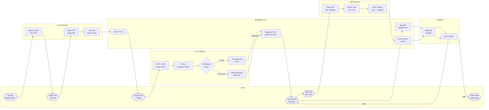
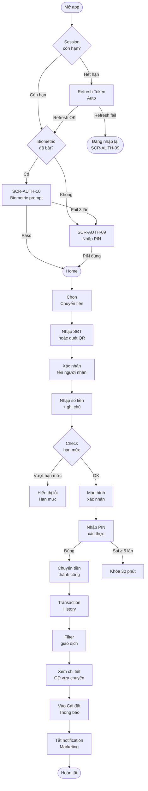
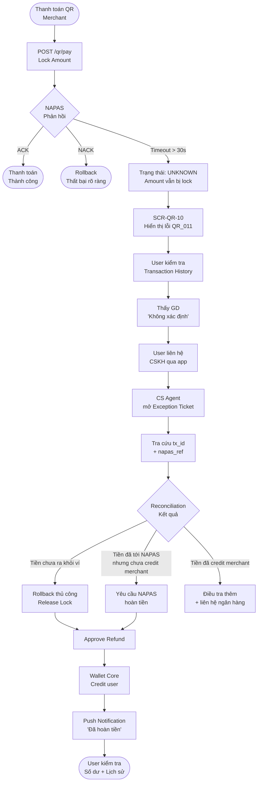
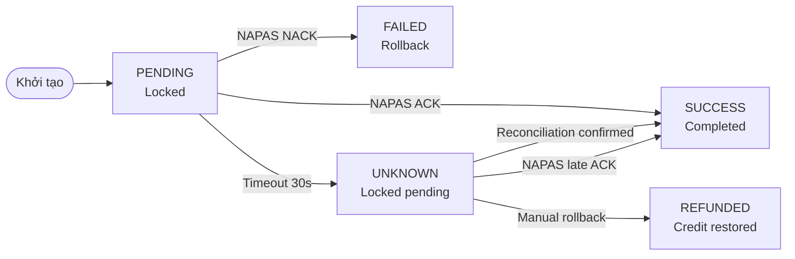

# Hành trình người dùng — FinPay E-Wallet

<Note>
  Đây là practice case được xây dựng để thể hiện cách tiếp cận BA trong domain E-wallet / Payment System. Tài liệu này mô tả 3 hành trình người dùng xuyên suốt 8 module của hệ thống FinPay fictional. Mọi tên tổ chức, số liệu và tình huống đều là mô phỏng.
</Note>

<Info>
  **Mục tiêu tài liệu:** Cung cấp góc nhìn tổng thể về hành trình người dùng xuyên suốt các module của FinPay — từ lúc đăng ký đến khi thực hiện giao dịch đầu tiên thành công. Giúp PM, Dev và QA hiểu liên kết giữa 8 module mà không cần đọc từng PRD riêng lẻ.

  **Tài liệu liên quan:** PRD-EW-AUTH-001 · PRD-EW-KYC-001 · PRD-EW-WALLET-001 · PRD-EW-QR-001 · PRD-EW-BANK-001 · PRD-EW-TRANSFER-001 · PRD-EW-HISTORY-001 · PRD-EW-NOTIF-001
</Info>

---

## 1. Tổng quan 3 hành trình chính

| Hành trình | Persona | Mục tiêu |
|---|---|---|
| **Hành trình 1** | Người dùng mới (New User) | Đăng ký → KYC → nạp tiền → thanh toán QR lần đầu |
| **Hành trình 2** | Người dùng thường xuyên (Active User) | Đăng nhập nhanh → chuyển tiền → xem lịch sử → cập nhật cài đặt |
| **Hành trình 3** | Người dùng có giao dịch tranh chấp (Dispute User) | Phát hiện giao dịch không xác định → liên hệ CS → nhận hoàn tiền |

---

## 2. Hành trình 1 — Người dùng mới (New User Journey)

**Mục tiêu:** Đăng ký tài khoản → KYC Tier 2 → nạp tiền → thanh toán QR merchant lần đầu thành công.

### 2.1 Bảng bước chi tiết

| Bước | Tên bước | Module | Màn hình chính | Điều kiện đặc biệt | Lỗi có thể xảy ra |
|------|----------|--------|----------------|-------------------|-------------------|
| 1 | Tải app & khởi động | Auth Module | SCR-AUTH-01 Splash | — | — |
| 2 | Nhập số điện thoại | Auth Module | SCR-AUTH-03 | SĐT chưa đăng ký; đầu số VN hợp lệ | AUTH_001 (SĐT sai định dạng), AUTH_002 (SĐT đã tồn tại) |
| 3 | Nhập OTP xác thực | Auth Module | SCR-AUTH-04 | OTP 6 số; hiệu lực 3 phút; tối đa 3 lần nhập sai | AUTH_004 (OTP sai), AUTH_005 (block 15 phút), AUTH_006 (OTP hết hạn) |
| 4 | Tạo PIN 6 số | Auth Module | SCR-AUTH-05/06 | PIN không được là pattern đơn giản (123456, 000000…) | AUTH_008 (PIN quá đơn giản), AUTH_014 (PIN không khớp) |
| 5 | Nhập thông tin cơ bản | Auth Module | SCR-AUTH-07 | Tuổi ≥ 15; xác nhận pháp lý | AUTH_013 (chưa đủ tuổi) |
| 6 | Tài khoản Tier 1 được tạo | Auth Module + Wallet Core | Home | Ví được tạo tự động; Tier 1 (hạn mức 1M/lần, 10M/tháng) | — |
| 7 | Bắt đầu KYC — quét CCCD | KYC Module | SCR-KYC-01/02/03/04 | CCCD gắn chip 12 số; còn hạn | KYC_001 (ảnh mờ), KYC_002 (CCCD hết hạn), KYC_010 (sai loại giấy tờ) |
| 8 | Đọc chip NFC | KYC Module | SCR-KYC-05 | Thất bại 3 lần → bỏ qua và vào manual review | KYC_006 (chip không hợp lệ) |
| 9 | Xác nhận thông tin OCR/NFC | KYC Module | SCR-KYC-06 | Read-only; không chỉnh sửa trực tiếp | — |
| 10 | Chụp selfie liveness (iProov) | KYC Module | SCR-KYC-07 | Đủ sáng; nhìn thẳng; không đeo kính mát; iProov flash sequence | KYC_004 (khuôn mặt không khớp), KYC_005 (liveness fail) |
| 11 | KYC auto-approve / chờ manual | KYC Module | SCR-KYC-09 hoặc SCR-KYC-11 | Confidence ≥ 0.85 → auto-approve; 0.70–0.84 → manual review 48h | KYC_009 (hệ thống bảo trì) |
| 12 | Tier 2 được kích hoạt | KYC Module + Wallet Core | Home — Tier 2 badge | Hạn mức tăng lên 20M/lần, 100M/tháng | — |
| 13 | Liên kết ngân hàng | Bank Linking Module | SCR-BANK-01 | OTP ngân hàng xác thực; tối thiểu 1 ngân hàng bắt buộc (Nghị định 52/2024) | — |
| 14 | Nạp tiền lần đầu (Pull) | Wallet Core | SCR-WALLET-02/03/04/05 | Chọn ngân hàng liên kết; nhập số tiền; xác nhận PIN | WALLET_007 (ngân hàng không đủ số dư), WALLET_008 (ngân hàng bảo trì) |
| 15 | Mở camera quét QR merchant | QR Payment | SCR-QR-01 | Yêu cầu quyền camera; Tier 2 mới được dùng tính năng này | QR_003 (Tier 1 bị chặn) |
| 16 | Quét QR merchant (VietQR) | QR Payment | SCR-QR-02/03 | CRC-16 checksum phải hợp lệ; parse EMV payload | QR_001 (QR không hỗ trợ), QR_002 (QR bị hỏng) |
| 17 | Xác nhận + chọn phương thức xác thực | QR Payment | SCR-QR-05 | PIN hoặc Biometric; số dư phải đủ | QR_007 (số dư không đủ), QR_004/005/006 (vượt hạn mức) |
| 18 | Thanh toán thành công | QR Payment + Wallet Core + NAPAS | SCR-QR-09 | NAPAS ACK; balance cập nhật tức thì | QR_010 (NAPAS NACK), QR_011 (timeout 30s) |

### 2.2 Sơ đồ User Flow — Swimlane

### 2.3 Happy Path tóm tắt

Người dùng mới mất khoảng **7–10 phút** để hoàn thành toàn bộ hành trình (không tính thời gian chờ manual KYC review). Nếu KYC auto-approve, toàn bộ luồng là liền mạch và không cần chờ đợi.

---

## 3. Hành trình 2 — Người dùng thường xuyên (Active User Journey)

**Mục tiêu:** Mở app → đăng nhập nhanh bằng Biometric → chuyển tiền cho bạn → xem lịch sử giao dịch → tắt thông báo marketing.

### 3.1 Bảng bước chi tiết

| Bước | Tên bước | Module | Màn hình chính | Điều kiện |
|------|----------|--------|----------------|-----------|
| 1 | Mở app — kiểm tra session | Auth Module | SCR-AUTH-01 | Session còn hiệu lực (access token 15 phút; refresh token 30 ngày) |
| 2 | Biometric login (fast path) | Auth Module | SCR-AUTH-10 | Biometric đã kích hoạt trước đó; thiết bị hỗ trợ Face ID / vân tay |
| 3 | Đăng nhập thành công — vào Home | Auth Module + Wallet Core | Home | Balance refresh; nếu Biometric fail 3 lần → fallback về PIN |
| 4 | Chọn "Chuyển tiền" | Transfer Module | SCR-TRANS-01 | Tier 2 bắt buộc; người nhận phải có tài khoản FinPay |
| 5 | Nhập SĐT hoặc quét QR người nhận | Transfer Module | SCR-TRANS-01/02 | Lookup SĐT → xác nhận tên người nhận trước khi tiếp tục |
| 6 | Nhập số tiền + ghi chú | Transfer Module | SCR-TRANS-03 | Tối thiểu 1,000 VND; hạn mức dùng chung với QR Payment |
| 7 | Xác nhận PIN | Transfer Module + Auth Module | SCR-TRANS-04 / PIN screen | Sai 5 lần → khóa tài khoản 30 phút |
| 8 | Chuyển tiền thành công | Transfer Module + Wallet Core | SCR-TRANS-05 | Balance cập nhật tức thì; người nhận nhận Push notification |
| 9 | Vào Transaction History | Transaction History Module | SCR-HISTORY-01 | Hiển thị toàn bộ lịch sử; mặc định sắp xếp theo thời gian giảm dần |
| 10 | Filter giao dịch | Transaction History Module | SCR-HISTORY-02 | Lọc theo: loại GD, khoảng thời gian, trạng thái, số tiền |
| 11 | Xem chi tiết giao dịch vừa chuyển | Transaction History Module | SCR-HISTORY-03 | Hiển thị: tx_id, trạng thái, số tiền, người nhận, thời gian, napas_ref |
| 12 | Vào Cài đặt thông báo | Notifications & Settings Module | SCR-NOTIF-SETTINGS | Quản lý từng loại thông báo: GD, KYC, marketing, bảo mật |
| 13 | Tắt thông báo marketing | Notifications & Settings Module | SCR-NOTIF-SETTINGS | Toggle OFF cho loại "Khuyến mãi / Marketing"; các loại bảo mật không thể tắt |

### 3.2 Sơ đồ User Flow

### 3.3 Edge Cases quan trọng

- **Biometric fail 3 lần:** Auth module tự động fallback về màn PIN mà không cần user thao tác thêm.
- **PIN sai 5 lần trong khi chuyển tiền:** Tài khoản bị khóa 30 phút; giao dịch đang thực hiện dở bị hủy; balance không thay đổi.
- **Vượt hạn mức ngày/tháng:** Hạn mức Transfer P2P và QR Payment dùng chung daily/monthly cap — cần kiểm tra cả hai trước khi hiển thị thông báo lỗi chính xác.

---

## 4. Hành trình 3 — Người dùng có giao dịch tranh chấp (Dispute User Journey)

**Mục tiêu:** Phát hiện giao dịch QR bị trừ tiền nhưng không có xác nhận → liên hệ CS → được hoàn tiền (refund).

<Warning>
  Đây là hành trình phức tạp nhất, liên quan đến trạng thái UNKNOWN trong State Machine của QR Payment. Khi NAPAS timeout > 30 giây mà không có ACK hoặc NACK rõ ràng, giao dịch rơi vào trạng thái không xác định và cần xử lý thủ công qua quy trình Exception Handling.
</Warning>

### 4.1 Bảng bước chi tiết

| Bước | Tên bước | Module | Trạng thái hệ thống | Người xử lý | SLA |
|------|----------|--------|---------------------|-------------|-----|
| 1 | Quét QR merchant — gửi lệnh thanh toán | QR Payment | `PENDING` — amount locked | Hệ thống | — |
| 2 | NAPAS timeout > 30s | QR Payment + NAPAS | `UNKNOWN` — balance locked, chưa có ACK/NACK | Hệ thống tự động | 30 giây |
| 3 | App hiển thị màn lỗi timeout | QR Payment | Hiển thị QR_011 cho user | Hệ thống | Ngay lập tức |
| 4 | User kiểm tra lịch sử giao dịch | Transaction History | GD hiển thị trạng thái "Không xác định" / "Đang xử lý" | User | — |
| 5 | User liên hệ CSKH (qua app) | Notifications & Settings / CS Module | Ticket được tạo; GD được tra cứu theo tx_id | CS Agent | — |
| 6 | CS mở exception ticket | Exception Handling (Reconciliation) | Ticket gắn với tx_id và napas_ref; trạng thái: `OPEN` | CS Agent | 4 giờ làm việc |
| 7 | Reconciliation staff tra cứu NAPAS | Reconciliation Module | Đối chiếu với NAPAS statement; xác định tiền đã thoát hay chưa | Reconciliation Staff | 8 giờ làm việc |
| 8 | Quyết định: Refund được approve | Exception Handling | Ticket: `APPROVED_REFUND`; Wallet Core nhận lệnh credit | CS Lead / Reconciliation Lead | 24 giờ làm việc |
| 9 | Balance được hoàn trả | Wallet Core | Tiền hoàn về ví; balance_available tăng; balance_locked = 0 | Hệ thống tự động | Ngay sau approve |
| 10 | User nhận Push notification | Notifications Module | Thông báo: "Giao dịch [tx_id] đã được xử lý. Hoàn tiền [amount] VND về ví." | Hệ thống | Ngay lập tức |
| 11 | User kiểm tra số dư cập nhật | Wallet Core + Transaction History | Balance hiển thị đúng; GD tranh chấp được cập nhật trạng thái `REFUNDED` | User | — |

### 4.2 Sơ đồ User Flow

### 4.3 State Machine — Trạng thái giao dịch QR

---

## 5. Bản đồ module theo hành trình

| Module | Hành trình 1\nNgười dùng mới | Hành trình 2\nNgười dùng thường xuyên | Hành trình 3\nGiao dịch tranh chấp | Ghi chú |
|--------|:---:|:---:|:---:|---------|
| **01. Authentication** | Bắt buộc (đăng ký, tạo PIN) | Bắt buộc (Biometric/PIN login) | Gián tiếp (session cần có) | Module nền tảng; mọi hành trình đều đi qua |
| **02. KYC** | Bắt buộc (Tier 1 → Tier 2) | Không cần (đã KYC) | Không cần trực tiếp | Kết quả KYC ảnh hưởng hạn mức ở H1 |
| **03. Wallet Core** | Bắt buộc (tạo ví, nạp tiền) | Bắt buộc (balance, debit) | Bắt buộc (lock/unlock, refund) | Module trung tâm của mọi giao dịch |
| **04. Bank Linking** | Bắt buộc (liên kết ngân hàng để nạp) | Không cần (đã liên kết) | Không cần trực tiếp | Nghị định 52/2024 yêu cầu liên kết 1 NH |
| **05. Transfer** | Không có trong H1 | Bắt buộc (P2P transfer) | Không có | H2 tập trung vào Transfer P2P |
| **06. QR Payment** | Bắt buộc (thanh toán lần đầu) | Không có trong H2 | Là điểm khởi đầu của H3 | Cùng daily cap với Transfer |
| **07. Transaction History** | Không có trong H1 | Bắt buộc (xem lịch sử) | Bắt buộc (phát hiện GD lỗi) | Giao diện chính để user tra cứu |
| **08. Notifications & Settings** | Gián tiếp (nhận push KYC, nạp tiền) | Bắt buộc (tắt notification) | Bắt buộc (nhận thông báo refund) | Channel quan trọng trong H3 |

---

## 6. Điểm chuyển tiếp quan trọng giữa các module

Dưới đây là các **điểm handoff quan trọng** mà Dev và QA cần đặc biệt chú ý — đây là nơi dữ liệu và trạng thái được truyền giữa các module, dễ xảy ra lỗi nhất trong hệ thống phân tán.

### Điểm 1 — Auth hoàn tất → Wallet Core tạo ví

**Khi:** User đăng ký thành công (PIN tạo xong, thông tin cơ bản OK).

**Handoff:** `POST /users/register` → UserService gọi `WalletService.CreateWallet(user_id, tier: "TIER_1")`.

**Rủi ro:** Nếu WalletService fail sau khi UserService đã tạo user → tài khoản tồn tại nhưng không có ví. Cần có rollback hoặc retry mechanism.

---

### Điểm 2 — KYC Tier 2 approved → Wallet Core unlock hạn mức

**Khi:** Auto-approve (confidence ≥ 0.85) hoặc manual reviewer approve KYC.

**Handoff:** KYC Service gọi `UserService.UpgradeTier(user_id, "TIER_2")` → Wallet Core tự động áp dụng hạn mức mới (20M/lần, 100M/tháng).

**Lưu ý quan trọng:** Giao dịch đang pending trong thời điểm tier upgrade vẫn dùng limit của tier cũ. Tier mới chỉ áp dụng cho giao dịch kế tiếp.

---

### Điểm 3 — QR Payment UNKNOWN State → Exception Handling → Refund workflow

**Khi:** NAPAS timeout sau 30 giây mà không có ACK/NACK rõ ràng.

**Handoff:** QR Service giữ amount locked trong Wallet Core → ghi log với `status: UNKNOWN` + `napas_ref` → CS Agent tra cứu → Reconciliation Staff đối chiếu → Wallet Core nhận lệnh credit nếu approve refund.

**Rủi ro:** Nếu NAPAS gửi late ACK sau khi đã rollback thủ công → double credit. Cần idempotency check.

---

### Điểm 4 — Biometric login fail 3 lần → Auth yêu cầu PIN

**Khi:** User dùng Biometric đăng nhập thất bại liên tiếp 3 lần.

**Handoff:** Auth Module tự động chuyển từ SCR-AUTH-10 sang SCR-AUTH-09 mà không cần user thao tác thêm. Không xóa Biometric — chỉ fallback cho phiên hiện tại.

**Lưu ý:** Nếu Biometric bị OS invalidate (user thêm vân tay mới) → App phát hiện và yêu cầu PIN một lần để re-enroll Biometric.

---

### Điểm 5 — QR Payment parse thấy QR nội bộ ví → Chuyển tiếp sang Transfer P2P

**Khi:** QR parser nhận diện payload `ewallet://transfer?user_id=xxx` thay vì VietQR/EMV.

**Handoff:** QR Module không xử lý tiếp — redirect ngay sang Transfer P2P với `recipient_id` và `amount` (nếu có) được prefilled. Payload handoff qua deeplink: `ewallet://transfer?recipient_id={uuid}&amount={optional}&source=QR_SCAN`.

---

### Điểm 6 — Tier 1 cố vào tính năng cần Tier 2 → KYC Module

**Khi:** User Tier 1 nhấn vào "Rút tiền", "QR Payment", hoặc "Chuyển tiền".

**Handoff:** Wallet Core / QR Service kiểm tra tier → trả lỗi WALLET_010 hoặc QR_003 → App hiển thị CTA "Xác minh danh tính ngay" → điều hướng sang SCR-KYC-01.

---

### Điểm 7 — Transaction History → QR Payment receipt

**Khi:** User nhấn vào một giao dịch QR trong lịch sử để xem chi tiết.

**Handoff:** Transaction History đọc từ Wallet Core transactions table (type: `qr_pay`) → hiển thị đầy đủ: tx_id, napas_ref, bank thụ hưởng, số tiền, thời gian. Nút "Xem biên lai" mở receipt dạng ảnh/PDF do QR Service generate.

---

## 7. Trạng thái chặn (Blocking States)

Các trạng thái sau đây **ngăn người dùng thực hiện giao dịch** và cần được xử lý rõ ràng trong cả UX lẫn backend:

| Trạng thái | Module | Lý do chặn | Cách unblock | Ảnh hưởng đến hành trình |
|-----------|--------|------------|-------------|--------------------------|
| **KYC chưa hoàn thành (Tier 1)** | KYC Module | Chưa xác minh danh tính theo Nghị định 52/2024 | Hoàn thành eKYC CCCD + Selfie → Tier 2 | Chặn H1 tại bước thanh toán QR; chặn rút tiền, chuyển tiền |
| **PIN chưa được tạo** | Auth Module | Tài khoản tồn tại nhưng ví chưa được thiết lập đầy đủ | Hoàn thành bước tạo PIN trong đăng ký | Chặn toàn bộ H1 từ bước 4 trở đi |
| **Tài khoản bị tạm khóa (PIN sai 5 lần)** | Auth Module | Bảo vệ brute-force theo BR-AUTH-06 | Chờ 30 phút; hết thời gian lock tự động mở | Chặn H2 tại bước đăng nhập; chặn xác nhận GD trong H1 |
| **CCCD hết hạn — Tài khoản bị freeze** | KYC Module | Không còn hồ sơ KYC hợp lệ theo BR-KYC-10 | Re-KYC với CCCD mới còn hiệu lực | Chặn mọi giao dịch mới; chỉ xem lịch sử |
| **Vượt hạn mức giao dịch tháng** | Wallet Core + Limit Engine | Đạt giới hạn theo tier (100M/tháng cho Tier 2) | Chờ đến ngày 1 tháng kế tiếp (reset 00:00 UTC+7) | Chặn H1, H2 tại bước nạp/rút/chuyển tiền/QR |
| **Số dư không đủ** | Wallet Core | `balance_available` thấp hơn số tiền muốn giao dịch | Nạp thêm tiền vào ví | Chặn bước cuối của H1 và H2 |
| **Thiết bị mới chờ approval** | Auth Module | 1-device policy — phải được thiết bị cũ xác nhận | Device A approve trong 5 phút; hoặc liên hệ CSKH nếu mất thiết bị | Chặn H1 và H2 nếu user đổi điện thoại |
| **KYC đang chờ manual review** | KYC Module | Confidence score 0.70–0.84; đang trong hàng đợi reviewer | Chờ reviewer xử lý (SLA 48h làm việc) | Chặn H1 tại bước unlock Tier 2; tài khoản vẫn Tier 1 trong thời gian chờ |

---

<Note>
  Tài liệu này là **practice case** phục vụ thực hành BA trong domain E-wallet / Payment System. Tên hệ thống, số liệu, tên tổ chức và mọi tình huống nghiệp vụ đều là **fictional assumptions** — không đại diện cho bất kỳ sản phẩm thương mại nào.
</Note>
