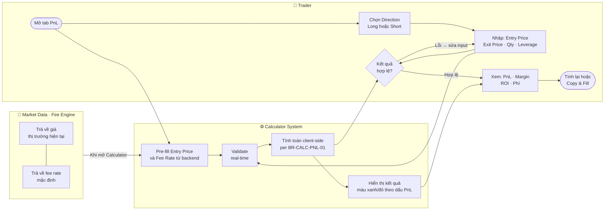
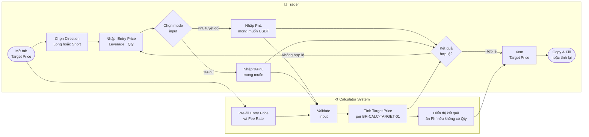
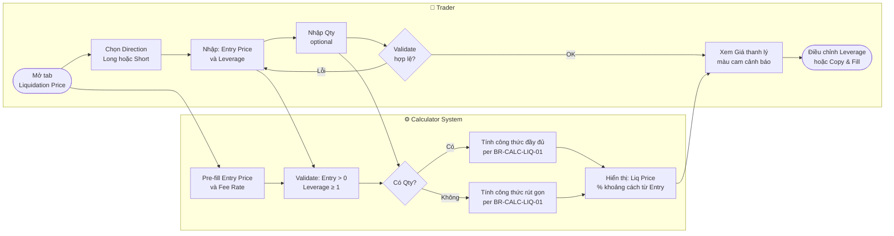
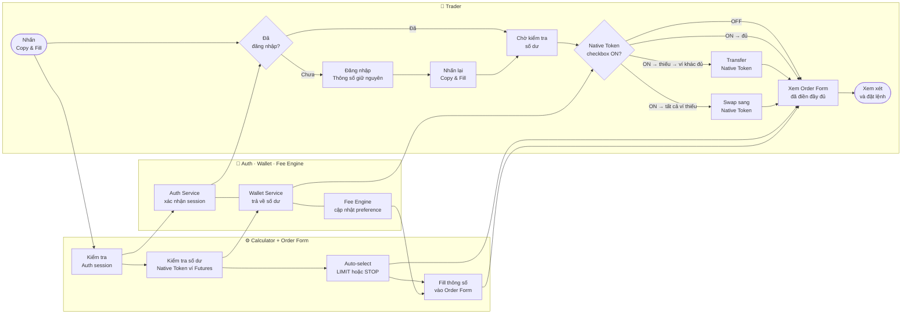

## 1. Document Header

| Trường | Nội dung |
|---|---|
| **Tên tài liệu** | Use Case Specification — Futures Position Calculator |
| **Mã tài liệu** | UC-FUTURES-CALC-001 |
| **Phiên bản** | 1.0 |
| **Trạng thái** | Draft |
| **Ngày tạo** | 2026-05-26 |
| **Ngày cập nhật lần cuối** | 2026-05-26 |
| **Tác giả** | Business Analysis Team |
| **Phê duyệt bởi** | — |

---

## 2. Người đọc dự kiến

| Đối tượng | Mục đích sử dụng tài liệu |
|---|---|
| **Product Manager** | Xác nhận phạm vi tính năng và độ ưu tiên |
| **Tech Lead / Developer** | Hiểu logic nghiệp vụ, thiết kế hệ thống và implement |
| **QA Engineer** | Xây dựng test cases từ các luồng chính, thay thế và ngoại lệ |
| **UX/UI Designer** | Hiểu hành vi kỳ vọng của hệ thống để thiết kế giao diện |

---

## 3. Lịch sử thay đổi

| Phiên bản | Ngày | Người thực hiện | Nội dung thay đổi |
|---|---|---|---|
| 1.0 | 2026-05-26 | BA Team | Tạo tài liệu lần đầu — bao gồm 5 Use Cases: PnL, Giá mục tiêu, Giá thanh lý, Copy & Fill, Fee Token xử lý |

---

## 4. Danh sách Use Case

| ID | Tên Use Case | Actor chính | Độ ưu tiên |
|---|---|---|---|
| UC-01 | Tính toán PnL vị thế | Trader | Must Have |
| UC-02 | Tính Giá mục tiêu (Target Price) | Trader | Must Have |
| UC-03 | Tính Giá thanh lý (Liquidation Price) | Trader | Must Have |
| UC-04 | Sao chép thông số và tự động điền vào Order Form | Trader (đã đăng nhập) | Must Have |
| UC-05 | Xử lý khi Native Token không đủ số dư để nộp phí | Trader (đã đăng nhập) | Must Have |

---

## 5. Chi tiết từng Use Case

---

## UC-01: Tính toán PnL vị thế

### Tóm tắt

Trader nhập các thông số vị thế (hướng, giá vào, giá thoát, số lượng, đòn bẩy, fee rate) vào tab **PnL Calculator**. Hệ thống tính toán ngay phía client và hiển thị PnL dự kiến cùng Margin ban đầu (Initial Margin).

### Sơ đồ luồng (BPMN)

### Actor

- **Actor chính:** Trader (có thể chưa đăng nhập)
- **Actor phụ:** Market Data Service (cung cấp giá thị trường hiện tại làm giá trị gợi ý), Fee Engine (cung cấp fee rate mặc định)

### Điều kiện tiên quyết (Pre-conditions)

1. Trader đang ở trang Futures Calculator, tab PnL.
2. Market Data Service đang hoạt động và có thể trả về giá thị trường của cặp giao dịch hiện tại.
3. Fee Engine đang hoạt động và có thể trả về fee rate (taker/maker) cho cặp giao dịch.

### Điều kiện kết thúc thành công (Post-conditions)

1. Hệ thống hiển thị giá trị **PnL** (dương hoặc âm) tính bằng đồng quote.
2. Hệ thống hiển thị giá trị **Initial Margin (IM)** tương ứng.
3. Kết quả được cập nhật tức thì mỗi khi Trader thay đổi bất kỳ thông số nào.

### Điều kiện kết thúc thất bại

1. Trader nhập dữ liệu không hợp lệ (ví dụ: giá = 0, số lượng âm, đòn bẩy = 0) — hệ thống hiển thị thông báo lỗi inline, không thực hiện tính toán.
2. Market Data Service không phản hồi — hệ thống không điền giá gợi ý, Trader phải nhập thủ công.

### Luồng chính (Main Flow)

| Bước | Actor | Hành động | Hệ thống phản hồi |
|---|---|---|---|
| 1 | Trader | Mở Futures Calculator, chọn tab **PnL** | Hiển thị form với các trường: Direction (Long/Short), Entry Price, Exit Price, Quantity, Leverage, Fee Rate |
| 2 | Hệ thống | — | Tự động điền Entry Price = giá thị trường hiện tại (từ Market Data Service); Fee Rate = fee rate mặc định (từ Fee Engine) |
| 3 | Trader | Chọn **Direction**: Long hoặc Short | Hệ thống cập nhật nhãn và công thức hiển thị tương ứng |
| 4 | Trader | Nhập **Entry Price** (giá vào) | Hệ thống validate: phải là số dương; nếu hợp lệ, kích hoạt tính toán |
| 5 | Trader | Nhập **Exit Price** (giá thoát) | Hệ thống validate: phải là số dương; nếu hợp lệ, kích hoạt tính toán |
| 6 | Trader | Nhập **Quantity** (số lượng hợp đồng) | Hệ thống validate: phải là số dương; nếu hợp lệ, kích hoạt tính toán |
| 7 | Trader | Nhập **Leverage** (đòn bẩy) | Hệ thống validate: phải là số nguyên dương ≥ 1; nếu hợp lệ, kích hoạt tính toán |
| 8 | Trader | (Tuỳ chọn) Chỉnh **Fee Rate** | Hệ thống validate: phải là số không âm; nếu hợp lệ, kích hoạt tính toán |
| 9 | Hệ thống | — | Thực hiện tính toán phía client theo **BR-CALC-PNL-01** (FRD Section 5.2): - **Long PnL**: dương khi Exit Price > Entry Price - **Short PnL**: dương khi Exit Price < Entry Price - **Initial Margin (IM)**: phụ thuộc vào Size, Entry Price và Leverage |
| 10 | Hệ thống | — | Hiển thị kết quả: PnL (màu xanh nếu dương, đỏ nếu âm), IM, ROE% (PnL/IM×100) |

### Luồng thay thế (Alternative Flows)

**AF-01-01: Trader chuyển tab rồi quay lại tab PnL**

Từ bước 1: Nếu Trader đã nhập thông số ở tab PnL, chuyển sang tab khác (Target Price hoặc Liquidation Price), rồi quay lại tab PnL — hệ thống giữ nguyên toàn bộ giá trị đã nhập (không reset). Áp dụng BR-CALC-01.

**AF-01-02: Market Data Service không phản hồi khi tải trang**

Tại bước 2: Nếu Market Data Service timeout hoặc trả về lỗi, hệ thống để trống trường Entry Price (không hiển thị gợi ý). Trader phải tự nhập. Hệ thống không hiển thị thông báo lỗi toàn trang — chỉ để trống trường giá.

**AF-01-03: Fee Engine không phản hồi khi tải trang**

Tại bước 2: Nếu Fee Engine không phản hồi, hệ thống dùng fee rate mặc định dự phòng (fallback). Trader vẫn có thể chỉnh sửa fee rate thủ công.

### Luồng ngoại lệ (Exception Flows)

**EF-01-01: Trader nhập giá trị không hợp lệ**

Điều kiện kích hoạt: Bất kỳ trường số nào nhận giá trị âm, bằng 0 (đối với Entry Price, Exit Price, Leverage), hoặc ký tự không phải số.

Xử lý: Hệ thống highlight trường lỗi màu đỏ, hiển thị thông báo lỗi inline (ví dụ: "Giá phải lớn hơn 0"). Kết quả tính toán không cập nhật cho đến khi tất cả trường hợp lệ.

**EF-01-02: Leverage vượt giới hạn tối đa cho phép của cặp giao dịch**

Điều kiện kích hoạt: Trader nhập leverage > giá trị tối đa được cấu hình cho cặp giao dịch.

Xử lý: Hệ thống hiển thị cảnh báo inline, tự động clamp giá trị leverage về mức tối đa và tính toán lại với giá trị đã clamp.

### Business Rules áp dụng

- **BR-CALC-01:** Giá trị các trường đã nhập không bị reset khi Trader switch giữa các tab của Calculator.
- **BR-CALC-04:** Toàn bộ tính toán được thực hiện phía client (client-side), không gọi API backend.
- **BR-CALC-12:** Trader không cần đăng nhập để sử dụng chức năng tính toán PnL.

### Ghi chú

- `f` trong công thức là fee rate dưới dạng thập phân (ví dụ: 0.0005 cho 0.05%).
- `Size` = Quantity (số hợp đồng).
- ROE% là chỉ số thêm cho UX, không phải đầu ra bắt buộc của business logic.
- Không lưu lịch sử tính toán vào database — mọi thứ chỉ tồn tại trong session phía client.

---

## UC-02: Tính Giá mục tiêu (Target Price)

### Tóm tắt

Trader nhập PnL mong muốn cùng với thông số vị thế vào tab **Target Price Calculator**. Hệ thống tính toán ngay phía client và trả về mức giá cần đạt được để vị thế đạt đúng PnL mục tiêu đó.

### Sơ đồ luồng (BPMN)

### Actor

- **Actor chính:** Trader (có thể chưa đăng nhập)
- **Actor phụ:** Market Data Service (cung cấp giá thị trường làm gợi ý), Fee Engine (cung cấp fee rate mặc định)

### Điều kiện tiên quyết (Pre-conditions)

1. Trader đang ở trang Futures Calculator, tab Target Price.
2. Market Data Service và Fee Engine đang hoạt động bình thường (nếu không, xem AF-02-01).

### Điều kiện kết thúc thành công (Post-conditions)

1. Hệ thống hiển thị **Target Price** — mức giá cần đạt để vị thế thu được đúng PnL mục tiêu.
2. Kết quả cập nhật tức thì khi Trader thay đổi bất kỳ thông số đầu vào nào.

### Điều kiện kết thúc thất bại

1. Trader nhập PnL mục tiêu hoặc thông số khác không hợp lệ — hệ thống không hiển thị kết quả và báo lỗi inline.
2. Kết quả tính toán ra giá trị âm hoặc vô cực (trường hợp chia cho 0) — hệ thống hiển thị cảnh báo "Không có giá mục tiêu hợp lệ với thông số này".

### Luồng chính (Main Flow)

| Bước | Actor | Hành động | Hệ thống phản hồi |
|---|---|---|---|
| 1 | Trader | Mở Futures Calculator, chọn tab **Target Price** | Hiển thị form: Direction (Long/Short), Entry Price, Quantity, Leverage, Fee Rate, Target PnL |
| 2 | Hệ thống | — | Tự động điền Entry Price từ Market Data Service; Fee Rate từ Fee Engine |
| 3 | Trader | Chọn **Direction**: Long hoặc Short | Hệ thống cập nhật công thức phù hợp |
| 4 | Trader | Nhập **Entry Price** | Validate: số dương |
| 5 | Trader | Nhập **Quantity** (số lượng) | Validate: số dương |
| 6 | Trader | Nhập **Leverage** | Validate: số nguyên dương ≥ 1 |
| 7 | Trader | (Tuỳ chọn) Chỉnh **Fee Rate** | Validate: số không âm |
| 8 | Trader | Nhập **Target PnL** — giá trị PnL mong muốn | Validate: là số thực (có thể âm nếu Trader muốn xác định mức cắt lỗ) |
| 9 | Hệ thống | — | Tính **Target Price** theo **BR-CALC-TARGET-01** (FRD Section 5.3) — công thức phụ thuộc vào: (1) hướng Long/Short, (2) có/không có Quantity |
| 10 | Hệ thống | — | Hiển thị kết quả Target Price, làm tròn theo số thập phân của cặp giao dịch |

### Luồng thay thế (Alternative Flows)

**AF-02-01: Market Data Service hoặc Fee Engine không phản hồi**

Tại bước 2: Tương tự AF-01-02 và AF-01-03 — các trường tương ứng để trống hoặc dùng fallback. Trader nhập thủ công.

**AF-02-02: Trader chuyển tab rồi quay lại tab Target Price**

Hệ thống giữ nguyên toàn bộ thông số đã nhập. Áp dụng BR-CALC-01.

**AF-02-03: Target PnL âm (Trader tính điểm cắt lỗ)**

Tại bước 8: Trader nhập PnL âm (ví dụ: −500 USDT). Hệ thống chấp nhận giá trị âm, tính toán bình thường và trả về Target Price tương ứng với mức lỗ đó. Không cần cảnh báo đặc biệt.

### Luồng ngoại lệ (Exception Flows)

**EF-02-01: Kết quả Target Price âm hoặc không hợp lý**

Điều kiện kích hoạt: Công thức trả về giá trị ≤ 0 với tổ hợp thông số Trader đã nhập (ví dụ: Target PnL quá lớn so với Margin).

Xử lý: Hệ thống không hiển thị giá trị âm. Thay vào đó hiển thị thông báo: "Không có giá mục tiêu hợp lệ — vui lòng điều chỉnh PnL mục tiêu hoặc thông số vị thế."

**EF-02-02: Mẫu số bằng 0 (trường hợp biên)**

Điều kiện kích hoạt: Size × (1 − f) = 0 (xảy ra khi Size = 0 hoặc f = 1, tức fee rate = 100%).

Xử lý: Hệ thống phát hiện điều kiện này và hiển thị cảnh báo "Thông số không hợp lệ, không thể tính toán." Trường hợp này bị chặn trước bởi validation đầu vào (Quantity > 0, Fee Rate < 100%).

### Business Rules áp dụng

- **BR-CALC-01:** Không reset thông số khi switch tab.
- **BR-CALC-04:** Tính toán phía client, không gọi API.
- **BR-CALC-12:** Không yêu cầu đăng nhập.

### Ghi chú

- Công thức trên áp dụng cho vị thế **Long có Quantity** (đã biết số lượng). Hệ thống không hỗ trợ biến thể "không có Quantity" cho tab Target Price.
- Short Target Price = phép biến đổi đối xứng của công thức Long — cần document riêng khi implement.
- Đơn vị PnL đầu vào phải khớp với đồng quote của cặp giao dịch đang chọn.

---

## UC-03: Tính Giá thanh lý (Liquidation Price)

### Tóm tắt

Trader nhập thông số vị thế vào tab **Liquidation Price Calculator** (không cần nhập Quantity). Hệ thống tính toán ngay phía client và hiển thị mức giá mà tại đó vị thế bị thanh lý bắt buộc.

### Sơ đồ luồng (BPMN)

### Actor

- **Actor chính:** Trader (có thể chưa đăng nhập)
- **Actor phụ:** Market Data Service (cung cấp giá thị trường làm gợi ý), Fee Engine (cung cấp fee rate mặc định)

### Điều kiện tiên quyết (Pre-conditions)

1. Trader đang ở trang Futures Calculator, tab Liquidation Price.
2. Hệ thống có thể nhận fee rate từ Fee Engine (hoặc dùng fallback nếu không phản hồi).

### Điều kiện kết thúc thành công (Post-conditions)

1. Hệ thống hiển thị **Liquidation Price** — mức giá kích hoạt thanh lý.
2. Kết quả cập nhật tức thì khi thay đổi bất kỳ thông số nào.

### Điều kiện kết thúc thất bại

1. Trader nhập thông số không hợp lệ — hệ thống báo lỗi inline, không tính toán.
2. Kết quả âm hoặc vô nghĩa — hệ thống hiển thị cảnh báo và không hiển thị giá trị.

### Luồng chính (Main Flow)

| Bước | Actor | Hành động | Hệ thống phản hồi |
|---|---|---|---|
| 1 | Trader | Mở Futures Calculator, chọn tab **Liquidation Price** | Hiển thị form: Direction (Long/Short), Entry Price, Leverage, Fee Rate. Không có trường Quantity |
| 2 | Hệ thống | — | Tự động điền Entry Price từ Market Data Service; Fee Rate từ Fee Engine |
| 3 | Trader | Chọn **Direction**: Long hoặc Short | Hệ thống cập nhật công thức phù hợp |
| 4 | Trader | Nhập **Entry Price** | Validate: số dương |
| 5 | Trader | Nhập **Leverage** | Validate: số nguyên dương ≥ 1 |
| 6 | Trader | (Tuỳ chọn) Chỉnh **Fee Rate** | Validate: số không âm |
| 7 | Hệ thống | — | Tính **Liquidation Price** theo **BR-CALC-LIQ-01** (FRD Section 5.4) — công thức phụ thuộc vào: (1) hướng Long/Short, (2) có/không có Quantity |
| 8 | Hệ thống | — | Hiển thị kết quả Liquidation Price, kèm khoảng cách % từ Entry Price đến Liquidation Price |

### Luồng thay thế (Alternative Flows)

**AF-03-01: Trader chuyển tab rồi quay lại tab Liquidation Price**

Hệ thống giữ nguyên toàn bộ thông số đã nhập. Áp dụng BR-CALC-01.

**AF-03-02: Leverage rất cao (ví dụ: 100x)**

Tại bước 5: Hệ thống chấp nhận và tính toán bình thường. Liquidation Price sẽ rất gần Entry Price — hệ thống hiển thị thêm cảnh báo UX: "Vị thế đòn bẩy cao — khoảng cách đến giá thanh lý rất nhỏ."

### Luồng ngoại lệ (Exception Flows)

**EF-03-01: Kết quả Liquidation Price âm hoặc ≤ 0**

Điều kiện kích hoạt: Tổ hợp Entry Price, Leverage, Fee Rate dẫn đến kết quả ≤ 0.

Xử lý: Hệ thống hiển thị thông báo "Thông số không tạo ra giá thanh lý hợp lệ — vui lòng kiểm tra lại đòn bẩy và fee rate."

**EF-03-02: Mẫu số (1 − f) bằng 0**

Điều kiện kích hoạt: Fee rate = 100% (f = 1) — bị ngăn bởi validation đầu vào (Fee Rate < 100%).

Xử lý: Hệ thống không cho phép nhập fee rate ≥ 100%. Hiển thị lỗi inline.

### Business Rules áp dụng

- **BR-CALC-01:** Không reset thông số khi switch tab.
- **BR-CALC-04:** Tính toán phía client, không gọi API.
- **BR-CALC-12:** Không yêu cầu đăng nhập.

### Ghi chú

- Tab Liquidation Price **không có trường Quantity** vì công thức thanh lý chỉ phụ thuộc vào giá vào, đòn bẩy và phí — không phụ thuộc số lượng hợp đồng.
- Công thức cho Short là đối xứng: cần được document khi implement.
- Mức giá thanh lý thực tế trên sàn có thể chênh lệch với kết quả tính toán do các yếu tố như Maintenance Margin, Insurance Fund — cần có disclaimer trên UI.

---

## UC-04: Sao chép thông số và tự động điền vào Order Form

### Tóm tắt

Sau khi tính toán xong ở bất kỳ tab nào của Calculator, Trader (đã đăng nhập) nhấn nút **Copy & Fill**. Hệ thống sao chép toàn bộ thông số đã tính và tự động điền vào Order Form, đồng thời đồng bộ fee preference. Nếu Trader chưa đăng nhập, luồng bị chặn và yêu cầu xác thực trước.

### Sơ đồ luồng (BPMN)

### Actor

- **Actor chính:** Trader (đã đăng nhập)
- **Actor phụ:** Auth Service (xác thực session), Fee Engine (cập nhật fee preference), Order Form (nhận thông số đã fill), Wallet Service (kiểm tra số dư Native Token)

### Điều kiện tiên quyết (Pre-conditions)

1. Trader đã hoàn thành việc nhập thông số và hệ thống đang hiển thị kết quả tính toán hợp lệ (PnL, Target Price, hoặc Liquidation Price).
2. Nút **Copy & Fill** hiển thị và có thể nhấn.
3. Order Form tồn tại trong giao diện (có thể ở trạng thái mặc định hoặc đã có thông số cũ).

### Điều kiện kết thúc thành công (Post-conditions)

1. Order Form được điền đầy đủ thông số từ Calculator: Direction, Entry Price (làm Limit Price hoặc Stop Price), Quantity, Leverage.
2. Order Type được tự động chọn là **LIMIT** hoặc **STOP** phù hợp với ngữ cảnh.
3. Fee preference trên Order Form được đồng bộ theo lựa chọn hiện tại trong Calculator.
4. Trader được đưa focus về Order Form để xem xét và xác nhận trước khi đặt lệnh.

### Điều kiện kết thúc thất bại

1. Trader chưa đăng nhập — luồng dừng tại màn hình xác thực, không fill vào Order Form.
2. Order Form không phản hồi hoặc bị lỗi khi nhận thông số — hệ thống hiển thị thông báo lỗi, gợi ý Trader nhập thủ công.

### Luồng chính (Main Flow)

| Bước | Actor | Hành động | Hệ thống phản hồi |
|---|---|---|---|
| 1 | Trader | Nhấn nút **Copy & Fill** trên Calculator | Hệ thống kiểm tra trạng thái đăng nhập qua Auth Service |
| 2 | Auth Service | — | Xác nhận Trader đã đăng nhập (session hợp lệ) |
| 3 | Hệ thống | — | Kiểm tra số dư Native Token trong Futures Wallet qua Wallet Service (phục vụ cho việc nộp phí giao dịch) |
| 4 | Wallet Service | — | Xác nhận số dư Native Token trong Futures Wallet đủ để nộp phí dự kiến |
| 5 | Hệ thống | — | Sao chép thông số từ Calculator: Direction, Entry Price, Quantity, Leverage, Fee Rate |
| 6 | Hệ thống | — | Tự động chọn Order Type = **LIMIT** (nếu Entry Price ≤ giá thị trường hiện tại với Long, hoặc ≥ giá thị trường với Short) hoặc **STOP** (các trường hợp còn lại). Áp dụng BR-COPY-04 |
| 7 | Hệ thống | — | Điền thông số vào Order Form: Limit/Stop Price ← Entry Price, Quantity ← Quantity, Leverage ← Leverage |
| 8 | Hệ thống | — | Đồng bộ fee preference (Native Token / Quote Token) từ trạng thái Calculator sang Order Form. Áp dụng BR-COPY-05 |
| 9 | Hệ thống | — | Cuộn màn hình / chuyển focus đến Order Form |
| 10 | Trader | Xem xét thông số đã được điền | Order Form hiển thị đầy đủ thông số, sẵn sàng để Trader xác nhận đặt lệnh |

### Luồng thay thế (Alternative Flows)

**AF-04-01: Trader chưa đăng nhập**

Tại bước 1 → bước 2 thất bại: Auth Service xác nhận Trader chưa có session hợp lệ.

Xử lý:
1. Hệ thống dừng luồng Copy & Fill.
2. Hiển thị modal hoặc redirect đến màn hình đăng nhập/đăng ký.
3. Sau khi Trader đăng nhập thành công, hệ thống tự động quay lại Calculator với thông số đã nhập được giữ nguyên (BR-CALC-01).
4. Trader có thể nhấn **Copy & Fill** lại để tiếp tục luồng chính.

Lưu ý: Trader chưa đăng nhập vẫn có thể tính toán bình thường (BR-CALC-12) — chỉ nút Copy & Fill bị chặn.

---

**AF-04-02: Native Token thiếu trong Futures Wallet nhưng Tổng ví đủ số dư**

Tại bước 3 → bước 4: Wallet Service báo cáo số dư Native Token trong Futures Wallet không đủ, nhưng tổng số dư Native Token trên toàn bộ ví (bao gồm Spot Wallet hoặc các ví khác) đủ để nộp phí. Áp dụng BR-COPY-08 (ưu tiên 2: Tổng ví → Transfer).

Xử lý:
1. Hệ thống tạm dừng luồng Copy & Fill.
2. Hiển thị **Transfer Modal**: thông báo số dư Futures Wallet không đủ, đề xuất chuyển Native Token từ ví khác sang Futures Wallet.
3. Transfer Modal hiển thị: số dư hiện tại trong Futures Wallet, số lượng cần chuyển (đủ để nộp phí + buffer an toàn), nút xác nhận chuyển.
4. Trader xác nhận chuyển tiền.
5. Hệ thống thực hiện transfer, cập nhật số dư.
6. Sau khi transfer thành công, hệ thống tự động tiếp tục luồng chính từ bước 5 (không yêu cầu Trader nhấn Copy & Fill lại).

---

**AF-04-03: Native Token thiếu trên toàn bộ ví — cần Swap**

Tại bước 3 → bước 4: Wallet Service báo cáo tổng số dư Native Token trên tất cả ví đều không đủ để nộp phí. Áp dụng BR-COPY-08 (ưu tiên 3: Swap).

Xử lý:
1. Hệ thống tạm dừng luồng Copy & Fill.
2. Hiển thị **Swap Modal**: thông báo không đủ Native Token trên bất kỳ ví nào, đề xuất swap từ tài sản khác (ví dụ: Quote Token → Native Token).
3. Swap Modal hiển thị: số lượng Native Token cần có, gợi ý token nguồn phù hợp dựa trên số dư hiện tại của Trader, tỷ giá swap ước tính.
4. Trader xác nhận swap.
5. Hệ thống thực hiện swap.
6. Sau khi swap thành công và Native Token đã về Futures Wallet, hệ thống tự động tiếp tục luồng chính từ bước 5.

### Luồng ngoại lệ (Exception Flows)

**EF-04-01: Order Form không nhận thông số (lỗi kỹ thuật)**

Điều kiện kích hoạt: Sau bước 7, Order Form phản hồi lỗi hoặc thông số không được điền.

Xử lý: Hệ thống hiển thị thông báo lỗi: "Không thể điền vào Order Form. Vui lòng thử lại hoặc nhập thủ công." Không xóa kết quả tính toán trên Calculator.

**EF-04-02: Transfer thất bại (AF-04-02)**

Điều kiện kích hoạt: Tại bước 5 của AF-04-02, giao dịch transfer bị từ chối hoặc timeout.

Xử lý: Hệ thống hiển thị thông báo lỗi trong Transfer Modal. Luồng Copy & Fill không tiếp tục. Trader có thể thử lại hoặc đóng modal.

**EF-04-03: Swap thất bại (AF-04-03)**

Điều kiện kích hoạt: Tại bước 5 của AF-04-03, giao dịch swap bị từ chối, tỷ giá thay đổi vượt slippage, hoặc timeout.

Xử lý: Hệ thống hiển thị thông báo lỗi trong Swap Modal. Luồng Copy & Fill không tiếp tục. Trader có thể thử lại với slippage cao hơn hoặc đóng modal.

**EF-04-04: Session hết hạn trong khi đang thực hiện luồng**

Điều kiện kích hoạt: Auth Service báo session đã hết hạn trong khi Trader đang thao tác (sau bước 1).

Xử lý: Hệ thống hiển thị thông báo "Phiên đăng nhập đã hết hạn." Redirect đến màn hình đăng nhập. Thông số Calculator được cố gắng giữ lại trong sessionStorage để khôi phục sau khi đăng nhập lại.

### Business Rules áp dụng

- **BR-COPY-04:** Khi fill vào Order Form, hệ thống tự động chọn Order Type là LIMIT hoặc STOP dựa trên tương quan giữa Entry Price (Calculator) và giá thị trường hiện tại.
- **BR-COPY-05:** Fee preference (dùng Native Token hay Quote Token để nộp phí) được đồng bộ từ trạng thái Calculator sang Order Form khi thực hiện Copy & Fill.
- **BR-COPY-08:** Thứ tự kiểm tra và xử lý khi thiếu Native Token: (1) Futures Wallet → đủ thì tiếp tục; (2) Tổng ví → đủ thì mở Transfer Modal; (3) Thiếu toàn bộ → mở Swap Modal.
- **BR-CALC-01:** Thông số Calculator không bị mất khi luồng bị gián đoạn (chuyển sang login, transfer, swap) và quay lại.

### Ghi chú

- Luồng AF-04-02 và AF-04-03 thuộc UC-05 nhưng được tích hợp trực tiếp vào luồng Copy & Fill thay vì tách thành UC riêng biệt để tránh ngắt quãng trải nghiệm người dùng.
- Order Form sau khi được fill **không tự động đặt lệnh** — Trader phải chủ động xem xét và bấm Submit.
- Cần xác nhận với Product: nếu Order Form đang có lệnh dở dang (đã nhập một phần), Copy & Fill có ghi đè toàn bộ hay chỉ điền các trường trống?

---

## UC-05: Xử lý khi Native Token không đủ số dư để nộp phí

### Tóm tắt

Khi Trader (đã đăng nhập) thực hiện Copy & Fill hoặc đặt lệnh với fee preference là Native Token, hệ thống phát hiện số dư không đủ và dẫn dắt Trader qua luồng xử lý phù hợp: Transfer từ ví khác (nếu tổng số dư đủ) hoặc Swap tài sản sang Native Token (nếu thiếu hoàn toàn). Use case này mô tả chi tiết logic kiểm tra và xử lý độc lập với điểm khởi phát.

### Actor

- **Actor chính:** Trader (đã đăng nhập)
- **Actor phụ:** Wallet Service (kiểm tra số dư), Fee Engine (xác nhận fee preference và lượng phí cần thiết), Order Form (bị block cho đến khi vấn đề fee được giải quyết)

### Điều kiện tiên quyết (Pre-conditions)

1. Trader đã đăng nhập và có session hợp lệ.
2. Fee preference hiện tại được đặt là **Native Token** (không phải Quote Token).
3. Hệ thống đang chuẩn bị thực thi một hành động yêu cầu Native Token (Copy & Fill hoặc đặt lệnh).
4. Wallet Service đang hoạt động và có thể trả về số dư chính xác.

### Điều kiện kết thúc thành công (Post-conditions)

1. Native Token đã được chuyển vào Futures Wallet (qua Transfer) hoặc được swap thành công.
2. Futures Wallet có đủ Native Token để nộp phí cho lệnh dự kiến.
3. Hệ thống tiếp tục luồng bị gián đoạn (Copy & Fill hoặc đặt lệnh) mà không yêu cầu Trader thao tác lại từ đầu.

### Điều kiện kết thúc thất bại

1. Trader huỷ Transfer Modal hoặc Swap Modal — hệ thống dừng luồng, quay lại trạng thái trước.
2. Transfer hoặc Swap thất bại về kỹ thuật — hệ thống thông báo lỗi, cho phép thử lại.
3. Trader không có bất kỳ tài sản nào có thể swap sang Native Token — hệ thống thông báo không thể tiếp tục, gợi ý nạp tiền.

### Luồng chính (Main Flow)

| Bước | Actor | Hành động | Hệ thống phản hồi |
|---|---|---|---|
| 1 | Hệ thống | — | Phát hiện cần Native Token để nộp phí (khi Copy & Fill hoặc Submit Order) |
| 2 | Hệ thống | — | Gọi Wallet Service: kiểm tra số dư Native Token trong **Futures Wallet** |
| 3 | Wallet Service | — | Trả về số dư Futures Wallet |
| 4 | Hệ thống | — | **Nhánh A:** Futures Wallet ≥ phí cần thiết → Tiếp tục luồng gốc bình thường. Kết thúc UC-05 |
| 5 | Hệ thống | — | **Nhánh B:** Futures Wallet < phí cần thiết → Gọi Wallet Service kiểm tra tổng số dư Native Token trên toàn bộ ví |
| 6 | Wallet Service | — | Trả về tổng số dư Native Token (Futures Wallet + Spot Wallet + các ví khác) |
| 7 | Hệ thống | — | **Nhánh B.1:** Tổng số dư ≥ phí cần thiết → Mở Transfer Modal (xem bước 8–12) |
| 8 | Hệ thống | — | Hiển thị **Transfer Modal**: số dư Futures Wallet hiện tại, số lượng Native Token cần chuyển, ví nguồn có số dư |
| 9 | Trader | Xem xét thông tin và xác nhận chuyển tiền | — |
| 10 | Hệ thống | — | Thực hiện transfer Native Token từ ví nguồn → Futures Wallet |
| 11 | Wallet Service | — | Xác nhận transfer thành công, cập nhật số dư |
| 12 | Hệ thống | — | Đóng Transfer Modal, tiếp tục luồng gốc từ điểm bị gián đoạn |
| 13 | Hệ thống | — | **Nhánh B.2:** Tổng số dư < phí cần thiết → Mở Swap Modal (xem bước 14–18) |
| 14 | Hệ thống | — | Hiển thị **Swap Modal**: lượng Native Token cần có, danh sách token có thể swap (dựa trên số dư của Trader), tỷ giá và phí swap ước tính |
| 15 | Trader | Chọn token nguồn, xem tỷ giá và xác nhận swap | — |
| 16 | Hệ thống | — | Thực hiện swap token nguồn → Native Token, chuyển Native Token vào Futures Wallet |
| 17 | Wallet Service | — | Xác nhận swap và số dư mới |
| 18 | Hệ thống | — | Đóng Swap Modal, tiếp tục luồng gốc từ điểm bị gián đoạn |

### Luồng thay thế (Alternative Flows)

**AF-05-01: Trader huỷ Transfer Modal hoặc Swap Modal**

Tại bước 9 hoặc bước 15: Trader nhấn nút Huỷ / đóng modal.

Xử lý: Hệ thống đóng modal. Luồng gốc (Copy & Fill hoặc Submit Order) bị dừng hoàn toàn. Calculator và Order Form không bị thay đổi. Trader có thể thay đổi fee preference sang Quote Token và tiếp tục, hoặc tự nạp/swap Native Token bên ngoài rồi thử lại.

**AF-05-02: Trader không có tài sản nào để swap (Swap Modal — Nhánh B.2)**

Tại bước 14: Wallet Service xác nhận không có token nào đủ số dư để swap lấy lượng Native Token cần thiết.

Xử lý: Swap Modal hiển thị thông báo "Không có tài sản phù hợp để swap. Vui lòng nạp thêm [Native Token] vào tài khoản." Cung cấp nút tắt tắt modal. Không tiếp tục luồng gốc.

**AF-05-03: Trader thay đổi fee preference sang Quote Token**

Điều kiện: Có thể xảy ra bất kỳ lúc nào khi Trader điều chỉnh fee preference trong Calculator hoặc Order Form.

Xử lý: Hệ thống bỏ qua toàn bộ kiểm tra Native Token. UC-05 không được kích hoạt. Luồng tiếp tục bình thường với Quote Token.

### Luồng ngoại lệ (Exception Flows)

**EF-05-01: Wallet Service không phản hồi khi kiểm tra số dư**

Điều kiện kích hoạt: Timeout hoặc lỗi kết nối khi gọi Wallet Service ở bước 2 hoặc bước 5.

Xử lý: Hệ thống hiển thị thông báo lỗi: "Không thể kiểm tra số dư. Vui lòng thử lại." Cung cấp nút Thử lại. Không tiếp tục luồng gốc trong khi chưa xác minh được số dư.

**EF-05-02: Transfer thất bại (bước 10)**

Điều kiện kích hoạt: Giao dịch transfer bị từ chối bởi hệ thống (lỗi mạng, lỗi blockchain, hoặc số dư ví nguồn thay đổi trong thời gian chờ).

Xử lý: Transfer Modal hiển thị thông báo lỗi cụ thể. Cung cấp nút Thử lại. Số dư không bị thay đổi (giao dịch không thực hiện). Trader có thể thử lại hoặc huỷ.

**EF-05-03: Swap thất bại do slippage vượt ngưỡng (bước 16)**

Điều kiện kích hoạt: Tỷ giá swap thay đổi vượt mức slippage cho phép trong thời gian từ khi Trader xác nhận đến khi thực thi.

Xử lý: Swap Modal hiển thị thông báo: "Giao dịch thất bại — tỷ giá thay đổi quá lớn. Vui lòng thử lại." Cung cấp tùy chọn: Thử lại với tỷ giá mới / Tăng slippage tolerance / Huỷ.

### Business Rules áp dụng

- **BR-COPY-08:** Thứ tự kiểm tra bắt buộc: (1) Futures Wallet → (2) Tổng ví → (3) Transfer Modal → (4) Swap Modal. Không được bỏ qua bước kiểm tra trung gian.
- **BR-COPY-05:** Fee preference được đồng bộ giữa Calculator và Order Form — nếu Trader thay đổi ở một nơi, nơi kia cập nhật theo.

### Ghi chú

- UC-05 là use case hỗ trợ, được kích hoạt ngầm bên trong UC-04 (Copy & Fill) hoặc khi Trader Submit Order trực tiếp.
- "Phí cần thiết" được tính toán bởi Fee Engine dựa trên Quantity, Entry Price, và fee rate của lệnh dự kiến — cần cộng thêm buffer (ví dụ: 10%) để tránh trường hợp biên do trượt giá.
- Cần xác nhận với Product: khi Transfer/Swap thành công, hệ thống có hiển thị toast confirmation riêng trước khi tiếp tục luồng gốc không?
- Thứ tự ví khi kiểm tra "tổng ví" cần được làm rõ với backend: bao gồm những loại ví nào (Spot, Earn, Cross Margin...)?
