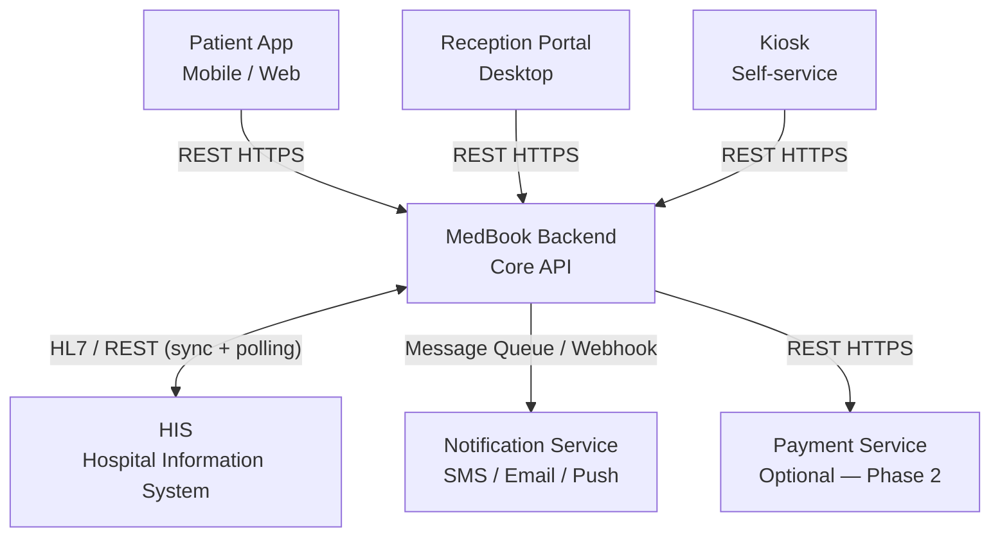

<Note>
  **Practice Case Study** — MedBook tại CityHealth General Hospital (fictional). Đây là API thinking ở mức BA — không phải API specification đầy đủ. Mục tiêu là định nghĩa purpose, key fields, common errors và idempotency requirements để Dev có đủ context để design.
</Note>

## Integration Architecture



**Integration Principles:**
- MedBook Backend là hub duy nhất — mọi client giao tiếp qua đây, không client nào gọi trực tiếp HIS
- HIS integration: synchronous tại check-in (create visit), polling cho visit status updates
- Notification: event-driven qua message queue; delivery status callback về MedBook để audit
- All APIs require JWT authentication (trừ health check endpoint)

---

## 16 Core APIs

<AccordionGroup>

<Accordion title="API 01 — GET /specialties — List Available Specialties">

| | |
|---|---|
| **Method** | `GET` |
| **Endpoint** | `/api/v1/specialties` |
| **Caller** | Patient App, Reception Portal |
| **Receiver** | MedBook Backend |
| **Purpose** | Trả về danh sách chuyên khoa đang hoạt động, dùng để patient chọn chuyên khoa trước khi tìm bác sĩ và slot |
| **Key Request Fields** | `hospital_id` (query, required), `active_only` (query, boolean, default `true`) |
| **Key Response Fields** | `specialties[]: { specialty_id, name_vi, name_en, icon_url, is_active, requires_manual_confirm, avg_wait_minutes }` |
| **Common Errors** | `404 HOSPITAL_NOT_FOUND`, `400 INVALID_HOSPITAL_ID` |
| **Idempotency** | N/A — GET, read-only |
| **Impact on Status** | None |

</Accordion>

<Accordion title="API 02 — GET /doctors — List Doctors by Specialty/Date">

| | |
|---|---|
| **Method** | `GET` |
| **Endpoint** | `/api/v1/doctors` |
| **Caller** | Patient App, Reception Portal |
| **Receiver** | MedBook Backend |
| **Purpose** | Trả về danh sách bác sĩ có lịch làm việc published theo specialty và ngày, kèm trạng thái slot còn trống hay hết |
| **Key Request Fields** | `specialty_id` (required), `date` (required, YYYY-MM-DD), `hospital_id` (required) |
| **Key Response Fields** | `doctors[]: { doctor_id, full_name, title, specialty_id, has_available_slots, avatar_url, rating }` |
| **Common Errors** | `404 SPECIALTY_NOT_FOUND`, `400 INVALID_DATE` (past date hoặc quá 30 ngày) |
| **Idempotency** | N/A — GET |
| **Impact on Status** | None |

</Accordion>

<Accordion title="API 03 — GET /slots — Available Slots (Real-time)">

| | |
|---|---|
| **Method** | `GET` |
| **Endpoint** | `/api/v1/slots` |
| **Caller** | Patient App, Reception Portal |
| **Receiver** | MedBook Backend → HIS slot inventory |
| **Purpose** | Trả về danh sách timeslot còn trống cho bác sĩ và ngày được chọn, trong real-time từ HIS |
| **Key Request Fields** | `doctor_id` (required), `date` (required), `specialty_id` (optional, for validation) |
| **Key Response Fields** | `slots[]: { slot_id, start_time, end_time, is_available, is_held }` |
| **Common Errors** | `404 DOCTOR_NOT_FOUND`, `503 HIS_UNAVAILABLE` (fallback to cached data với warning) |
| **Idempotency** | N/A — GET |
| **Impact on Status** | None |

**BA Note:** Slot bị held bởi patient khác (đang điền form) hiển thị `is_held: true` và không thể chọn. Sau khi TTL 10 phút hết, slot được release và `is_held` trở về `false`.

</Accordion>

<Accordion title="API 04 — POST /appointments — Create Appointment">

| | |
|---|---|
| **Method** | `POST` |
| **Endpoint** | `/api/v1/appointments` |
| **Caller** | Patient App, Reception Portal (walk-in) |
| **Receiver** | MedBook Backend |
| **Purpose** | Tạo appointment mới, soft lock slot (TTL 10 phút), và trigger confirm flow (auto hoặc manual tùy specialty) |
| **Key Request Fields** | `slot_id` (required), `specialty_id`, `doctor_id`, `service_id`, `patient_id`, `facility_id`, `chief_complaint` (min 10 chars), `patient_info: { full_name, dob, identity_number, phone, insurance_number }`, `booker_id` (nếu khác patient_id), `caregiver_authorization_id` (nếu có) |
| **Key Response Fields** | `appointment_id` (APT-YYYYMMDD-XXXXXX), `appointment_status` (PENDING_CONFIRMATION hoặc CONFIRMED), `slot_hold_expires_at`, `confirm_deadline` (nếu manual confirm) |
| **Common Errors** | `409 SLOT_ALREADY_HELD`, `409 DUPLICATE_APPOINTMENT`, `400 BOOKING_CUTOFF_EXCEEDED`, `400 MISSING_REQUIRED_FIELDS`, `403 CAREGIVER_NOT_AUTHORIZED` |
| **Idempotency** | Yes — với `idempotency_key` = `patient_id + slot_id + date`. Prevent double booking nếu request được gửi 2 lần |
| **Impact on Status** | Appointment → `DRAFT` → `PENDING_CONFIRMATION` (hoặc `CONFIRMED` nếu auto-confirm) |

**BA Note:** API này là điểm quan trọng nhất — phải chống duplicate booking (BR-BOOK-04) và soft lock slot (BR-BOOK-02) trong cùng 1 transaction DB.

</Accordion>

<Accordion title="API 05 — PATCH /appointments/{id}/confirm — Confirm Appointment (Manual)">

| | |
|---|---|
| **Method** | `PATCH` |
| **Endpoint** | `/api/v1/appointments/{appointment_id}/confirm` |
| **Caller** | Reception Portal |
| **Receiver** | MedBook Backend |
| **Purpose** | Receptionist manually confirm hoặc reject appointment đang ở PENDING_CONFIRMATION. Chỉ áp dụng cho manual confirm specialties |
| **Key Request Fields** | `action` (CONFIRM hoặc REJECT, required), `reject_reason` (required nếu action = REJECT), `receptionist_id` |
| **Key Response Fields** | `appointment_status` (CONFIRMED hoặc CANCELLED_BY_HOSPITAL), `qr_code_token` (nếu CONFIRMED), `notification_sent` |
| **Common Errors** | `404 APPOINTMENT_NOT_FOUND`, `409 APPOINTMENT_ALREADY_CONFIRMED`, `403 ONLY_MANUAL_CONFIRM_SPECIALTY` |
| **Idempotency** | No — action có side effect |
| **Impact on Status** | PENDING_CONFIRMATION → CONFIRMED (nếu confirm) hoặc CANCELLED_BY_HOSPITAL (nếu reject) |

</Accordion>

<Accordion title="API 06 — PATCH /appointments/{id}/cancel — Cancel Appointment">

| | |
|---|---|
| **Method** | `PATCH` |
| **Endpoint** | `/api/v1/appointments/{appointment_id}/cancel` |
| **Caller** | Patient App (patient self-cancel), Reception Portal (hospital cancel) |
| **Receiver** | MedBook Backend |
| **Purpose** | Hủy appointment. Kiểm tra cut-off time, release slot sau 30 phút, và notify patient |
| **Key Request Fields** | `cancelled_by` (PATIENT hoặc HOSPITAL), `cancel_reason` (required nếu sau cut-off hoặc hospital cancel), `reason_code` (enum) |
| **Key Response Fields** | `appointment_status` (CANCELLED_BY_PATIENT hoặc CANCELLED_BY_HOSPITAL), `slot_release_at`, `notification_sent` |
| **Common Errors** | `409 CANNOT_CANCEL_AFTER_CHECKIN`, `403 CUTOFF_EXCEEDED_REQUIRES_REASON`, `403 HOSPITAL_CANCEL_REQUIRES_ADMIN_ROLE` |
| **Idempotency** | No |
| **Impact on Status** | CONFIRMED/REMINDER_SENT → CANCELLED_BY_PATIENT hoặc CANCELLED_BY_HOSPITAL |

</Accordion>

<Accordion title="API 07 — PATCH /appointments/{id}/reschedule — Reschedule Appointment">

| | |
|---|---|
| **Method** | `PATCH` |
| **Endpoint** | `/api/v1/appointments/{appointment_id}/reschedule` |
| **Caller** | Patient App, Reception Portal |
| **Receiver** | MedBook Backend |
| **Purpose** | Dời lịch sang slot mới: tạo appointment mới, mark appointment gốc RESCHEDULED, release slot cũ sau 30 phút |
| **Key Request Fields** | `new_slot_id` (required), `new_doctor_id` (optional), `reschedule_reason` |
| **Key Response Fields** | `original_appointment_id` (RESCHEDULED), `new_appointment_id` (PENDING_CONFIRMATION), `new_appointment_status`, `old_slot_release_at` |
| **Common Errors** | `409 SLOT_UNAVAILABLE`, `400 RESCHEDULE_AFTER_CUTOFF`, `400 BOOKING_CUTOFF_EXCEEDED` |
| **Idempotency** | No — tạo appointment mới mỗi lần |
| **Impact on Status** | Original → RESCHEDULED; New → PENDING_CONFIRMATION |

</Accordion>

<Accordion title="API 08 — GET /appointments/{id}/qr — Generate QR Check-in Code">

| | |
|---|---|
| **Method** | `GET` |
| **Endpoint** | `/api/v1/appointments/{appointment_id}/qr` |
| **Caller** | Patient App |
| **Receiver** | MedBook Backend |
| **Purpose** | Trả về QR code dạng image URL và token string để bệnh nhân scan check-in. QR chỉ valid trong time window |
| **Key Request Fields** | `appointment_id` (path param), `format` (query: `url` hoặc `base64`, default `url`) |
| **Key Response Fields** | `qr_image_url`, `qr_token` (JWT), `valid_from`, `valid_until`, `facility_name`, `appointment_summary` |
| **Common Errors** | `404 APPOINTMENT_NOT_FOUND`, `409 APPOINTMENT_NOT_CONFIRMED`, `410 QR_ALREADY_USED`, `410 QR_EXPIRED` |
| **Idempotency** | Yes — nếu QR còn valid, trả về QR hiện tại thay vì tạo mới. QR bị invalidated ngay khi check-in thành công |
| **Impact on Status** | None (QR generation không thay đổi appointment_status) |

</Accordion>

<Accordion title="API 09 — POST /checkin/validate-qr — Validate QR at Kiosk/Reception">

| | |
|---|---|
| **Method** | `POST` |
| **Endpoint** | `/api/v1/checkin/validate-qr` |
| **Caller** | Kiosk, Reception Portal |
| **Receiver** | MedBook Backend |
| **Purpose** | Validate QR code scanned tại kiosk: check time window, facility, appointment status, và identity match. Trigger HIS registration nếu pass |
| **Key Request Fields** | `qr_token` (required), `facility_id` (required — từ kiosk config), `kiosk_id` (optional, for audit) |
| **Key Response Fields** | `appointment_id`, `patient_name`, `specialty`, `doctor_name`, `appointment_time`, `checkin_status`, `his_sync_status`, `queue_number` (nếu HIS sync thành công), `room_number` |
| **Common Errors** | `422 QR_EXPIRED`, `422 WRONG_FACILITY`, `422 OUTSIDE_CHECKIN_WINDOW`, `409 ALREADY_CHECKED_IN`, `409 APPOINTMENT_NOT_CONFIRMED` |
| **Idempotency** | No — mỗi call trigger check-in flow |
| **Impact on Status** | Pass → `checkin_status = CHECKED_IN` + trigger HIS sync |

**BA Note:** Đây là API quan trọng nhất về mặt nghiệp vụ. Phải validate đủ 4 điều kiện (BR-CHECKIN-01 đến BR-CHECKIN-07) trước khi trigger HIS sync.

</Accordion>

<Accordion title="API 10 — POST /checkin/manual — Manual Check-in by Receptionist">

| | |
|---|---|
| **Method** | `POST` |
| **Endpoint** | `/api/v1/checkin/manual` |
| **Caller** | Reception Portal |
| **Receiver** | MedBook Backend |
| **Purpose** | Receptionist check-in thủ công cho bệnh nhân (không cần QR), có thể override late check-in nếu có lý do |
| **Key Request Fields** | `appointment_id` (required), `receptionist_id` (required), `override_late_checkin` (boolean, default false), `override_reason` (required nếu override), `reason_code` (enum) |
| **Key Response Fields** | `checkin_status`, `his_sync_status`, `queue_number` (nếu HIS sync thành công) |
| **Common Errors** | `404 APPOINTMENT_NOT_FOUND`, `409 APPOINTMENT_NOT_CONFIRMED`, `403 LATE_CHECKIN_REQUIRES_OVERRIDE_REASON` |
| **Idempotency** | No |
| **Impact on Status** | `checkin_status = CHECKED_IN` + trigger HIS sync |

</Accordion>

<Accordion title="API 11 — POST /his/register — Create HIS Registration (Critical)">

| | |
|---|---|
| **Method** | `POST` |
| **Endpoint** | `/api/v1/his/register` (internal, MedBook → HIS) |
| **Caller** | MedBook Backend (triggered by check-in) |
| **Receiver** | HIS System |
| **Purpose** | Tạo visit registration trong HIS. CRITICAL: phải có idempotency để tránh duplicate visit |
| **Key Request Fields** | `appointment_id` (idempotency_key), `patient_identity_number`, `his_patient_code` (nếu đã có), `specialty_code`, `doctor_code`, `facility_code`, `appointment_datetime`, `chief_complaint` |
| **Key Response Fields** | `his_visit_id`, `his_patient_code` (nếu tạo mới patient trong HIS), `queue_number`, `registration_status` |
| **Common Errors** | `409 DUPLICATE_VISIT` (nếu HIS không có idempotency → MedBook phải handle), `404 DOCTOR_NOT_FOUND_IN_HIS`, `422 PATIENT_DATA_INVALID` |
| **Idempotency** | **Yes — CRITICAL**. `appointment_id` phải được dùng làm idempotency key. Nếu HIS đã xử lý request với cùng `appointment_id`, phải trả về result đã tồn tại thay vì tạo mới |
| **Impact on Status** | Success: `his_sync_status = SYNCED`, `queue_number` được ghi vào appointment; Fail: `his_sync_status = FAILED` hoặc `RETRYING` |

**BA Note:** Đây là API nguy hiểm nhất nếu không có idempotency — retry sau timeout có thể tạo duplicate visit record trong HIS, ảnh hưởng đến hồ sơ bệnh án.

</Accordion>

<Accordion title="API 12 — POST /his/retry-sync — Retry Failed HIS Sync">

| | |
|---|---|
| **Method** | `POST` |
| **Endpoint** | `/api/v1/his/retry-sync/{appointment_id}` |
| **Caller** | Reception Portal (manual trigger bởi Receptionist), MedBook Backend (scheduled retry) |
| **Receiver** | MedBook Backend → HIS |
| **Purpose** | Trigger lại HIS registration cho appointment đang ở HIS_SYNC_FAILED. Sử dụng cùng idempotency key để không tạo duplicate |
| **Key Request Fields** | `appointment_id` (path), `triggered_by` (USER hoặc SYSTEM), `triggerer_id` (nếu USER) |
| **Key Response Fields** | `retry_count`, `his_sync_status` (RETRYING → SUCCESS hoặc FAILED), `his_visit_id` (nếu success) |
| **Common Errors** | `409 MAX_RETRIES_EXCEEDED` (sau 5 manual retries), `409 APPOINTMENT_NOT_IN_FAILED_STATE` |
| **Idempotency** | Yes — inherits from API 11 |
| **Impact on Status** | `his_sync_status: FAILED → RETRYING → SUCCESS` hoặc `FAILED` |

</Accordion>

<Accordion title="API 13 — GET /queue/number — Get Queue Number Status">

| | |
|---|---|
| **Method** | `GET` |
| **Endpoint** | `/api/v1/queue/{appointment_id}` |
| **Caller** | Patient App, Kiosk |
| **Receiver** | MedBook Backend |
| **Purpose** | Trả về thông tin queue number, ước tính thời gian chờ, và trạng thái hiện tại của queue |
| **Key Request Fields** | `appointment_id` (path) |
| **Key Response Fields** | `queue_number`, `current_serving_number`, `position_in_queue`, `estimated_wait_minutes`, `room_number`, `doctor_name` |
| **Common Errors** | `404 APPOINTMENT_NOT_FOUND`, `409 NOT_YET_CHECKED_IN`, `409 HIS_SYNC_FAILED_QUEUE_NOT_AVAILABLE` |
| **Idempotency** | N/A — GET |
| **Impact on Status** | None |

</Accordion>

<Accordion title="API 14 — PATCH /appointments/{id}/status — Update Visit Status">

| | |
|---|---|
| **Method** | `PATCH` |
| **Endpoint** | `/api/v1/appointments/{appointment_id}/status` |
| **Caller** | Reception Portal, Doctor portal (if applicable) |
| **Receiver** | MedBook Backend → HIS (callback) |
| **Purpose** | Cập nhật trạng thái visit cho appointment đang active — gọi bệnh nhân vào, bắt đầu khám, kết thúc khám |
| **Key Request Fields** | `new_status` (WAITING_FOR_CONSULTATION, IN_CONSULTATION, COMPLETED), `updated_by` (user_id) |
| **Key Response Fields** | `appointment_status`, `his_visit_updated` (boolean), `timestamp` |
| **Common Errors** | `409 INVALID_STATUS_TRANSITION`, `403 INSUFFICIENT_PERMISSION_FOR_STATUS` |
| **Idempotency** | No |
| **Impact on Status** | CHECKED_IN → WAITING_FOR_CONSULTATION → IN_CONSULTATION → COMPLETED |

</Accordion>

<Accordion title="API 15 — POST /notifications/send — Trigger Notification">

| | |
|---|---|
| **Method** | `POST` |
| **Endpoint** | `/api/v1/notifications/send` (internal) |
| **Caller** | MedBook Backend |
| **Receiver** | Notification Service |
| **Purpose** | Trigger notification cho patient theo event: confirmation, reminder, queue number, no-show, completion |
| **Key Request Fields** | `event_type` (CONFIRMATION, REMINDER_24H, REMINDER_2H, QUEUE_ASSIGNED, NO_SHOW, COMPLETION), `appointment_id`, `patient_phone`, `patient_push_token`, `template_data: { doctor_name, time, queue_number, room_number, ... }` |
| **Key Response Fields** | `notification_id`, `channels_attempted: [SMS, PUSH]`, `status` (QUEUED hoặc SENT) |
| **Common Errors** | `400 INVALID_EVENT_TYPE`, `422 MISSING_CONTACT_INFO` |
| **Idempotency** | Yes — với `(appointment_id, event_type)`. Prevent duplicate reminder nếu scheduled job chạy 2 lần |
| **Impact on Status** | Sau khi reminder được gửi thành công: `appointment_status → REMINDER_SENT` |

</Accordion>

<Accordion title="API 16 — GET /appointments/daily — Reception Daily Appointment List">

| | |
|---|---|
| **Method** | `GET` |
| **Endpoint** | `/api/v1/appointments/daily` |
| **Caller** | Reception Portal |
| **Receiver** | MedBook Backend |
| **Purpose** | Trả về danh sách appointment trong ngày với đầy đủ thông tin để receptionist monitor và xử lý — bao gồm cả HIS sync status |
| **Key Request Fields** | `date` (query, default today), `facility_id` (required), `specialty_id` (optional), `doctor_id` (optional), `appointment_status` (optional, multi-value), `his_sync_status` (optional) |
| **Key Response Fields** | `appointments[]: { appointment_id, patient_name, specialty, doctor_name, scheduled_time, appointment_status, checkin_status, his_sync_status, queue_number, room_number, is_priority }`, `summary: { total, checked_in, no_show, waiting, in_consultation, completed, his_sync_failed }` |
| **Common Errors** | `403 INSUFFICIENT_PERMISSION` (chỉ Receptionist/Doctor/Admin mới được gọi API này) |
| **Idempotency** | N/A — GET |
| **Impact on Status** | None |

**BA Note:** API này là backbone của Reception Dashboard. Filter theo `his_sync_status = FAILED` giúp Receptionist phát hiện và xử lý exception kịp thời.

</Accordion>

</AccordionGroup>

---

## HIS Integration Pattern

### Sync Mode: Synchronous tại check-in + Polling cho visit status

```
Check-in:
  MedBook → HIS: POST /visits (create registration)
  Timeout: 8 giây
  Retry: 1 lần auto, sau đó manual

Visit status updates:
  MedBook → HIS: GET /visits/{his_visit_id}/status
  Frequency: mỗi 10 phút cho active appointments
  Trigger: appointment_status = WAITING_FOR_CONSULTATION hoặc IN_CONSULTATION
```

### Idempotency Key Format
`appointment_id` được dùng làm idempotency key khi gọi HIS create visit. HIS phải support idempotency pattern này — đây là **prerequisite trước khi go-live**.

### Retry Policy
```
Attempt 1: Gửi ngay khi check-in
Failure → Attempt 2: Retry sau 2 phút
Failure → Attempt 3: Retry sau 2 phút
Failure → HIS_SYNC_FAILED: Alert Receptionist
          Receptionist override window: 15 phút
          After 15 phút no action → EXCEPTION
```

### Polling HIS for Visit Status Updates
```
GET /visits/{his_visit_id}/status
Polling interval: 10 phút
Appointments polled: appointment_status IN (WAITING_FOR_CONSULTATION, IN_CONSULTATION)
On visit_status = COMPLETED → appointment_status = COMPLETED
```

---

## QR Code Design

| Attribute | Value |
|---|---|
| **Format** | JWT (JSON Web Token) |
| **Signing algorithm** | HMAC-SHA256 |
| **Payload** | `{ appointment_id, patient_id, facility_id, scheduled_datetime, iat, exp }` |
| **Expiry** | `scheduled_datetime + 30 phút` (check-in window đóng) |
| **Validity start** | `scheduled_datetime - 60 phút` (check-in window mở) |
| **One-time use** | Yes — sau khi scan thành công, token được invalidated trong DB |
| **QR image** | Generated server-side dạng PNG, trả về dưới dạng URL hoặc base64 |
| **Refresh** | QR không refresh — patient phải liên hệ Receptionist nếu QR hết hạn |
| **Revocation** | Ngay khi appointment bị cancel, token bị revoke và không thể scan |
