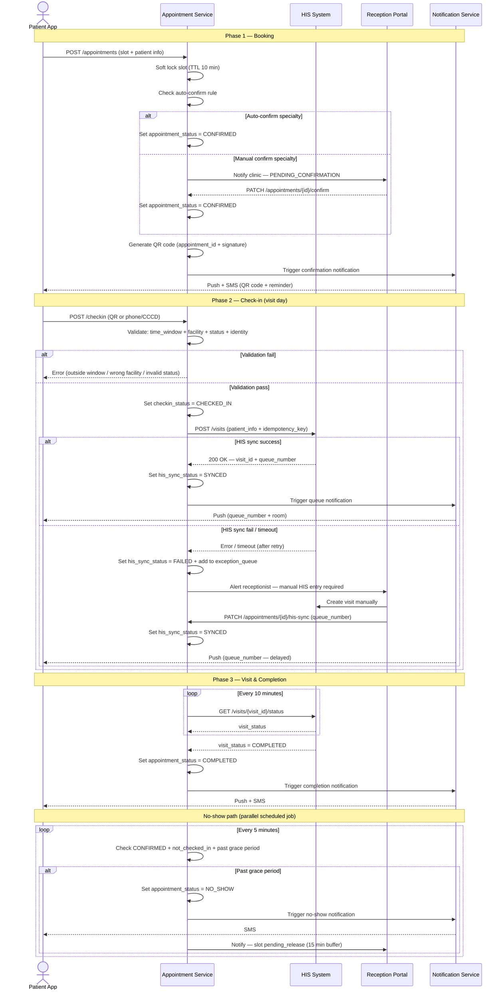

<Note>
  Tài liệu này là phần chi tiết của [Practice Case Study: Outpatient Appointment Booking & HIS Check-in](/projects/healthcare-appointment/overview). Mọi tên hệ thống, bệnh viện, và số liệu đều là fictional.
</Note>

## Section 1: Business Flow — 18 Bước

**Bước 1 — Patient đăng nhập và chọn chuyên khoa.**
Bệnh nhân đăng nhập vào MedBook app (mobile hoặc web). Hệ thống hiển thị danh sách 18 chuyên khoa ngoại trú đang hoạt động. Bệnh nhân chọn chuyên khoa theo nhu cầu.

**Bước 2 — Chọn bác sĩ và xem lịch trống.**
MedBook query slot inventory theo chuyên khoa và ngày được chọn. Slot đang bị hold bởi patient khác được ẩn hoặc hiển thị là "Đang giữ chỗ". Slot đã full hiển thị là "Hết lịch".

**Bước 3 — Bệnh nhân chọn slot và nhấn "Đặt lịch".**
Bệnh nhân chọn bác sĩ, ngày, và khung giờ cụ thể. Tại thời điểm này, slot chưa bị giữ.

**Bước 4 — Slot hold được kích hoạt ngay khi bệnh nhân bắt đầu điền form.**
Ngay khi bệnh nhân nhấn "Đặt lịch" và form điền thông tin xuất hiện, MedBook Backend đặt một **soft lock** lên slot với TTL 10 phút. Trong 10 phút này, slot hiển thị là "Đang giữ chỗ" với các bệnh nhân khác. Nếu bệnh nhân không submit form sau 10 phút, lock được giải phóng tự động.

**Bước 5 — Bệnh nhân điền thông tin và submit.**
Form yêu cầu: họ tên, số BHYT hoặc CCCD, lý do khám, và số điện thoại liên hệ. Bệnh nhân đã có hồ sơ sẽ được pre-fill thông tin. Submit form kết thúc cửa sổ điền — slot lock được extend thêm 5 phút trong khi hệ thống xử lý.

**Bước 6 — MedBook kiểm tra điều kiện auto-confirm.**
Sau khi nhận submit, MedBook kiểm tra rule auto-confirm vs manual confirm. **Auto-confirm** áp dụng khi: chuyên khoa không nằm trong danh sách yêu cầu xét duyệt (Nội tổng quát, Nhi, Da liễu, Mắt). **Manual confirm** áp dụng khi: chuyên khoa yêu cầu xét duyệt (Ung bướu, Tim mạch can thiệp, Phẫu thuật) — vì cần tiền sàng lọc.

**Bước 7A — Auto-confirm: appointment_status = confirmed ngay lập tức.**
`appointment_status` được set thành `confirmed`. Slot lock chuyển thành hard lock (không có TTL — slot được giữ đến khi appointment bị cancel hoặc hoàn tất).

**Bước 7B — Manual confirm: appointment_status = pending_confirmation.**
Phòng khám nhận notification và có 4 tiếng để review và confirm/reject. Nếu không có action sau 4 tiếng, hệ thống gửi reminder. Sau 8 tiếng không có action, escalate lên trưởng phòng khám.

**Bước 8 — QR code được sinh ra sau khi confirmed.**
Khi `appointment_status = confirmed`, MedBook sinh QR code unique encode: `appointment_id`, `patient_id`, `scheduled_datetime`, `facility_code`, và một signature để prevent tampering. QR code được gửi đến bệnh nhân qua push notification + SMS.

**Bước 9 — Notification gửi cho bệnh nhân.**
Notification Service gửi: (a) confirmation message với QR code ngay sau confirmed; (b) reminder 24 tiếng trước giờ hẹn; (c) reminder 2 tiếng trước giờ hẹn kèm hướng dẫn check-in.

**Bước 10 — Bệnh nhân đến và bắt đầu check-in.**
Bệnh nhân có thể check-in qua 3 kênh: (a) **Mobile app QR** — mở app, nhấn "Check-in", scan QR tại cổng hoặc kiosk; (b) **Kiosk tự phục vụ** — nhập số điện thoại hoặc số CCCD; (c) **Lễ tân** — nhân viên tra cứu theo tên/số điện thoại và check-in thủ công.

**Bước 11 — MedBook validate check-in request.**
MedBook kiểm tra 4 điều kiện: **(1) Time window:** phải trong khoảng 60 phút trước đến 30 phút sau giờ hẹn. **(2) Facility match:** facility_code trong QR phải khớp với facility của kiosk. **(3) Appointment status:** phải là `confirmed` — không cho phép check-in nếu đang `pending_confirmation`, `cancelled`, hoặc `no_show`. **(4) Identity match:** với kênh kiosk, so sánh SĐT/CCCD nhập vào với thông tin trong appointment.

**Bước 12 — Check-in validation pass: set checkin_status = checked_in.**
Nếu tất cả 4 điều kiện đều pass, `checkin_status` được set thành `checked_in` với timestamp. Bệnh nhân thấy màn hình "Đang kết nối hệ thống, vui lòng đợi..." trong khi MedBook call HIS.

**Bước 13 — MedBook call HIS API để tạo visit record.**
MedBook gọi HIS API `POST /visits` với payload chứa: patient info, doctor code, department code, scheduled time, và `idempotency_key = medbook_appointment_{appointment_id}_{date}`. Timeout được set 8 giây. Nếu HIS không trả lời trong 8 giây, MedBook thực hiện 1 lần retry. Nếu retry cũng timeout, case được đưa vào exception queue.

**Bước 14A — HIS sync success: cấp queue number.**
HIS trả về `visit_id` và `queue_number`. MedBook lưu cả hai, set `his_sync_status = synced`. Queue number được hiển thị ngay cho bệnh nhân trên màn hình và gửi qua push notification.

**Bước 14B — HIS sync fail: đưa vào exception queue.**
Nếu HIS trả về lỗi hoặc timeout sau retry, `his_sync_status = failed`, case được thêm vào `exception_queue` với priority `HIGH`. Receptionist nhận alert ngay. Bệnh nhân nhận thông báo "Vui lòng đến quầy lễ tân để hoàn tất check-in".

**Bước 15 — Bệnh nhân ngồi chờ theo queue number.**
Queue number được cập nhật lên màn hình hiển thị tại phòng chờ. Bệnh nhân có thể theo dõi tiến độ hàng đợi qua app.

**Bước 16 — Kiểm tra no-show sau grace period.**
Một scheduled job chạy mỗi 5 phút kiểm tra tất cả appointment có `appointment_status = confirmed` và `checkin_status = not_checked_in` mà `scheduled_datetime + 30 phút < now`. Với các appointment thỏa điều kiện, `appointment_status` được set thành `no_show`. Slot được đánh dấu "pending_release" — giữ thêm 15 phút buffer.

**Bước 17 — Bác sĩ hoàn tất khám và update HIS.**
Sau khi khám xong, bác sĩ cập nhật kết quả khám và đóng visit trong HIS. HIS cập nhật `visit_status = completed`.

**Bước 18 — MedBook nhận signal và update appointment_status = completed.**
MedBook polling HIS mỗi 10 phút để check `visit_status` của các appointment đang ở trạng thái checked-in + synced. Khi phát hiện `visit_status = completed` trong HIS, MedBook update `appointment_status = completed`. Notification gửi cho bệnh nhân. Flow kết thúc.

---

## Section 2: Swimlane Diagram

```mermaid
flowchart LR
  subgraph PATIENT["Patient (Mobile/Web App)"]
    P1([Đăng nhập & chọn khoa])
    P2([Chọn slot & mở form])
    P5([Submit form])
    P8([Nhận QR & notification])
    P10([Check-in via QR/kiosk])
    P15([Chờ theo queue number])
    P18([Nhận confirmation hoàn tất])
  end

  subgraph BACKEND["MedBook Backend"]
    B3([Hiển thị slot available])
    B4([Soft lock slot 10 phút])
    B6{Auto-confirm?}
    B7A([Set CONFIRMED + hard lock])
    B7B([Set PENDING_CONFIRMATION])
    B8([Sinh QR code])
    B11{Validate: time window,\nfacility, status, identity}
    B12([Set checkin_status = CHECKED_IN])
    B13([Call HIS API — tạo visit])
    B14A([Nhận visit_id + queue_number])
    B14B([Set his_sync_status = FAILED\nVào exception queue])
    B16([Scheduled job: no-show check])
    B18([Polling HIS → set COMPLETED])
  end

  subgraph HIS["HIS System"]
    H13([Receive create visit request])
    H14A([Return visit_id + queue_number])
    H14B([Return error / timeout])
    H17([Bác sĩ close visit → COMPLETED])
  end

  subgraph RECEPTION["Reception / Kiosk"]
    R10([Kiosk: nhập SĐT/CCCD])
    R14B([Receptionist: tạo manual visit\nCập nhật queue number])
    R16B([Receptionist override no-show])
  end

  subgraph NOTIF["Notification Service"]
    N8([Gửi QR + confirmation])
    N9([Gửi reminder 24h + 2h])
    N14A([Gửi queue number])
    N16([Gửi no-show notification])
    N18([Gửi completion notification])
  end

  P1 --> B3
  B3 --> P2
  P2 --> B4
  B4 --> P5
  P5 --> B6
  B6 -->|Yes| B7A
  B6 -->|No| B7B
  B7A --> B8
  B7B -->|Phòng khám confirm| B8
  B8 --> N8
  N8 --> P8
  N8 --> N9

  P8 --> P10
  R10 --> B11
  P10 --> B11

  B11 -->|Pass| B12
  B12 --> B13
  B13 --> H13
  H13 -->|Success| H14A
  H13 -->|Fail/Timeout| H14B
  H14A --> B14A
  H14B --> B14B
  B14A --> N14A
  N14A --> P15
  B14B --> R14B
  R14B --> P15

  P15 --> H17
  H17 --> B18
  B18 --> N18
  N18 --> P18

  B16 -->|No check-in after grace period| N16
  B16 --> R16B
```

---

## Section 3: Sequence Diagram

---

## Section 4: Exception Paths

Năm exception path chính xảy ra ngoài happy path, mỗi path đều có owner rõ ràng và next action được định nghĩa trước.

**Exception 1 — QR scan ngoài time window.**
Bệnh nhân scan QR trước 60 phút hoặc sau 30 phút so với giờ hẹn.
**Actor chịu trách nhiệm:** MedBook Backend (xử lý tự động).
**Next action:** Trả về lỗi với message rõ ràng về thời gian check-in hợp lệ. Receptionist có thể override bằng cách check-in thủ công qua reception portal nếu bệnh nhân có lý do hợp lệ.

**Exception 2 — HIS sync fail sau check-in.**
MedBook call HIS API thất bại sau 1 lần retry.
**Actor chịu trách nhiệm:** Receptionist (nhận alert).
**Next action:** Receptionist vào HIS tạo visit thủ công, sau đó cập nhật `his_sync_status` và queue number vào MedBook qua reception portal. SLA: xử lý trong 5 phút kể từ khi nhận alert.

**Exception 3 — Duplicate visit risk (idempotency key conflict).**
HIS nhận request tạo visit với `idempotency_key` đã tồn tại.
**Actor chịu trách nhiệm:** HIS System (xử lý tự động theo idempotency rule).
**Next action:** HIS trả về visit record đã tồn tại thay vì tạo mới. Nếu HIS không hỗ trợ idempotency và tạo duplicate record, case được flag vào exception queue với priority `CRITICAL` để team IT xử lý trong HIS. SLA: 15 phút.

**Exception 4 — Manual confirm timeout.**
Appointment ở trạng thái `pending_confirmation` quá 8 tiếng mà phòng khám không phản hồi.
**Actor chịu trách nhiệm:** Trưởng phòng khám (nhận escalation alert).
**Next action:** MedBook gửi escalation notification cho trưởng phòng khám. Nếu sau 2 tiếng tiếp theo vẫn không có action, appointment được tự động cancel và bệnh nhân nhận thông báo. Slot được giải phóng.

**Exception 5 — No-show override bởi receptionist.**
Hệ thống đã tự động set `appointment_status = no_show` nhưng bệnh nhân xuất hiện trong 15 phút buffer với lý do hợp lệ.
**Actor chịu trách nhiệm:** Receptionist.
**Next action:** Receptionist sử dụng nút "Override No-show" trong reception portal, nhập lý do override (ghi vào audit log). Hệ thống reset: `appointment_status = confirmed`, giữ `checkin_status` chưa thay đổi. Bệnh nhân tiếp tục check-in bình thường từ Bước 10.
