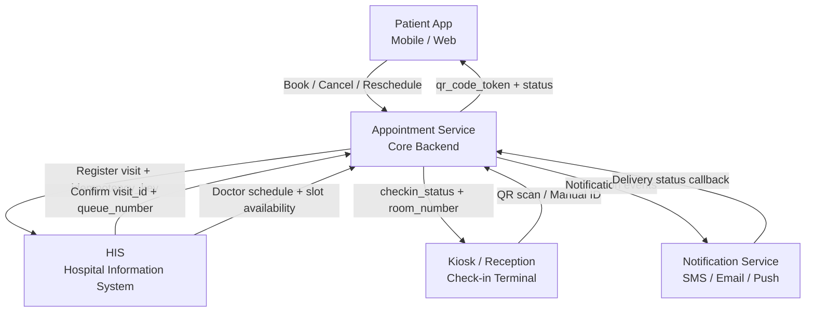
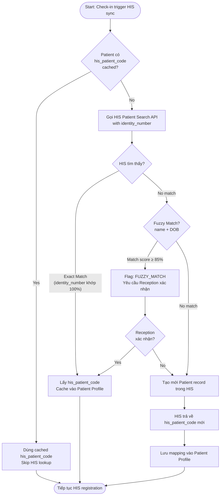

<Note>
  **Practice Case Study** — MedBook tại CityHealth General Hospital (fictional).
</Note>

## System Data Flow

**Integration Patterns:**
- Patient App ↔ AS: REST API (HTTPS), real-time
- AS ↔ HIS: REST / HL7, synchronous at check-in + polling for visit status
- Kiosk/Reception ↔ AS: REST API, real-time
- AS → NS: Message Queue (Kafka/SQS), event-driven

---

## Data Mapping Table — 25 Fields

### Nhóm 1: Order Identifiers

| Field | Source | Target | Required | Transformation Rule | Validation Rule | Source of Truth | Note |
|---|---|---|---|---|---|---|---|
| `appointment_id` | Appointment Service (generated) | HIS, Kiosk/Reception, NS, Patient App | Required | Format: `APT-YYYYMMDD-XXXXXX` (6-digit sequence, reset hàng ngày) | Pattern: `^APT-\d{8}-\d{6}$`. Unique constraint. | Appointment Service | Race condition nếu sequence không đồng bộ — cần global lock hoặc UUID fallback |
| `his_visit_id` | HIS (generated sau sync) | Appointment Service, Kiosk, Patient App (display) | Optional tại booking; Required sau `his_sync_status = SUCCESS` | Nhận từ HIS response. Lưu raw string, không transform | Không null nếu `his_sync_status = SUCCESS`. Max 50 chars alphanumeric | HIS | Null nếu HIS timeout → không thể in phiếu khám; cần xử lý fallback |
| `patient_id` | Appointment Service / Patient Profile Service | Appointment Service, NS | Required | Format: `PAT-XXXXXX` (6-digit) | FK constraint tới Patient Profile table | Patient Profile Service | Không expose ra HIS. HIS dùng `his_patient_code` |
| `his_patient_code` | HIS (matched hoặc created via identity_number) | Appointment Service (stored), HIS | Optional tại booking; Required để sync HIS | Look up từ HIS bằng `identity_number`. Nếu tìm được → lưu. Nếu không → HIS tạo mới và trả về | Alphanumeric, max 20 chars. Null cho phép nếu chưa sync | HIS | Nếu patient có nhiều CCCD (thay đổi, mất) → mismatch. Cần fallback matching bằng name + DOB |

### Nhóm 2: Patient Information

| Field | Source | Target | Required | Transformation Rule | Validation Rule | Source of Truth | Note |
|---|---|---|---|---|---|---|---|
| `patient_full_name` | Patient Profile Service (từ đăng ký / eKYC) | HIS, Kiosk (display), NS, Patient App | Required | Uppercase toàn bộ khi gửi sang HIS (HIS yêu cầu). Giữ nguyên case khi hiển thị trên app | Không null, max 100 chars. Unicode letters + dấu cách + dấu tiếng Việt | Patient Profile Service | Nếu patient cập nhật tên trên MedBook sau khi có `his_patient_code`, tên trong HIS không tự update — cần quy trình đồng bộ thủ công |
| `date_of_birth` | Patient Profile Service | HIS (mandatory), Kiosk (verification) | Required | Lưu dạng `DATE (YYYY-MM-DD)`. Khi gửi HIS: convert sang format HIS yêu cầu (có thể `DD/MM/YYYY`) | Không null. Phải là ngày hợp lệ. Không được là ngày tương lai | Patient Profile Service | HIS khác nhau có thể yêu cầu format khác — cần adapter layer |
| `gender` | Patient Profile Service | HIS, Kiosk | Required | MedBook enum: `MALE / FEMALE / OTHER`. Map sang HIS: `M / F / U` (Unknown) | Phải thuộc: `[MALE, FEMALE, OTHER]`. Không null | Patient Profile Service | HIS có thể không hỗ trợ `OTHER` — map về `U` và confirm với HIS team |
| `phone_number` | Patient Profile Service | NS, Kiosk (display masked) | Required | Lưu E.164 format (`+84xxxxxxxxx`). Hiển thị masked: `+84 **** ***XX` (show 2 digits cuối) | E.164 pattern. Việt Nam: `+84[3-9]\d{8}`. Không null | Patient Profile Service | Nếu patient đổi SĐT sau khi appointment đã tạo, notification gửi về số cũ |
| `identity_number` | Patient Profile Service (từ eKYC / nhập thủ công) | HIS (để match `his_patient_code`) | Required cho HIS sync | Lưu encrypted at rest. Masked khi hiển thị: `****XXXX`. Gửi raw sang HIS qua secure channel | CCCD: 12 digits. CMND: 9 digits. Passport: alphanumeric 8-9 chars | Patient Profile Service | PII/Sensitive — cần encrypt at rest + in transit. Audit log mọi access |

### Nhóm 3: Appointment Reference Data

| Field | Source | Target | Required | Transformation Rule | Validation Rule | Source of Truth | Note |
|---|---|---|---|---|---|---|---|
| `facility_id` | Hospital Master Data (Admin configured) | HIS, Appointment Service, Kiosk | Required | Static lookup từ master data. Format: alphanumeric code (vd: `CGH-F01`) | Phải tồn tại trong Facility master table. FK constraint | Hospital Master Data | Nếu HIS dùng facility code khác → cần mapping table |
| `specialty_id` | Hospital Master Data | HIS, Appointment Service, Patient App (display) | Required | Internal code map sang HIS specialty code qua lookup table | Phải tồn tại trong Specialty master table. Active flag = true | Hospital Master Data | HIS specialty code có thể thay đổi theo phiên bản — cần versioned mapping |
| `doctor_id` | Hospital Master Data / Doctor Profile | HIS, Appointment Service, Patient App, Kiosk | Required (nếu booking theo bác sĩ); Optional (nếu booking theo khoa) | Internal `doctor_id` map sang HIS doctor code qua lookup table | Nếu cung cấp: phải tồn tại, active, có lịch làm việc trong ngày đặt | Hospital Master Data | Bác sĩ nghỉ đột xuất → appointment đã đặt cần reassign |
| `service_id` | Hospital Master Data (Service/Examination catalog) | HIS, Appointment Service, Patient App | Required | Internal service code → HIS examination/service code mapping | Phải tồn tại, active. Phải compatible với `specialty_id` đã chọn | Hospital Master Data | Nếu service bị deactivate sau khi appointment đã tạo → không cancel được tự động |
| `appointment_date` | Patient App (user selected) | HIS, Appointment Service, Kiosk, NS | Required | Lưu dạng `DATE YYYY-MM-DD` (no timezone). Kết hợp với `appointment_time_slot` để tính datetime đầy đủ | Phải ≥ today. Không được là ngày HIS đóng (holiday/maintenance). Max 30 ngày tới | Appointment Service | MedBook chỉ phục vụ VN → chấp nhận VN timezone (UTC+7) |
| `appointment_time_slot` | HIS (slot availability) → exposed qua AS | HIS, Appointment Service, Patient App, Kiosk, NS | Required | Lưu dạng slot ID (reference HIS slot table) HOẶC `HH:MM` string. Display: `HH:MM - HH:MM` | Slot phải available tại thời điểm booking. Không được đã qua (past slot). Phải thuộc `appointment_date` | HIS (slot inventory) | Race condition: 2 patients book cùng slot đồng thời → HIS cần idempotent slot lock |

### Nhóm 4: Status Fields

| Field | Source | Target | Required | Transformation Rule | Validation Rule | Source of Truth | Note |
|---|---|---|---|---|---|---|---|
| `appointment_status` | Appointment Service | Patient App, HIS, Kiosk, NS | Required | MedBook enum (15 states). Map sang HIS visit status theo Status Mapping bên dưới | Phải thuộc enum defined. State machine validation: chỉ allow transition hợp lệ | Appointment Service | Tách biệt với `checkin_status` và `his_sync_status` |
| `checkin_status` | Kiosk/Reception hoặc AS | Appointment Service, HIS (inform), Patient App | Required (default: `NOT_CHECKED_IN`) | Enum: `NOT_CHECKED_IN / CHECKED_IN / FAILED`. Set bởi check-in event | `CHECKED_IN` chỉ hợp lệ nếu `appointment_status = CONFIRMED`. `FAILED` phải có `checkin_failure_reason` | Appointment Service | Tách khỏi `appointment_status` để track check-in independently |
| `his_sync_status` | Appointment Service (tracking sync job) | Appointment Service (internal), Hospital Admin UI | Required (default: `PENDING`) | Enum: `PENDING / SUCCESS / FAILED / RETRYING`. Tự động update theo kết quả HIS API call | `SUCCESS` phải có `his_visit_id` không null. `FAILED` phải có `his_sync_error` | Appointment Service | Retry logic: tối đa 3 lần. Sau 3 lần FAILED → alert Hospital Admin. Không expose raw error sang Patient App |
| `queue_number` | HIS (generated sau sync thành công) | Patient App (display), Kiosk (display), NS | Optional (chỉ có sau `his_sync_status = SUCCESS`) | Format: `[SpecialtyCode]-[Number]` (vd: `NOI-042`). Nhận từ HIS, lưu raw | Pattern: `^[A-Z]{2,5}-\d{1,4}$`. Null cho phép khi chưa sync. Unique trong ngày + khoa | HIS | Nếu HIS reset queue number giữa ngày (maintenance) → duplicate có thể xảy ra |
| `room_number` | Reception (assigned thủ công hoặc theo rule của HIS) | Patient App (display sau check-in), Kiosk | Optional | String, format tự do (vd: `P.201`, `B.305`). Nhận từ Reception input hoặc HIS assignment | Nếu không null: phải tồn tại trong Room master data. Max 10 chars | HIS / Reception | Nếu phòng thay đổi sau khi patient đã nhận thông báo → cần push notification cập nhật |

### Nhóm 5: Operational Fields

| Field | Source | Target | Required | Transformation Rule | Validation Rule | Source of Truth | Note |
|---|---|---|---|---|---|---|---|
| `payment_status` | Payment Service (Phase 2) hoặc HIS | Patient App, Kiosk, HIS | Optional (default: `NOT_REQUIRED`) | Enum: `NOT_REQUIRED / PENDING / PAID / EXEMPTED`. MVP: `NOT_REQUIRED` cho toàn bộ | `PAID` phải có `payment_reference_id`. `EXEMPTED` phải có `exemption_reason_code` | Payment Service (Phase 2) hoặc HIS | MVP: placeholder field. Phase 2: tích hợp Payment Service |
| `qr_code_token` | Appointment Service (generated sau CONFIRMED) | Patient App (display as QR), Kiosk (scan để check-in) | Required sau CONFIRMED | JWT encode: `appointment_id + patient_id + expiry`. Expiry: ngày khám + 2h sau giờ khám | Valid JWT. Không expired. `appointment_id` trong token phải match DB record | Appointment Service | One-time-use flag sau khi scan thành công. Revoke khi appointment cancelled |
| `created_at` | Appointment Service (auto-generated) | Audit log, reporting | Required | UTC timestamp (ISO 8601). Hiển thị convert sang UTC+7 cho người dùng VN | Auto-set tại insert time. Immutable sau khi tạo | Appointment Service DB | Nếu server không đồng bộ NTP → timestamp lệch |
| `updated_at` | Appointment Service (auto-update) | Audit log, reporting, sync detection | Required | UTC timestamp. Auto-update mỗi lần record thay đổi | ≥ `created_at`. Auto-managed, không accept từ client | Appointment Service DB | Dùng `updated_at` để detect dirty records cần re-sync |
| `checked_in_at` / `cancelled_at` / `no_show_at` | Appointment Service (set khi event xảy ra) | Audit log, reporting, HIS (inform), NS | Optional (nullable) | UTC timestamp. Immutable sau khi set. Phải ≥ `created_at` | Null nếu event chưa xảy ra. Không được overwrite sau khi set | Appointment Service | Tách thành 3 nullable fields riêng — không dùng generic `event_at` để query và reporting đơn giản hơn |

---

## Patient Identity Matching Logic

### Match Flow: `identity_number` → `his_patient_code`

| Case | Điều kiện | Xử lý | Risk |
|---|---|---|---|
| Exact Match | `identity_number` khớp 100% với HIS record | Dùng `his_patient_code` trực tiếp, cache lại | Thấp |
| Fuzzy Match | Name + DOB match ≥ 85% | Flag `FUZZY_MATCH`, Reception xác nhận thủ công | Trung bình |
| New Patient | Không match bất kỳ record nào trong HIS | HIS tạo mới, trả `his_patient_code` mới | Thấp |
| Multiple Fuzzy Matches | Nhiều record match ≥ threshold | Alert Reception chọn đúng record; không tự động chọn | Cao |
| HIS Unavailable | HIS API timeout/error | Queue ở `HIS_SYNC_PENDING`; retry sau | Trung bình |

---

## Status Mapping: MedBook ↔ HIS

| MedBook `appointment_status` | HIS Visit Status | Direction |
|---|---|---|
| `CONFIRMED` | `REGISTERED` | MedBook → HIS |
| `CHECKED_IN` | `ARRIVED` | MedBook → HIS |
| `WAITING_FOR_CONSULTATION` | `WAITING` | HIS → MedBook |
| `IN_CONSULTATION` | `IN_CONSULTATION` | HIS → MedBook |
| `COMPLETED` | `COMPLETED` | HIS → MedBook |
| `NO_SHOW` | `NO_SHOW` | MedBook (auto) → HIS |
| `CANCELLED_BY_PATIENT` | `CANCELLED` | MedBook → HIS |
| `CANCELLED_BY_HOSPITAL` | `CANCELLED` | MedBook → HIS |
| `RESCHEDULED` | `CANCELLED` + new `REGISTERED` | MedBook → HIS (2 calls) |
