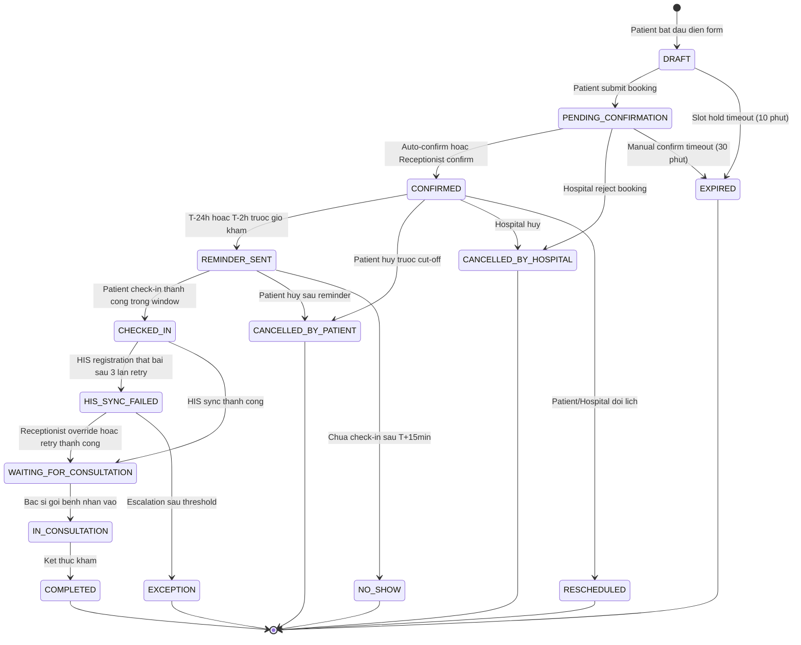

<Note>
  **Practice Case Study** — MedBook là platform fictional. Tài liệu này được tạo cho mục đích portfolio BA.
</Note>

## Overview

State machine này mô tả toàn bộ vòng đời của một lịch hẹn trên nền tảng MedBook tại CityHealth General Hospital. Mỗi appointment tồn tại duy nhất một trạng thái tại một thời điểm và chuyển trạng thái theo các business rules đã được định nghĩa.

### State Groups

| Nhóm | States | Mô tả |
|---|---|---|
| **Booking States** (7) | DRAFT, PENDING_CONFIRMATION, CONFIRMED, REMINDER_SENT, RESCHEDULED, EXPIRED, CANCELLED_BY_PATIENT | Các trạng thái liên quan đến quá trình đặt lịch trước ngày khám |
| **Visit States** (5) | CHECKED_IN, HIS_SYNC_FAILED, WAITING_FOR_CONSULTATION, IN_CONSULTATION, COMPLETED | Các trạng thái diễn ra trong ngày khám tại cơ sở y tế |
| **Terminal / Exception States** (8) | CANCELLED_BY_PATIENT, CANCELLED_BY_HOSPITAL, EXPIRED, NO_SHOW, RESCHEDULED, HIS_SYNC_FAILED, EXCEPTION, COMPLETED | Trạng thái kết thúc vòng đời hoặc xử lý ngoại lệ |

---

## State Diagram



---

## Chi Tiết Từng State

### 1. DRAFT

| | |
|---|---|
| **Status** | `DRAFT` |
| **Meaning** | Bệnh nhân đang trong quá trình điền form đặt lịch. Slot đã được giữ tạm thời nhưng chưa được xác nhận. |
| **Trigger vào** | Patient bắt đầu quá trình booking, chọn doctor/specialty/timeslot |
| **Owner system** | MedBook System |
| **Actor được phép chuyển** | MedBook System (auto-transition theo timeout hoặc submit) |
| **Next possible statuses** | `PENDING_CONFIRMATION` (patient submit), `EXPIRED` (timeout 10 phút) |
| **User-facing message** | "Đang giữ chỗ cho bạn. Vui lòng hoàn tất đặt lịch trong 10 phút." |
| **Business rules** | BR-BOOK-02 (slot hold 10 phút), BR-BOOK-06 (required fields validation) |

---

### 2. PENDING_CONFIRMATION

| | |
|---|---|
| **Status** | `PENDING_CONFIRMATION` |
| **Meaning** | Bệnh nhân đã submit form đặt lịch. Appointment đang chờ xác nhận — tự động hoặc thủ công từ lễ tân. |
| **Trigger vào** | Patient nhấn "Xác nhận đặt lịch" và form hợp lệ |
| **Owner system** | MedBook System / Receptionist (tùy specialty) |
| **Actor được phép chuyển** | MedBook System (auto-confirm), Receptionist (manual confirm/reject) |
| **Next possible statuses** | `CONFIRMED` (confirm thành công), `CANCELLED_BY_HOSPITAL` (reject), `EXPIRED` (manual confirm timeout) |
| **User-facing message** | "Lịch hẹn của bạn đang được xác nhận. Bạn sẽ nhận thông báo trong vài phút." |
| **Business rules** | BR-CONF-01 (auto-confirm), BR-CONF-02 (manual confirm), BR-CONF-04 (slot hold expiration) |

---

### 3. CONFIRMED

| | |
|---|---|
| **Status** | `CONFIRMED` |
| **Meaning** | Lịch hẹn đã được xác nhận chính thức. Slot được giữ chắc chắn. QR code được sinh ra và gửi cho bệnh nhân. |
| **Trigger vào** | Auto-confirm bởi MedBook System hoặc Receptionist manually confirm |
| **Owner system** | MedBook System |
| **Actor được phép chuyển** | Patient (cancel/reschedule), Hospital (cancel/reschedule), MedBook System (auto-send reminder) |
| **Next possible statuses** | `REMINDER_SENT`, `CANCELLED_BY_PATIENT`, `CANCELLED_BY_HOSPITAL`, `RESCHEDULED` |
| **User-facing message** | "Lịch hẹn của bạn đã được xác nhận! Ngày [date], lúc [time] với Bác sĩ [name]." |
| **Business rules** | BR-CONF-03 (reminder schedule), BR-CANCEL-01 (cancel before cut-off), BR-CANCEL-03 (reschedule) |

---

### 4. REMINDER_SENT

| | |
|---|---|
| **Status** | `REMINDER_SENT` |
| **Meaning** | Hệ thống đã gửi ít nhất một reminder đến bệnh nhân. Appointment sẵn sàng cho check-in. |
| **Trigger vào** | MedBook System auto-trigger tại T-24h hoặc T-2h trước appointment_time |
| **Owner system** | MedBook System |
| **Actor được phép chuyển** | Patient (check-in, cancel), MedBook System (auto-detect no-show tại T+15min) |
| **Next possible statuses** | `CHECKED_IN` (patient check-in), `NO_SHOW` (T+15min không check-in), `CANCELLED_BY_PATIENT` |
| **User-facing message** | "Nhắc nhở: Lịch hẹn của bạn vào lúc [time] hôm nay. Mở ứng dụng để check-in." |
| **Business rules** | BR-CONF-03 (reminder timing), BR-CANCEL-04 (no-show grace period), BR-CHECKIN-01 (check-in window) |

---

### 5. CHECKED_IN

| | |
|---|---|
| **Status** | `CHECKED_IN` |
| **Meaning** | Bệnh nhân đã check-in thành công tại cơ sở. MedBook đang gửi registration request đến HIS. |
| **Trigger vào** | Patient quét QR code hoặc Receptionist xác nhận check-in tại kiosk/quầy |
| **Owner system** | MedBook System |
| **Actor được phép chuyển** | MedBook System (auto-transition sau HIS sync result) |
| **Next possible statuses** | `WAITING_FOR_CONSULTATION` (HIS sync success), `HIS_SYNC_FAILED` (HIS sync thất bại) |
| **User-facing message** | "Check-in thành công! Đang xử lý thông tin, vui lòng chờ." |
| **Business rules** | BR-CHECKIN-01 (time window), BR-CHECKIN-02 (facility match), BR-HIS-01 (trigger HIS registration) |

---

### 6. HIS_SYNC_FAILED

| | |
|---|---|
| **Status** | `HIS_SYNC_FAILED` |
| **Meaning** | Quá trình đồng bộ thông tin bệnh nhân từ MedBook sang HIS thất bại sau 3 lần retry. Đây là **blocking state** — bệnh nhân chưa được cấp queue number. |
| **Trigger vào** | HIS registration request thất bại lần thứ 3 (sau 2 lần retry tự động) |
| **Owner system** | MedBook System / Receptionist (escalation) |
| **Actor được phép chuyển** | Receptionist (manual override → WAITING_FOR_CONSULTATION), MedBook System (escalation → EXCEPTION) |
| **Next possible statuses** | `WAITING_FOR_CONSULTATION` (override/retry thành công), `EXCEPTION` (escalation vượt threshold) |
| **User-facing message** | "Đang xử lý thông tin, vui lòng đến quầy lễ tân để được hỗ trợ." |
| **Business rules** | BR-HIS-04 (retry 3 lần), BR-HIS-06 (chặn queue assignment), BR-HIS-05 (idempotency) |

<Warning>
  HIS_SYNC_FAILED là trạng thái quan trọng nhất trong toàn bộ state machine. Nếu queue number được cấp khi HIS chưa có record, bác sĩ sẽ không thấy bệnh nhân trong danh sách HIS — nguy hiểm hơn việc bệnh nhân phải chờ thêm vài phút.
</Warning>

---

### 7. WAITING_FOR_CONSULTATION

| | |
|---|---|
| **Status** | `WAITING_FOR_CONSULTATION` |
| **Meaning** | HIS registration thành công. Bệnh nhân đã có queue number và đang chờ được gọi vào phòng khám. |
| **Trigger vào** | HIS sync thành công và queue number được cấp phát |
| **Owner system** | HIS System / MedBook System |
| **Actor được phép chuyển** | Doctor/Receptionist (gọi bệnh nhân vào) |
| **Next possible statuses** | `IN_CONSULTATION` (doctor gọi vào), `EXCEPTION` (sự cố) |
| **User-facing message** | "Số thứ tự của bạn: [SpecialtyCode]-[Number]. Dự kiến chờ: [X] phút. Vui lòng chú ý bảng hiển thị." |
| **Business rules** | BR-HIS-06 (queue chỉ sau HIS sync), BR-QUEUE-01 (queue number generation), BR-QUEUE-02 (priority) |

---

### 8. IN_CONSULTATION

| | |
|---|---|
| **Status** | `IN_CONSULTATION` |
| **Meaning** | Bệnh nhân đang trong phòng khám với bác sĩ. Cuộc khám đang diễn ra. |
| **Trigger vào** | Doctor hoặc Receptionist cập nhật trạng thái bệnh nhân "Đang khám" trong HIS/MedBook |
| **Owner system** | HIS System |
| **Actor được phép chuyển** | Doctor (kết thúc khám → COMPLETED) |
| **Next possible statuses** | `COMPLETED` (kết thúc khám bình thường), `EXCEPTION` (sự cố y tế) |
| **User-facing message** | "Bệnh nhân đang được khám." (hiển thị cho người chờ kèm) |
| **Business rules** | BR-QUEUE-03 (room assignment), BR-QUEUE-04 (doctor substitution handling) |

---

### 9. COMPLETED

| | |
|---|---|
| **Status** | `COMPLETED` |
| **Meaning** | Cuộc khám đã hoàn tất. Bác sĩ đã kết thúc consultation. Appointment được đóng lại thành công. |
| **Trigger vào** | Doctor đánh dấu "Kết thúc khám" trong HIS hoặc MedBook |
| **Owner system** | HIS System |
| **Actor được phép chuyển** | Không ai (terminal state) |
| **Next possible statuses** | Không có (terminal) |
| **User-facing message** | "Khám hoàn tất. Cảm ơn bạn đã sử dụng dịch vụ CityHealth." |
| **Business rules** | Kết quả được lưu vào HIS. MedBook ghi nhận appointment_completed_at timestamp. |

---

### 10. CANCELLED_BY_PATIENT

| | |
|---|---|
| **Status** | `CANCELLED_BY_PATIENT` |
| **Meaning** | Bệnh nhân chủ động hủy lịch hẹn. |
| **Trigger vào** | Patient thực hiện hủy lịch qua app/web MedBook |
| **Owner system** | MedBook System |
| **Actor được phép chuyển** | Không ai (terminal state) |
| **Next possible statuses** | Không có (terminal). Patient có thể tạo booking mới. |
| **User-facing message** | "Lịch hẹn của bạn đã được hủy. Slot sẽ được mở lại trong 30 phút." |
| **Business rules** | BR-CANCEL-01 (trước cut-off: tự do hủy), BR-CANCEL-02 (sau cut-off: cần lý do), BR-CANCEL-05 (slot release) |

---

### 11. CANCELLED_BY_HOSPITAL

| | |
|---|---|
| **Status** | `CANCELLED_BY_HOSPITAL` |
| **Meaning** | Bệnh viện/lễ tân hủy lịch hẹn do bác sĩ nghỉ, sự cố thiết bị, hoặc lý do vận hành. |
| **Trigger vào** | Receptionist hoặc Hospital Admin thực hiện cancel từ phía hospital |
| **Owner system** | MedBook System / Receptionist |
| **Actor được phép chuyển** | Không ai (terminal state) |
| **Next possible statuses** | Không có (terminal). MedBook hỗ trợ patient rebook. |
| **User-facing message** | "Rất tiếc, bệnh viện phải hủy lịch hẹn của bạn. Lý do: [reason]. Vui lòng đặt lại lịch hoặc liên hệ hotline." |
| **Business rules** | BR-CONF-05 (thông báo ≥ 2h trước), BR-CANCEL-05 (slot release) |

---

### 12. RESCHEDULED

| | |
|---|---|
| **Status** | `RESCHEDULED` |
| **Meaning** | Lịch hẹn đã được dời sang ngày/giờ khác. Appointment gốc được đánh dấu RESCHEDULED và một appointment mới được tạo. |
| **Trigger vào** | Patient hoặc Hospital chọn "Đổi lịch" thay vì hủy |
| **Owner system** | MedBook System |
| **Actor được phép chuyển** | Không ai (terminal state cho appointment gốc) |
| **Next possible statuses** | Không có cho appointment gốc. Appointment mới (new appointment_id) được tạo. |
| **User-facing message** | "Lịch hẹn đã được dời thành công. Lịch mới: [new date/time]. Mã lịch mới: [new_id]." |
| **Business rules** | BR-CANCEL-03 (reschedule before cut-off), BR-CANCEL-05 (slot cũ release trong 30 phút) |

---

### 13. EXPIRED

| | |
|---|---|
| **Status** | `EXPIRED` |
| **Meaning** | Appointment tự động bị hủy do timeout — slot hold hết hạn hoặc manual confirm không được xử lý đúng hạn. |
| **Trigger vào** | MedBook System auto-expire: (1) DRAFT quá 10 phút, (2) PENDING_CONFIRMATION chưa confirm sau 30 phút |
| **Owner system** | MedBook System |
| **Actor được phép chuyển** | Không ai (terminal state) |
| **Next possible statuses** | Không có (terminal). Slot được release ngay lập tức. |
| **User-facing message** | "Phiên đặt lịch đã hết hạn. Vui lòng đặt lại lịch." |
| **Business rules** | BR-BOOK-02 (slot hold 10 phút cho DRAFT), BR-CONF-04 (30 phút cho PENDING) |

---

### 14. NO_SHOW

| | |
|---|---|
| **Status** | `NO_SHOW` |
| **Meaning** | Bệnh nhân không đến khám và không check-in trong thời gian cho phép. |
| **Trigger vào** | MedBook System auto-trigger khi REMINDER_SENT và không có check-in sau T+15 phút |
| **Owner system** | MedBook System |
| **Actor được phép chuyển** | Receptionist (override trong 24h nếu có lý do hợp lệ) |
| **Next possible statuses** | `CHECKED_IN` (nếu Receptionist override trong vòng 24h) |
| **User-facing message** | "Chúng tôi ghi nhận bạn không đến khám. Nếu có nhầm lẫn, vui lòng liên hệ bệnh viện trong 24 giờ." |
| **Business rules** | BR-CANCEL-04 (grace period T+15min), BR-CANCEL-06 (receptionist override trong 24h) |

---

### 15. EXCEPTION

| | |
|---|---|
| **Status** | `EXCEPTION` |
| **Meaning** | Appointment rơi vào tình trạng bất thường không thể tự xử lý — lỗi hệ thống, HIS escalation, sự cố y tế. Cần System Admin hoặc Hospital Admin can thiệp. |
| **Trigger vào** | HIS_SYNC_FAILED không được giải quyết sau threshold; sự cố kỹ thuật nghiêm trọng |
| **Owner system** | System Admin / Hospital Admin |
| **Actor được phép chuyển** | System Admin (investigate và manually transition), Hospital Admin |
| **Next possible statuses** | Tùy vào kết quả điều tra |
| **User-facing message** | "Đã xảy ra sự cố với lịch hẹn của bạn. Đội ngũ hỗ trợ sẽ liên hệ bạn trong vòng 30 phút." |
| **Business rules** | Mọi EXCEPTION phải được ghi log đầy đủ với incident_id. SLA xử lý: 30 phút trong giờ hành chính. |

---

## Cancellation Rules Matrix

| Trạng thái hiện tại | Patient có thể hủy? | Hospital có thể hủy? | Điều kiện đặc biệt |
|---|---|---|---|
| `DRAFT` | Có (abandon form) | N/A | Slot tự động release khi EXPIRED |
| `PENDING_CONFIRMATION` | Có | Có (reject) | Hospital reject → CANCELLED_BY_HOSPITAL |
| `CONFIRMED` (trước cut-off T-2h) | Có, tự do | Có, phải thông báo ≥ T-2h | BR-CANCEL-01, BR-CONF-05 |
| `CONFIRMED` (sau cut-off T-2h) | Có, cần nhập lý do | Có, phải gọi điện thông báo | Slot có thể không được release nếu < 30 phút |
| `REMINDER_SENT` | Có, cần lý do | Có | Áp dụng BR-CANCEL-02 |
| `CHECKED_IN` | Không | Có (sự cố vận hành) | Chỉ Hospital mới có quyền hủy sau check-in |
| `HIS_SYNC_FAILED` | Không | Có (emergency only) | Phải có Receptionist override |
| `WAITING_FOR_CONSULTATION` | Không | Có (emergency only) | Doctor/Admin approval bắt buộc |
| `IN_CONSULTATION` | Không | Không | Không được phép hủy mid-consultation |
| `COMPLETED` | Không | Không | Terminal state |
| `NO_SHOW` | Không | Không | Receptionist override trong 24h |

---

## HIS Sync State — Chi Tiết

### Luồng xử lý HIS_SYNC_FAILED

```
CHECKED_IN
    │
    ▼
[MedBook gửi HIS Registration Request]
    │
    ├─ SUCCESS ──────────────────────► WAITING_FOR_CONSULTATION
    │                                  (queue number được cấp)
    │
    └─ FAILURE
         │
         ├─ Attempt 1: Retry sau 2 phút → SUCCESS hoặc tiếp tục
         ├─ Attempt 2: Retry sau 2 phút → SUCCESS hoặc tiếp tục
         └─ Attempt 3: Retry sau 2 phút
                └─ SUCCESS → WAITING_FOR_CONSULTATION
                └─ FAILURE → HIS_SYNC_FAILED
                              │
                              ├─ Alert: Receptionist dashboard
                              ├─ Bệnh nhân: "Vui lòng đến quầy lễ tân"
                              │
                              ├─ Receptionist override (trong 15 phút)
                              │      └─ Manual HIS entry → WAITING_FOR_CONSULTATION
                              │
                              └─ Không xử lý sau 15 phút
                                     └─ EXCEPTION (escalation to System Admin)
```

### Retry Configuration

| Parameter | Giá trị |
|---|---|
| Max retry attempts | 3 |
| Retry interval | 2 phút giữa mỗi lần |
| Receptionist override window | 15 phút kể từ khi vào HIS_SYNC_FAILED |
| Escalation threshold | Sau 15 phút không có override |
| Logging | Mỗi attempt được log với attempt_number, error_code, timestamp |

---

## Terminal States Summary

| State | Triggered by | Slot Released? | Audit Log? | Patient Notification |
|---|---|---|---|---|
| `COMPLETED` | Doctor (kết thúc khám) | N/A | Có | Có (receipt + link) |
| `CANCELLED_BY_PATIENT` | Patient | Có (30 phút) | Có | Có (confirmation) |
| `CANCELLED_BY_HOSPITAL` | Receptionist / Admin | Có (ngay) | Có (+ reason required) | Có (phải ≥ 2h trước) |
| `EXPIRED` | MedBook System (auto) | Có (ngay) | Có | Có (form expired) |
| `NO_SHOW` | MedBook System (T+15min) | Có (30 phút) | Có | Có (+ override link) |
| `RESCHEDULED` | Patient / Hospital | Có (30 phút) | Có (link to new ID) | Có (new appointment) |
| `EXCEPTION` | System (escalation) | Giữ nguyên | Có (incident_id required) | Có (support contact) |
