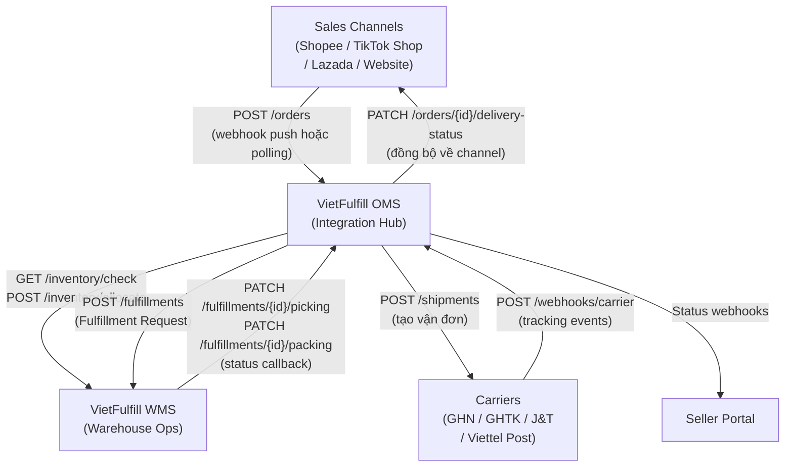

<Warning>
  **Practice Case Study** — Tài liệu này được tạo cho mục đích học tập và luyện tập phân tích nghiệp vụ (BA-level API thinking). Không phải API specification đầy đủ hay tài liệu dự án thực tế.
</Warning>

## Tổng quan kiến trúc Integration

VietFulfill đóng vai trò **integration hub** trung tâm: nhận order từ nhiều Sales Channel, điều phối WMS để thực hiện fulfillment vật lý, rồi giao tiếp với Carrier để tạo vận đơn và nhận tracking update. Toàn bộ luồng dữ liệu đi theo hai hướng rõ ràng — inbound (từ Sales Channel và Carrier vào OMS) và outbound (từ OMS ra WMS và Carrier API).

OMS là thành phần duy nhất có quyền ghi vào WMS. WMS chỉ nhận lệnh từ OMS và trả status update ngược lại. Carrier thì được OMS gọi để tạo shipment, sau đó tự chủ động push tracking webhook về OMS khi có thay đổi trạng thái vận chuyển.



### Integration Patterns

**Webhook (Push)** là pattern ưu tiên khi đối tác hỗ trợ. Sales Channel push order event ngay khi có đơn mới — OMS nhận thụ động. Carrier cũng push tracking event về `/webhooks/carrier`. Pattern này giảm tải hệ thống và đảm bảo độ trễ thấp (thường dưới 30 giây).

**Polling (Pull)** được dùng như fallback khi đối tác không hỗ trợ webhook ổn định. OMS có scheduler chạy định kỳ (mỗi 5 phút) để pull danh sách order mới.

**Sync vs Async:** Các API liên quan đến inventory check và validation chạy synchronous. Các API tạo fulfillment và shipment chạy asynchronous — OMS gửi request rồi tiếp tục xử lý đơn khác, WMS và Carrier callback khi hoàn thành.

---

## API List — 12 APIs Cốt Lõi

### 1. POST /orders — Nhận đơn hàng từ Sales Channel

| | |
|---|---|
| **Method** | `POST` |
| **Endpoint** | `/api/v1/orders` |
| **Caller** | Sales Channel (Shopee, TikTok Shop, Lazada, Website Seller) |
| **Receiver** | OMS |
| **Purpose** | Tiếp nhận đơn hàng mới từ Sales Channel, sinh `oms_order_id`, chuyển trạng thái sang `ORDER_CREATED` |
| **Idempotency** | Yes — OMS dedup theo `channel_order_id` + `channel_code` trong vòng 24 giờ |

**Key Request Fields:**
- `channel_code` — định danh Sales Channel (`SHOPEE`, `TIKTOK`, `LAZADA`, `WEBSITE`)
- `channel_order_id` — order ID phía channel (dùng để dedup và trace)
- `items[]` — danh sách SKU: `sku_code`, `quantity`, `unit_price`
- `shipping_address` — địa chỉ giao hàng: `name`, `phone`, `province`, `district`, `ward`, `street`
- `payment_method` — `COD` hoặc `PREPAID`
- `cod_amount` — bắt buộc nếu `payment_method = COD`
- `channel_created_at` — timestamp tạo đơn phía channel (dùng để tính SLA)

**Key Response Fields:**
- `oms_order_id` — ID nội bộ VietFulfill, format `VF-2026-XXXXXX`
- `status` — `ORDER_CREATED`
- `estimated_sla` — thời gian giao dự kiến tính từ thời điểm nhận đơn

**Common Errors:**
- `400 MISSING_REQUIRED_FIELD` — thiếu field bắt buộc
- `409 DUPLICATE_ORDER` — `channel_order_id` đã tồn tại; response trả về `oms_order_id` hiện tại
- `422 UNSUPPORTED_PAYMENT_METHOD` — payment method không hợp lệ
- `503 OMS_UNAVAILABLE` — OMS đang maintenance; channel nên retry sau 60 giây

**Notes (BA):** API này là entry point của toàn bộ fulfillment flow. Dedup theo `(channel_code, channel_order_id)` cực kỳ quan trọng — Shopee và TikTok có thể gửi lại webhook nếu không nhận được ACK kịp thời.

### 2. POST /orders/{id}/validate — Trigger order validation

| | |
|---|---|
| **Method** | `POST` |
| **Endpoint** | `/api/v1/orders/{oms_order_id}/validate` |
| **Caller** | OMS (tự gọi nội bộ, hoặc trigger thủ công từ Ops Team) |
| **Receiver** | OMS (validation engine) |
| **Purpose** | Chạy toàn bộ validation rules; trả kết quả PASS/FAIL và danh sách lỗi cụ thể |
| **Idempotency** | No — mỗi lần gọi chạy lại validation từ đầu |

**Key Response Fields:**
- `validation_status` — `PASS` hoặc `FAIL`
- `failed_rules[]` — danh sách rule fail: `rule_code`, `rule_name`, `detail`
- `next_status` — `AWAITING_STOCK_CHECK` nếu PASS, `VALIDATION_FAILED` nếu FAIL

**Common Errors:**
- `404 ORDER_NOT_FOUND`
- `409 INVALID_STATE_TRANSITION` — đơn đang ở trạng thái không cho phép validate
- `500 VALIDATION_ENGINE_ERROR` — lỗi nội bộ; cần check log

### 3. GET /inventory/check — Kiểm tra tồn kho khả dụng

| | |
|---|---|
| **Method** | `GET` |
| **Endpoint** | `/api/v1/inventory/check` |
| **Caller** | OMS |
| **Receiver** | WMS |
| **Purpose** | Truy vấn available stock cho danh sách SKU; không thay đổi trạng thái tồn kho |
| **Idempotency** | N/A — read-only |

**Key Request Fields (query params):**
- `sku_codes` — danh sách SKU phân tách bằng dấu phẩy
- `warehouse_id` — kho cụ thể cần check (optional)

**Key Response Fields:**
- `items[]` — `sku_code`, `available_qty`, `reserved_qty`, `physical_qty`, `bin_locations[]`, `low_stock_warning`

**Common Errors:**
- `400 INVALID_SKU_FORMAT`
- `404 SKU_NOT_FOUND` — response vẫn trả items còn lại, SKU không tìm thấy được đánh dấu `not_found: true`
- `503 WMS_UNAVAILABLE`

**Notes (BA):** `available_qty = physical_qty - reserved_qty`. Đây là số OMS dùng để quyết định có allocate được không, không phải `physical_qty`.

### 4. POST /inventory/allocate — Khóa tồn kho cho đơn hàng

| | |
|---|---|
| **Method** | `POST` |
| **Endpoint** | `/api/v1/inventory/allocate` |
| **Caller** | OMS |
| **Receiver** | WMS |
| **Purpose** | Lock (reserved) số lượng hàng tương ứng với đơn hàng; ngăn oversell khi nhiều đơn cùng request cùng SKU |
| **Idempotency** | Yes — với `idempotency_key` là `oms_order_id` |

**Key Request Fields:**
- `oms_order_id` — dùng làm idempotency key
- `items[]` — `sku_code`, `quantity_to_allocate`, `warehouse_id`
- `allocation_expiry` — thời gian hết hạn reservation (mặc định 4 giờ)

**Key Response Fields:**
- `allocation_id`, `allocated_items[]`, `expires_at`, `status` (`ALLOCATED` hoặc `PARTIAL_ALLOCATED`)

**Common Errors:**
- `409 INSUFFICIENT_STOCK` — chi tiết từng SKU còn thiếu bao nhiêu
- `409 ALREADY_ALLOCATED` — idempotency; response trả allocation hiện tại
- `503 WMS_LOCK_TIMEOUT` — retry sau 5 giây

### 5. POST /fulfillments — Tạo Fulfillment Request (OMS → WMS)

| | |
|---|---|
| **Method** | `POST` |
| **Endpoint** | `/api/v1/fulfillments` |
| **Caller** | OMS |
| **Receiver** | WMS |
| **Purpose** | Gửi lệnh thực hiện vật lý cho WMS: nhặt hàng, đóng gói, chuẩn bị bàn giao Carrier |
| **Idempotency** | Yes — với `idempotency_key` là `oms_order_id` |

**Key Request Fields:**
- `oms_order_id`, `fulfillment_id` (format `FUL-XXXXXX`), `items[]`, `carrier_code`, `priority` (`NORMAL/HIGH/URGENT`), `sla_deadline`, `packing_notes`

**Common Errors:**
- `404 ORDER_NOT_ALLOCATED` — cần chạy `/inventory/allocate` trước
- `409 FULFILLMENT_EXISTS` — idempotency guard
- `503 WMS_QUEUE_FULL` — retry sau 60 giây

### 6. PATCH /fulfillments/{id}/picking — Cập nhật trạng thái picking

| | |
|---|---|
| **Method** | `PATCH` |
| **Endpoint** | `/api/v1/fulfillments/{fulfillment_id}/picking` |
| **Caller** | WMS (callback về OMS sau mỗi milestone picking) |
| **Receiver** | OMS |
| **Purpose** | WMS báo cáo tiến độ picking; OMS cập nhật trạng thái đơn và log timeline |
| **Idempotency** | No — mỗi PATCH là một milestone update |

**Key Request Fields:**
- `picking_status` — `PICKING_STARTED`, `PICKING_IN_PROGRESS`, `PICKING_COMPLETED`, `PICKING_EXCEPTION`
- `picked_items[]`, `picker_id`, `timestamp`, `exception_detail` (optional)

**Notes (BA):** `timestamp` trong request là thời điểm thực tế picker thực hiện (do device WMS ghi lại), không phải thời điểm API call. Điều này quan trọng cho audit trail và tính SLA chính xác.

### 7. PATCH /fulfillments/{id}/packing — Cập nhật trạng thái packing

| | |
|---|---|
| **Method** | `PATCH` |
| **Endpoint** | `/api/v1/fulfillments/{fulfillment_id}/packing` |
| **Caller** | WMS (callback về OMS sau milestone packing) |
| **Receiver** | OMS |
| **Purpose** | WMS báo cáo hoàn thành đóng gói, cung cấp thông tin kiện hàng để OMS tạo vận đơn với Carrier |
| **Idempotency** | No — nhưng OMS cần guard trạng thái |

**Key Request Fields:**
- `packing_status`, `package_info` (`weight_gram`, `length_cm`, `width_cm`, `height_cm`), `packer_id`, `timestamp`, `label_printed`

**Key Response Fields:**
- `oms_status` — `PACKING_COMPLETED` → OMS sẽ tự động trigger `POST /shipments`
- `shipment_trigger` — `AUTO` hoặc `MANUAL`

**Notes (BA):** `package_info` cực kỳ quan trọng — Carrier tính phí dựa trên actual weight vs dimensional weight (`L*W*H/5000`). Sai số lớn có thể dẫn đến charge thêm và tranh chấp với Seller.

### 8. POST /shipments — Tạo vận đơn với Carrier

| | |
|---|---|
| **Method** | `POST` |
| **Endpoint** | `/api/v1/shipments` |
| **Caller** | OMS |
| **Receiver** | Carrier API (thông qua Carrier Adapter layer) |
| **Purpose** | OMS gọi Carrier API để tạo vận đơn, nhận tracking code |
| **Idempotency** | Yes — với `idempotency_key` là `fulfillment_id` |

**Key Request Fields:**
- `carrier_code`, `sender_info`, `recipient_info`, `package_info`, `cod_amount`, `service_type`, `note`

**Key Response Fields:**
- `tracking_code`, `carrier_order_id`, `estimated_delivery`, `label_url`

**Common Errors:**
- `400 INVALID_ADDRESS_CODE` — address code không tồn tại trong master data Carrier
- `422 COD_NOT_SUPPORTED` — Carrier không hỗ trợ COD cho địa bàn này
- `503 CARRIER_API_DOWN` — retry theo exponential backoff; nếu vẫn fail sau 3 lần, chuyển sang carrier backup

**Notes (BA):** OMS không gọi trực tiếp từng Carrier API — cần có **Carrier Adapter layer** để chuẩn hóa request/response. Mỗi carrier có format address khác nhau.

### 9. POST /webhooks/carrier — Nhận tracking event từ Carrier

| | |
|---|---|
| **Method** | `POST` |
| **Endpoint** | `/api/v1/webhooks/carrier` |
| **Caller** | Carrier (GHN, GHTK, J&T, Viettel Post — chủ động push) |
| **Receiver** | OMS |
| **Purpose** | Nhận milestone tracking event từ Carrier và cập nhật trạng thái đơn hàng |
| **Idempotency** | Yes — OMS dedup theo `carrier_order_id` + `event_code` + `event_timestamp` |

**Key Request Fields:**
- `carrier_code`, `carrier_order_id`, `tracking_code`, `event_code`, `event_timestamp`, `location`, `signature` (HMAC-SHA256)

**Common Errors:**
- `401 INVALID_SIGNATURE` — payload bị tamper hoặc sai secret key; không xử lý
- `409 DUPLICATE_EVENT` — OMS vẫn trả 200 để Carrier không retry tiếp
- `422 UNKNOWN_EVENT_CODE` — OMS log lại, alert Ops, trả 200

**Notes (BA):** Việc trả `200` cho cả `DUPLICATE_EVENT` và `UNKNOWN_EVENT_CODE` là có chủ đích — nếu trả `4xx`, Carrier sẽ retry liên tục và tạo noise.

### 10. PATCH /orders/{id}/delivery-status — Đồng bộ trạng thái về Sales Channel

| | |
|---|---|
| **Method** | `PATCH` |
| **Endpoint** | `/api/v1/orders/{oms_order_id}/delivery-status` |
| **Caller** | OMS (tự gọi sau khi xử lý carrier webhook) |
| **Receiver** | Sales Channel API (thông qua Channel Adapter) |
| **Purpose** | Push trạng thái giao hàng mới nhất từ OMS về phía Sales Channel |
| **Idempotency** | Yes — với `(oms_order_id, delivery_status, status_timestamp)` |

**Common Errors:**
- `502 CHANNEL_API_ERROR` — Sales Channel API trả lỗi; OMS log và schedule retry
- `504 CHANNEL_API_TIMEOUT` — treat như 502 và retry

**Notes (BA):** Nếu Sales Channel API fail liên tục, OMS cần có queue để push lại sau — không được drop event.

### 11. POST /returns — Tạo yêu cầu hoàn hàng

| | |
|---|---|
| **Method** | `POST` |
| **Endpoint** | `/api/v1/returns` |
| **Caller** | Sales Channel hoặc OMS (tự động sau `DELIVERY_FAILED` quá ngưỡng) |
| **Receiver** | OMS |
| **Purpose** | Khởi tạo quy trình hoàn hàng |
| **Idempotency** | Yes — dedup theo `(oms_order_id, return_reason_code)` trong 48 giờ |

**Key Request Fields:**
- `return_type` — `BUYER_RETURN` hoặc `CARRIER_RETURN`
- `return_reason_code`, `items[]` (với `condition`: `NEW/USED/DAMAGED`), `return_shipping_method`

**Key Response Fields:**
- `return_id` (format `RET-XXXXXX`), `return_status`, `return_sla`, `wms_notified`

**Notes (BA):** `return_type` ảnh hưởng đến toàn bộ quy trình xử lý và ai chịu chi phí vận chuyển hoàn.

### 12. PATCH /exceptions/{id}/resolve — Xử lý exception

| | |
|---|---|
| **Method** | `PATCH` |
| **Endpoint** | `/api/v1/exceptions/{exception_id}/resolve` |
| **Caller** | Ops Team (qua Seller Portal) hoặc OMS (tự động) |
| **Receiver** | OMS |
| **Purpose** | Ghi nhận resolution cho exception đang mở và trigger action tiếp theo |
| **Idempotency** | No — mỗi resolve là một action có side effect |

**Key Request Fields:**
- `resolution_code` — `RETRY_FULFILLMENT`, `CANCEL_ORDER`, `PARTIAL_FULFIL`, `ESCALATE`, `MANUAL_OVERRIDE`
- `resolution_notes` (bắt buộc với MANUAL_OVERRIDE và ESCALATE), `resolved_by`

**Key Response Fields:**
- `exception_status` — `RESOLVED` hoặc `ESCALATED`
- `next_action`, `resolved_at`, `audit_trail`

**Notes (BA):** `MANUAL_OVERRIDE` là resolution code mạnh nhất — cần 2 lớp xác nhận (resolver + approver) và log đầy đủ. `ESCALATE` không đóng exception mà chuyển nó lên tier cao hơn.

---

## Webhook Design

### VietFulfill nhận Webhook từ

OMS expose endpoint `/api/v1/webhooks/{source}` để nhận inbound webhook từ tất cả đối tác.

| Source | Loại Event | Endpoint OMS nhận |
|--------|-----------|-------------------|
| Shopee | Order mới, Order cancel, Payment confirm | `/api/v1/webhooks/shopee` |
| TikTok Shop | Order mới, Order update, Refund request | `/api/v1/webhooks/tiktok` |
| Lazada | Order mới, Order status change | `/api/v1/webhooks/lazada` |
| GHN | Tracking milestone | `/api/v1/webhooks/carrier` |
| GHTK | Tracking update, COD collection confirm | `/api/v1/webhooks/carrier` |
| J&T Express | Tracking milestone, Return to sender | `/api/v1/webhooks/carrier` |
| Viettel Post | Tracking update, Delivery confirmation | `/api/v1/webhooks/carrier` |

### Retry Policy cho Inbound Webhook

Khi OMS nhận webhook mà xử lý fail, OMS phải trả `5xx` để đối tác biết cần retry. Retry từ phía đối tác thường theo exponential backoff: attempt 1 ngay lập tức → attempt 2 sau 1 phút → attempt 3 sau 5 phút → attempt 4 sau 30 phút → attempt 5 sau 2 giờ.

### Retry Policy cho Outbound Webhook (đến Seller Portal)

OMS retry theo cơ chế: attempt 1 sau 30 giây → attempt 2 sau 2 phút → attempt 3 sau 10 phút → attempt 4 sau 1 giờ → attempt 5 sau 6 giờ. Nếu fail cả 5 lần, event được đẩy vào **Dead Letter Queue (DLQ)** và Ops được notify.

### Signature Verification

Mọi inbound webhook đều phải verify signature trước khi xử lý payload. OMS sử dụng HMAC-SHA256 với shared secret riêng cho từng đối tác (lưu trong HashiCorp Vault). Request không có signature hoặc signature không khớp phải trả `401` và không xử lý payload.

### Idempotency cho Webhook

Mỗi webhook event từ đối tác có `event_id` duy nhất. OMS lưu `event_id` đã xử lý trong Redis với TTL 24 giờ. Khi nhận webhook, OMS check Redis trước — nếu `event_id` đã tồn tại thì trả `200` ngay mà không xử lý lại.

---

## Carrier Integration Specifics

| Đặc điểm | GHN | GHTK | J&T Express | Viettel Post |
|-----------|-----|------|-------------|--------------|
| **Label API** | REST, trả `label_url` PDF | REST, trả HTML label | REST, trả ZPL/PDF | SOAP + REST hybrid |
| **Tracking Webhook** | Có — push đến callback URL | Có — push đến webhook URL | Có — push, delay 2-5 phút | Có — độ ổn định thấp hơn; nên kết hợp polling 15 phút |
| **Status Codes** | Numeric (~50 codes) | String (`picking`, `delivering`, `delivered`) | Alphanumeric (`IN_TRANSIT`, `DELIVERED`) | Numeric, khác GHN |
| **COD Support** | Có — toàn quốc, tối đa 20 triệu VND | Có — giới hạn một số tỉnh vùng xa | Có — toàn quốc | Có — toàn quốc qua bưu cục |
| **Address Format** | Numeric code (province_id, district_id) | String name (cần normalize) | Tương tự GHTK | Tương tự GHN |
| **Rate Limit** | 100 req/phút | 60 req/phút | 120 req/phút | 50 req/phút |
| **Sandbox** | Có — đầy đủ | Có — webhook không hoạt động ở sandbox | Có | Không có; dùng test account trên production |

<Warning>
  Address master data của GHN và Viettel Post thay đổi khi có thay đổi hành chính. OMS cần có job đồng bộ address master data từ Carrier API tối thiểu mỗi tuần một lần.
</Warning>

---

## Error Handling & Retry

### HTTP Error Codes và Cách Xử Lý

| HTTP Code | Ý nghĩa | Cách xử lý |
|-----------|---------|------------|
| `200 OK` | Thành công; bao gồm cả idempotent | Xử lý bình thường |
| `400 Bad Request` | Request sai format | Không retry — fix request trước |
| `401 Unauthorized` | Thiếu auth hoặc signature không hợp lệ | Không retry — kiểm tra credentials |
| `403 Forbidden` | Auth hợp lệ nhưng không có quyền | Không retry — escalate |
| `404 Not Found` | Resource không tồn tại | Không retry — kiểm tra ID |
| `409 Conflict` | Duplicate hoặc invalid state | Xử lý theo context |
| `422 Unprocessable Entity` | Data sai về business logic | Không retry — fix data |
| `429 Too Many Requests` | Rate limit exceeded | Retry sau `Retry-After` header |
| `500 Internal Server Error` | Lỗi nội bộ VietFulfill | Retry tối đa 3 lần với exponential backoff |
| `502/503/504` | Downstream service unavailable | Retry với exponential backoff |

### Exponential Backoff Policy

`wait_time = base_delay * (2 ^ attempt_number) + jitter`. Base delay là 1 giây. Jitter là random 0–500ms. Tối đa 5 lần retry.

```
attempt 1: wait 1s + jitter
attempt 2: wait 2s + jitter
attempt 3: wait 4s + jitter
attempt 4: wait 8s + jitter
attempt 5: wait 16s + jitter
→ fail: vào DLQ, alert Ops
```

### Dead Letter Queue (DLQ)

VietFulfill dùng DLQ riêng biệt cho 3 loại: Inbound Event DLQ, Outbound Call DLQ, Outbound Webhook DLQ. Mỗi item trong DLQ lưu: payload gốc, timestamp, số lần đã retry, error cuối cùng, và context (trace ID). TTL mặc định là 7 ngày. Alert được gửi realtime khi có item mới vào DLQ.

### Distributed Tracing

Mọi API request trong hệ thống VietFulfill phải truyền `X-Trace-ID` header — một UUID sinh từ lúc event đầu tiên và giữ nguyên xuyên suốt toàn bộ chain. Khi debug một đơn hàng có vấn đề, Ops dùng `trace_id` để tìm toàn bộ log liên quan.
