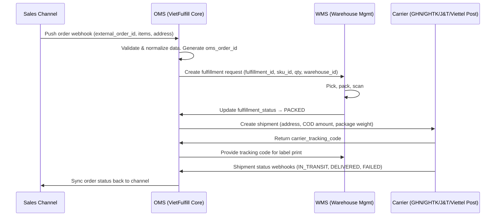

<Warning>
  **Practice Case Study Only.** VietFulfill là công ty fictional. Mọi ID, format, và quy tắc trong tài liệu này không đại diện cho hệ thống thực tế.
</Warning>

## Tổng quan kiến trúc Data Flow

Hệ thống VietFulfill xử lý data theo luồng 4 tầng: từ Sales Channel (nơi đơn hàng phát sinh) → OMS (orchestration layer) → WMS (kho vật lý) → Carrier (vận chuyển đến khách). Mỗi tầng sở hữu một tập trạng thái riêng và có responsibility rõ ràng.

<Info>
  OMS là **single source of truth** cho `order_status`. WMS sở hữu `fulfillment_status`. Carrier sở hữu `shipment_status`. Ba trạng thái này độc lập nhưng có quan hệ phụ thuộc — xem **Status Mapping Matrix** bên dưới.
</Info>

---

## Data Mapping Table

<Note>
  Cột **Required/Optional** đánh giá theo góc nhìn của **Target System** — tức là field đó có bắt buộc phải có khi target nhận data không.
</Note>

### Nhóm 1 — Order Identifiers

| Field Name | Source System | Target System(s) | Required / Optional | Transformation Rule | Validation Rule | Notes |
|---|---|---|---|---|---|---|
| `external_order_id` | Sales Channel | OMS, WMS (read-only) | **Required** | Lưu nguyên giá trị gốc từ channel. OMS parse prefix để xác định channel: `SP-` = Shopee, `TK-` = TikTok Shop, `LZ-` = Lazada, `WEB-` = Website riêng | Không được null. Phải khớp regex `^(SP|TK|LZ|WEB)-\d{6,20}$`. Combination (`external_order_id` + `source_channel`) phải unique trong OMS | Dùng để tra cứu đơn gốc từ channel. Không được sửa đổi sau khi nhận |
| `oms_order_id` | OMS (generated) | WMS, Carrier, Sales Channel | **Required** | OMS tự sinh theo pattern `VF-{YYYY}-{6-digit-sequence}`. Sequence reset mỗi năm | Phải unique toàn hệ thống. Format `^VF-\d{4}-\d{6}$`. WMS và Carrier chỉ đọc, không được ghi | Primary key trong OMS. Dùng trong mọi internal communication |
| `fulfillment_id` | WMS (generated) | OMS | **Required** | WMS tự sinh khi nhận fulfillment request. Pattern `FUL-{YYYYMMDD}-{6-digit-seq}` | Phải unique trong WMS. Format `^FUL-\d{8}-\d{6}$`. Một `oms_order_id` chỉ có đúng 1 `fulfillment_id` active tại một thời điểm | WMS-owned ID. OMS lưu reference để query status WMS |
| `shipment_id` | Carrier (returned) | OMS, WMS | **Required** (sau khi shipment created) | OMS gửi request tạo shipment; Carrier trả về `shipment_id` (internal Carrier ID). OMS lưu cả `shipment_id` và `carrier_tracking_code` | Không null sau khi Carrier confirm | Dùng để query shipment status từ Carrier API. Không hiển thị cho khách hàng |

### Nhóm 2 — Customer & Delivery Information

| Field Name | Source System | Target System(s) | Required / Optional | Transformation Rule | Validation Rule | Notes |
|---|---|---|---|---|---|---|
| `customer_name` | Sales Channel | OMS, WMS, Carrier | **Required** | Trim whitespace đầu/cuối. Giữ nguyên Unicode tiếng Việt (có dấu). Max length 100 ký tự. | Không được null hoặc empty string. Min length 2 ký tự | Tên in trên nhãn vận chuyển. Một số Carrier (GHN) giới hạn 50 ký tự — truncate với `…` nếu vượt |
| `customer_phone` | Sales Channel | OMS, WMS, Carrier | **Required** | 1. Loại bỏ khoảng trắng, dấu `-`, `.`. 2. Nếu bắt đầu bằng `+84` → thay bằng `0`. 3. Nếu bắt đầu `84` (không có `+`) và length = 11 → thay `84` đầu bằng `0`. 4. Kết quả phải có đúng 10 chữ số | Sau normalize: phải khớp regex `^(0[3|5|7|8|9])[0-9]{8}$`. Từ chối nếu không đạt sau 3 bước normalize | Lưu cả giá trị gốc (`customer_phone_raw`) để audit |
| `shipping_address` | Sales Channel | OMS, WMS, Carrier | **Required** | OMS nhận address dạng free-text từ channel. Tách thành 4 phần: `address_line` + `ward` + `district` + `province`. Khi gửi Carrier: concatenate theo format. Một số Carrier yêu cầu structured fields riêng biệt — map từng phần | `address_line` không được null. Tổng concatenated ≤ 200 ký tự | WMS không dùng field này (WMS chỉ quan tâm kho nào — `warehouse_id`) |
| `province_code` | Sales Channel (tên tỉnh) → OMS (lookup) | OMS, WMS, Carrier | **Required** | Channel gửi tên tỉnh dạng free-text. OMS lookup bảng mapping nội bộ → VietFulfill province code. Khi gửi từng Carrier: map thêm sang Carrier-specific code (GHN dùng integer ID, GHTK dùng slug, J&T dùng 2-char code) | Lookup không được ra null — nếu tên tỉnh không match → flag `ADDRESS_REVIEW_REQUIRED`, hold đơn | Bảng mapping cần update khi có thay đổi đơn vị hành chính |
| `district_code` | Sales Channel (tên quận) → OMS (lookup) | OMS, Carrier | **Required** | Tương tự `province_code`. Lookup phải scoped trong `province_code` đã resolve (tránh nhầm quận trùng tên khác tỉnh) | Phải tìm thấy trong `vf_district_master` với `province_code` đúng | Quận/huyện cùng tên có thể ở nhiều tỉnh khác nhau — bắt buộc scoped lookup |
| `ward_code` | Sales Channel (tên phường) → OMS (lookup) | OMS, Carrier | **Optional** (Required với GHN) | Scoped lookup trong `district_code`. Nếu channel không gửi ward → OMS để null; nếu Carrier đích là GHN (bắt buộc ward) → hold đơn, yêu cầu ops bổ sung | Nếu có giá trị: phải tồn tại trong `vf_ward_master` với `district_code` đúng | GHN API reject nếu thiếu `ward_code`. GHTK/J&T/Viettel Post chấp nhận null |

### Nhóm 3 — Product Information

| Field Name | Source System | Target System(s) | Required / Optional | Transformation Rule | Validation Rule | Notes |
|---|---|---|---|---|---|---|
| `sku_id` | Sales Channel | OMS, WMS | **Required** | Channel gửi SKU code theo định danh của channel. OMS lookup bảng `channel_sku_mapping` để resolve về VietFulfill internal `sku_id`. Nếu mapping không tồn tại → reject đơn với error `SKU_NOT_MAPPED` | Sau resolve: phải tồn tại trong `vf_sku_master` với `status = ACTIVE` | Mỗi merchant phải setup channel SKU mapping trước khi go-live |
| `sku_name` | Sales Channel | OMS, WMS (reference only) | **Optional** | Lưu nguyên tên sản phẩm từ channel để reference. WMS in tên này lên picking slip nếu `vf_sku_master.name` bị null | Max 255 ký tự. Trim whitespace | Backup display name. WMS ưu tiên dùng tên từ `vf_sku_master` |
| `quantity` | Sales Channel | OMS, WMS | **Required** | Lấy nguyên giá trị integer từ channel. WMS dùng để determine số lượng cần pick | Phải là integer dương, tối thiểu 1. Max 9999 per line item | Nếu channel gửi decimal (e.g., `2.0`) → OMS cast về integer, log warning |

### Nhóm 4 — Operational Fields

| Field Name | Source System | Target System(s) | Required / Optional | Transformation Rule | Validation Rule | Notes |
|---|---|---|---|---|---|---|
| `warehouse_id` | OMS (routing engine) | WMS | **Required** | OMS tự động assign dựa trên routing rule: ưu tiên kho có tồn kho đủ + gần nhất với `province_code`. HAN001 = kho Hà Nội (miền Bắc), HCM001 = kho TP.HCM (miền Nam & Trung) | Phải là một trong các giá trị active trong `vf_warehouse_master` | Channel không tự chọn kho — routing là internal logic của OMS |
| `payment_method` | Sales Channel | OMS, WMS, Carrier | **Required** | Normalize về 2 giá trị chuẩn: `COD` hoặc `PREPAID`. Mapping: `"cod"`, `"cash_on_delivery"`, `"Thanh toán khi nhận hàng"` → `COD`. `"online"`, `"prepaid"`, `"bank_transfer"`, `"momo"`, `"vnpay"`, `"zalopay"` → `PREPAID`. Giá trị không map được → reject với `PAYMENT_METHOD_UNKNOWN` | Sau normalize: phải là `COD` hoặc `PREPAID` | Carrier cần biết để setup COD collection |
| `cod_amount` | Sales Channel | OMS, Carrier | **Conditional** | Nếu `payment_method = COD`: lấy giá trị từ channel. Nếu `payment_method = PREPAID`: set `cod_amount = 0`. Làm tròn về VND (không có decimal) | Khi COD: phải là số dương, min 1.000 VND, max 50.000.000 VND. Khi PREPAID: phải bằng 0 | OMS không tự tính `cod_amount` — lấy từ channel. Merchant chịu trách nhiệm gửi đúng giá trị |

### Nhóm 5 — Status Fields

| Field Name | Source System | Target System(s) | Required / Optional | Transformation Rule | Validation Rule | Notes |
|---|---|---|---|---|---|---|
| `order_status` | OMS (owned) | Sales Channel (sync back), reporting | **Required** | OMS là owner duy nhất. Status thay đổi dựa trên action từ OMS operator, status update từ WMS, và status update từ Carrier. Xem Status Mapping Matrix | Phải là một trong enum: `PENDING_VALIDATION`, `CONFIRMED`, `FULFILLMENT_REQUESTED`, `IN_FULFILLMENT`, `READY_TO_SHIP`, `SHIPPED`, `DELIVERED`, `DELIVERY_FAILED`, `RETURNED`, `CANCELLED`. State transition phải tuân theo state machine | OMS sync `order_status` về Sales Channel mỗi khi có thay đổi |
| `fulfillment_status` | WMS (owned) | OMS | **Required** (sau khi fulfillment request tạo) | WMS cập nhật `fulfillment_status` theo tiến trình xử lý kho. WMS không được ghi trực tiếp vào `order_status` | Phải là một trong enum WMS: `RECEIVED`, `PROCESSING`, `PICKED`, `PACKED`, `HANDOVER_READY`, `HANDED_TO_CARRIER`, `RETURN_RECEIVED` | WMS push update về OMS qua webhook nội bộ |
| `shipment_status` | Carrier (owned) | OMS | **Required** (sau khi shipment created) | Carrier push webhook về OMS. OMS normalize Carrier-specific status về internal `shipment_status` enum. Mỗi Carrier có status code riêng — xem Status Mapping Matrix | Phải là một trong enum: `CREATED`, `PICKED_UP`, `IN_TRANSIT`, `OUT_FOR_DELIVERY`, `DELIVERED`, `DELIVERY_FAILED`, `RETURNING`, `RETURNED_TO_SENDER` | Carrier status là final authority cho việc giao hàng |

### Nhóm 6 — Tracking & Timestamps

| Field Name | Source System | Target System(s) | Required / Optional | Transformation Rule | Validation Rule | Notes |
|---|---|---|---|---|---|---|
| `carrier_tracking_code` | Carrier (returned) | OMS, WMS, Sales Channel, Customer | **Required** (sau khi shipment created) | Carrier trả về tracking code khi OMS tạo shipment thành công. OMS lưu vào order record và push về WMS (để in label) và Sales Channel | Không được null sau khi Carrier xác nhận tạo shipment. Phải khớp regex tương ứng của từng Carrier | Đây là mã khách hàng dùng để tra cứu trên website Carrier |
| `created_at` | OMS (generated) | OMS, WMS, Reporting | **Required** | OMS tự sinh timestamp ISO 8601 UTC tại thời điểm đơn hàng pass validation | Không được null. Immutable sau khi set. Phải là valid ISO 8601 UTC datetime | Dùng để tính SLA fulfillment |
| `updated_at` | OMS (auto-update) | OMS, Reporting | **Required** | OMS tự động cập nhật mỗi khi bất kỳ field nào trong order record thay đổi. Dùng optimistic locking | Luôn ≥ `created_at`. Không được set thủ công từ application code | Dùng để polling incremental changes |

---

## Carrier Tracking Code Format

| Carrier | Ví dụ Tracking Code | Pattern (Regex) | Độ dài | Ghi chú |
|---|---|---|---|---|
| **GHN** (Giao Hàng Nhanh) | `GHN2026060500012` | `^GHN\d{13}$` | 16 ký tự | Prefix `GHN` + 13 chữ số |
| **GHTK** (Giao Hàng Tiết Kiệm) | `S12345678.GHTK-K1` | `^S\d{8}\.GHTK-[A-Z0-9]{2,6}$` | 14–18 ký tự | Phần sau dấu `.` là hub code |
| **J&T Express** | `JT2026060500456789` | `^JT\d{16}$` | 18 ký tự | Prefix `JT` + 16 chữ số |
| **Viettel Post** | `VT12345678ABCD` | `^VT\d{8}[A-Z]{4}$` | 14 ký tự | Prefix `VT` + 8 chữ số + 4 chữ cái hoa |

<Warning>
  Nếu tracking code nhận từ Carrier không khớp regex, OMS phải: (1) log error với toàn bộ raw response, (2) không lưu tracking code invalid, (3) alert ops team để re-create shipment.
</Warning>

---

## Status Mapping Matrix

### Layer 1 — Sales Channel Status → OMS `order_status`

| Sales Channel | Channel Status (Raw) | OMS `order_status` | Hành động OMS |
|---|---|---|---|
| Shopee | `UNPAID` | `PENDING_VALIDATION` | Hold, chờ payment confirm |
| Shopee | `READY_TO_SHIP` | `CONFIRMED` | Trigger fulfillment request |
| Shopee | `CANCELLED` | `CANCELLED` | Cancel fulfillment nếu chưa PACKED |
| TikTok Shop | `AWAITING_SHIPMENT` | `CONFIRMED` | Trigger fulfillment request |
| TikTok Shop | `CANCELLED` | `CANCELLED` | Cancel fulfillment nếu chưa PACKED |
| Lazada | `pending` | `PENDING_VALIDATION` | Hold, chờ Lazada xác nhận |
| Lazada | `ready_to_ship` | `CONFIRMED` | Trigger fulfillment request |
| Lazada | `canceled` | `CANCELLED` | Cancel fulfillment nếu chưa PACKED |
| Website | `payment_received` | `CONFIRMED` | Trigger fulfillment request ngay |

### Layer 2 — OMS `order_status` ↔ WMS `fulfillment_status`

| OMS `order_status` | Event Trigger | WMS `fulfillment_status` | Chiều mapping |
|---|---|---|---|
| `FULFILLMENT_REQUESTED` | OMS gửi request lên WMS | `RECEIVED` | OMS → WMS |
| `IN_FULFILLMENT` | WMS bắt đầu pick hàng | `PROCESSING` → `PICKED` | WMS → OMS |
| `IN_FULFILLMENT` | WMS đóng gói xong | `PACKED` | WMS → OMS |
| `READY_TO_SHIP` | WMS sẵn sàng bàn giao | `HANDOVER_READY` | WMS → OMS |
| `SHIPPED` | WMS bàn giao cho Carrier | `HANDED_TO_CARRIER` | WMS → OMS |
| `RETURNED` | WMS nhận hàng hoàn | `RETURN_RECEIVED` | WMS → OMS |

### Layer 3 — Carrier `shipment_status` Mapping

| Carrier `shipment_status` (internal) | GHN Raw | GHTK Raw | J&T Raw | Viettel Post Raw | OMS `order_status` update |
|---|---|---|---|---|---|
| `CREATED` | `"ready_to_pick"` | `"picking"` | `"CREATED"` | `"SHIPMENT_CREATED"` | Không đổi (`SHIPPED`) |
| `PICKED_UP` | `"picking"` | `"picked"` | `"PICK_UP_SUCCESS"` | `"PICKED"` | Không đổi (`SHIPPED`) |
| `IN_TRANSIT` | `"transporting"` | `"transporting"` | `"IN_TRANSIT"` | `"IN_TRANSIT"` | Không đổi (`SHIPPED`) |
| `OUT_FOR_DELIVERY` | `"delivering"` | `"delivering"` | `"OUT_FOR_DELIVERY"` | `"DELIVERING"` | Không đổi (`SHIPPED`) |
| `DELIVERED` | `"delivered"` | `"delivered"` | `"DELIVERED"` | `"DELIVERED"` | `DELIVERED` |
| `DELIVERY_FAILED` | `"delivery_fail"` | `"failed_delivery"` | `"DELIVERY_FAIL"` | `"DELIVERY_FAILED"` | `DELIVERY_FAILED` |
| `RETURNING` | `"return"` | `"returning"` | `"RETURN_IN_TRANSIT"` | `"RETURNING"` | `DELIVERY_FAILED` (giữ nguyên) |
| `RETURNED_TO_SENDER` | `"returned"` | `"returned"` | `"RETURNED"` | `"RETURNED_SENDER"` | `RETURNED` |

---

## Data Quality Rules

### 1. Completeness Checks — Mandatory Fields

OMS chạy completeness check ngay sau khi nhận webhook từ Sales Channel, trước khi insert vào database. Đơn hàng fail bất kỳ check nào sẽ bị **reject**.

| Field | Check | Error Code nếu fail |
|---|---|---|
| `external_order_id` | Không null, không empty string | `ERR_MISSING_ORDER_ID` |
| `customer_name` | Không null, length ≥ 2 | `ERR_MISSING_CUSTOMER_NAME` |
| `customer_phone` | Không null, pass phone normalization | `ERR_INVALID_PHONE` |
| `shipping_address.address_line` | Không null, không empty | `ERR_MISSING_ADDRESS` |
| `province_code` (tên tỉnh) | Không null, lookup thành công | `ERR_UNKNOWN_PROVINCE` |
| `sku_id` (ít nhất 1 line item) | Có ít nhất 1 SKU, lookup thành công | `ERR_NO_SKU` hoặc `ERR_SKU_NOT_MAPPED` |
| `quantity` (mỗi line item) | Integer dương ≥ 1 | `ERR_INVALID_QUANTITY` |
| `payment_method` | Normalize thành công về COD/PREPAID | `ERR_PAYMENT_METHOD_UNKNOWN` |
| `cod_amount` (khi COD) | Số dương, trong giới hạn Carrier | `ERR_INVALID_COD_AMOUNT` |

### 2. Format Validation Rules

**Phone Number:**
- Sau normalize: phải khớp `^(03|05|07|08|09)\d{8}$`
- Log cả giá trị raw (`customer_phone_raw`) và giá trị sau normalize (`customer_phone`)

**Monetary Amount:**
- `cod_amount` phải là integer (VND không có decimal)
- Min: 1.000 VND. Max: 50.000.000 VND
- Nếu channel gửi float → round về integer, log warning

**Datetime:**
- `created_at`, `updated_at` phải là ISO 8601 UTC
- `channel_order_created_at` được phép là timezone khác nhưng OMS convert về UTC khi lưu

**Text Fields:**
- `customer_name`: strip whitespace, collapse multiple spaces thành 1 space
- `sku_name`: strip whitespace, max 255 ký tự, truncate nếu vượt (không reject)

### 3. Referential Integrity Rules

**SKU Integrity:**
- Sau khi resolve `sku_id`: phải tồn tại trong `vf_sku_master` với `status = ACTIVE`
- SKU với `status = SUSPENDED` → reject đơn, error `SKU_SUSPENDED`
- Nếu SKU là bundle: tất cả component SKU phải ACTIVE

**Address Integrity:**
- `district_code` phải thuộc `province_code` đã resolve (scoped lookup)
- `ward_code` (nếu có) phải thuộc `district_code` đã resolve

**Warehouse Integrity:**
- `warehouse_id` phải tồn tại trong `vf_warehouse_master` với `status = OPERATIONAL`

**COD Integrity:**
- Nếu `payment_method = PREPAID` nhưng `cod_amount > 0` → override `cod_amount = 0`, log warning
- Nếu `payment_method = COD` nhưng `cod_amount = 0` → reject, error `COD_AMOUNT_REQUIRED`

### 4. Deduplication Rules

**Primary Deduplication Key:** Combination `(external_order_id, source_channel)` phải unique trong bảng `oms_orders`.

**Deduplication Flow:**
1. Khi nhận webhook, OMS query record với combination trên
2. Nếu tìm thấy record cũ với `order_status NOT IN ('CANCELLED', 'RETURNED')` → reject với `ERR_DUPLICATE_ORDER`
3. Nếu tìm thấy record với `order_status IN ('CANCELLED', 'RETURNED')` → cho phép tạo lại (re-order), link `previous_order_id`
4. Nếu không tìm thấy → insert mới bình thường

**Idempotency cho Carrier Webhooks:**
- Carrier có thể gửi duplicate webhook (at-least-once delivery)
- OMS dedup Carrier webhook bằng `(carrier_tracking_code, shipment_status, carrier_event_timestamp)` — nếu combination đã xử lý → idempotent ignore, return 200 OK

**Deduplication Window:**
- Duplicate check cho `external_order_id`: không có time window — check toàn bộ history (trừ CANCELLED/RETURNED)
- Carrier webhook dedup window: 72 giờ

