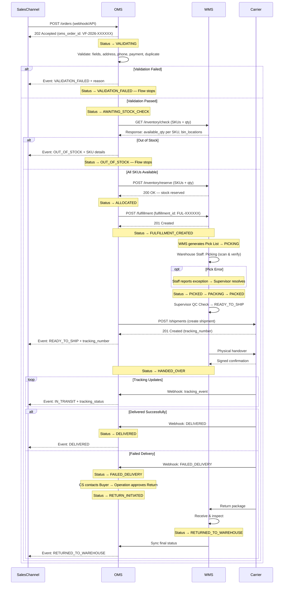

<Note>
**Practice Case Study** — VietFulfill là công ty 3PL fictional. Tài liệu này được tạo cho mục đích luyện tập BA.
</Note>

## Overview

VietFulfill vận hành theo mô hình 3PL (Third-Party Logistics), tiếp nhận đơn hàng từ nhiều Sales Channel (Shopee, TikTok Shop, Lazada, Website của Seller) thông qua OMS (Order Management System), sau đó điều phối WMS (Warehouse Management System) để thực hiện các bước picking, packing, và bàn giao hàng cho Carrier. Toàn bộ luồng được thiết kế để đảm bảo tính trung thực của tồn kho, khả năng trace từng đơn hàng theo `oms_order_id` (format `VF-2026-XXXXXX`), và đồng bộ trạng thái real-time về phía Seller.

Flow end-to-end bao gồm hai trục chính: **Order Intake & Validation** (OMS xử lý) và **Physical Fulfillment** (WMS và Warehouse Staff thực hiện). Hai trục này được liên kết qua Fulfillment Request, trong khi Carrier đảm nhận phần vận chuyển cuối và trả tracking status về OMS để OMS đồng bộ lên Sales Channel. Mọi exception — từ validation failed, out of stock, đến failed delivery — đều có nhánh xử lý riêng với actor chịu trách nhiệm được xác định rõ.

---

## Core Flow — Business Flow

Dưới đây là 16 bước của luồng fulfillment chuẩn (happy path + các decision point chính):

1. **Sales Channel → OMS:** Sales Channel (Shopee / TikTok Shop / Lazada / Website) gửi order event qua webhook hoặc API call vào OMS. Payload bao gồm: danh sách SKU, số lượng, địa chỉ giao hàng, số điện thoại người nhận, phương thức thanh toán, và order ID phía Sales Channel. OMS sinh `oms_order_id` (format `VF-2026-XXXXXX`) và chuyển trạng thái đơn sang `ORDER_CREATED`.

2. **OMS validate order data:** OMS thực hiện bước validation ngay khi nhận order. Trạng thái chuyển sang `VALIDATING`. Các rule validation gồm: định dạng dữ liệu (required fields, data types), địa chỉ giao hàng nằm trong vùng phục vụ, số điện thoại hợp lệ (Việt Nam), phương thức thanh toán được hỗ trợ, và kiểm tra duplicate order (theo order ID phía Channel + khoảng thời gian).

3. **OMS check validation result:** Nếu bất kỳ rule nào fail, OMS chuyển trạng thái sang `VALIDATION_FAILED`, ghi log lý do chi tiết, và gửi notification về Sales Channel để Seller xử lý. Flow dừng tại đây cho đến khi được retry hoặc cancel. Nếu pass toàn bộ, trạng thái chuyển sang `AWAITING_STOCK_CHECK`.

4. **OMS → WMS: Inventory Check Request:** OMS gửi request sang WMS kèm danh sách SKU và số lượng cần kiểm tra. WMS truy vấn available stock (tổng tồn kho khả dụng = tồn kho vật lý − số lượng đã reserved cho các đơn đang xử lý).

5. **WMS → OMS: Available Stock Response:** WMS trả về kết quả cho từng SKU: số lượng available, vị trí lưu kho (bin/rack), và cảnh báo nếu stock thấp hơn ngưỡng. OMS nhận response và quyết định bước tiếp theo.

6. **OMS allocate stock (reserved):** Nếu tất cả SKU đủ hàng, OMS ra lệnh WMS reserved số lượng tương ứng — các unit này bị lock khỏi available pool để tránh oversell. Trạng thái đơn chuyển sang `ALLOCATED`. Nếu bất kỳ SKU nào thiếu hàng, trạng thái chuyển sang `OUT_OF_STOCK` và OMS notify Seller để xử lý (restock hoặc cancel).

7. **OMS tạo Fulfillment Request → WMS:** OMS sinh `fulfillment_id` (format `FUL-XXXXXX`) và gửi Fulfillment Request sang WMS. Request chứa: `oms_order_id`, `fulfillment_id`, danh sách SKU + số lượng + bin location, địa chỉ giao hàng, Carrier được chỉ định (GHN / GHTK / J&T / Viettel Post), và SLA deadline. Trạng thái đơn chuyển sang `FULFILLMENT_CREATED`.

8. **WMS tạo Pick List:** WMS tổng hợp Fulfillment Request và sinh Pick List cho Warehouse Staff. Pick List được optimize theo bin location (nhóm các item gần nhau về mặt vật lý) để giảm thời gian di chuyển trong kho. Trạng thái chuyển sang `PICKING`.

9. **Warehouse Staff thực hiện Picking:** Warehouse Staff nhận Pick List (trên device/PDA hoặc bản in), đến từng bin location, scan barcode/QR để xác nhận đúng SKU và số lượng. Nếu phát sinh lỗi (sai SKU, thiếu hàng tại bin), Staff báo cáo exception lên Warehouse Supervisor.

10. **Warehouse Staff thực hiện Packing:** Sau khi picking hoàn tất và đã verify, Staff chuyển sang bước packing: lựa chọn loại thùng/túi phù hợp, đóng gói theo quy chuẩn (chèn đệm nếu cần, dán nhãn địa chỉ, in shipping label từ WMS). Trạng thái chuyển sang `PACKING` → `PACKED`.

11. **Warehouse Supervisor xác nhận Ready-to-Ship:** Supervisor thực hiện QC spot-check (kiểm tra ngẫu nhiên hoặc 100% tùy SLA tier): đối chiếu shipping label với order, kiểm tra trọng lượng, tình trạng đóng gói. Sau khi approve, trạng thái chuyển sang `READY_TO_SHIP`. Nếu có lỗi, package được gửi lại bước packing để xử lý.

12. **System tạo Shipment với Carrier:** OMS/WMS gọi API của Carrier (GHN / GHTK / J&T / Viettel Post) để tạo shipment, nhận về `shipment_id` (carrier tracking number). Thông tin tracking được lưu vào order record và sync về Sales Channel. Trạng thái đơn chuyển sang `HANDED_OVER` sau khi Carrier xác nhận tiếp nhận.

13. **Carrier nhận bàn giao package:** Carrier đến kho VietFulfill pickup (theo lịch cố định hoặc on-demand). Warehouse Staff scan từng package khi bàn giao, Carrier ký xác nhận bàn giao. WMS ghi nhận timestamp handover. Trạng thái chuyển sang `HANDED_OVER`.

14. **Carrier cập nhật tracking status về OMS:** Trong quá trình vận chuyển, Carrier push tracking events về OMS qua webhook/API (ví dụ: picked up, in transit, out for delivery, delivery attempted). OMS nhận, lưu vào tracking log, cập nhật trạng thái sang `IN_TRANSIT`, và đẩy update về Sales Channel để Buyer theo dõi.

15. **Delivered hoặc Failed Delivery:** Khi Carrier hoàn thành delivery attempt: nếu thành công (Buyer ký nhận), trạng thái đơn chuyển sang `DELIVERED` — OMS ghi nhận thời gian giao hàng thực tế và đồng bộ về Sales Channel. Nếu thất bại (không liên lạc được Buyer, sai địa chỉ, Buyer từ chối nhận), trạng thái chuyển sang `FAILED_DELIVERY`.

16. **Failed Delivery → CS/Operation xử lý Return → WMS sync:** CS nhận alert khi đơn vào trạng thái `FAILED_DELIVERY`. CS liên hệ Buyer để xác minh; nếu không giải quyết được, Operation Manager phê duyệt Return. Trạng thái chuyển sang `RETURN_INITIATED`. Carrier vận chuyển hàng về kho VietFulfill; khi WMS nhận hàng và kiểm tra xong, trạng thái chuyển sang `RETURNED_TO_WAREHOUSE`. WMS cập nhật lại tồn kho (unreserve + nhập lại nếu còn dùng được) và đồng bộ final status về Sales Channel cho Seller xử lý hoàn tiền / tái bán.

---

## Swimlane Flowchart

```mermaid
flowchart LR
    subgraph SELLER["Seller / Sales Channel"]
        A([Order Placed]) --> B[Send Order Webhook/API]
        Z1([Receive VALIDATION_FAILED])
        Z2([Receive OUT_OF_STOCK])
        Z_END([Receive Final Status\nDELIVERED / RETURNED])
    end

    subgraph OMS_SYS["OMS"]
        C[Generate oms_order_id\nStatus: ORDER_CREATED]
        D{Validate Order\nStatus: VALIDATING}
        E[Status: VALIDATION_FAILED\nNotify Seller]
        F[Status: AWAITING_STOCK_CHECK\nSend Stock Check to WMS]
        G{Stock\nAvailable?}
        H[Status: OUT_OF_STOCK\nNotify Seller]
        I[Allocate Stock — Reserved\nStatus: ALLOCATED]
        J[Create Fulfillment Request\nfulfillment_id: FUL-XXXXXX\nStatus: FULFILLMENT_CREATED]
        N[Create Shipment via Carrier API\nReceive shipment_id]
        O[Receive Tracking Events\nStatus: IN_TRANSIT]
        P{Delivery\nOutcome?}
        Q[Status: DELIVERED\nSync to Sales Channel]
        R[Status: FAILED_DELIVERY\nAlert CS]
    end

    subgraph WMS_SYS["WMS / Warehouse"]
        K1[Return Available Stock\nper SKU]
        K2[Reserve Stock in WMS]
        L[Create Pick List\nStatus: PICKING]
        M1[Warehouse Staff: Picking\nScan & Verify SKU]
        M2{Pick\nError?}
        M3[Report Exception\nto Supervisor]
        M4[Warehouse Staff: Packing\nStatus: PACKING → PACKED]
        M5[Supervisor QC Check\nStatus: READY_TO_SHIP]
        M6{QC\nPass?}
        M7[Repack / Fix Error]
        M8[Scan & Handover to Carrier\nStatus: HANDED_OVER]
        W1[Receive Return from Carrier\nStatus: RETURNED_TO_WAREHOUSE]
        W2[Inspect & Restock\nUpdate Inventory]
    end

    subgraph CARRIER_SYS["Carrier\nGHN / GHTK / J&T / Viettel Post"]
        CAR1[Pickup from Warehouse]
        CAR2[In Transit\nPush Tracking Events]
        CAR3{Delivery\nSuccess?}
        CAR4[Delivered\nBuyer Signed]
        CAR5[Failed Delivery\nReturn to Warehouse]
    end

    subgraph CS_SYS["CS / Operation"]
        CS1[CS Contact Buyer\nVerify Issue]
        CS2{Resolved?}
        CS3[Close — Redeliver\nor Reschedule]
        CS4[Operation Approve Return\nStatus: RETURN_INITIATED]
    end

    B --> C
    C --> D
    D -->|Fail| E
    E --> Z1
    D -->|Pass| F
    F --> K1
    K1 --> G
    G -->|No| H
    H --> Z2
    G -->|Yes| K2
    K2 --> I
    I --> J
    J --> L
    L --> M1
    M1 --> M2
    M2 -->|Yes| M3
    M3 --> M1
    M2 -->|No| M4
    M4 --> M5
    M5 --> M6
    M6 -->|No| M7
    M7 --> M4
    M6 -->|Yes| N
    N --> M8
    M8 --> CAR1
    CAR1 --> CAR2
    CAR2 --> O
    O --> CAR3
    CAR3 -->|Yes| CAR4
    CAR4 --> P
    P -->|Delivered| Q
    Q --> Z_END
    CAR3 -->|No| CAR5
    CAR5 --> R
    R --> CS1
    CS1 --> CS2
    CS2 -->|Yes| CS3
    CS3 --> Z_END
    CS2 -->|No| CS4
    CS4 --> W1
    W1 --> W2
    W2 --> Z_END
```

---

## Sequence Diagram — High-Level System Interactions

---

## Exception Paths

Dưới đây là 5 exception path chính cần được handle trong implementation:

- **Validation Failed:** OMS nhận order nhưng data không hợp lệ → `VALIDATION_FAILED`. Seller cần sửa data và retry. Không có stock nào bị lock. Actor: Seller (sửa) + System Admin (nếu lỗi config).

- **Out of Stock:** Validation pass nhưng WMS xác nhận thiếu hàng → `OUT_OF_STOCK`. OMS không partial-reserve (atomic check). Seller có thể restock rồi retry, hoặc cancel. Actor: Operation Manager + Seller.

- **Pick/Pack Error:** Picker phát hiện sai SKU hoặc thiếu hàng tại bin → Exception. Supervisor điều tra: tìm hàng đúng → tiếp tục pick; không tìm được → escalate, có thể chuyển `EXCEPTION`. Actor: Warehouse Supervisor + Operation Manager.

- **Carrier Pickup Failed:** Carrier không đến lấy đúng hẹn hoặc từ chối nhận → WMS giữ package ở `READY_TO_SHIP`. OMS alert Operation Manager để reschedule hoặc đổi carrier. Actor: Operation Manager + CS.

- **Failed Delivery → Return:** Carrier giao thất bại sau 2–3 lần → `FAILED_DELIVERY`. CS liên hệ Buyer; nếu không resolve → Operation Manager approve Return → `RETURN_INITIATED` → hàng về kho → `RETURNED_TO_WAREHOUSE`. Actor: CS + Operation Manager + Warehouse Staff + Seller.

---

## Status Transition Summary

| Bước trong Flow | Status chuyển sang | Actor trigger |
|---|---|---|
| OMS nhận order từ Sales Channel | `ORDER_CREATED` | System (OMS) |
| OMS bắt đầu validate data | `VALIDATING` | System (OMS) |
| Validation fail ít nhất 1 rule | `VALIDATION_FAILED` | System (OMS) |
| Validation pass, gửi stock check | `AWAITING_STOCK_CHECK` | System (OMS) |
| WMS xác nhận đủ hàng, reserve stock | `ALLOCATED` | System (OMS + WMS) |
| Bất kỳ SKU nào thiếu hàng | `OUT_OF_STOCK` | System (WMS → OMS) |
| OMS gửi Fulfillment Request sang WMS | `FULFILLMENT_CREATED` | System (OMS) |
| WMS tạo Pick List, assign Staff | `PICKING` | System (WMS) |
| Staff hoàn thành scan & verify picking | `PICKED` | Warehouse Staff |
| Staff bắt đầu đóng gói | `PACKING` | Warehouse Staff |
| Staff hoàn thành packing | `PACKED` | Warehouse Staff |
| Supervisor QC pass, approve shipment | `READY_TO_SHIP` | Warehouse Supervisor |
| WMS scan bàn giao, Carrier xác nhận | `HANDED_OVER` | Warehouse Staff + Carrier |
| Carrier push tracking event in-transit | `IN_TRANSIT` | System (Carrier webhook → OMS) |
| Carrier xác nhận giao hàng thành công | `DELIVERED` | System (Carrier webhook → OMS) |
| Carrier báo giao hàng thất bại | `FAILED_DELIVERY` | System (Carrier webhook → OMS) |
| Operation Manager approve return | `RETURN_INITIATED` | Operation Manager |
| WMS nhận hàng hoàn từ Carrier | `RETURNED_TO_WAREHOUSE` | Warehouse Staff |
| Seller / Admin hủy đơn trước handover | `CANCELLED` | Seller / System Admin |
| Sự cố không thuộc exception path chuẩn | `EXCEPTION` | System / Operation Manager |
