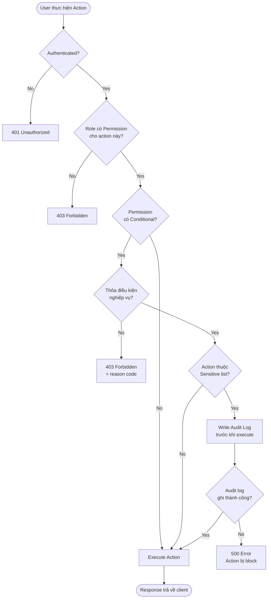

<Info>
  **Practice Case Study — VietFulfill (Fictional 3PL)**
  Tài liệu này được xây dựng phục vụ mục đích học tập và thực hành BA. VietFulfill là công ty 3PL hư cấu đặt tại Việt Nam.
</Info>

## Overview

Trong hệ thống logistics tích hợp OMS và WMS, dữ liệu vận hành trải rộng qua nhiều bên: **seller**, **nhân viên kho**, **đội vận hành**, và **carrier**. Mỗi actor có nhu cầu truy cập khác nhau — và việc cấp quyền sai có thể dẫn đến:

- Seller xem được đơn hàng của đối thủ cạnh tranh (data leak)
- Nhân viên kho tự ý hủy đơn sau khi đã picking, gây sai lệch tồn kho
- Dữ liệu xuất report bị lấy ra ngoài mà không có audit trail
- Override status thủ công mà không có người phê duyệt

### Nguyên tắc thiết kế

| Nguyên tắc | Mô tả |
|---|---|
| **Least Privilege** | Mỗi role chỉ được cấp đúng quyền cần thiết để hoàn thành công việc |
| **Action-Based Permissions** | Phân quyền theo hành động cụ thể (view, create, cancel, resolve...) |
| **Audit Trail** | Các sensitive actions bắt buộc ghi log: actor, timestamp, trạng thái trước/sau, lý do |
| **Conditional Access** | Một số quyền chỉ được phép khi thỏa điều kiện nghiệp vụ |
| **Separation of Duties** | Người tạo exception không phải người resolve; người request cancel không phải người approve |

---

## Roles

### 1. Operation Manager
Quản lý vận hành toàn diện. Có quyền xem toàn bộ dữ liệu hệ thống, phê duyệt các thay đổi lớn (hủy đơn sau picking, override status), theo dõi KPI qua dashboard, và xuất báo cáo. Là người chịu trách nhiệm cuối cùng về SLA và exception resolution ở mức cao nhất.

### 2. Warehouse Supervisor
Quản lý hoạt động tại kho. Phân công task cho Warehouse Staff, approve exception phát sinh trong fulfillment, xử lý yêu cầu hủy đơn sau khi đã bắt đầu picking. Có quyền truy cập các luồng exception liên quan đến kho.

### 3. Warehouse Staff
Thực hiện các thao tác vật lý tại kho: picking, packing, handover cho carrier. Cập nhật trạng thái fulfillment theo task được giao. Quyền hạn giới hạn trong phạm vi task được assign.

### 4. Customer Service (CS)
Tra cứu thông tin đơn hàng để hỗ trợ seller và end-customer. Tạo return/exchange request, xử lý khiếu nại, tạo exception liên quan đến thông tin giao hàng. Không có quyền thay đổi trạng thái kho hay override order status.

### 5. Seller
Đối tác bán hàng sử dụng dịch vụ fulfillment. Chỉ xem được đơn hàng của chính mình (theo `seller_id`). Có thể request cancel đơn trước khi picking bắt đầu. Không có quyền truy cập dữ liệu vận hành kho.

### 6. System Admin
Quản trị hệ thống toàn quyền. Tạo/sửa/khóa tài khoản người dùng, gán và thu hồi role, cấu hình carrier integration, thiết lập SLA rules. Không thực hiện nghiệp vụ fulfillment trực tiếp.

---

## RBAC Permission Matrix

<Note>
  **Ký hiệu:** ✅ = Allowed | ❌ = Denied | 🔒 = Conditional (chỉ được phép khi thỏa điều kiện — xem mục **Conditional Permission Details**)
</Note>

| # | Permission | Operation Manager | Warehouse Supervisor | Warehouse Staff | Customer Service | Seller | System Admin |
|---|---|:---:|:---:|:---:|:---:|:---:|:---:|
| 1 | View all orders | ✅ | ✅ | ❌ | ✅ | ❌ | ✅ |
| 2 | View own seller orders only | ✅ | ✅ | ❌ | ✅ | 🔒 | ✅ |
| 3 | Create order (API/portal) | ✅ | ❌ | ❌ | ❌ | ✅ | ✅ |
| 4 | Cancel order — before PICKING | ✅ | ✅ | ❌ | ✅ | 🔒 | ✅ |
| 5 | Cancel order — after PICKING | ✅ | 🔒 | ❌ | ❌ | ❌ | ❌ |
| 6 | Create fulfillment request | ✅ | ✅ | ❌ | ❌ | ✅ | ✅ |
| 7 | Start picking task | ✅ | ✅ | 🔒 | ❌ | ❌ | ❌ |
| 8 | Confirm picked | ✅ | ✅ | 🔒 | ❌ | ❌ | ❌ |
| 9 | Confirm packed | ✅ | ✅ | 🔒 | ❌ | ❌ | ❌ |
| 10 | Mark ready to ship | ✅ | ✅ | 🔒 | ❌ | ❌ | ❌ |
| 11 | Confirm handover to carrier | ✅ | ✅ | ✅ | ❌ | ❌ | ❌ |
| 12 | Update shipment status (carrier webhook) | ✅ | ❌ | ❌ | ❌ | ❌ | ✅ |
| 13 | View exception queue | ✅ | ✅ | ✅ | 🔒 | ❌ | ✅ |
| 14 | Create exception | ✅ | ✅ | ✅ | ✅ | ❌ | ❌ |
| 15 | Update exception reason | ✅ | ✅ | 🔒 | 🔒 | ❌ | ❌ |
| 16 | Resolve exception | ✅ | 🔒 | ❌ | 🔒 | ❌ | ❌ |
| 17 | Escalate exception | ✅ | ✅ | ✅ | ✅ | ❌ | ❌ |
| 18 | View operation dashboard | ✅ | ✅ | ❌ | ❌ | ❌ | ✅ |
| 19 | Export report / data | ✅ | 🔒 | ❌ | ❌ | 🔒 | ✅ |
| 20 | Manage user accounts & roles | ❌ | ❌ | ❌ | ❌ | ❌ | ✅ |
| 21 | Configure carrier integration | ❌ | ❌ | ❌ | ❌ | ❌ | ✅ |
| 22 | Configure SLA rules | 🔒 | ❌ | ❌ | ❌ | ❌ | ✅ |
| 23 | View audit log | ✅ | ❌ | ❌ | ❌ | ❌ | ✅ |
| 24 | Override order status (manual) | 🔒 | ❌ | ❌ | ❌ | ❌ | ❌ |
| 25 | Approve cancel request (Seller sau PICKING) | ✅ | 🔒 | ❌ | ❌ | ❌ | ❌ |

---

## Conditional Permission Details

### Perm #2 — View own seller orders only (Seller)

> **Seller chỉ được xem đơn hàng có `seller_id` khớp với tài khoản đang đăng nhập.**

- Query filter bắt buộc: `WHERE seller_id = :current_user_seller_id`
- Direct URL access đến đơn của seller khác → trả về `403 Forbidden`, không phải `404`
- API phải enforce filter ở backend — không được tin vào filter từ phía client

---

### Perm #4 — Cancel order before PICKING (Seller)

> **Seller chỉ được cancel đơn của chính mình, và chỉ khi đơn chưa chuyển sang PICKING.**

| Điều kiện | Giá trị chấp nhận |
|---|---|
| Ownership | `order.seller_id == current_user.seller_id` |
| Order status | `PENDING`, `CONFIRMED`, `AWAITING_FULFILLMENT` |
| Order status bị từ chối | `PICKING`, `PICKED`, `PACKING`, `PACKED`, `READY_TO_SHIP`, `SHIPPED`, `DELIVERED` |

---

### Perm #5 — Cancel order after PICKING (Warehouse Supervisor)

> **Chỉ Warehouse Supervisor được cancel sau khi đơn đã bắt đầu picking, và chỉ sau khi nhận được yêu cầu chính thức từ CS hoặc Operation Manager.**

**Quy trình bắt buộc:**
1. Seller request cancel → CS/Operation xác nhận lý do → Supervisor thực hiện cancel → Audit log ghi nhận
2. Supervisor không tự khởi tạo cancel — phải có cancel request đang `PENDING_APPROVAL`
3. Sau khi cancel: hệ thống tự động trigger **reverse picking task** để hoàn trả hàng về vị trí kho
4. Bắt buộc điền `cancel_reason` và `authorized_by` trước khi confirm

<Warning>
  Warehouse Supervisor **không có quyền** cancel đơn nếu đơn đã ở trạng thái `SHIPPED`. Trường hợp này phải leo thang lên Operation Manager và xử lý qua luồng recall/return với carrier.
</Warning>

---

### Perm #7, #8, #9, #10 — Warehouse Staff picking/packing actions

> **Warehouse Staff chỉ được thực hiện action trên task được assign cho chính mình.**

- Điều kiện: `task.assigned_to == current_user.id`
- Staff không thể bắt đầu picking task của người khác, kể cả khi task đang `OPEN`
- Supervisor có thể re-assign task; sau khi re-assign, người mới có quyền thực hiện
- Nếu Staff cố truy cập task không được assign → `403 Forbidden` + ghi log attempt

---

### Perm #13 — View exception queue (Customer Service)

> **CS chỉ xem được exception thuộc các category liên quan đến thông tin giao hàng.**

| Exception Category | CS được xem? |
|---|---|
| `WRONG_ADDRESS` | ✅ |
| `INVALID_PHONE` | ✅ |
| `CUSTOMER_UNAVAILABLE` | ✅ |
| `RETURN_REQUESTED` | ✅ |
| `CARRIER_LOST` | ✅ |
| `DAMAGED_ITEM` | ❌ (Warehouse Supervisor scope) |
| `MISSING_ITEM` | ❌ (Warehouse Supervisor scope) |
| `WRONG_ITEM_PICKED` | ❌ (Warehouse Supervisor scope) |

---

### Perm #15 — Update exception reason

> **Mỗi role chỉ được update exception reason trong scope của mình.**

- **Warehouse Staff**: chỉ update reason cho exception do chính mình tạo, và chỉ khi exception còn ở `OPEN`
- **Customer Service**: chỉ update reason cho exception thuộc category giao hàng, status `OPEN` hoặc `IN_PROGRESS`
- Sau khi exception được `RESOLVED`, không ai được update reason

---

### Perm #16 — Resolve exception

> **Phạm vi resolve exception phân theo loại exception và role.**

| Exception Category | Người được Resolve |
|---|---|
| Thông tin giao hàng (`WRONG_ADDRESS`, `INVALID_PHONE`, `CUSTOMER_UNAVAILABLE`) | Customer Service |
| Vật lý tại kho (`DAMAGED_ITEM`, `MISSING_ITEM`, `WRONG_ITEM_PICKED`) | Warehouse Supervisor |
| Carrier (`CARRIER_LOST`, `DELIVERY_FAILED_REPEAT`) | Operation Manager |
| Tất cả các loại | Operation Manager |

Điều kiện bổ sung: Exception phải ở trạng thái `OPEN` hoặc `IN_PROGRESS`. Bắt buộc điền `resolution_note`.

---

### Perm #19 — Export report / data

> **Quyền export bị giới hạn theo scope dữ liệu.**

- **Warehouse Supervisor**: chỉ export báo cáo kho — không export dữ liệu đơn hàng raw
- **Seller**: chỉ export dữ liệu đơn hàng của `seller_id` của mình. Rate-limit: tối đa **10 lần/ngày**
- Mọi export action đều được ghi audit log

---

### Perm #22 — Configure SLA rules (Operation Manager)

> **Operation Manager được phép đề xuất thay đổi SLA rules, nhưng thay đổi phải được System Admin activate.**

- Operation Manager có quyền **draft** và **submit** SLA rule change request
- System Admin review và **activate** — ngăn ngừa thay đổi SLA đơn phương

---

### Perm #24 — Override order status (manual)

> **Operation Manager được override order status trong các trường hợp ngoại lệ, nhưng phải qua bước xác nhận 2 lớp.**

1. Phải điền `override_reason` bắt buộc
2. Hệ thống gửi confirmation prompt — OM phải confirm lần 2
3. Không được override từ trạng thái terminal sang trạng thái khác mà không có escalation ticket
4. Toàn bộ action ghi audit log chi tiết

<Warning>
  Override order status là action có rủi ro cao nhất trong hệ thống. Mọi override phải có lý do hợp lệ và có thể bị review bởi System Admin trong audit log.
</Warning>

---

### Perm #25 — Approve cancel request sau PICKING

> **Operation Manager approve mọi cancel request sau picking. Warehouse Supervisor chỉ approve nếu được Operation Manager ủy quyền cho ca trực cụ thể.**

| Actor | Điều kiện approve |
|---|---|
| Operation Manager | Luôn được phép |
| Warehouse Supervisor | Chỉ khi OM đã tạo `delegation_record` cho ca trực hiện tại |

---

## Sensitive Actions & Audit Requirements

| # | Sensitive Action | Role có thể thực hiện | Audit Fields bắt buộc |
|---|---|---|---|
| 1 | Override order status (manual) | Operation Manager | `actor`, `order_id`, `previous_status`, `new_status`, `override_reason`, `timestamp`, `ip_address` |
| 2 | Cancel order after PICKING | Warehouse Supervisor | `actor`, `order_id`, `cancel_reason`, `authorized_by`, `timestamp`, `fulfillment_stage_at_cancel` |
| 3 | Resolve exception | CS / Warehouse Supervisor / Operation Manager | `actor`, `exception_id`, `exception_category`, `resolution_note`, `timestamp`, `related_order_id` |
| 4 | Manage user roles (assign/revoke) | System Admin | `actor`, `target_user_id`, `role_before`, `role_after`, `timestamp`, `reason` |
| 5 | Export data | Operation Manager / Warehouse Supervisor / Seller | `actor`, `export_type`, `filter_params`, `record_count`, `timestamp`, `file_id` |
| 6 | Configure SLA rules | System Admin (activate) / Operation Manager (draft) | `actor`, `rule_id`, `rule_before`, `rule_after`, `submitted_by`, `activated_by`, `timestamp` |
| 7 | Approve cancel request (Seller sau PICKING) | Operation Manager / Warehouse Supervisor | `actor`, `cancel_request_id`, `order_id`, `approved_by`, `delegation_record_id`, `timestamp` |

<Note>
  Audit log được lưu trữ tối thiểu **24 tháng** và không được phép xóa bởi bất kỳ role nào kể cả System Admin.
</Note>

---

## Access Control Flow



<Info>
  **Audit-before-execute pattern:** Với sensitive actions, audit log được ghi **trước** khi action được thực thi. Nếu audit log thất bại, action bị block hoàn toàn — đảm bảo không có sensitive action nào thoát khỏi audit trail.
</Info>

---

## Implementation Notes

```
Không được phép enforce RBAC chỉ ở frontend (UI hide/show).
Mọi permission check phải được enforce tại API layer.
Frontend ẩn button chỉ là UX — không phải security control.
```

**Role Hierarchy:** Hệ thống VietFulfill **không dùng role inheritance**. Mỗi role có permission set độc lập — tránh quyền leo thang ngoài ý muốn.

**Multi-role:** Một user account chỉ được gán **một role tại một thời điểm**. Nếu cần thay đổi role → System Admin phải thực hiện role reassignment và ghi audit log.

**Seller ID Binding:** `seller_id` được bind vào JWT token khi Seller đăng nhập. API không nhận `seller_id` từ request body — luôn lấy từ token để tránh horizontal privilege escalation.
