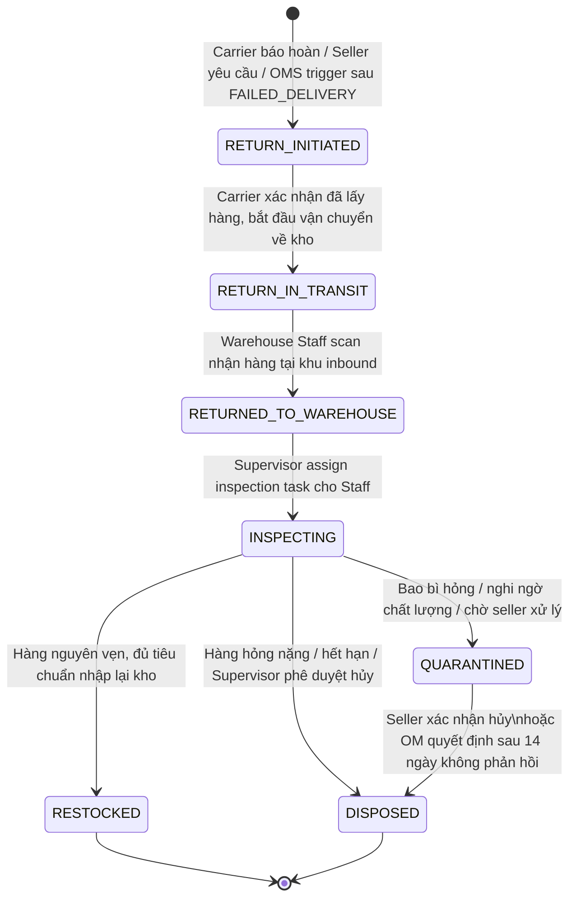
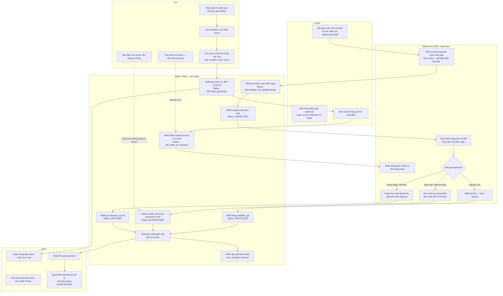

<Note>
  **Practice Case Study** — Tài liệu này được xây dựng cho mục đích luyện tập phân tích nghiệp vụ (BA practice). Tên công ty VietFulfill, dữ liệu, số liệu và mọi scenario đều là hư cấu. Không sử dụng làm tài liệu tham khảo cho dự án thực tế.
</Note>

---

## 1. Bối cảnh & Bài toán

Luồng hoàn hàng (return) chiếm **15–25% tổng volume fulfillment** thực tế tại các 3PL. Tại VietFulfill, với 8.000–12.000 đơn/ngày, con số này có nghĩa là 1.200–3.000 kiện hàng được hoàn về kho mỗi ngày — một luồng đủ lớn để gây tắc nghẽn nếu không có spec rõ ràng.

### Vấn đề hiện tại

Khi chưa có tài liệu đặc tả luồng return, hàng hoàn về kho sẽ bị xử lý không nhất quán:

- Warehouse Staff không có hướng dẫn thống nhất → khi nhập lại tồn kho, khi để khu cách ly, khi không rõ trạng thái
- Seller không biết hàng của mình đang ở đâu và ở trạng thái nào sau khi carrier trả về
- Không có SLA tracking → hàng nằm ở khu return nhiều ngày không ai xử lý
- Không có tiêu chí rõ ràng để quyết định restock hay quarantine hay hủy → Supervisor mỗi người quyết định theo kinh nghiệm riêng
- Hàng bị hỏng do carrier không được claim đúng hạn → VietFulfill chịu thiệt

### Mục tiêu tài liệu này

Định nghĩa luồng return từ thời điểm carrier báo hoàn hàng đến khi có phương án xử lý cuối (restock / quarantine / dispose). Đảm bảo mọi Warehouse Staff, CS, Seller và hệ thống đều hoạt động theo cùng một quy trình.

---

## 2. Phạm vi

### Trong phạm vi (In Scope)

- Return từ carrier do **giao hàng thất bại** (carrier giao không thành công sau 2–3 lần)
- Return do **khách hàng từ chối nhận hàng** tại cửa
- Return do **seller yêu cầu** (seller chủ động thu hồi hàng về kho)
- Quy trình **inspection và phân loại** tại kho: restock, quarantine, dispose
- **SLA tracking** cho từng mốc trong luồng return
- Thông báo kết quả inspection đến seller

### Ngoài phạm vi (Out of Scope)

- **Return portal cho end-customer** tự tạo yêu cầu hoàn hàng (Phase 2)
- **Exchange / đổi hàng trực tiếp** — thay hàng mới khi khách muốn đổi model/size (Phase 2)
- **Refund / hoàn tiền** cho khách hàng — thuộc trách nhiệm seller, không phải WMS
- Xử lý hàng hóa nguy hiểm hoặc hàng có yêu cầu đặc biệt (thực phẩm, dược phẩm)

<Info>
  Phân biệt hai loại return chính trong scope: (1) **Carrier return** — hàng không giao được, carrier tự chuyển về; (2) **Seller-initiated return** — seller chủ động tạo lệnh thu hồi hàng về kho để xử lý. Cả hai đều đi qua cùng một luồng inspection sau khi về kho.
</Info>

---

## 3. State Machine hoàn hàng

### Tổng quan các trạng thái

Luồng return có **6 trạng thái** chính, trong đó 3 trạng thái cuối là terminal states (điểm kết thúc):

| Trạng thái | Loại | Ý nghĩa ngắn gọn |
|---|---|---|
| `RETURN_INITIATED` | Khởi tạo | Return order đã được tạo, carrier đang chuẩn bị vận chuyển về |
| `RETURN_IN_TRANSIT` | Vận chuyển | Carrier đang vận chuyển kiện hàng về kho VietFulfill |
| `RETURNED_TO_WAREHOUSE` | Nhận hàng | Hàng đã về kho vật lý, đã được scan nhận, chờ inspection |
| `INSPECTING` | Kiểm tra | Warehouse Staff đang tiến hành inspection và phân loại |
| `RESTOCKED` | **Terminal** | Hàng đủ điều kiện, đã nhập lại tồn kho bán hàng |
| `QUARANTINED` | Trung gian | Hàng cần giữ cách ly, chờ seller quyết định phương án xử lý — có thể chuyển tiếp sang `DISPOSED` |
| `DISPOSED` | **Terminal** | Hàng đã hủy, có biên bản hủy, không còn trong kho |

### State Diagram

### Mô tả chi tiết từng trạng thái

#### RETURN_INITIATED

Trạng thái này được khởi tạo khi một trong ba điều kiện xảy ra: (1) OMS tự động tạo return order sau khi đơn chuyển sang `FAILED_DELIVERY` và không giải quyết được; (2) Carrier push sự kiện `RETURN_INITIATED` vào OMS qua webhook; (3) CS hoặc Operation Manager tạo thủ công lệnh thu hồi hàng từ seller. Tại thời điểm này, return order được gán `return_id` (format `RET-XXXXXX`) và liên kết với `oms_order_id` gốc. Carrier nhận thông báo để chuẩn bị vận chuyển hàng về.

**Ai có thể trigger:** OMS (tự động), CS, Operation Manager

#### RETURN_IN_TRANSIT

Carrier đã lấy hàng từ địa chỉ khách hoặc từ kho trung gian và đang trên đường vận chuyển về kho VietFulfill. OMS nhận tracking events từ carrier qua webhook và cập nhật trạng thái. WMS được thông báo để chuẩn bị khu vực inbound tiếp nhận.

**Ai có thể trigger:** Carrier (qua webhook tích hợp), OMS (xử lý webhook tự động)

#### RETURNED_TO_WAREHOUSE

Kiện hàng đã được vận chuyển về và Warehouse Staff tại khu inbound đã scan nhận vật lý. Scan này là bắt buộc — không scan thì hệ thống không ghi nhận hàng đã về. Tại bước này, WMS ghi nhận `received_at` timestamp, điều kiện bao bì nhìn bằng mắt thường (OK / Nghi ngờ / Hỏng), và số lượng thực tế nhận được. Sau khi scan xong, hàng được đưa vào khu chờ inspection.

**Ai có thể trigger:** Warehouse Staff (qua WMS scan), WMS (tự động sau scan nhận)

#### INSPECTING

Warehouse Supervisor assign task inspection cho Warehouse Staff. Staff tiến hành kiểm tra chi tiết từng item trong kiện hàng: tình trạng bao bì, tình trạng sản phẩm, đối chiếu SKU và số lượng với return order. Kết quả inspection được ghi nhận trực tiếp vào WMS kèm ảnh chụp (bắt buộc tối thiểu 4 góc). Sau khi có đủ thông tin, Supervisor phê duyệt phương án xử lý.

**Ai có thể trigger:** Warehouse Supervisor (assign task), Warehouse Staff (thực hiện và ghi kết quả)

#### RESTOCKED — Terminal State

Hàng đáp ứng đủ điều kiện restock theo BR-RETURN-01. WMS tăng `available_qty` cho SKU tương ứng, ghi `restock_record` với `return_id`, `restock_at`, `restocked_by`. Seller được thông báo số lượng hàng đã được nhập lại tồn kho. Đây là kết quả tích cực nhất của một return.

#### QUARANTINED — Terminal State

Hàng không đủ điều kiện restock ngay nhưng chưa đủ cơ sở để hủy. Hàng được chuyển vào khu cách ly (quarantine zone) riêng biệt trong kho, gắn nhãn với `return_id` và `quarantine_date`. Seller được thông báo và có 14 ngày để quyết định phương án xử lý. Hàng trong quarantine không được tính vào tồn kho khả dụng.

#### DISPOSED — Terminal State

Hàng hỏng nặng hoặc hết hạn, không còn giá trị thương mại. Việc hủy bắt buộc phải có **Supervisor phê duyệt** và tạo `disposal_record` trước khi thực hiện. Biên bản hủy được lưu trong hệ thống và gửi cho seller. Seller được thông báo với đầy đủ bằng chứng (ảnh hàng trước khi hủy).

---

## 4. Luồng nghiệp vụ chính

### Swimlane — Các bên tham gia

Luồng return liên quan đến 5 swimlane: **Carrier**, **WMS / Hệ thống**, **CS**, **Seller**, **Warehouse Staff**

### Mô tả từng bước

**Bước 1 — Phát sinh return:** Carrier push sự kiện hoàn hàng vào OMS sau khi giao thất bại đủ số lần (thường 3 lần theo hợp đồng). Hoặc CS tạo thủ công sau khi xác nhận khách từ chối nhận. Hoặc seller gửi yêu cầu thu hồi hàng qua Seller Portal.

**Bước 2 — OMS tạo return order:** OMS sinh `return_id` (format `RET-XXXXXX`), liên kết với `oms_order_id` gốc và `shipment_id`. Trạng thái cập nhật sang `RETURN_INITIATED`. OMS gửi notification đến seller, CS, và WMS để chuẩn bị.

**Bước 3 — Carrier vận chuyển hàng về kho:** Carrier cập nhật tracking events trong suốt quá trình vận chuyển về kho. OMS nhận webhook, cập nhật trạng thái sang `RETURN_IN_TRANSIT` và lưu vào tracking log.

**Bước 4 — WMS thông báo cho kho chuẩn bị:** WMS hiển thị danh sách hàng hoàn dự kiến về cho Warehouse Supervisor để chuẩn bị không gian inbound và nhân lực.

**Bước 5 — Carrier bàn giao tại cửa kho:** Carrier đến kho và bàn giao kiện hàng cho Warehouse Staff. Staff kiểm tra bao bì bên ngoài bằng mắt thường trước khi nhận.

**Bước 6 — Warehouse Staff scan nhận hàng:** Staff scan barcode kiện hàng vào WMS. Hệ thống đối chiếu với `return_id` trong hệ thống. Staff ghi nhận: số lượng thực nhận, tình trạng bao bì quan sát ban đầu (Nguyên vẹn / Nghi ngờ / Rõ ràng hỏng). Trạng thái cập nhật sang `RETURNED_TO_WAREHOUSE`. Timestamp `received_at` được ghi nhận — đây là mốc tính SLA.

**Bước 7 — Supervisor assign inspection task:** Warehouse Supervisor review danh sách hàng hoàn đang chờ và assign inspection task cho Staff phù hợp. Thời hạn inspection được hiển thị theo SLA (48h từ khi nhận).

**Bước 8 — Warehouse Staff thực hiện inspection:** Staff mở kiện hàng, kiểm tra từng item theo checklist: đúng SKU, đúng số lượng, tình trạng sản phẩm, tình trạng bao bì, còn seal/tem chưa mở. Bắt buộc chụp ảnh tối thiểu 4 góc và upload lên WMS. Trạng thái cập nhật sang `INSPECTING`.

**Bước 9 — Phân loại và quyết định phương án xử lý:** Dựa trên kết quả inspection và các Business Rules (BR-RETURN-01 đến BR-RETURN-03), Staff đề xuất phương án xử lý. Supervisor phê duyệt, đặc biệt bắt buộc với quyết định `DISPOSED`.

**Bước 10 — Thực hiện phương án xử lý:**
- Nếu **Restock**: Staff scan hàng vào vị trí bin, WMS tăng `available_qty`, ghi `restock_record`
- Nếu **Quarantine**: Staff đưa hàng vào khu cách ly, dán nhãn `RET-XXXXXX + quarantine_date`, WMS ghi nhận vị trí
- Nếu **Dispose**: Supervisor phê duyệt, Staff lập biên bản hủy, chụp ảnh trước khi hủy, upload WMS

**Bước 11 — Gửi thông báo đến seller:** Sau khi phương án xử lý hoàn tất, OMS tự động gửi notification đến seller với: kết quả inspection, phương án xử lý, số lượng restock (nếu có), ảnh chụp tình trạng hàng.

**Bước 12 — Seller xử lý tiếp (nếu cần):** Nếu hàng đang `QUARANTINED`, seller nhận thông báo và cần quyết định trong 14 ngày: yêu cầu giao lại (tạo đơn mới), xuất kho chuyển đến kho khác, hoặc xác nhận hủy. Nếu seller không phản hồi, áp dụng BR-RETURN-02 về escalation.

---

## 5. Business Rules

<Warning>
  Các Business Rules trong nhóm này (BR-RETURN-xx) bổ sung cho các rules đã có trong `business-rules.mdx`. Khi có xung đột, BR-RETURN-xx được ưu tiên áp dụng cho luồng return vì đây là spec chi tiết hơn.
</Warning>

| Rule ID | Trigger | Điều kiện | Hành vi mong đợi | Owner |
|---|---|---|---|---|
| **BR-RETURN-01** | Warehouse Staff hoàn tất inspection và chọn phương án xử lý | Hàng được coi là đủ điều kiện restock khi: (1) Bao bì còn nguyên vẹn hoặc hư hỏng không quá 20% diện tích; (2) Seal/tem nguyên vẹn, chưa có dấu hiệu đã sử dụng; (3) Số ngày từ khi xuất kho đến khi nhận về không vượt quá ngưỡng do seller cấu hình (mặc định 30 ngày); (4) Sản phẩm không thuộc danh mục đặc biệt (thực phẩm, dược phẩm, đồ lót) | WMS tăng `available_qty` cho SKU tương ứng. Ghi `restock_record` với `return_id`, `restocked_qty`, `restocked_by`, `restocked_at`. Trạng thái return chuyển sang `RESTOCKED`. Seller được notify số lượng hàng đã về tồn kho. | Warehouse Staff / Warehouse Supervisor |
| **BR-RETURN-02** | Warehouse Staff hoàn tất inspection, phát hiện dấu hiệu bất thường | Hàng được đưa vào quarantine khi: (1) Bao bì hỏng hơn 20% nhưng sản phẩm bên trong chưa rõ tình trạng; (2) Có dấu hiệu đã qua sử dụng nhưng không hỏng hoàn toàn; (3) Seal/tem đã bị mở hoặc có dấu hiệu bị thay thế; (4) Staff nghi ngờ tráo hàng nhưng chưa xác minh được; (5) Seller yêu cầu giữ hàng lại để kiểm tra thêm | Hàng được chuyển vào **quarantine zone** riêng biệt trong kho. WMS ghi nhận `quarantine_at`, `quarantine_reason`, vị trí lưu trong khu quarantine. Seller được notify ngay với ảnh tình trạng hàng. Seller có **14 ngày** để quyết định phương án xử lý kể từ ngày nhận thông báo. Nếu seller không phản hồi sau 7 ngày → OMS gửi reminder. Sau 14 ngày không phản hồi → Operation Manager quyết định dispose hoặc tính phí lưu kho. | Warehouse Supervisor / Operation Manager |
| **BR-RETURN-03** | Warehouse Staff hoàn tất inspection, sản phẩm rõ ràng không còn giá trị thương mại | Hàng được hủy khi: (1) Hàng hỏng nặng — không thể tái sử dụng hoặc bán lại dưới bất kỳ hình thức nào; (2) Hàng hết hạn sử dụng tại thời điểm nhận về kho; (3) Hàng bị ô nhiễm — nghi ngờ ảnh hưởng sức khỏe; (4) Seller xác nhận yêu cầu hủy sau khi nhận kết quả inspection | Bắt buộc có **Supervisor phê duyệt** trên WMS trước khi thực hiện hủy. Staff tạo `disposal_record` với lý do chi tiết, chụp ảnh trước khi hủy (tối thiểu 4 góc), upload WMS. Biên bản hủy được gửi cho seller qua OMS. Trạng thái return chuyển sang `DISPOSED`. WMS ghi nhận `disposed_at`, `disposed_by`, `disposal_reason`. | Warehouse Supervisor (phê duyệt) / Warehouse Staff (thực hiện) |
| **BR-RETURN-04** | WMS nhận scan nhận hàng từ carrier tại khu inbound | Return phải được nhận và scan vào hệ thống trong vòng **24 giờ** kể từ khi carrier bàn giao về kho (tính từ thời điểm carrier check-in tại cổng kho) | Tại **80% SLA (19.2h)**: WMS gửi warning cho Warehouse Supervisor. Tại **100% SLA (24h)**: OMS gán `SLA_BREACH`, gửi alert cho Operation Manager. Ghi nhận breach vào `return_sla_log`. | Warehouse Staff / Warehouse Supervisor |
| **BR-RETURN-05** | Trạng thái return chuyển sang `RETURNED_TO_WAREHOUSE` | Inspection phải được hoàn thành và phương án xử lý phải được ghi nhận trong vòng **48 giờ** kể từ thời điểm `received_at` (timestamp scan nhận hàng) | Tại **80% SLA (38.4h)**: WMS gửi warning cho Warehouse Supervisor và nhắc nhở Staff được assign. Tại **100% SLA (48h)**: OMS gán `INSPECTION_SLA_BREACH`, alert Operation Manager. Đơn hàng được đưa vào exception queue với priority High. | Warehouse Staff / Warehouse Supervisor / Operation Manager |
| **BR-RETURN-06** | Phương án xử lý được ghi nhận trong WMS (Restock / Quarantine / Dispose) | Kết quả inspection và phương án xử lý phải được thông báo đến seller trong vòng **24 giờ** sau khi có phương án xử lý cuối | OMS tự động gửi notification ngay khi status chuyển sang `RESTOCKED`, `QUARANTINED`, hoặc `DISPOSED`. Notification bao gồm: tóm tắt kết quả inspection, phương án xử lý, số lượng từng SKU, ảnh chụp tình trạng hàng. Nếu hệ thống notification lỗi: CS phải liên hệ seller thủ công trong SLA 24h. | OMS System / CS |

---

## 6. Edge Cases cần chú ý

<Warning>
  Các edge case dưới đây xảy ra thường xuyên hơn dự kiến trong thực tế vận hành. Mỗi trường hợp cần được xử lý theo quy trình riêng — không áp dụng happy path.
</Warning>

### EC-01: Carrier báo hoàn hàng nhưng hàng chưa về kho

**Mô tả:** OMS nhận webhook `RETURN_INITIATED` hoặc `RETURN_IN_TRANSIT` từ carrier nhưng sau 5 ngày làm việc mà WMS vẫn chưa nhận được hàng vật lý.

**Xử lý:** CS chủ động liên hệ carrier để trace kiện hàng. Nếu carrier không cung cấp tracking update trong 48h → CS mở claim và leo thang lên Operation Manager. Áp dụng BR-SLA-05 từ `business-rules.mdx` (Return SLA Breach). Ghi nhận incident vào carrier performance scorecard.

---

### EC-02: Hàng về kho nhưng không có return order trong OMS (Ghost Return)

**Mô tả:** Carrier bàn giao kiện hàng tại cửa kho nhưng khi Warehouse Staff scan barcode, WMS không tìm thấy `return_id` tương ứng trong hệ thống.

**Xử lý:** Staff **không được** từ chối nhận hàng. Thay vào đó, Staff tạo **ghost return ticket** trong WMS với thông tin: barcode kiện hàng, tên carrier, ngày nhận, mô tả ban đầu. Hàng được đặt vào khu **"Chờ xác minh"** (holding area), không vào khu return thông thường. CS tra cứu theo barcode hoặc thông tin gói hàng để tìm đơn gốc. Sau khi xác định được đơn gốc, CS tạo return order thủ công trong OMS và liên kết với ghost return ticket. SLA giải quyết ghost return: 4 giờ làm việc.

---

### EC-03: Seller không phản hồi trong 14 ngày khi hàng đang quarantine

**Mô tả:** Hàng đã được chuyển vào quarantine, seller đã được thông báo nhưng không có phản hồi trong 14 ngày.

**Xử lý:** Ngày 7: OMS tự động gửi reminder thứ nhất. Ngày 12: CS chủ động liên hệ seller qua điện thoại, ghi nhận log cuộc gọi. Ngày 14: Operation Manager quyết định một trong hai: (1) Tiếp tục giữ với tính phí lưu kho theo biểu phí (gửi thông báo cho seller); hoặc (2) Hủy hàng và gửi biên bản cho seller. Mọi hành động sau ngày 14 phải được ghi nhận đầy đủ trong `return_audit_log`.

---

### EC-04: Hàng về kho bị hỏng rõ ràng do lỗi carrier

**Mô tả:** Khi Warehouse Staff nhận hàng từ carrier, kiện hàng bị móp méo, thủng, ướt — hư hỏng rõ ràng do quá trình vận chuyển của carrier.

**Xử lý:** Staff **không ký nhận** trước khi ghi nhận damage. Chụp ảnh ngay tại thời điểm nhận trước mặt nhân viên carrier (ưu tiên), hoặc chụp ảnh ngay sau khi carrier rời đi. Upload ảnh lên WMS ngay tại bước scan nhận. CS mở **carrier damage claim** trong vòng 24h từ khi nhận hàng (theo điều khoản hợp đồng với carrier). Hàng được chuyển vào quarantine với `damage_source: CARRIER`. Kết quả claim phải được theo dõi trong `carrier_claim_log`. Mọi carrier damage claim phải được ghi vào carrier performance scorecard.

---

### EC-05: Return của đơn COD — tiền đã thu hay chưa thu

**Mô tả:** Đơn COD được hoàn về — có hai tình huống cần phân biệt: (A) Carrier chưa thu tiền (giao thất bại trước khi thu); (B) Carrier đã thu tiền nhưng sau đó khách đổi ý, hoặc xảy ra sự cố sau khi thu.

**Xử lý:** Return order trong OMS phải kèm trường `cod_collected: true/false` lấy từ thông tin carrier webhook. Nếu `cod_collected: false` — không có tác động tài chính, xử lý như return thông thường. Nếu `cod_collected: true` — CS phải gắn flag `refund_pending` vào return order và leo thang đến bộ phận tài chính/kế toán của VietFulfill để đối soát với carrier. Quyết định hoàn tiền cho end-customer là trách nhiệm của seller, không phải VietFulfill — nhưng VietFulfill cần cung cấp đủ thông tin cho seller ra quyết định.

<Info>
  COD reconciliation là quy trình riêng biệt, nằm ngoài scope của WMS. Tài liệu này chỉ xác định rằng return order **phải có thông tin COD status** để các bên liên quan xử lý đúng.
</Info>

---

### EC-06: Partial return — số lượng hàng về ít hơn số lượng trên đơn

**Mô tả:** Đơn hàng gốc có 3 SKU, mỗi SKU 2 sản phẩm. Carrier chỉ trả về 4/6 sản phẩm, hoặc chỉ trả về 2/3 SKU.

**Xử lý:** WMS cho phép ghi nhận **số lượng thực nhận** khác số lượng trên return order. Hệ thống tạo `quantity_discrepancy_record` tự động khi `received_qty < expected_qty`. CS mở case điều tra với carrier về phần hàng bị thiếu. Với phần hàng đã về: xử lý inspection và phân loại bình thường. Với phần hàng còn thiếu: tạo open item theo dõi, SLA điều tra 5 ngày làm việc. Seller được thông báo về discrepancy ngay khi phát hiện — không chờ đến khi điều tra xong.

---

## 7. SLA & Escalation

| Mốc | SLA | Người chịu trách nhiệm | Escalation khi quá hạn |
|---|---|---|---|
| Scan nhận hàng sau khi carrier bàn giao tại kho | **24 giờ** kể từ khi carrier check-in | Warehouse Staff | Warehouse Supervisor → Operation Manager |
| Hoàn thành inspection và ghi nhận phương án xử lý | **48 giờ** kể từ thời điểm `received_at` | Warehouse Staff / Warehouse Supervisor | Operation Manager → exception queue (priority High) |
| Thông báo kết quả inspection đến seller | **24 giờ** sau khi có phương án xử lý | OMS (tự động) / CS (nếu lỗi hệ thống) | CS lead → Operation Manager |
| Carrier bàn giao hàng về kho kể từ khi `RETURN_INITIATED` | **5 ngày làm việc** (standard) / **3 ngày** (đơn > 1.000.000 VNĐ) / **7 ngày** (vùng xa) | Carrier (trách nhiệm) / CS (theo dõi) | CS liên hệ carrier hotline → mở incident report → ghi carrier KPI |
| Seller phản hồi về hàng quarantine | **14 ngày** kể từ ngày nhận thông báo | Seller | CS nhắc nhở ngày 7 → CS gọi điện ngày 12 → Operation Manager quyết định ngày 14 |
| Giải quyết ghost return (hàng về không có return order) | **4 giờ làm việc** | CS | CS lead → Operation Manager |
| Mở carrier damage claim sau khi phát hiện hàng hỏng do carrier | **24 giờ** kể từ khi nhận hàng | CS | Operation Manager approve claim escalation |
| Điều tra partial return (hàng thiếu) | **5 ngày làm việc** | CS / Carrier | Operation Manager → leo thang theo hợp đồng carrier |

<Info>
  **Cơ chế cảnh báo SLA:** OMS gửi warning khi đạt 80% ngưỡng SLA, và gửi alert khẩn cấp khi đạt 100%. Mọi SLA breach được ghi nhận vào `return_sla_log` và đưa vào báo cáo carrier performance hàng tuần.
</Info>

---

## 8. UAT Scenarios cơ bản

### Scenario 1 — Happy Path: Hoàn hàng thành công, nhập lại tồn kho

**Mô tả:** Carrier giao hàng thất bại 3 lần, tạo return. Hàng về kho nguyên vẹn, được nhập lại tồn kho.

**Điều kiện đầu vào:**
- Đơn `VF-2026-000123` ở trạng thái `FAILED_DELIVERY`
- Carrier: GHN
- Hàng: 1 SKU, bao bì nguyên vẹn, còn trong hạn sử dụng

**Các bước thực hiện:**
1. OMS nhận webhook `RETURN_INITIATED` từ GHN → tạo `RET-000456`, trạng thái `RETURN_INITIATED`
2. Carrier push tracking events → OMS cập nhật `RETURN_IN_TRANSIT`
3. GHN đến kho bàn giao. Staff scan barcode → WMS tìm thấy `RET-000456` → ghi `received_at`, trạng thái `RETURNED_TO_WAREHOUSE`
4. Supervisor assign inspection task. Staff kiểm tra: bao bì tốt, seal nguyên, sản phẩm không hỏng, trong 30 ngày xuất kho
5. Staff upload ảnh 4 góc, chọn phương án "Restock". Supervisor phê duyệt → trạng thái `RESTOCKED`
6. WMS tăng `available_qty` của SKU tương ứng
7. OMS gửi notification cho seller: "Hàng hoàn `RET-000456` đã được nhập lại tồn kho. Số lượng: 1 đơn vị."

**Kết quả mong đợi:** Return order ở trạng thái `RESTOCKED`. Available qty của SKU tăng 1. Seller nhận notification trong vòng 24h sau restock. Không có SLA breach.

---

### Scenario 2 — Quarantine Flow: Hàng về với bao bì hỏng, chờ seller quyết định

**Mô tả:** Hàng về kho với bao bì rách hơn 20%, không rõ tình trạng sản phẩm bên trong.

**Điều kiện đầu vào:**
- Return order `RET-000457`, hàng: điện thoại Samsung
- Bao bì ngoài rách khoảng 35%, hộp sản phẩm có vết móp

**Các bước thực hiện:**
1. Staff scan nhận hàng, ghi điều kiện ban đầu: "Bao bì ngoài rách nặng" → `RETURNED_TO_WAREHOUSE`
2. Staff inspection: bao bì rách > 20%, hộp sản phẩm bị móp, không xác định được sản phẩm còn hoạt động không
3. Staff chụp 4 ảnh, chọn "Quarantine". Supervisor phê duyệt → trạng thái `QUARANTINED`
4. Staff chuyển hàng vào quarantine zone, dán nhãn `RET-000457 | Quarantine | 08/06/2026`
5. OMS gửi notification đến seller với ảnh tình trạng hàng và thông báo 14 ngày phản hồi
6. Ngày 7: OMS gửi reminder tự động
7. Ngày 10: Seller phản hồi — yêu cầu tiêu hủy do chi phí xử lý cao hơn giá trị hàng

**Kết quả mong đợi:** Return order ở `QUARANTINED` → `DISPOSED` sau khi seller xác nhận. Biên bản hủy được tạo và gửi seller. Không tính hàng vào tồn kho.

---

### Scenario 3 — Dispose Flow: Hàng về hỏng nặng, Supervisor phê duyệt hủy

**Mô tả:** Carrier trả về hàng bị vỡ hoàn toàn, không còn giá trị thương mại.

**Điều kiện đầu vào:**
- Return order `RET-000458`, hàng: bình thủy tinh handmade
- Kiện hàng bị móp méo nặng khi carrier bàn giao

**Các bước thực hiện:**
1. Staff nhận hàng từ carrier. Phát hiện kiện hàng bị dập, có dấu hiệu hỏng do carrier. Staff chụp ảnh trước mặt nhân viên carrier
2. Scan nhận hàng. Ghi: `damage_source: CARRIER`, trạng thái `RETURNED_TO_WAREHOUSE`
3. CS mở carrier damage claim với carrier trong 24h
4. Staff inspection: sản phẩm bên trong vỡ hoàn toàn, không thể tái sử dụng
5. Staff chọn "Dispose" và ghi lý do chi tiết. Supervisor review ảnh và phê duyệt trên WMS
6. Staff lập biên bản disposal, chụp ảnh thêm trước khi hủy. Hủy hàng
7. OMS gửi notification đến seller với biên bản hủy và ảnh hàng

**Kết quả mong đợi:** Return order ở `DISPOSED`. `disposal_record` được tạo với đủ thông tin. Seller nhận biên bản hủy. Carrier claim đang trong quá trình xử lý (separate flow).

---

### Scenario 4 — SLA Breach: Carrier không giao hàng về đúng hạn

**Mô tả:** Return được tạo nhưng sau 5 ngày làm việc, WMS vẫn chưa nhận được hàng từ carrier.

**Điều kiện đầu vào:**
- Return order `RET-000459`, tạo ngày 01/06/2026
- Carrier: GHTK
- Hạn nhận hàng: 06/06/2026 (5 ngày làm việc)

**Các bước thực hiện:**
1. Return order được tạo, trạng thái `RETURN_IN_TRANSIT`
2. Ngày 04/06: OMS gửi warning (80% SLA). CS xem tracking, hàng vẫn đang "in transit" theo GHTK
3. Ngày 06/06 (hết SLA): OMS gán `RETURN_SLA_BREACH`, gửi alert cho CS và Operation Manager
4. CS liên hệ GHTK hotline. GHTK báo hàng đang ở kho trung chuyển, dự kiến giao ngày 08/06
5. CS ghi nhận incident, ghi vào carrier performance scorecard của GHTK
6. Ngày 08/06: carrier bàn giao hàng. Xử lý bình thường từ đây

**Kết quả mong đợi:** `RETURN_SLA_BREACH` được ghi nhận. Incident report được tạo. Hàng vẫn được xử lý bình thường sau khi về. GHTK có một điểm SLA breach trong performance report.

---

### Scenario 5 — Ghost Return: Hàng về kho không có return order trong hệ thống

**Mô tả:** Carrier bàn giao một kiện hàng tại cửa kho nhưng WMS không tìm thấy return order tương ứng khi scan.

**Điều kiện đầu vào:**
- Kiện hàng có barcode `GHN-987654321`
- WMS scan → "Không tìm thấy return order tương ứng"

**Các bước thực hiện:**
1. Staff scan, WMS hiển thị cảnh báo "Ghost Return — Không có return order". Staff không từ chối nhận
2. Staff tạo ghost return ticket trong WMS: ghi barcode, tên carrier, ngày giờ, ảnh kiện hàng. Hàng được đặt vào holding area
3. CS nhận alert ghost return ticket. CS tra cứu theo barcode carrier trong OMS
4. CS tìm được đơn `VF-2026-000567` đã ở trạng thái `FAILED_DELIVERY` nhưng chưa có return order (do webhook carrier bị miss)
5. CS tạo return order thủ công `RET-000460`, liên kết với ghost return ticket. Trạng thái cập nhật sang `RETURNED_TO_WAREHOUSE`
6. Xử lý inspection bình thường từ đây

**Kết quả mong đợi:** Ghost return được giải quyết trong 4 giờ làm việc. Return order được tạo đầy đủ. Ghi nhận incident "missed webhook" cho root cause analysis.

---

### Scenario 6 — Seller-Initiated Return: Seller chủ động thu hồi hàng từ kho

**Mô tả:** Seller muốn thu hồi một lô hàng còn trong kho VietFulfill (chưa có đơn hàng nào) về kho của mình.

**Điều kiện đầu vào:**
- Seller: Thương hiệu X
- Yêu cầu: thu hồi 50 đơn vị SKU `SKU-ABC-001` từ kho Hà Nội

**Các bước thực hiện:**
1. Seller gửi yêu cầu thu hồi qua Seller Portal. Yêu cầu bao gồm: SKU, số lượng, lý do, địa chỉ nhận hàng
2. CS review và xác nhận yêu cầu. Operation Manager phê duyệt (nếu số lượng lớn)
3. OMS tạo seller-initiated return order `RET-000461`. WMS nhận lệnh chuẩn bị hàng xuất đi kho seller
4. WMS tạo task xuất kho cho Warehouse Staff. Staff pick 50 đơn vị SKU-ABC-001, đóng gói
5. Carrier được booking để đến lấy hàng giao về kho seller
6. Sau khi carrier lấy, `RET-000461` cập nhật trạng thái `RETURN_IN_TRANSIT` (hàng đang trên đường về kho seller)
7. Khi kho seller xác nhận nhận hàng (hoặc seller confirm trên portal), return order đóng lại

**Kết quả mong đợi:** Hàng được xuất kho chính xác, tồn kho WMS được giảm đúng số lượng. Return order có đầy đủ audit trail.

---

<Info>
  **Tài liệu liên quan:**
  - `state-machine.mdx` — State Machine đơn hàng tổng thể, bao gồm `RETURN_INITIATED` và `RETURNED_TO_WAREHOUSE`
  - `business-rules.mdx` — Nhóm BR-DELIVER-04 đến BR-DELIVER-06 và BR-SLA-05 liên quan trực tiếp đến luồng return
  - `fulfillment-flow.mdx` — Bước 16 mô tả return flow trong context fulfillment end-to-end
  - `exception-queue.mdx` — Cách exception từ luồng return được track trong exception queue
</Info>
