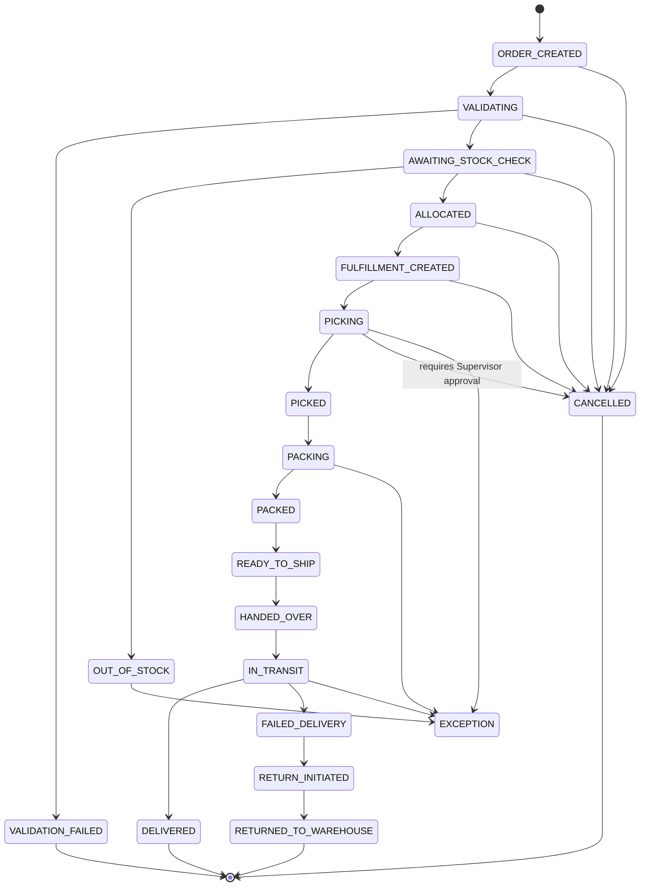

<Note>
  **Practice Case Study** — Tài liệu này được viết cho mục đích luyện tập BA. Mọi tên công ty, dữ liệu và scenario đều là hư cấu.
</Note>

## Overview

State Machine mô tả **vòng đời đầy đủ của một đơn hàng** từ lúc được tạo trong OMS cho đến khi kết thúc ở một trong các terminal states. Mỗi trạng thái đại diện cho một giai đoạn xử lý cụ thể, và mỗi transition chỉ hợp lệ khi đáp ứng đủ business rules tương ứng.

| Thành phần | Mô tả |
|---|---|
| **Tổng số states** | 20 states |
| **Terminal states** | 5 (VALIDATION_FAILED, DELIVERED, RETURNED_TO_WAREHOUSE, CANCELLED, EXCEPTION*) |
| **Hệ thống tham gia** | OMS, WMS |
| **Actors tham gia** | Warehouse Staff, Warehouse Supervisor, Carrier, CS, Operation Manager, System Admin |

---

## State Diagram

---

## Chi Tiết Từng State

### 1. ORDER_CREATED

| | |
|---|---|
| **Status** | `ORDER_CREATED` |
| **Ý nghĩa** | Đơn hàng vừa được tạo thành công trong OMS. Dữ liệu đơn hàng đã được lưu nhưng chưa qua bất kỳ bước kiểm tra nghiệp vụ nào. |
| **Trigger vào trạng thái** | Seller hoặc hệ thống integration gửi request tạo đơn thành công; OMS tạo record và gán `order_id` duy nhất. |
| **Ai/Hệ thống được phép chuyển** | OMS (tự động), System Admin (manual override) |
| **Next possible statuses** | `VALIDATING`, `CANCELLED` |
| **Business rules liên quan** | BR-VAL-01, BR-CANCEL-01 |

---

### 2. VALIDATING

| | |
|---|---|
| **Status** | `VALIDATING` |
| **Ý nghĩa** | OMS đang thực hiện kiểm tra tính hợp lệ của đơn hàng: địa chỉ giao hàng, SKU, phương thức thanh toán, giới hạn COD, và các rule nghiệp vụ khác. |
| **Trigger vào trạng thái** | OMS tự động trigger ngay sau khi `ORDER_CREATED`; không cần thao tác thủ công. |
| **Ai/Hệ thống được phép chuyển** | OMS (tự động) |
| **Next possible statuses** | `VALIDATION_FAILED`, `AWAITING_STOCK_CHECK`, `CANCELLED` |
| **Business rules liên quan** | BR-VAL-01 đến BR-VAL-08, BR-CANCEL-01 |

---

### 3. VALIDATION_FAILED

| | |
|---|---|
| **Status** | `VALIDATION_FAILED` |
| **Ý nghĩa** | Đơn hàng không vượt qua bước validation. Ít nhất một rule nghiệp vụ bị vi phạm. Đơn bị dừng và không được xử lý tiếp. |
| **Trigger vào trạng thái** | OMS phát hiện lỗi trong quá trình VALIDATING; ghi nhận error code và lý do cụ thể. |
| **Ai/Hệ thống được phép chuyển** | OMS (tự động) |
| **Next possible statuses** | `[*]` — Terminal state |
| **Business rules liên quan** | BR-VAL-01 đến BR-VAL-08 |

<Warning>
  **Terminal State:** Đơn ở `VALIDATION_FAILED` không thể được reactivate. Seller phải tạo đơn mới với thông tin đã được chỉnh sửa.
</Warning>

---

### 4. AWAITING_STOCK_CHECK

| | |
|---|---|
| **Status** | `AWAITING_STOCK_CHECK` |
| **Ý nghĩa** | Đơn hàng đã qua validation thành công và đang chờ WMS kiểm tra tồn kho thực tế theo từng SKU trong đơn. |
| **Trigger vào trạng thái** | OMS hoàn thành VALIDATING thành công → tự động gửi stock check request đến WMS. |
| **Ai/Hệ thống được phép chuyển** | OMS → WMS (tự động qua API), Operation Manager (manual trigger nếu timeout) |
| **Next possible statuses** | `OUT_OF_STOCK`, `ALLOCATED`, `CANCELLED` |
| **Business rules liên quan** | BR-INV-01 (stock check timeout SLA = 5 phút), BR-INV-02, BR-CANCEL-01, BR-SLA-01 |

---

### 5. ALLOCATED

| | |
|---|---|
| **Status** | `ALLOCATED` |
| **Ý nghĩa** | WMS đã xác nhận đủ tồn kho và **khóa (reserve)** số lượng hàng tương ứng cho đơn này. Hàng không còn available cho các đơn khác. |
| **Trigger vào trạng thái** | WMS xác nhận tồn kho đủ cho tất cả SKU → gửi allocation confirmation về OMS. |
| **Ai/Hệ thống được phép chuyển** | WMS (tự động), System Admin (override trong trường hợp đặc biệt) |
| **Next possible statuses** | `FULFILLMENT_CREATED`, `CANCELLED` |
| **Business rules liên quan** | BR-INV-01, BR-INV-03, BR-CANCEL-02, BR-SLA-01 |

---

### 6. OUT_OF_STOCK

| | |
|---|---|
| **Status** | `OUT_OF_STOCK` |
| **Ý nghĩa** | WMS xác nhận không đủ tồn kho cho ít nhất một SKU trong đơn hàng. Đơn không thể tiếp tục quy trình fulfillment thông thường. |
| **Trigger vào trạng thái** | WMS trả về kết quả stock check thất bại. |
| **Ai/Hệ thống được phép chuyển** | WMS (tự động) |
| **Next possible statuses** | `EXCEPTION` |
| **Business rules liên quan** | BR-INV-02, BR-INV-04 (OOS notification to CS & Seller), BR-SLA-01 |

<Info>
  Khi đơn vào `OUT_OF_STOCK`, CS được notify tự động để liên hệ Seller xử lý. Nếu không có hướng giải quyết trong SLA window, đơn chuyển sang `EXCEPTION`.
</Info>

---

### 7. FULFILLMENT_CREATED

| | |
|---|---|
| **Status** | `FULFILLMENT_CREATED` |
| **Ý nghĩa** | OMS đã tạo Fulfillment Order trong WMS. WMS nhận được lệnh xử lý kèm danh sách SKU, số lượng, vị trí kho và yêu cầu đóng gói. |
| **Trigger vào trạng thái** | OMS gửi Fulfillment Creation request đến WMS sau khi stock đã được ALLOCATED. |
| **Ai/Hệ thống được phép chuyển** | OMS (tự động sau ALLOCATED), Operation Manager (manual nếu cần) |
| **Next possible statuses** | `PICKING`, `CANCELLED` |
| **Business rules liên quan** | BR-PICK-01 (pick list generation), BR-SLA-01 (SLA từ FULFILLMENT_CREATED đến PICKING), BR-CANCEL-03 |

---

### 8. PICKING

| | |
|---|---|
| **Status** | `PICKING` |
| **Ý nghĩa** | Warehouse Staff đang thực hiện lấy hàng khỏi vị trí lưu kho theo pick list do WMS chỉ định. Đây là bước vật lý đầu tiên trong quy trình kho. |
| **Trigger vào trạng thái** | Warehouse Staff scan barcode bắt đầu picking trên thiết bị WMS (PDA/tablet). |
| **Ai/Hệ thống được phép chuyển** | Warehouse Staff (qua WMS app) |
| **Next possible statuses** | `PICKED`, `CANCELLED` (cần Supervisor approval), `EXCEPTION` |
| **Business rules liên quan** | BR-PICK-01, BR-PICK-02, BR-CANCEL-04 (cancel trong PICKING cần Supervisor approval), BR-SLA-02 |

<Warning>
  **Cancel tại PICKING yêu cầu Warehouse Supervisor approval.** Hàng đang được lấy vật lý, cần đảm bảo việc hoàn trả hàng về đúng vị trí trước khi cancel.
</Warning>

---

### 9. PICKED

| | |
|---|---|
| **Status** | `PICKED` |
| **Ý nghĩa** | Warehouse Staff đã lấy đủ toàn bộ hàng theo pick list. Tất cả SKU đã được xác nhận scan và số lượng khớp. Hàng đang được chuyển đến khu vực packing. |
| **Trigger vào trạng thái** | Warehouse Staff confirm hoàn thành picking — scan xác nhận toàn bộ items trên WMS app. |
| **Ai/Hệ thống được phép chuyển** | Warehouse Staff (qua WMS app) |
| **Next possible statuses** | `PACKING` |
| **Business rules liên quan** | BR-PICK-01, BR-PICK-03 (quantity variance threshold) |

---

### 10. PACKING

| | |
|---|---|
| **Status** | `PACKING` |
| **Ý nghĩa** | Warehouse Staff đang thực hiện đóng gói hàng hóa: kiểm tra hàng lần cuối, chọn thùng/túi phù hợp, in và dán nhãn vận chuyển, thêm phụ kiện. |
| **Trigger vào trạng thái** | Warehouse Staff bắt đầu packing trên WMS — scan barcode đơn hàng tại trạm packing. |
| **Ai/Hệ thống được phép chuyển** | Warehouse Staff (qua WMS app) |
| **Next possible statuses** | `PACKED`, `EXCEPTION` |
| **Business rules liên quan** | BR-PICK-04 (pack thiếu item), BR-PICK-05 (weight/dimension mismatch), BR-SLA-02 |

---

### 11. PACKED

| | |
|---|---|
| **Status** | `PACKED` |
| **Ý nghĩa** | Hàng đã được đóng gói hoàn chỉnh: đúng sản phẩm, đúng số lượng, nhãn vận chuyển đã dán, kiện hàng đã được niêm phong. Đơn đang chờ chuyển đến khu vực staging. |
| **Trigger vào trạng thái** | Warehouse Staff confirm hoàn thành packing — scan xác nhận trên WMS. WMS ghi nhận package weight và dimension. |
| **Ai/Hệ thống được phép chuyển** | Warehouse Staff (qua WMS app) |
| **Next possible statuses** | `READY_TO_SHIP` |
| **Business rules liên quan** | BR-PACK-01, BR-PICK-04, BR-DELIVER-01 (carrier routing logic xác định tại bước này) |

---

### 12. READY_TO_SHIP

| | |
|---|---|
| **Status** | `READY_TO_SHIP` |
| **Ý nghĩa** | Kiện hàng đã được đưa vào khu vực staging/outbound và đang chờ Carrier đến lấy hàng (pickup). Manifest đã được chuẩn bị. |
| **Trigger vào trạng thái** | Warehouse Staff scan kiện hàng vào khu vực staging trên WMS. |
| **Ai/Hệ thống được phép chuyển** | Warehouse Staff (qua WMS app), WMS (tự động qua staging scan) |
| **Next possible statuses** | `HANDED_OVER` |
| **Business rules liên quan** | BR-DELIVER-01 (carrier assignment và cutoff time), BR-DELIVER-02 (manifest generation), BR-SLA-03 |

---

### 13. HANDED_OVER

| | |
|---|---|
| **Status** | `HANDED_OVER` |
| **Ý nghĩa** | Kiện hàng đã được bàn giao vật lý cho Carrier tại kho VietFulfill. Carrier đã ký nhận. Trách nhiệm vận chuyển chuyển sang phía Carrier. |
| **Trigger vào trạng thái** | Carrier scan nhận hàng tại kho hoặc Warehouse Staff xác nhận handover trên WMS kèm mã xác nhận từ Carrier. |
| **Ai/Hệ thống được phép chuyển** | Warehouse Staff (qua WMS app), WMS (tự động nếu Carrier scan tích hợp) |
| **Next possible statuses** | `IN_TRANSIT` |
| **Business rules liên quan** | BR-DELIVER-02 (handover confirmation requirements), BR-DELIVER-03 (proof of handover lưu trữ) |

---

### 14. IN_TRANSIT

| | |
|---|---|
| **Status** | `IN_TRANSIT` |
| **Ý nghĩa** | Kiện hàng đang trong quá trình vận chuyển từ kho đến địa chỉ người nhận. Carrier chịu trách nhiệm. OMS nhận tracking updates từ Carrier qua webhook/API. |
| **Trigger vào trạng thái** | Carrier cập nhật "picked up" hoặc "in transit" trên hệ thống của họ → OMS nhận webhook và cập nhật. |
| **Ai/Hệ thống được phép chuyển** | Carrier (qua webhook tích hợp), OMS (xử lý webhook tự động) |
| **Next possible statuses** | `DELIVERED`, `FAILED_DELIVERY`, `EXCEPTION` |
| **Business rules liên quan** | BR-DELIVER-04 (tracking update frequency SLA), BR-DELIVER-05 (failed delivery retry policy), BR-SLA-01 |

---

### 15. DELIVERED

| | |
|---|---|
| **Status** | `DELIVERED` |
| **Ý nghĩa** | Kiện hàng đã được giao thành công đến người nhận. Carrier xác nhận giao hàng thành công kèm bằng chứng (POD). |
| **Trigger vào trạng thái** | Carrier cập nhật "delivered" kèm POD → OMS nhận webhook → cập nhật trạng thái. |
| **Ai/Hệ thống được phép chuyển** | Carrier (qua webhook), OMS (tự động) |
| **Next possible statuses** | `[*]` — Terminal state |
| **Business rules liên quan** | BR-DELIVER-06 (POD requirements), BR-DELIVER-07 (COD reconciliation sau DELIVERED) |

<Info>
  **Terminal State (Success):** Sau DELIVERED, hệ thống trigger các post-delivery workflows: COD reconciliation, seller settlement, review request notification.
</Info>

---

### 16. FAILED_DELIVERY

| | |
|---|---|
| **Status** | `FAILED_DELIVERY` |
| **Ý nghĩa** | Carrier đã cố giao hàng nhưng không thành công. Lý do có thể bao gồm: người nhận vắng mặt, địa chỉ sai, người nhận từ chối nhận hàng. |
| **Trigger vào trạng thái** | Carrier cập nhật "delivery failed" kèm lý do cụ thể → OMS nhận webhook → cập nhật. |
| **Ai/Hệ thống được phép chuyển** | Carrier (qua webhook), OMS (tự động) |
| **Next possible statuses** | `RETURN_INITIATED` |
| **Business rules liên quan** | BR-DELIVER-05 (retry attempts — số lần thử giao tối đa theo carrier contract), BR-DELIVER-08 (notification to CS và Seller) |

<Info>
  Theo BR-DELIVER-05, Carrier có thể thực hiện tối đa **3 lần giao** trước khi cập nhật FAILED_DELIVERY vào OMS. Số lần retry tùy thuộc vào hợp đồng từng Carrier.
</Info>

---

### 17. RETURN_INITIATED

| | |
|---|---|
| **Status** | `RETURN_INITIATED` |
| **Ý nghĩa** | Quy trình hoàn hàng về kho đã được khởi tạo. Carrier đang vận chuyển kiện hàng trở lại kho VietFulfill. |
| **Trigger vào trạng thái** | OMS tự động tạo return order sau `FAILED_DELIVERY`; hoặc CS/Operation Manager manual trigger. |
| **Ai/Hệ thống được phép chuyển** | OMS (tự động sau FAILED_DELIVERY), CS, Operation Manager |
| **Next possible statuses** | `RETURNED_TO_WAREHOUSE` |
| **Business rules liên quan** | BR-DELIVER-09 (return shipping label generation), BR-DELIVER-10 (return SLA từ Carrier), BR-INV-05 |

---

### 18. RETURNED_TO_WAREHOUSE

| | |
|---|---|
| **Status** | `RETURNED_TO_WAREHOUSE` |
| **Ý nghĩa** | Kiện hàng đã được Carrier hoàn trả vật lý về kho VietFulfill. Warehouse Staff đã kiểm tra, scan nhận hàng và cập nhật vào WMS. Hàng chờ quyết định tiếp theo từ Seller. |
| **Trigger vào trạng thái** | Warehouse Staff scan nhận kiện hàng hoàn trả tại khu vực inbound kho → WMS cập nhật → OMS đồng bộ. |
| **Ai/Hệ thống được phép chuyển** | Warehouse Staff (qua WMS app), WMS (tự động sau scan nhận) |
| **Next possible statuses** | `[*]` — Terminal state |
| **Business rules liên quan** | BR-INV-05 (returned stock inspection và re-stocking policy), BR-DELIVER-11 (return notification to Seller) |

<Warning>
  **Terminal State:** Sau `RETURNED_TO_WAREHOUSE`, Seller cần xử lý hàng hoàn: yêu cầu giao lại (tạo đơn mới), xuất kho tiêu hủy, hoặc tái nhập kho bán tiếp.
</Warning>

---

### 19. CANCELLED

| | |
|---|---|
| **Status** | `CANCELLED` |
| **Ý nghĩa** | Đơn hàng đã bị huỷ trước khi hoàn tất giao hàng. Mọi reservation tồn kho (nếu có) đã được giải phóng. |
| **Trigger vào trạng thái** | Seller request cancel; CS thực hiện cancel; Operation Manager cancel vì lý do vận hành; Warehouse Supervisor approve cancel trong giai đoạn PICKING. |
| **Ai/Hệ thống được phép chuyển** | Seller (chỉ giai đoạn sớm), CS (mọi giai đoạn được phép), Operation Manager, Warehouse Supervisor (đặc biệt cho PICKING), System Admin |
| **Next possible statuses** | `[*]` — Terminal state |
| **Business rules liên quan** | BR-CANCEL-01 đến BR-CANCEL-05, BR-INV-07 (stock release khi cancel) |

<Info>
  **Terminal State:** Tất cả stock reservations được tự động giải phóng ngay khi đơn chuyển sang CANCELLED.
</Info>

---

### 20. EXCEPTION

| | |
|---|---|
| **Status** | `EXCEPTION` |
| **Ý nghĩa** | Đơn hàng gặp tình huống bất thường không thể xử lý tự động theo luồng tiêu chuẩn. Cần sự can thiệp thủ công của Operation Manager hoặc System Admin. |
| **Trigger vào trạng thái** | Tồn kho không đủ (từ OUT_OF_STOCK), lỗi vật lý trong picking/packing, sự cố vận chuyển nghiêm trọng, timeout xử lý vượt SLA. |
| **Ai/Hệ thống được phép chuyển** | OMS (tự động), WMS (tự động), Operation Manager (manual escalation) |
| **Next possible statuses** | Tùy theo kết quả điều tra: retry, cancel, hoặc manual override sang trạng thái phù hợp. EXCEPTION là **partial terminal** — cần human intervention. |
| **Business rules liên quan** | BR-SLA-01 (SLA breach triggers exception), BR-INV-02, BR-PICK-02, BR-DELIVER-12 (exception escalation SLA — 2 giờ làm việc) |

<Warning>
  **Partial Terminal State:** `EXCEPTION` không tự động kết thúc vòng đời đơn. Operation Manager PHẢI review và quyết định action trong vòng 2 giờ làm việc. Nếu quá hạn, System Admin được alert tự động.
</Warning>

---

## Terminal States

| Terminal State | Loại | Ý nghĩa | Hành động tiếp theo |
|---|---|---|---|
| `VALIDATION_FAILED` | Hard stop | Đơn không hợp lệ ngay từ đầu | Seller tạo đơn mới với thông tin đã sửa |
| `DELIVERED` | Success | Giao hàng thành công | Post-delivery workflows: COD reconciliation, settlement |
| `RETURNED_TO_WAREHOUSE` | Completed (with return) | Hàng về kho sau khi không giao được | Seller quyết định: tái nhập kho, giao lại, hoặc tiêu hủy |
| `CANCELLED` | Terminated | Đơn bị huỷ chủ động | Stock được release; Seller được notify |
| `EXCEPTION` | Partial terminal* | Cần human intervention | Operation Manager điều tra và quyết định action |

> **(*) EXCEPTION là partial terminal:** đơn dừng xử lý tự động nhưng vẫn chưa đóng. Operation Manager có thể khôi phục luồng hoặc escalate lên CANCELLED/terminal state khác.

---

## Cancellation Rules

Quy tắc cancel thay đổi theo từng giai đoạn xử lý. **Nguyên tắc: càng về sau trong quy trình, càng khó cancel và càng cần nhiều thẩm quyền hơn.**

| State | Cancel được không? | Actor được phép | Điều kiện đặc biệt | Business Rule |
|---|---|---|---|---|
| `ORDER_CREATED` | Có | Seller, CS, OMS (tự động) | Không cần approval | BR-CANCEL-01 |
| `VALIDATING` | Có | Seller, CS | Không cần approval | BR-CANCEL-01 |
| `AWAITING_STOCK_CHECK` | Có | Seller, CS | Không cần approval | BR-CANCEL-01 |
| `ALLOCATED` | Có | CS, Operation Manager | Stock reservation phải được release ngay | BR-CANCEL-02 |
| `FULFILLMENT_CREATED` | Có | CS, Operation Manager | WMS Fulfillment Order phải được recall | BR-CANCEL-03 |
| `PICKING` | Có (hạn chế) | Warehouse Supervisor | **Bắt buộc Supervisor approval** + hàng đã pick phải được hoàn trả về đúng bin | BR-CANCEL-04 |
| `PICKED` | Không | — | Đơn đã qua PICKING — chuyển sang EXCEPTION nếu cần | — |
| `PACKING` | Không | — | — | — |
| `PACKED` | Không | — | — | — |
| `READY_TO_SHIP` | Không | — | — | — |
| `HANDED_OVER` | Không | — | Hàng đã bàn giao Carrier — chỉ có thể recall qua Carrier | — |
| `IN_TRANSIT` | Không | — | — | — |

### Business Rules Cancel Chi Tiết

**BR-CANCEL-01:** Đơn ở giai đoạn `ORDER_CREATED`, `VALIDATING`, `AWAITING_STOCK_CHECK` có thể cancel bởi Seller hoặc CS. Không cần approval. Không có tác động vật lý lên kho.

**BR-CANCEL-02:** Khi cancel đơn ở `ALLOCATED`, WMS phải nhận được lệnh release reservation trong vòng 30 giây. Stock được cộng lại vào available inventory ngay lập tức.

**BR-CANCEL-03:** Cancel ở `FULFILLMENT_CREATED` yêu cầu OMS gửi Fulfillment Recall request đến WMS. WMS xác nhận recall thành công trước khi OMS cập nhật trạng thái CANCELLED. Nếu WMS không xác nhận trong 5 phút → cần Operation Manager can thiệp.

**BR-CANCEL-04:** Cancel trong `PICKING` yêu cầu: CS/Operation Manager gửi cancel request → Warehouse Supervisor nhận notification và review → Supervisor confirm trên WMS app sau khi kiểm tra thực tế hàng → Warehouse Staff hoàn trả hàng đã pick về đúng bin location.

**BR-CANCEL-05:** Đơn ở `FAILED_DELIVERY` không thể cancel trực tiếp — phải chuyển sang `RETURN_INITIATED` → `RETURNED_TO_WAREHOUSE` trước. Sau đó Seller có thể yêu cầu không giao lại.

---

## Exception Rules

### Các Điều Kiện Trigger EXCEPTION

| Nguồn state | Điều kiện trigger | Actor phát hiện | Priority |
|---|---|---|---|
| `OUT_OF_STOCK` | CS không giải quyết được trong SLA window (4 giờ làm việc) | OMS (tự động sau timeout) | High |
| `PICKING` | Warehouse Staff phát hiện hàng thực tế không khớp với pick list | Warehouse Staff (qua WMS alert) | High |
| `PACKING` | Phát hiện hàng bị hỏng nghiêm trọng trong quá trình packing | Warehouse Staff (qua WMS alert) | Medium |
| `IN_TRANSIT` | Carrier báo cáo sự cố nghiêm trọng: mất hàng, hàng bị hư hỏng toàn phần | Carrier (qua webhook) / CS (manual) | Critical |
| Bất kỳ state nào | SLA breach nghiêm trọng vượt ngưỡng theo BR-SLA-01 | OMS (tự động) | Medium |

### SLA Xử Lý EXCEPTION

| Priority | Thời gian OM phải acknowledge | Thời gian phải resolve |
|---|---|---|
| Critical | 15 phút | 2 giờ làm việc |
| High | 30 phút | 4 giờ làm việc |
| Medium | 2 giờ làm việc | 8 giờ làm việc |

---

<Info>
  **Tài liệu liên quan:**
  - `business-rules.mdx` — Định nghĩa chi tiết tất cả Business Rule IDs được tham chiếu
  - `fulfillment-flow.mdx` — End-to-end business flow với Mermaid diagrams
  - `exception-queue.mdx` — Exception Queue design và UI requirements
  - `api-integration.mdx` — API/Webhook specs cho OMS-WMS và Carrier integration
</Info>
