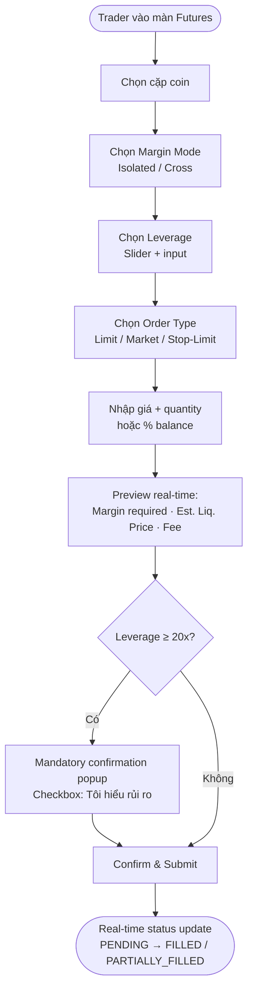
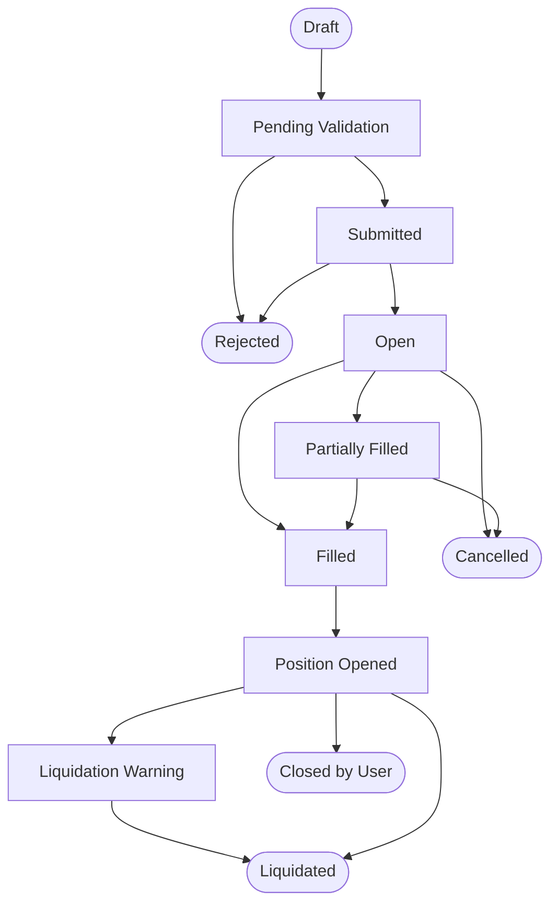

<Info>
  **Vai trò:** Business Analyst · **Công ty:** Nami Innovation · **Dự án thực tế**  
  **Thời gian:** 2025 · **Platform:** Web / Mobile  
  **Team:** ~20 người (BA, Dev, QA, UI/UX, DevOps)
</Info>

---

## Kết quả — Early Rollout

<CardGroup cols={2}>
  <Card title="6,000+" icon="users">
    Active users trong giai đoạn early rollout sau launch
  </Card>
  <Card title="~$10M" icon="dollar-sign">
    Trading volume trong những tháng đầu vận hành
  </Card>
</CardGroup>

<Note>
Số liệu phản ánh giai đoạn đầu sau launch. BA đóng góp vào spec, alignment và delivery — không đứng tên đơn lẻ về kết quả kỹ thuật hay business metrics.
</Note>

---

## Bối cảnh

Nami Innovation mở rộng từ spot trading sang **futures trading** — một bước nhảy lớn về độ phức tạp cả nghiệp vụ lẫn kỹ thuật. Futures yêu cầu xử lý real-time cho margin management, leverage 5x–125x, automated liquidation engine và risk control đa tầng.

**Thách thức đặc thù với BA:** Futures là domain mà một business rule sai không chỉ là bug UX — nó có thể dẫn đến tổn thất tài chính thực cho user. Không có chỗ cho "define thêm sau khi dev xong".

---

## Bài toán BA phải giải quyết

| Bài toán | Mô tả |
|---|---|
| **Domain ambiguity** | Nhiều khái niệm đa nghĩa: isolated vs. cross margin, mark price vs. last price, funding rate direction. Nếu BA–Dev–QA hiểu khác nhau, bug xuất hiện ở production — và domain này không có "undo". |
| **Edge case density** | Mỗi order type × margin mode × position state tạo ra một ma trận kịch bản. Không thể để Engineering tự suy luận từng trường hợp. |
| **Stakeholder alignment** | Product muốn UX đơn giản cho trader mới; Engineering lo ngại complexity và performance; Risk cần guardrail chặt. BA phải tìm phương án cả ba bên làm việc được. |

---

## Cách tiếp cận

**Business Rule Register từ đầu —** Khi nhận ra futures có hàng chục rules phụ thuộc nhau, tôi đề xuất xây register tập trung thay vì scatter trong nhiều tài liệu. Mỗi rule có: ID, mô tả, formula, danh sách dependency và ví dụ numeric. Engineering dùng để track: *nếu rule này thay đổi, cần update gì tiếp theo*.

**User story trước, technical spec sau —** Viết user story cho từng loại trader trước, sau đó mới define business rules cần có để support từng story. Tránh team bị lạc vào technical details trước khi đồng thuận về value thực sự.

**Prototype review trước PRD —** Cùng Design review prototype Figma trước khi viết PRD chi tiết. Phần lớn inconsistency giữa UX và business rule được phát hiện ở bước này — không phải sau khi dev đã code.

---

## Business Rules & Logic Cốt lõi

<AccordionGroup>
  <Accordion title="Margin Calculation" icon="calculator">
    | Loại | Mô tả | Công thức |
    |---|---|---|
    | **Initial Margin** | Ký quỹ ban đầu bắt buộc | `Position Size / Leverage` |
    | **Maintenance Margin** | Ngưỡng tối thiểu duy trì position | `Position Size × MM Rate` |
    | **Margin Ratio** | Chỉ số sức khỏe tài khoản; liq khi ≥ 100% | `Maintenance Margin / Account Equity` |

    **Lưu ý:** MM Rate thay đổi theo Position Tier — phải xây lookup table, không được hardcode.
  </Accordion>

  <Accordion title="Liquidation Conditions" icon="triangle-exclamation">
    - `Margin Ratio ≥ 100%` → auto-liquidate; không cancel được sau khi trigger
    - `Margin Ratio ≥ 80%` → warning in-app + email
    
    **Isolated vs. Cross (phân biệt cốt lõi):**
    - **Isolated:** chỉ margin của position đó bị ảnh hưởng; tổn thất tối đa = margin đã ký quỹ
    - **Cross:** toàn account equity làm margin; ít liq hơn nhưng rủi ro lan toàn tài khoản

    **MVP scope:** Chỉ hỗ trợ Isolated — xem quyết định bên dưới.
  </Accordion>

  <Accordion title="Order Types & Edge Cases" icon="list-check">
    **Order types:** Limit · Market · Stop-Limit · Take Profit / Stop Loss

    | Edge Case | Vấn đề | Giải pháp |
    |---|---|---|
    | Partial fill | Order khớp một phần | PARTIALLY_FILLED state + allow cancel remainder |
    | Liquidation cascade | Nhiều account liq cùng lúc | Insurance fund absorb; ADL nếu fund cạn |
    | Leverage ≥ 20x | User không hiểu rủi ro đòn bẩy cao | Mandatory confirmation popup |
    | Mark vs. last price | Liq trigger theo mark price | Spec rõ để tránh confusion Dev–QA |
  </Accordion>

  <Accordion title="Funding Rate — Khái niệm khó align nhất" icon="rotate">
    Cơ chế thu/trả mỗi 8 giờ giữa long và short. Rate dương → long trả short; âm → short trả long.

    Không phức tạp về công thức — nhưng rất khó để Engineering, UX và CS hiểu nhất quán về *ai trả, ai nhận, countdown hiển thị thế nào*. Tôi viết internal explainer document riêng tách khỏi PRD và tổ chức walkthrough session trước khi Design bắt đầu.
  </Accordion>
</AccordionGroup>

---

## Các Quyết định BA Quan Trọng

<AccordionGroup>
  <Accordion title="Decision 1 — MVP chỉ hỗ trợ Isolated Margin">
    | | |
    |---|---|
    | **Context** | Product muốn cả Isolated và Cross Margin trong phiên bản đầu. |
    | **Problem / Risk** | Cross Margin có formula liquidation phức tạp hơn đáng kể; số edge case tăng gấp đôi; timeline MVP không đủ để spec và test đúng — rủi ro ship sai logic cao. |
    | **BA recommendation** | MVP chỉ hỗ trợ Isolated. Cross Margin document rõ trong Out of Scope với kế hoạch và rationale cho v2. |
    | **Trade-off** | User muốn Cross Margin phải chờ. Nhưng Isolated đã phục vụ được phần lớn nhu cầu trader và giảm rủi ro launch đáng kể. |
    | **Result** | Engineering confirm estimate giảm đáng kể; timeline MVP được giữ nguyên. Không có scope conflict sau khi Out of Scope được document rõ. |
  </Accordion>

  <Accordion title="Decision 2 — Hiển thị Estimated Liquidation Price ngay trên Order Form">
    | | |
    |---|---|
    | **Context** | Design ban đầu chỉ hiển thị liquidation price trong Position Management — sau khi lệnh đã đặt và khớp. |
    | **Problem / Risk** | Trader mới thường không vào Position Management ngay sau khi đặt lệnh. Họ thấy liquidation price lần đầu khi margin ratio đã gần 100%. CS ticket "tại sao tôi bị liq bất ngờ" là vấn đề có thể giải quyết từ UX. |
    | **BA recommendation** | Hiển thị estimated liquidation price real-time ngay trên Order Form, update khi user thay leverage hoặc quantity. |
    | **Trade-off** | Thêm computation và UI complexity. Engineering confirm feasible với client-side calculation trong scope dự án. |
    | **Result** | Trader mới có risk information trước khi confirm lệnh — trực tiếp giải quyết một trong những nguyên nhân phổ biến nhất của CS ticket. |
  </Accordion>

  <Accordion title="Decision 3 — Mandatory Confirmation cho Leverage ≥ 20x">
    | | |
    |---|---|
    | **Context** | Nami chưa có cơ chế confirmation khi chọn leverage cao. Binance và Bybit đều đã có. |
    | **Problem / Risk** | User chọn leverage cao mà không hiểu rủi ro → bị liq sớm → CS complaint và churn. Warning text bị bỏ qua không hiệu quả. |
    | **BA recommendation** | Mandatory popup confirmation cho ≥ 20x. User phải tick "Tôi hiểu rủi ro" mới tiếp tục được. |
    | **Trade-off** | Friction với trader pro vốn biết mình đang làm gì. Giải pháp: popup chỉ xuất hiện 1 lần per session — không repeat mỗi lần chỉnh leverage. |
    | **Result** | Cân bằng giữa bảo vệ trader mới và không làm phiền trader pro quá mức. Đây cũng là approach đang được dùng bởi các sàn lớn. |
  </Accordion>
</AccordionGroup>

---

## Phối hợp Dev / QA / UX

**Điểm khó nhất khi align với Dev — Funding Rate:**  
Funding rate là khái niệm mà mỗi người có mental model khác nhau. Dev hỏi: "Tiền bị trừ đúng vào 8h hay theo event trigger?" UX hỏi: "Countdown hiển thị theo múi giờ nào?" CS lo: "Nếu user complain bị trừ sai, mình giải thích thế nào?" Câu trả lời khác nhau từ mỗi góc — BA phải viết explainer riêng và tổ chức walkthrough trước khi bất kỳ ai bắt đầu.

**Trade-off UX và Risk Control:**  
UX muốn Order Form sạch và tối giản. Risk yêu cầu phải visible: margin required, estimated liquidation price, leverage warning. Thỏa hiệp: các field cốt yếu về risk luôn visible — secondary info (funding rate countdown, fee detail) dùng expand/tooltip. Không ẩn hoàn toàn, không làm rối màn hình chính.

**BA giúp giảm ambiguity ở đâu:**  
Tôi cung cấp edge case list từ FRD kèm test data cụ thể cho từng case — ví dụ leverage = 1 → không có liquidation price; margin ratio = 99.9% → warning state, chưa liquidate. QA dùng để build test scenario, không cần tự suy luận. Một số inconsistency trong behavior tôi phát hiện trực tiếp trong UAT vì hiểu domain — không phải vì test script chỉ ra.

---

## Visual Artifacts

### Artifact 1 — Order Placement Flow

*Diagram này được dùng trong PRD review với Design và Engineering — giúp phát hiện inconsistency về flow và state trước giai đoạn dev.*

---

### Artifact 2 — Business Rule Table mẫu

| Rule ID | Tên Rule | Trigger | Điều kiện | Expected Behavior | Edge Case |
|---|---|---|---|---|---|
| BR-LIQ-01 | Auto Liquidation | Margin Ratio update | Ratio ≥ 100% | Đóng toàn bộ position; không cho cancel | Nếu insurance fund không đủ → ADL activation |
| BR-WARN-01 | Margin Warning | Margin Ratio update | Ratio ≥ 80% | Push notification + in-app alert | Nếu đã warn trong vòng 1h → không warn lại |
| BR-LEV-01 | High Leverage Confirm | User chọn leverage | Leverage ≥ 20x | Mandatory popup confirmation | Lần 2+ trong cùng session → bỏ qua popup |
| BR-FUND-01 | Funding Rate Settlement | Cron job mỗi 8h | Long/Short có open position | Long pays Short nếu rate dương | Nếu position bị close trước lúc settle → không tính |

*Business Rule Register là tài liệu BA maintain xuyên suốt dự án — không chỉ dùng một lần.*

---

### Artifact 3 — Annotated Order Form

*Translating trading business rules into UI behavior and validation.*

<iframe
  src="/artifacts/futures/annotated-order-form.html"
  width="100%"
  height="740"
  style="border:1px solid #2d3148;border-radius:12px;background:#0f1117;"
></iframe>

---

### Artifact 4 — High Leverage Confirmation Modal

*How the mandatory leverage risk confirmation is designed as a BA decision.*

<iframe
  src="/artifacts/futures/high-leverage-confirmation.html"
  width="100%"
  height="680"
  style="border:1px solid #2d3148;border-radius:12px;background:#0f1117;"
></iframe>

---

### Artifact 5 — Order Lifecycle State Machine

*Order lifecycle từ Draft đến terminal states — dùng để align Dev, QA và Risk về trạng thái hợp lệ và không hợp lệ.*

---

## Deliverables

| Tài liệu | Mục đích | Người nhận |
|---|---|---|
| BRS | Scope và business rules tổng thể | Product Lead, Engineering Lead |
| PRD | User flows, screen specs, edge cases | Dev, QA, UI/UX |
| Business Rule Register | Tracking rules, formulas, dependencies | BA, Dev, QA — dùng xuyên suốt dự án |
| Functional Specifications | Behavior chi tiết từng màn hình và API | Developer |
| User Guide | Hướng dẫn cho end user | CS, Marketing |

---

## Validation trước Release

Phối hợp cùng QA và Engineering để:

- **Verify trading logic** — chạy test case với số liệu cụ thể; đối chiếu kết quả tính toán thực tế với expected values từ formula trong Business Rule Register
- **Review edge case coverage** — xác nhận toàn bộ edge case list trong FRD có test case tương ứng; không để gap
- **UAT sign-off** — duyệt từng màn theo flow trong PRD; tập trung vào warning states, error messages và các trường hợp ngoại lệ
- **Consistency check** — hỗ trợ đối chiếu behavior hệ thống với Business Rule Register trước khi release

Platform ra mắt không phát sinh critical bug liên quan trading logic — kết quả chung của cả BA, Engineering và QA trong quá trình spec, review và test.

---

## Bài học

<CardGroup cols={2}>
  <Card title="Domain không thể học nhanh" icon="triangle-exclamation">
    **Tôi đã underestimate:** Thời gian cần thiết để nắm đủ futures domain trước khi có thể viết spec đúng.

    **Tôi đã thay đổi:** Dành 2 tuần đầu chỉ nghiên cứu domain — whitepaper, competitor, tài liệu kỹ thuật — trước khi viết bất kỳ requirement nào.

    **Lần sau làm sớm hơn:** Tổ chức domain study session với cả team Engineering từ tuần đầu để cùng xây shared vocabulary và mental model.
  </Card>

  <Card title="Rule dependency cần map từ sớm" icon="link">
    **Tôi đã underestimate:** Tác động lan rộng khi thay đổi một assumption nhỏ (ví dụ: MM Rate) kéo theo update ở nhiều chỗ khác nhau.

    **Tôi đã thay đổi:** Xây Business Rule Register với dependency mapping rõ ràng ngay từ đầu dự án.

    **Lần sau làm sớm hơn:** Propose register ngay trong kickoff — không chờ đến khi conflict xảy ra.
  </Card>

  <Card title="Prototype review trước PRD" icon="lightbulb">
    **Tôi đã underestimate:** Số lượng inconsistency giữa UX và business rule có thể phát hiện qua prototype review.

    **Tôi đã thay đổi:** Đưa prototype review session vào quy trình bắt buộc trước khi viết PRD chi tiết.

    **Lần sau làm sớm hơn:** Schedule prototype review ngay sau khi có wireframe đầu tiên — không chờ design "hoàn chỉnh".
  </Card>

  <Card title="Edge cases vào AC sớm hơn" icon="clipboard-check">
    **Tôi đã underestimate:** Edge case để cuối — trong FRD appendix — thường không được test kỹ vì QA không đọc kỹ phần phụ lục.

    **Tôi đã thay đổi:** Đưa critical edge cases trực tiếp vào Acceptance Criteria của từng user story.

    **Lần sau làm sớm hơn:** Raise edge cases trong sprint planning và đưa vào Definition of Done — không phải trong UAT phase.
  </Card>
</CardGroup>

---

<Note>
  **Dự án thực tế tại Nami Innovation.** Business rules cụ thể, số liệu nội bộ và tài liệu kỹ thuật không được công khai để bảo mật thông tin doanh nghiệp. Nội dung trên là tóm tắt cấp case study.
</Note>
